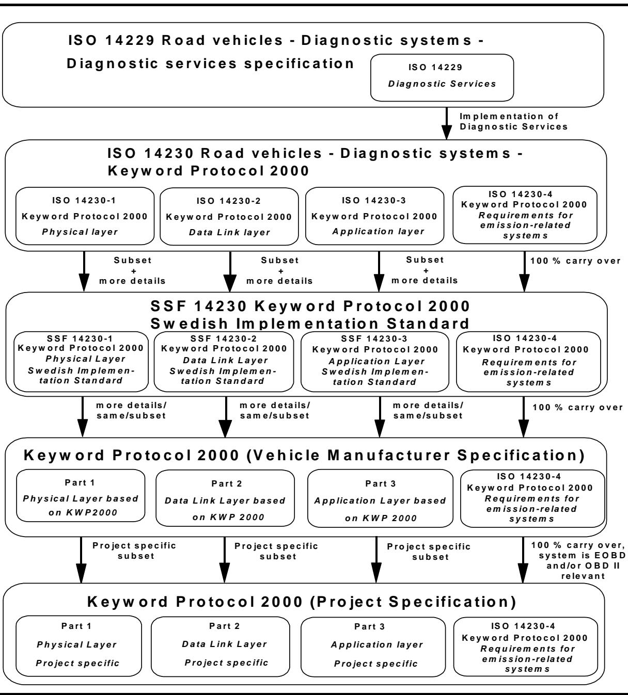
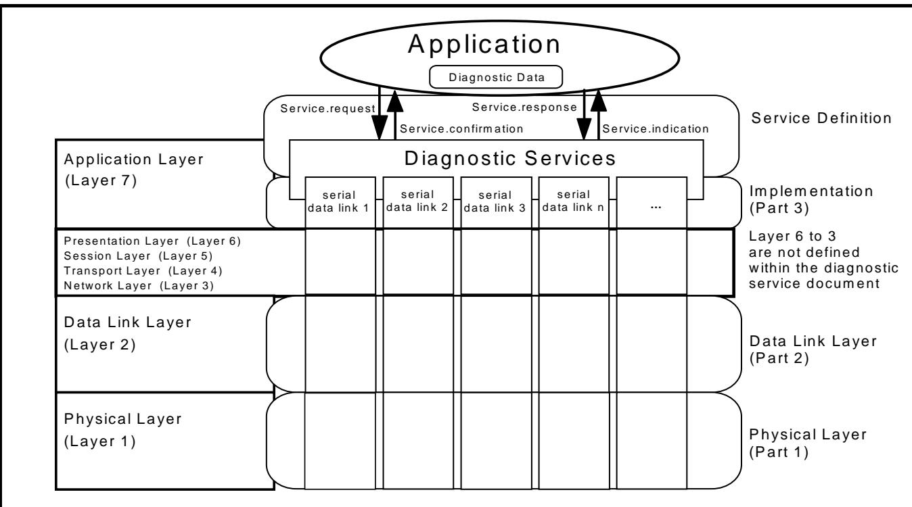
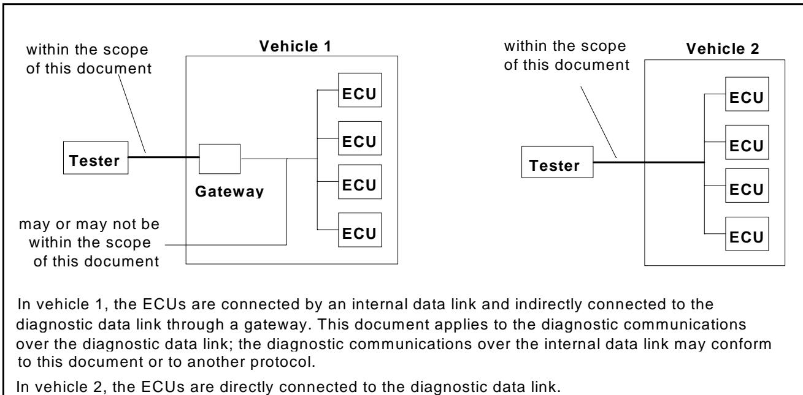
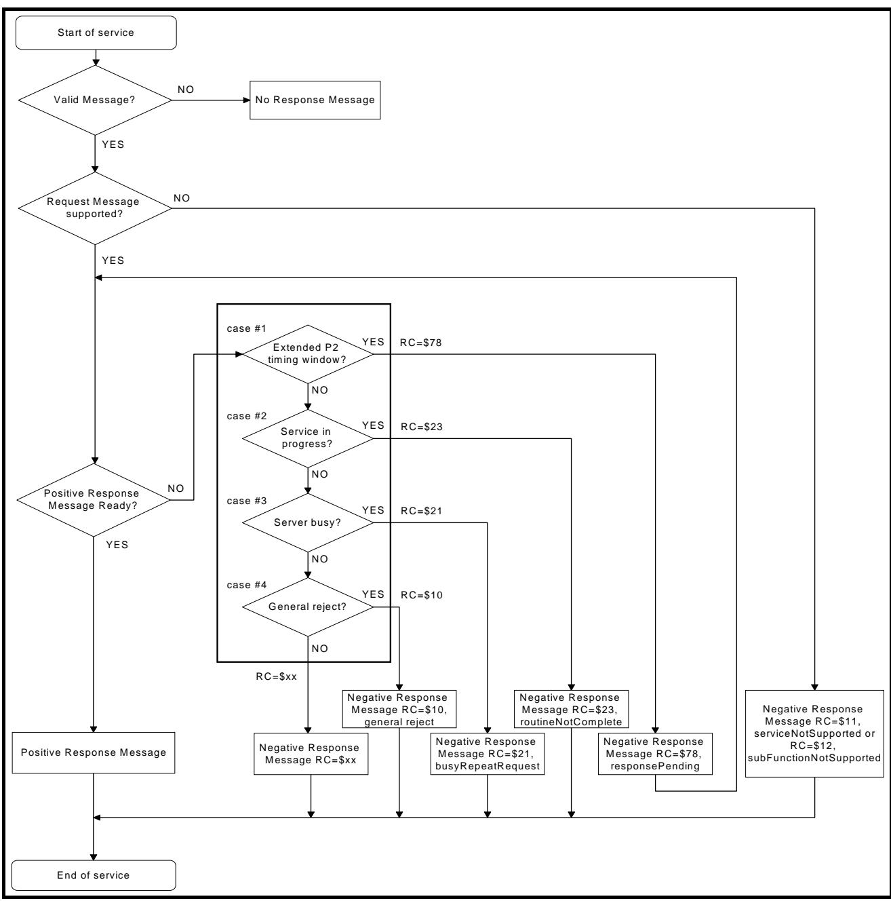
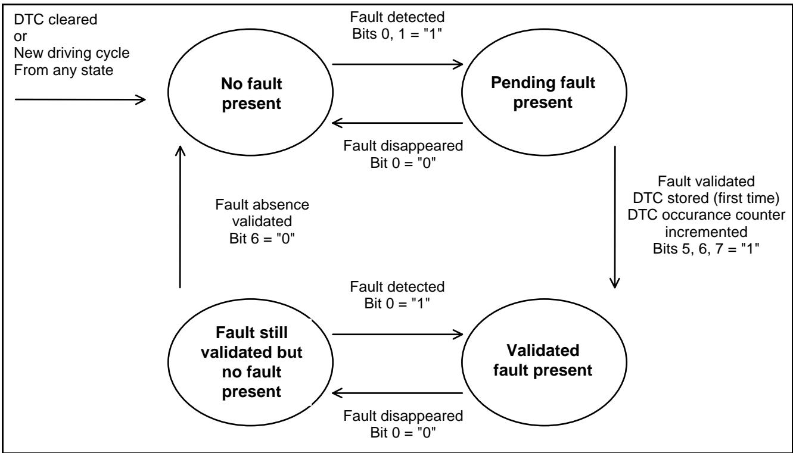
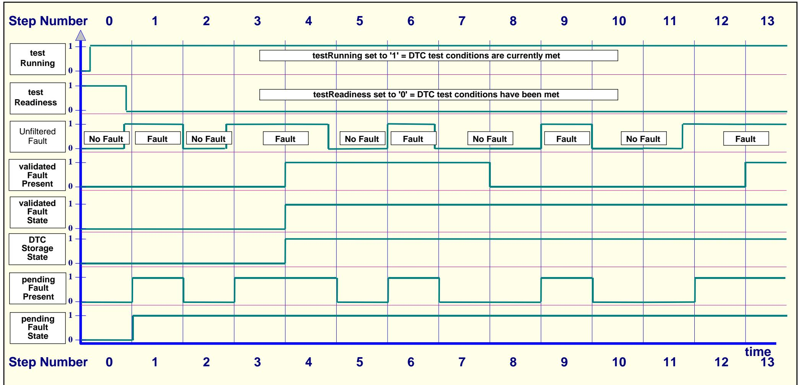
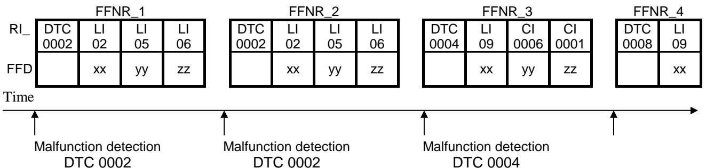
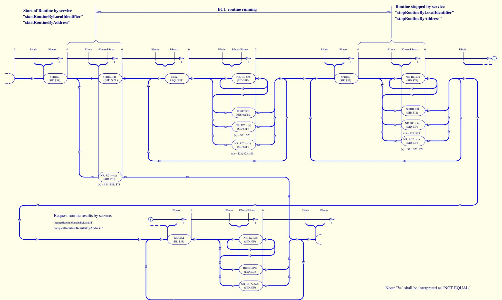
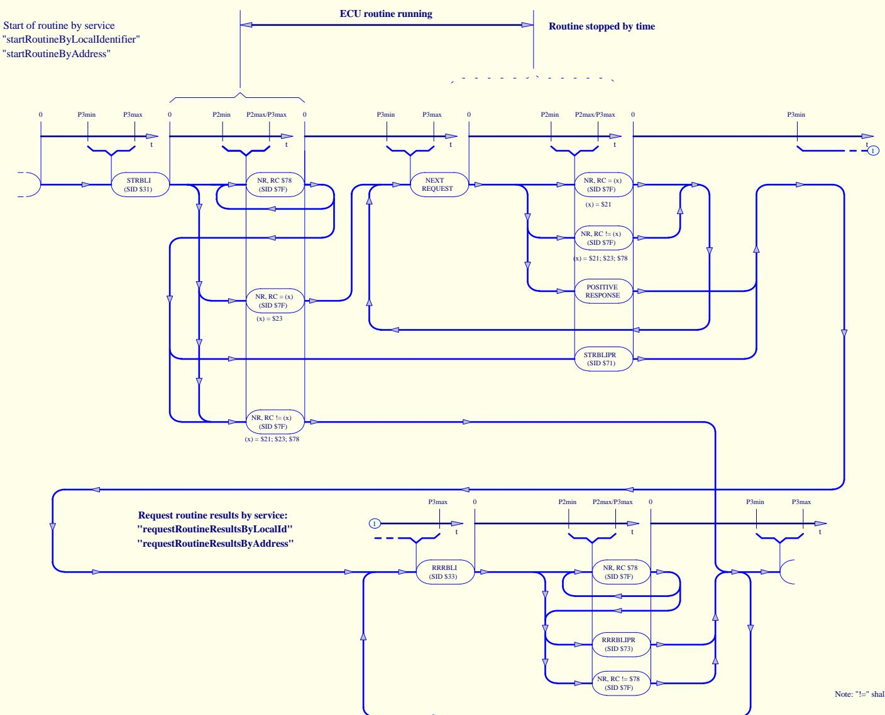

<table><tr><td colspan="2">SSF 14230 Road Vehicles - Diagnostic Systems</td></tr><tr><td colspan="2">Keyword Protocol 2000 - Part 3 - Application Layer
Swedish Implementation Standard</td></tr><tr><td colspan="2">Document: SSF 14230-3
Status: Issue 2
Date: February 1, 2000</td></tr><tr><td colspan="2">This document is based on the International Standard ISO 14230 Keyword Protocol 2000 and has been further developed to meet Swedish automotive manufacturer&#x27;s requirements by the Swedish Vehicle Diagnostics Task Force. It is based on mutual agreement between the following companies:
·Saab Automobile AB
·SCANIA AB
·Volvo Car Corp.
·Volvo Bus Corp.
·Mecel AB</td></tr><tr><td colspan="2">File: 14230-3s.DOC / Samarbetgruppen för Svensk Fordonsdiagnos
http://www.mecel.se/html/ssf.htm</td></tr></table>

Keyword Protocol 2000 Part 3 Implementation, Swedish Recommended Practice

# Document updates and issue history

This document can be revised and appear in several versions. The document will be classified in order to allow identification of updates and versions.

# A. Document status classification

A. Document status classificationThe document is assigned the status Outline, Draft or Issue. It will have the Outline status during the initial phase when parts of the document are not yet written. The Draft status is entered when a complete document is ready, which can be submitted for reviews. The draft is not approved. The draft status can appear between issues, and will in that case be indicated together with the new issue number E.g. Draft Issue 2. An Issue is established when the document is reviewed, corrected and approved.

# B.Version number and history procedure

Each issue is given a number and a date. A history record shall be kept over all issues. Document in Outline and Draft status may also have a history record.

# C. History

<table><tr><td>Issue #</td><td>Date</td><td>Comment</td></tr><tr><td>1</td><td>May 12, 1998</td><td></td></tr><tr><td>2</td><td>February 1, 2000</td><td>Mayor revision to make SSF 14230-3 compatible with ISO 16844-6. StopDiagnosticSession service replaced by StartDiagnosticSession, parameter diagnosticSession = 81 (standardSession).</td></tr></table>

# Table of Content

1 Scope. 8

# 2 NORMATIVE REFERENCE 9

2.1 ISO standards 9  2.2 Other standards 9

# 3 DEFINITIONS AND ABBREVIATIONS 10

3.1 Terms defined in other standards 10  3.2 Terms defined by this document 10

# 4 CONVENTIONS 11

4.1 Service description convention 11  4.2 Functional unit table 13  4.3 Service Identifier value summary table 14  4.4 Response Code value summary table 16

# 5 GENERAL IMPLEMENTATION RULES 24

5.1 Parameter definitions 24  5.2 Functional and physical addressed service requests 24  5.3 Message flow examples of physical/functional addressed services 24  5.4 Data Scaling 30

# 6 DIAGNOSTIC MANAGEMENT FUNCTIONAL UNIT 36

6.1 StartDiagnosticSession service 37  6.2 StopDiagnosticSession service 40  6.3 SecurityAccess service 41  6.4 TesterPresent service 45  6.5 EcuReset service 46  6.6 ReadEculdentification service 48

# 7 DATA TRANSMISSION FUNCTIONAL UNIT 55

7.1 ReadDataByLocalIdentifier service 56  7.2 ReadDataByCommonIdentifier service 58  7.3 ReadMemoryByAddress service 60  7.4 DynamicallyDefineLocalIdentifier service 62  7.5 WriteDataByLocalIdentifier service 71  7.6 WriteDataByCommonIdentifier service 72  7.7 WriteMemoryByAddress service 74  7.8 SetDataRates service 76  7.9 StopRepeatedDataTransmission service 77

# 8 STORED DATA TRANSMISSION FUNCTIONAL UNIT 78

8 STORED DATA TRANSMISSION FUNCTIONAL UNIT 788.1 ReadDiagnosticTroubleCodes service 798.2 ReadDiagnosticTroubleCodesByStatus service 808.3 ReadStatusOfDiagnosticTroubleCodes service 898.4 ReadFreezeFrameData service 928.5 ClearDiagnosticInformation service 101

# 9 INPUTOUTPUT CONTROL FUNCTIONAL UNIT 103

9 INPUTOUTPUT CONTROL FUNCTIONAL UNIT 1039.1 InputOutputControlByLocalIdentifier service 1049.2 InputOutputControlByCommonIdentifier service 110

# 10 REMOTE ACTIVATION OF ROUTINE FUNCTIONAL UNIT 113

10 REMOTE ACTIVATION OF ROUTINE FUNCTIONAL UNIT 11310.1 StartRoutineByLocalIdentifier service 11610.2 StartRoutineByAddress service 11810.3 StopRoutineByLocalIdentifier service 12010.4 StopRoutineByAddress service 12210.5 RequestRoutineResultsByLocalIdentifier service 12410.6 RequestRoutineResultsByAddress service 126

# 11UPLOAD DOWNLOAD FUNCTIONAL UNIT 128

11.1 RequestDownload service 12911.2 RequestUpload service 13111.3 TransferData service 13311.4 RequestTransferExit service 135

# Introduction

This document is based on the International Standard ISO 14230- 3 Road vehicles - Diagnostic systems - Keyword Protocol 2000 - Part 3: Application layer.

The SSF 14230- 3 Keyword Protocol 2000 - Part 3 - Application Layer, Swedish Implementation Standard has been established in order to define common requirements for the implementation of diagnostic services for diagnostic systems. The figure below shows the "Hierarchy of Documents" and indicates the level of commonality between the documents.

  
Figure 0.1 - Hierarchy of Documents

- The ISO 14229 document specifies common requirements for the implementation of diagnostic services.- The ISO 14230 documents specify the requirements of the "Physical Layer, Data Link Layer and Application Layer" in three (3) different documents.

- The SSF 14230 documents are based on the International Standard ISO 14230 and therefore fully compatible. The Keyword Protocol 2000 
- Physical Layer, Data Link Layer and Application Layer Swedish Implementation Standard documents are a subset with additional detail based on mutual agreement between all companies listed on the cover sheet of the documents.- The Keyword Protocol 2000 Vehicle Manufacturer Specification documents are based on SSF 14230 documents. The Part 1 Physical Layer, Part 2 Data Link Layer, and the Part 3 Application Layer documents shall specify more details or the same or a subset of the SSF 14230 documents.- The Keyword Protocol 2000 Project Specification document (e.g. Engine Management) is based on the vehicle manufacturer specification document. The documents of the system supplier specifies system and customer specific Part 1 Physical Layer, Part 2 Data Link Layer and Part 3 Application Layer details (e.g. datastreams, diagnostic trouble codes, input/output controls, etc.).

The SSF 14230 Swedish Implementation Standard is based on the Open Systems Interconnection (O.S.I.) Basic Reference Model in accordance with ISO/IEC 7498 and ISO/IEC 10731 which structures communication systems into seven layers. When mapped on this model, the services used by a diagnostic tester and an Electronic Control Unit (ECU) are broken into:

- Diagnostic services (layer 7),- Communication services (layers 1 to 6)

Mapping of the Diagnostic Services and Keyword Protocol 2000 onto the OSI model is shown below. SSF 14230 consists of the following parts, under the general title Road Vehicles - Diagnostic Systems - Keyword Protocol 2000:

- Part 1: Physical Layer- Part 2: Data Link Layer- Part 3: Application Layer

  
Figure 0.2 - Mapping of the Diagnostic Services and Keyword Protocol 2000 on the OSI Model

# 1 Scope

1 ScopeSSF 14230 specifies the requirements for the Keyword Protocol 2000 data link by which one or several on- vehicle Electronic Control Units are connected to an off- board tester in order to perform diagnostic functions.

SSF 14230 specifies additional detail to some sections of ISO 14230.

It consists of three parts:

Part 1:Physical Layer Part 2:Data Link Layer Part 3: Application Layer

This part of SSF 14230 specifies requirements on the implementation of the Diagnostic Services specified in ISO 14229, including:

byte encoding and hexadecimal values for the service identifiers, byte encoding for the parameters of the diagnostic service request and respons messages, hexadecimal values for the standard parameters.

The vehicle environment to which this standard applies may consist of:

a single tester which may be temporarily connected to the on- vehicle diagnostic data link and several on- vehicle Electronic Control Units connected directly or indirectly.

See figure 1.1 below.

  
Figure 1.1 - Vehicle diagnostic architectures

# 2 Normative reference

# 2.1 ISO standards

The following standards contain provisions which, through reference in this text, constitute provisions of this document. All standards are subject to revision, and parties to agreement based on this document are encouraged to investigate the possibility of applying the most recent editions of the standards listed below. Members of ISO maintain registers of currently valid International Standards.

ISO/IEC 7498 Information technology - Open Systems Interconnection - Basic Reference Model  ISO/IEC 10731 Information technology - Open Systems Interconnection - Basic Reference Model - Conventions for the definition of OSI services  ISO 14229 Road vehicles - Diagnostic systems - Diagnostic services specification  ISO 14230- 1 Road vehicles - Diagnostic systems - Keyword Protocol 2000 - Part 1: Physical layer  ISO 14230- 2 Road vehicles - Diagnostic systems - Keyword Protocol 2000 - Part 2: Data link layer  ISO 14230- 3 Road vehicles - Diagnostic systems - Keyword Protocol 2000 - Part 3: Application layer  ISO 14230- 4 Road Vehicles - Diagnostic systems - Keyword Protocol 2000 - Part 4: Requirements for emission- related systems

# 2.2 Other standards

SSF 14230- 1 Road Vehicles - Diagnostic Systems, Keyword Protocol 2000 - Part 1 - Physical Layer, Swedish Implementation Standard  SSF 14230- 2 Road Vehicles - Diagnostic Systems, Keyword Protocol 2000 - Part 2 - Data Link Layer, Swedish Implementation Standard

ANSI/IEEE Std 754- 1985

SAE J1930 Electrical/Electronic Systems Diagnostic Terms, Definitions, Abbreviations & Acronyms

SAE J1979 E/E Diagnostic Test Modes

# 3 Definitions and abbreviations

# 3.1 Terms defined in other standards

# 3.1.1 ISO definitions

This document makes use of terms defined in ISO 14229.

# 3.1.2 SAE definitions

This document makes use of terms defined in SAE J1930.

# 3.2 Terms defined by this document

# 3.2.1 Service Identifier value convention table

The following chart indicates the different ranges of service identifier values, which are defined in SSF 14230, SAE J1979, by vehicle manufacturers or by system suppliers.

Table 3.2.1 - Service Identifier value convention table  

<table><tr><td>Service Identifier
Hex Value</td><td>Service type
(bit 6)</td><td>Where defined</td></tr><tr><td>00 - 0F</td><td>Request</td><td>SAE J1979</td></tr><tr><td>10 - 1F</td><td rowspan="3">Request (bit 6 = 0)</td><td rowspan="3">SSF 14230-3</td></tr><tr><td>20 - 2F</td></tr><tr><td>30 - 3E</td></tr><tr><td>3F</td><td>Not Applicable</td><td>Reserved by document</td></tr><tr><td>40 - 4F</td><td>Response</td><td>SAE J1979</td></tr><tr><td>50 - 5F</td><td rowspan="3">Positive Response
to Services ($10 - $3E)
(bit 6 = 1)</td><td rowspan="3">SSF 14230-3</td></tr><tr><td>60 - 6F</td></tr><tr><td>70 - 7E</td></tr><tr><td>7F</td><td>Negative Response</td><td>SSF 14230-3</td></tr><tr><td>80</td><td>Request [ESC&#x27; Code</td><td>ISO 14230-3</td></tr><tr><td>81 - 8F</td><td>Request (bit 6 = 0)</td><td>SSF 14230-2</td></tr><tr><td>90 - 9F</td><td>Request (bit 6 = 0)</td><td>Reserved for future exp. as needed</td></tr><tr><td>A0 - B9</td><td>Request (bit 6 = 0)</td><td>Defined by vehicle manufacturer</td></tr><tr><td>BA - BF</td><td>Request (bit 6 = 0)</td><td>Defined by system supplier</td></tr><tr><td>C0</td><td>Positive Resp. &#x27;ESC&#x27; - Code</td><td>ISO 14230-3</td></tr><tr><td>C1 - CF</td><td>Positive Response (bit 6 = 1)</td><td>SSF 14230-2</td></tr><tr><td>D0 - DF</td><td>Positive Response (bit 6 = 1)</td><td>Reserved for future exp. as needed</td></tr><tr><td>E0 - F9</td><td>Positive Response (bit 6 = 1)</td><td>Refined by vehicle manufacturer</td></tr><tr><td>FA - FF</td><td>Positive Response (bit 6 = 1)</td><td>Refined by system supplier</td></tr></table>

Service identifier values  $\) 00- \\(0F"$  and  $\) 40- \\(4F"$  are reserved to be defined in SAE J1979 which currently only includes functionally addressed services. There is a one- to- one correspondence between request messages and positive response messages, with "bit 6" of the service identifier hex value indicating the service type.

# 3.2.2 Definitions used in this document

The "default timing" shall always reference the timing parameter values as initiated by the keybytes sent by the server (ECU) at the start of the communication. The timing parameter values and possible keybytes are specified in SSF 14230- 2. The term "system supplier" refers to the supplier with the product responsibility for the system or component. It is not necessarily the same as the system/component manufacturer.

# 4 Conventions

4 ConventionsThis document is guided by the OSI Service Conventions discussed in ISO/IEC 10731 as they apply to the diagnostic services. These conventions define the interactions between the service user and the service provider. Information is passed between the service user and the service provider by service primitives, which may convey parameters.

# 4.1 Service description convention

This section defines the layout used to describe the diagnostic services. It includes:

Parameter Definition Message Data Bytes Message Description Message Flow Example Implementation Example

# 4.1.1 Parameter definition

This section defines the use and the values of parameters used by the service.

# 4.1.2 Message data bytes

The definition of each message includes a table which lists the parameters of its primitives: request/indication ("Req/Ind"), response/confirmation ("Rsp/Cnf") for positive or negative result. All have the same structure. The first table (refer to section 4.1.2.1) describes the request message, the second table (refer to section 4.1.2.2) the positive response message and the third table (refer to section 4.1.2.3) the negative response message. Thus, only a positive or a negative response message may be used; both are listed in separate tables because the list of parameters differ between positive and negative response messages.

The header bytes and the checksum content of each message table is defined in SSF 14230- 2.

# Table content description:

Under the <Service Name> Request Message are listed the parameters specific to the service request/indication. Under the <Service Name> Positive Response Message are listed the parameters specific to the service response/confirmation in case the requested service was successful. Under the <Service Name> Negative Response Message are listed the parameters specific to the service response/confirmation in case the requested service has failed or could not be completed in time.

For a given primitive, the presence of each parameter (or parameter value) is described by one of the following convention (Cvt) values:

M: mandatory; U: user option; the parameter may or may not be supplied, depending on dynamic usage by the user; C: conditional; the presence of the parameter depends upon other parameters within the service.

# 4.1.2.1 Request message

The following table shows a general service table structure and its syntax.

Table 4.1.2.1 -Request message  

<table><tr><td>Type</td><td>Parameter Name</td><td>Cvt</td><td>Hex Value</td><td>Mnemonic</td></tr><tr><td rowspan="4">Header Bytes</td><td>Format Byte</td><td>M</td><td>xx</td><td>FMT</td></tr><tr><td>Target Byte</td><td>M</td><td>xx</td><td>TGT</td></tr><tr><td>Source Byte</td><td>M)</td><td>xx</td><td>SRC</td></tr><tr><td>Length Byte</td><td>C1)</td><td>xx</td><td>LEN</td></tr><tr><td>&lt;serviceid&gt;</td><td>&lt;service name&gt;Request Service Identifier</td><td>M</td><td>xx</td><td>SN</td></tr><tr><td>&lt;parameter type=&quot;&quot;&gt;</td><td>&lt;list of=&quot;&quot; parameter=&quot;&quot; type=&quot;&quot;&gt;</td><td>C2)</td><td>xx=[</td><td>PN</td></tr><tr><td>&lt;parameter type=&quot;&quot;&gt;</td><td>&lt;parameter name=&quot;&quot;&gt;</td><td>:</td><td>xx]</td><td></td></tr><tr><td>CS</td><td>Checksum Byte</td><td>M</td><td>xx</td><td>CS</td></tr></table>

</parameter></parameter></serviceid></service></parameter></parameter></service></servicename></service></serviceid></service></parameter></parameter></service></servicename></service></serviceid></parameter></parameter></parameter></parameter></parameter></service></servicename></service></parameter></parameter></parameter></parameter></parameter></service></servicename></parameter></parameter></parameter></parameter></parameter></service></servicename></parameter></parameter></parameter></parameter></parameter></parameter></parameter></service></servicename></parameter></parameter></parameter></parameter></parameter></parameter></parameter></parameter></parameter></parameter></parameter></parameter></parameter></parameter></parameter></parameter></parameter></parameter></parameter></parameter></parameter></parameter></parameter></parameter></parameter></parameter></parameter></parameter></parameter></parameter></parameter></parameter></parameter></parameter></parameter></parameter></parameter></parameter></parameter></parameter></parameter></parameter></parameter></parameter></parameter></parameter></parameter></parameter></parameter></parameter></service></servicename></service></service></servicename></parameter></parameter></parameter></parameter></parameter></parameter></parameter></parameter></parameter></parameter></parameter></parameter></parameter></parameter></parameter></parameter></parameter></parameter></parameter></parameter></parameter></parameter></parameter></parameter></parameter></parameter></parameter></parameter></parameter></parameter></parameter></parameter></parameter></parameter></parameter></parameter></parameter></parameter></parameter></parameter></parameter></parameter></parameter></parameter></parameter></parameter></parameter>

C1) Condition 1: The header byte "Length" depends on the content of the "Format Byte" which is specified in SSF 14230- 2.

C2) Condition 2: These parameters may be either mandatory (M) or user optional (U), depending on the individual message.

# 4.1.2.2 Positive response message

A positive response message shall be sent by the server if it is able to completely perform the requested actions.

Table 4.1.2.2 - Positive response message  

<table><tr><td>Type</td><td>Parameter Name</td><td>Cvt</td><td>Hex Value</td><td>Mnemonic</td></tr><tr><td rowspan="4">Header Bytes</td><td>Format Byte</td><td>M</td><td>xx</td><td>FMT</td></tr><tr><td>Target Byte</td><td>M</td><td>xx</td><td>TGT</td></tr><tr><td>Source Byte</td><td>M</td><td>xx</td><td>SRC</td></tr><tr><td>Length Byte</td><td>C1)</td><td>xx</td><td>LEN</td></tr><tr><td>&lt;serviceid&gt;</td><td>&lt;service name&gt; Positive Response Service Identifier</td><td>M</td><td>xx</td><td>SNPR</td></tr><tr><td>&lt;parameter type=&quot;&quot;&gt;</td><td>&lt;list of=&quot;&quot; parameter=&quot;&quot; type=&quot;&quot;&gt;</td><td>C2)</td><td>xx=[</td><td>PN</td></tr><tr><td>&lt;parameter type=&quot;&quot;&gt;</td><td>&lt;parameter name=&quot;&quot;&gt;</td><td>M</td><td></td><td></td></tr><tr><td>CS</td><td>Checksum Byte</td><td>M</td><td>xx</td><td>CS</td></tr></table>

</serviceid></parameter></service></parameter></serviceid></service></service></service></service></service></service></service></service></service></service></service></service></service></service></service></service></service></service></service></service></service></service></service></service></service></service></service></service></service></service></service></service></service></service></service></service></service></service></service></service></service></service></service></service></service></service></service></service></service></service></table>

Conditions: see 4.1.2.1

# 4.1.2.3 Negative response message

A negative response message shall be sent by the server if it is not able to completely perform the requested actions.

<table><tr><td>Type</td><td>Parameter Name</td><td>Cvt</td><td>Hex Value</td><td>Mnemonic</td></tr><tr><td rowspan="3">Header Bytes</td><td>Format Byte</td><td>M</td><td>xx</td><td>FMT</td></tr><tr><td>Target Byte</td><td>M</td><td>xx</td><td>TGT</td></tr><tr><td>Source Byte</td><td>M</td><td>xx</td><td>SRC</td></tr><tr><td>Length Byte</td><td>Length Byte</td><td>C1)</td><td>xx</td><td>LEN</td></tr><tr><td>&lt;serviceid&gt;</td><td>negativeResponse Service Identifier</td><td>M</td><td>7F</td><td>NR</td></tr><tr><td>&lt;serviceid&gt;</td><td>&lt;service name&gt; Request Service Identifier</td><td>M</td><td>xx</td><td>SN</td></tr><tr><td>&lt;parameter type=&quot;&quot;&gt;</td><td>responseCode= [ { section 4.4 } ]</td><td>M</td><td>xx</td><td>RC...</td></tr><tr><td>CS</td><td>Checksum Byte</td><td>M</td><td>xx</td><td>CS</td></tr></table>

</serviceid></service></service></service></service></service></service></service></service></service></service></service></service></service></service></service></service></service></service></service></service></service></service></service></service></service></service></service></service></service></service></service></service></service></service></service></service></service></service></service></service></service></service></service></service></service></service></service></service></table>Table 4.1.2.3 - Negative response message

Conditions: see 4.1.2.1

# 4.1.3 Message description

This section provides a description of the actions performed by the client and the server which are specific to the KWP 2000 data link. The response condition is service specific and defined separately for each service.

# 4.1.4 Message flow examples

This section provides message flow descriptions presented in a table format. Time relates to the table in a top to bottom sequence. The table consists of three columns:

column 1: includes the relevant inter- message timing which is specified in SSF 14230- 2. The message shall be started within the relevant inter- message timing. column 2: includes all requests sent by the client to the server column 3: includes all responses sent by the server to the client

For simplification all messages are described without any identifiers and/or data values. Details of messages are always specified in the section: Message data bytes.

<table><tr><td>time</td><td>client (Tester)</td><td>server (ECU)</td></tr><tr><td>P3</td><td>&lt;service name=&quot;Request&quot;...&gt;</td><td>&lt;service name=&quot;PositiveResponse&quot;...&gt;</td></tr></table>

</service></service>

Table 4.1.4 - Message flow example of physical addressed service

Note: Above message flow example is not documented for each service. Only services, which call for more detailed message flow description shall have their own message flow section.

# 4.1.5 Implementation example

# 4.1.5.1 Message flow Conditions

This section specifies the conditions to perform the service shown in the section 4.1.5.2 - Message flow.

# 4.1.5.2 Message flow

This section specifies the message flow of an example which is related to the service specified in above main section.

STEP#1 service name...  

<table><tr><td>time</td><td>Client (tester) Request Message</td><td>Hex</td><td>Hex</td></tr><tr><td rowspan="4">P3</td><td>service name.ReqSId[</td><td rowspan="4">xx</td><td></td></tr><tr><td>data byte#2</td><td></td></tr><tr><td>:</td><td></td></tr><tr><td>data byte#m]</td><td></td></tr></table>

<table><tr><td>time</td><td>Server (ECU) Positive Response Message</td><td>Hex</td><td>Server (ECU) Negative Response Message</td><td>Hex</td></tr><tr><td rowspan="4">P2</td><td>service name.PosRspSId[</td><td>xx</td><td>negativeResponse Service Identifier</td><td>7F</td></tr><tr><td>recordValue#1</td><td>xx</td><td>service name.ReqSId[</td><td>xx</td></tr><tr><td>:</td><td>:</td><td rowspan="2">responseCode {refer to section 4.4 }]</td><td rowspan="2">xx</td></tr><tr><td>recordValue#m]</td><td>xx</td></tr><tr><td></td><td>return(main)</td><td></td><td>return(responseCode)</td><td></td></tr></table>

# 4.2 Functional unit table

The intention of specifying functional unit tables is to group similar Keyword Protocol 2000 services into a functional unit. The definition of each functional unit includes a table which lists its services.

Table 4.2 - Keyword Protocol 2000 functional units  

<table><tr><td>Functional Unit</td><td>Description</td></tr><tr><td>Diagnostic Management</td><td>This functional unit includes Keyword Protocol 2000 services which are used to realise diagnostic management functions between the client (tester) and the server (ECU).</td></tr><tr><td>Data Transmission</td><td>This functional unit includes Keyword Protocol 2000 services which are used to realise data transmission functions between the client (tester) and the server (ECU).</td></tr><tr><td>Stored Data Transmission</td><td>This functional unit includes Keyword Protocol 2000 services which are used to realise stored data transmission functions between the client (tester) and the server (ECU).</td></tr><tr><td>Input / Output Control</td><td>This functional unit includes Keyword Protocol 2000 services which are used to realise input / output control functions between the client (tester) and the server (ECU).</td></tr><tr><td>Remote Activation of Routine</td><td>This functional unit includes Keyword Protocol 2000 services which are used to realise remote activation of routine functions between the client (tester) and the server (ECU).</td></tr><tr><td>Upload / Download</td><td>This functional unit includes Keyword Protocol 2000 services which are used to realise upload / download functions between the client (tester) and the server (ECU).</td></tr></table>

# 4.3 Service Identifier value summary table

The purpose of the "Service Identifier value summary table" is to provide an overview of all services specified/referenced in this document. The table is designed to assist system designers at a very early stage in the development of a new system with self diagnostic capabilities and serial interface to select the appropriate diagnostic services for the system to be developed without studying the entire document.

The table indicates which diagnostic session enables which set of diagnostic services.

The 1st column lists all implemented services from ISO 14229. The 2nd column includes the section number in this document where the service is further defined. The 3rd column assigns the Service Identifier values for request messages. The 4th column specifies the services of the "standardSession (SS) which may be implemented in each server (ECU) if the electronic system supports the functionality of these services. The 5th column specifies the services of the "adjustmentSession" (AS) which may be implemented to allow for adjustment of input/output signals of the server (ECU). The 6th column specifies the services of the "programmingSession" (PS) which may be implemented to allow for programming of memory (e.g. flash), variant coding, parameters, etc. in the server (ECU). The 7th column specifies the services of the "developmentSession" (DS) which may be implemented during the development of the server (ECU). The 8th column specifies the services of the "vehicleManufacturerSpecificSession" (VMSS) which is to be defined by the vehicle manufacturer The 9th column specifies the services of the "systemSupplierSpecificSession" (SSSS) which is to be defined by the system supplier.

<table><tr><td colspan="3">Diagnostic Services</td><td colspan="6">Diagnostic Sessions</td></tr><tr><td>Diagnostic Service Name</td><td>Section No.</td><td>SId Hex Value</td><td>SS</td><td>AS</td><td>PS</td><td>DS</td><td>VMSS</td><td>SSSS</td></tr><tr><td>startCommunication</td><td>1)</td><td>81</td><td>■</td><td>■</td><td>■</td><td>■</td><td>■</td><td>■</td></tr><tr><td>stopCommunication</td><td>1)</td><td>82</td><td>■</td><td>■</td><td>■</td><td>■</td><td>■</td><td>■</td></tr><tr><td>accessTimingParameters</td><td>1)</td><td>83</td><td>□</td><td>□</td><td>□</td><td>□</td><td></td><td></td></tr><tr><td>SAE J1979 Diag. Test Modes</td><td>2)</td><td>00-0F</td><td>□◆</td><td>□</td><td>□</td><td>□</td><td></td><td></td></tr><tr><td>testerPresent</td><td>6.4</td><td>3E</td><td>■</td><td>■</td><td>■</td><td>■</td><td>■</td><td>■</td></tr><tr><td>startDiagnosticSession</td><td>6.1</td><td>10</td><td>□</td><td>■</td><td>■</td><td>■</td><td>■</td><td>■</td></tr><tr><td>stopDiagnosticSession</td><td>6.2</td><td>20</td><td></td><td></td><td></td><td></td><td></td><td></td></tr><tr><td>securityAccess</td><td>6.3</td><td>27</td><td>□</td><td>□</td><td>□</td><td>□</td><td></td><td></td></tr><tr><td>ecuReset</td><td>6.5</td><td>11</td><td>□</td><td>□</td><td>□</td><td>□</td><td></td><td></td></tr><tr><td>readEculdentification</td><td>6.6</td><td>1A</td><td>■</td><td>■</td><td>■</td><td>■</td><td></td><td></td></tr><tr><td>readDataByLocalIdentifier</td><td>7.1</td><td>21</td><td>□</td><td>□</td><td>□</td><td>□</td><td></td><td></td></tr><tr><td>readDataByCommonIdentifier</td><td>7.2</td><td>22</td><td>□</td><td>□</td><td>□</td><td>□</td><td></td><td></td></tr><tr><td>readMemoryByAddress</td><td>7.3</td><td>23</td><td></td><td></td><td>□</td><td>□</td><td></td><td></td></tr><tr><td>dynamicallyDefineLocalIdentifier</td><td>7.4</td><td>2C</td><td>□</td><td>□</td><td>□</td><td>□</td><td></td><td></td></tr><tr><td>writeDataByLocalIdentifier</td><td>7.5</td><td>3B</td><td></td><td>□</td><td>□</td><td>□</td><td></td><td></td></tr><tr><td>writeDataByCommonIdentifier</td><td>7.6</td><td>2E</td><td></td><td>□</td><td>□</td><td>□</td><td></td><td></td></tr><tr><td>writeMemoryByAddress</td><td>7.7</td><td>3D</td><td></td><td></td><td>□</td><td>□</td><td></td><td></td></tr><tr><td>setDataRates</td><td>7.8</td><td>26</td><td></td><td></td><td></td><td></td><td></td><td></td></tr><tr><td>stopRepeatedDataTransmission</td><td>7.9</td><td>25</td><td></td><td></td><td></td><td></td><td></td><td></td></tr><tr><td>readDiagnosticTroubleCodes</td><td>8.1</td><td>13</td><td></td><td></td><td></td><td></td><td></td><td></td></tr><tr><td>readDiagnosticTroubleCodesByStatus</td><td>8.2</td><td>18</td><td>■</td><td>□</td><td>□</td><td>□</td><td></td><td></td></tr><tr><td>readStatusOfDiagnosticTroubleCodes</td><td>8.3</td><td>17</td><td>□</td><td>□</td><td>□</td><td>□</td><td></td><td></td></tr><tr><td>readFreezeFrameData</td><td>8.4</td><td>12</td><td>□</td><td>□</td><td>□</td><td>□</td><td></td><td></td></tr><tr><td>clearDiagnosticInformation</td><td>8.5</td><td>14</td><td>■</td><td>□</td><td>□</td><td>□</td><td></td><td></td></tr><tr><td>inputOutputControlByLocalIdentifier</td><td>9.1</td><td>30</td><td>○</td><td>□</td><td>□</td><td>□</td><td></td><td></td></tr><tr><td>inputOutputControlByCommonIdentifier</td><td>9.2</td><td>2F</td><td>○</td><td>□</td><td>□</td><td>□</td><td></td><td></td></tr><tr><td>startRoutineByLocalIdentifier</td><td>10.1</td><td>31</td><td></td><td>□</td><td>□</td><td>□</td><td></td><td></td></tr><tr><td>startRoutineByAddress</td><td>10.2</td><td>38</td><td></td><td></td><td>□</td><td>□</td><td>□</td><td></td></tr><tr><td>stopRoutineByLocalIdentifier</td><td>10.3</td><td>32</td><td></td><td>□</td><td>□</td><td>□</td><td></td><td></td></tr><tr><td>stopRoutineByAddress</td><td>10.4</td><td>39</td><td></td><td></td><td>□</td><td>□</td><td>□</td><td></td></tr><tr><td>requestRoutineResultsByLocalIdentifier</td><td>10.5</td><td>33</td><td></td><td>□</td><td>□</td><td>□</td><td></td><td></td></tr><tr><td>requestRoutineResultsByAddress</td><td>10.6</td><td>3A</td><td></td><td></td><td>□</td><td>□</td><td>□</td><td></td></tr><tr><td>requestDownload</td><td>11.1</td><td>34</td><td></td><td></td><td>□</td><td>□</td><td></td><td></td></tr></table>

Keyword Protocol 2000 - Part 3 - Application Layer, Swedish Implementation Standard  

<table><tr><td colspan="3">Diagnostic Services</td><td colspan="5">Diagnostic Sessions</td><td></td></tr><tr><td>Diagnostic Service Name</td><td>Section No.</td><td>SId Hex Value</td><td>SS</td><td>AS</td><td>PS</td><td>DS</td><td>VMSS</td><td>SSSS</td></tr><tr><td>requestUpload</td><td>11.2</td><td>35</td><td></td><td></td><td>□</td><td>□</td><td></td><td></td></tr><tr><td>transferData</td><td>11.3</td><td>36</td><td></td><td></td><td>□</td><td>□</td><td></td><td></td></tr><tr><td>requestTransferExit</td><td>11.4</td><td>37</td><td></td><td></td><td>□</td><td>□</td><td></td><td></td></tr></table>

Table 4.3 - Service Identifier value summary table

This symbol indicates that the service is mandatory in this diagnostic session.  $\bullet$  This symbol indicates that the service is mandatory in this diagnostic session if the server (ECU) is OBDll compliant. This symbol indicates that the service may be available in this diagnostic session. Selection of this service is defined by the vehicle manufacturer. O This sysbol indicates that the service may be available in this diagnostic session. The service shall only be used to read (report) values. It is not allowed to use the service to control (adjust) values in this diagnostic session. No symbol indicates that this service is not allowed in this diagnostic session (except in the last two columns, which are to be defined by the vehicle manufacturer / system supplier).

1) Communication services are specified in the document SSF 14230-2:1997 Keyword Protocol 2000 -Part 2 - Data Link Layer, Swedish Implementation Standard2) OBDII emission related diagnostic services are specified in SAE J1979. The service identifiers in SAE J1979 are co-ordinated with values specified in this document. The range is listed in table 4.3 for information only.

# 4.4 Response Code value summary table

The following table lists and assigns hex values for all response codes used in KWP 2000. SSF 14230- 3 has included each negative response code definition to reduce the number of documents which are referenced. The abbreviation "RC_" is used in combination with each "Mnemonic" to clearly identify the name of the response code.

Note: The use of (a) negative response message(s) by the server (ECU) shall be in case the server (ECU) can not respond with a positive response message on a client (tester) request message. In such case the server (ECU) shall send one of the response codes listed below as specified in figure 4.4.1. The figure below specifies the server (ECU) behavior on a client (tester) request message. This figure shows the logic as specified in the description of the response codes and to be implemented in the server (ECU) and client (tester) as appropriate.

  
Figure 4.4.1 - Server (ECU) positive and negative response message behavior

Table 4.4.0 - Reserved response code

Table 4.4.2 - Definition of response code 11 - serviceNotSupported  

<table><tr><td>Hex Value</td><td>Definition of Response Code</td><td>Mnemonic</td></tr><tr><td>00</td><td>reservedByDocument
This value shall not be used as a response code.</td><td>RBD</td></tr></table>

<table><tr><td>Hex Value</td><td>Definition of Response Code</td><td>Mnemonic</td></tr><tr><td>10</td><td>generalReject
The service is rejected but the server (ECU) does not specify the reason of the rejection.
The communication timing is not affected by this response code</td><td>GR</td></tr><tr><td colspan="3">Example: The server (ECU) shall send this response code if no other response code is available which properly indicates the rejection. It is up to the scan tool manufacturer to define the reaction of the client (tester) in case this response code is sent by the server (ECU). If a repetition of the request message is performed the number of repetitions shall be limited by the scan tool manufacturer to a certain value to prevent deadlock states.</td></tr></table>

<table><tr><td>Hex Value</td><td>Definition of Response Code</td><td>Mnemonic</td></tr><tr><td>11</td><td>serviceNotSupported
This response code indicates that the requested action will not be taken because the server (ECU) does not support the requested service.
The communication timing is not affected by this response code!</td><td>SNS</td></tr><tr><td colspan="3">Example: The server (ECU) shall send this response code in case the client (tester) has sent a request message with a service identifier which is either unknown (not a KWP 2000 Service Identifier) or not supported by the server (ECU).</td></tr></table>

<table><tr><td>Hex Value</td><td>Definition of Response Code</td><td>Mnemonic</td></tr><tr><td>12</td><td>subFunctionNotSupported-invalidFormat
This response code indicates that the requested action will not be taken because the server (ECU) does not support the arguments of the request message or the format of the argument bytes do not match the prescribed format for the specified service.
The communication timing is not affected by this response code!</td><td>SFNS-IF</td></tr><tr><td colspan="3">Example: The server (ECU) shall send this response code in case the client (tester) has sent a request message with a known and supported service identifier but with &quot;sub parameters&quot; which are either unknown or not supported or have an invalid format. It is recommended that the client (tester) shall not repeat the identical request message.</td></tr></table>

Table 4.4.4 - Definition of response code 21 - busy-RepeatRequest

Table 4.4.5 - Definition of response code 22 - conditionsNotCorrectOrRequestSequenceError  

<table><tr><td>Hex Value</td><td>Definition of Response Code</td><td>Mnemonic</td></tr><tr><td>21</td><td>busy-repeatRequest
This response code indicates that the server (ECU) is temporarily too busy to perform the requested operation and the requested service will not be started. In this circumstance, repetition of the &quot;identical request message&quot; or &quot;another request message&quot; shall be performed by the client (tester). This response code shall be returned for example while a server (ECU) is in the process of clearing stored DTC(s) information or fetching information.
The communication timing is not affected by this response code!</td><td>B-RR</td></tr><tr><td colspan="3">Example: The server (ECU) shall send this response code in case the client (tester) has sent a request message at a time when the server (ECU) is busy with internal processing not related to the current request message. It is recommended that the client (tester) shall repeat the request message within the P3 timing window.</td></tr></table>

<table><tr><td>Hex Value</td><td>Definition of Response Code</td><td>Mnemonic</td></tr><tr><td>22</td><td>conditionsNotCorrectOrRequestSequenceError
This response code indicates that the requested action will not be taken because the server (ECU) prerequisite conditions are not met. This request may occur when sequence sensitive requests are issued in the wrong order.
The communication timing is not affected by this response code!</td><td>CNCORSE</td></tr><tr><td colspan="3">Example: The server (ECU) shall send this response code in case the client (tester) has sent a known and supported request message at a time where the server (ECU) has expected another request message because of a predefined sequence of services. A typical example of occurrence is the securityAccess service which requires a sequence of messages as specified in the message description of this service.</td></tr></table>

Keyword Protocol 2000 Part 3 Implementation, Swedish Recommended Practice  
Table 4.4.6 -Definition of response code 23 -routineNotComplete  

<table><tr><td>Hex Value</td><td>Definition of Response Code</td><td>Mnemonic</td></tr><tr><td>23</td><td>routinelyCompleteOrServicelnProgress
This response code indicates that the request message was properly received by the server (ECU) and the routine (service), which has been initiated by the request message is already in process, but not yet completed. The server (ECU) knows in advance that the processing time is greater than the P2 timing window. The successful execution and completion of the request message will not be indicated by a positive response message. In case the client (tester) repeats the request message the server (ECU) shall &quot;not reinitiate the task&quot; if the initial task has not been completed!
The communication timing is not affected by this response code!</td><td>RNC</td></tr><tr><td colspan="3">Example: The server (ECU) shall send this response code in case the client (tester) has sent a clearDiagnosticInformation request message and if the server (ECU) is still clearing the diagnostic information and will not be finished before the timing parameter value of P3max is reached. In this particular case the server (ECU) shall send the negative response message with this response code. In case the client (tester) repeats the identical request message, the server (ECU) shall not restart the clearDiagnosticInformation routine. It is recommended to sent the next request message close to the timing parameter value of P3max. This increases the amount of time available to the server (ECU) to finish the routine. See also message flow examples in section 5.3.1.2 and section 5.3.2.2.</td></tr></table>

Table 4.4.7 -Definition of response code 31 - requestOutOfRange  

<table><tr><td>Hex Value</td><td>Definition of Response Code</td><td>Mnemonic</td></tr><tr><td>31</td><td>requestOutOfRange
This response code indicates that the requested action will not be taken because the server (ECU) detects the request message contains a data byte(s) which attempt(s) to substitute (a) value(s) beyond its range of authority (e.g. attempting to substitute a data byte of 111 when the data is only defined to 100).
The communication timing is not affected by this response code!</td><td>ROOR</td></tr><tr><td colspan="3">Example: The server (ECU) shall send this response code in case the client (tester) has sent a request message including data bytes to adjust a variant which does not exist (invalid) in the server (ECU). This response code shall be implemented for all services which allow the client (tester) to write data or adjust functions by data in the server (ECU). The communication timing is not affected!</td></tr></table>

Table 4.4.8 - Definition of response code 33 - securityAccessDenied-securityAccessRequested  

<table><tr><td>Hex Value</td><td>Definition of Response Code</td><td>Mnemonic</td></tr><tr><td>33</td><td>securityAccessDenied-securityAccessRequested
This response code indicates that the requested action will not be taken because the server&#x27;s (ECU&#x27;s) security strategy has not been satisfied by the client (tester).
The communication timing is not affected by this response code!</td><td>SAD-SAR</td></tr><tr><td colspan="3">Example: The server (ECU) shall send this response code if one of the following cases occur:
• the test conditions of the server (ECU) are not met
• the required message sequence e.g. startDiagnosticSession, securityAccess is not met
the client (tester) has sent a request message which requires an unlocked server (ECU)</td></tr></table>

<table><tr><td>Hex Value</td><td>Definition of Response Code</td><td>Mnemonic</td></tr><tr><td>35</td><td>invalidKey
This response code indicates that security access has not been given by the server (ECU) because the key sent by the client (tester) did not match with the key in the server&#x27;s (ECU&#x27;s) memory. This counts as an attempt to gain security. The server (ECU) shall remain locked!
The communication timing is not affected by this response code!</td><td>IK</td></tr><tr><td colspan="3">Example: The server (ECU) shall send this response code in case the client (tester) has sent a securityAccess request message with the sendKey and Key parameter where the key value does not match the key value stored in the server&#x27;s (ECU&#x27;s) memory. The server (ECU) shall increment its internal securityAccessFailed counter.</td></tr></table>

Table 4.4.9 - Definition of response code 35 - invalidKey

Table 4.4.10 - Definition of response code 36 - exceedNumberOfAttempts  

<table><tr><td>Hex Value</td><td>Definition of Response Code</td><td>Mnemonic</td></tr><tr><td>36</td><td>exceedNumberOfAttempts
This response code indicates that the requested action will not be taken because the client (tester) has unsuccessfully attempted to gain security access more times than the server&#x27;s (ECU&#x27;s) security strategy will allow. Refer to message description of the securityAccess service definition.
The communication timing is not affected by this response code!</td><td>ENOA</td></tr><tr><td colspan="3">Example: The server (ECU) shall send this response code in case the client (tester) has sent a securityAccess request message with the securityKey parameter where the key value does not match the key value stored in the server&#x27;s (ECU&#x27;s) memory and the number of attempts (securityAccessFailed counter value) have reached the server&#x27;s (ECU&#x27;s) securityAccessFailed calibration value.</td></tr></table>

Table 4.4.11 - Definition of response code 37 - requiredTimeDelayNotExpired  

<table><tr><td>Hex Value</td><td>Definition of Response Code</td><td>Mnemonic</td></tr><tr><td>37</td><td>requiredTimeDelayNotExpired
This response code indicates that the requested action will not be taken because the client&#x27;s (tester&#x27;s) latest attempt to gain security access was initiated before the server&#x27;s (ECU&#x27;s) required timeout period had elapsed.
The communication timing is not affected by this response code!</td><td>RTDNE</td></tr><tr><td colspan="3">Example: An invalid Key requires the client (tester) to start over from the beginning with a securityAccess service. If the security protection algorithm is not passed after &quot;X&quot; failed attempts (&quot;X&quot; = specified in the server&#x27;s (ECU&#x27;s) memory), all additional attempts are rejected for at least &quot;Y&quot; seconds (&quot;Y&quot; = specified in the server&#x27;s (ECU&#x27;s) memory). The &quot;Y&quot; second timer shall begin with the &quot;X&quot; failed attempt or upon a power/ignition cycle or reset of the server (ECU) to ensure a security lockout after all power interruptions.</td></tr></table>

Table 4.4.12 - Definition of response code 40 - downloadNotAccepted  

<table><tr><td>Hex Value</td><td>Definition of Response Code</td><td>Mnemonic</td></tr><tr><td>40</td><td>downloadNotAccepted
This response code indicates that an attempt to download to a server&#x27;s (ECU&#x27;s) memory cannot be accomplished due to some fault conditions.
The communication timing is not affected by this response code!</td><td>DNA</td></tr><tr><td colspan="3">Example: The server (ECU) shall send this response code in case the client (tester) has sent a requestDownload request message which the server (ECU) can not accept and the failure can not be described with another negative response code.</td></tr></table>

Table 4.4.13 - Definition of response code 41 - improperDownloadType  

<table><tr><td>Hex Value</td><td>Definition of Response Code</td><td>Mnemonic</td></tr><tr><td>41</td><td>improperDownloadType
This response code indicates that an attempt to download to a server&#x27;s (ECU&#x27;s) memory cannot be accomplished because the server (ECU) does not support the type of download being attempted.
The communication timing is not affected by this response code!</td><td>IDT</td></tr><tr><td colspan="3">Example: The server (ECU) shall send this response code in case the client (tester) has sent a requestDownload request message with transferRequestParameters which are unknown to the server (ECU) and therefore will not be supported.</td></tr></table>

<table><tr><td>Hex Value</td><td>Definition of Response Code</td><td>Mnemonic</td></tr><tr><td>42</td><td>canNotDownloadToSpecifiedAddress
This response code indicates that an attempt to download to a server&#x27;s (ECU&#x27;s) memory cannot be accomplished because the server (ECU) does not recognize the target address for the download as being available.
The communication timing is not affected by this response code!</td><td>CNDTSA</td></tr><tr><td colspan="3">Example: The server (ECU) shall send this response code in case the client (tester) has sent a requestDownload request message with transferRequestParameters which includes a memory address which can not be downloaded to.</td></tr></table>

Table 4.4.14 - Definition of response code 42 - canNotDownloadToSpecifiedAddress

Table 4.4.15 - Definition of response code 43 - canNotDownloadNumberOfBytesRequested  

<table><tr><td>Hex Value</td><td>Definition of Response Code</td><td>Mnemonic</td></tr><tr><td>43</td><td>canNotDownloadNumberOfBytesRequested
This response code indicates that an attempt to download to a server&#x27;s (ECU&#x27;s) memory cannot be accomplished because the server (ECU) does not recognize the number of bytes for the download as being available.
The communication timing is not affected by this response code!</td><td>CNDNOBR</td></tr><tr><td colspan="3">Example: The server (ECU) shall send this response code in case the client (tester) has sent a requestDownload request message with transferRequestParameters which includes a value in the uncompressedMemorySize parameter which does not fit with the number of bytes expected for this download by the server (ECU).</td></tr></table>

Table 4.4.16 - Definition of response code 50 - uploadNotAccepted  

<table><tr><td>Hex Value</td><td>Definition of Response Code</td><td>Mnemonic</td></tr><tr><td>50</td><td>uploadNotAccepted
This response code indicates that an attempt to upload from a server&#x27;s (ECU&#x27;s) memory cannot be accomplished due to some fault conditions.
The communication timing is not affected by this response code!</td><td>UNA</td></tr><tr><td colspan="3">Example: The server (ECU) shall send this response code in case the client (tester) has sent an requestUpload request message which the server (ECU) can not accept and the failure can not be described with another negative response code.</td></tr></table>

Table 4.4.17 - Definition of response code 51 - improperUploadType  

<table><tr><td>Hex Value</td><td>Definition of Response Code</td><td>Mnemonic</td></tr><tr><td>51</td><td>improperUploadType
This response code indicates that an attempt to upload from a server&#x27;s (ECU&#x27;s) memory cannot be accomplished because the server (ECU) does not support the type of upload being attempted.
The communication timing is not affected by this response code!</td><td>IUT</td></tr><tr><td colspan="3">Example: The server (ECU) shall send this response code in case the client (tester) has sent an requestUpload request message with transferRequestParameters which are unknown to the server (ECU) and therefore will not be supported.</td></tr></table>

Table 4.4.18 - Definition of response code 52 - canNotUploadFromSpecifiedAddress  

<table><tr><td>Hex Value</td><td>Definition of Response Code</td><td>Mnemonic</td></tr><tr><td>52</td><td>canNotUploadFromSpecifiedAddress
This response code indicates that an attempt to upload from a server&#x27;s (ECU&#x27;s) memory cannot be accomplished because the server (ECU) does not recognize the target address for the upload as being available.
The communication timing is not affected by this response code!</td><td>CNUFSA</td></tr><tr><td colspan="3">Example: The server (ECU) shall send this response code in case the client (tester) has sent a requestUpload request message with transferRequestParameters which includes a memory address which can not be uploaded from.</td></tr></table>

Table 4.4.19 - Definition of response code 53 - canNotUploadNumberOfBytesRequested  

<table><tr><td>Hex Value</td><td>Definition of Response Code</td><td>Mnemonic</td></tr><tr><td>53</td><td>canNotUploadNumberOfBytesRequested
This response code indicates that an attempt to upload from a server&#x27;s (ECU&#x27;s) memory cannot be accomplished because the server (ECU) does not recognize the number of bytes for the upload as being available.
The communication timing is not affected by this response code!</td><td>CUNOBR</td></tr><tr><td colspan="3">Example: The server (ECU) shall send this response code in case the client (tester) has sent a requestUpload request message with transferRequestParameters which includes a value in the uncompressed memorySize parameter which does not fit with the number of bytes expected for this upload by the server (ECU).</td></tr></table>

<table><tr><td>Hex Value</td><td>Definition of Response Code</td><td>Mnemonic</td></tr><tr><td>71</td><td>transferSuspended
This response code indicates that a data transfer operation was halted due to some fault.
The communication timing is not affected by this response code!</td><td>TS</td></tr><tr><td colspan="3">Example: The server (ECU) shall send this response code in case the client (tester) has sent a request message with incorrect data. In such case this response code shall be sent if no other response code matches the situation..</td></tr></table>

Table 4.4.20 - Definition of response code 71 - transferSuspended

Table 4.4.21 - Definition of response code 72 - transferAborted  

<table><tr><td>Hex Value</td><td>Definition of Response Code</td><td>Mnemonic</td></tr><tr><td>72</td><td>transferAborted
This response code indicates that a data transfer operation was halted due to some fault, but will not be completed later.
The communication timing is not affected by this response code!</td><td>TA</td></tr><tr><td colspan="3">Example: The server (ECU) shall send this response code in case the client (tester) has sent a request message with data which require the server (ECU) to abort the data transfer.</td></tr></table>

Table 4.4.22 - Definition of response code 74 - illegalAddresslnBlockTransfer  

<table><tr><td>Hex Value</td><td>Definition of Response Code</td><td>Mnemonic</td></tr><tr><td>74</td><td>illegalAddresslnBlockTransfer
This response code indicates that the starting address included in a request message is either out of range, protected, the wrong type of memory for the receiving data, or cannot be written to for some reason.
The communication timing is not affected by this response code!</td><td>IAIBT</td></tr><tr><td colspan="3">Example: The server (ECU) shall send this response code in case the client (tester) has sent a request message with an memoryAddress which is in conflict with the memory addresses supported by the server (ECU).</td></tr></table>

Table 4.4.23 - Definition of response code 75 - illegalByteCountlnBlockTransfer  

<table><tr><td>Hex Value</td><td>Definition of Response Code</td><td>Mnemonic</td></tr><tr><td>75</td><td>illegalByteCountlnBlockTransfer
This response code indicates that the number of data bytes included in the request message is either more than the request message can accommodate, requires more memory than is available at the requested starting address, or cannot be handled by the software.
The communication timing is not affected by this response code!</td><td>IBCIBT</td></tr><tr><td colspan="3">Example: The server (ECU) shall send this response code in case the client (tester) has sent a request message with an amount of data which does not fit with the number of bytes expected for this data transfer.</td></tr></table>

Table 4.4.24 - Definition of response code 76 - illegalBlockTransferType  

<table><tr><td>Hex Value</td><td>Definition of Response Code</td><td>Mnemonic</td></tr><tr><td>76</td><td>illegalBlockTransferType
This response code indicates that the transferRequestParameter(s) included in the transferData request message is (are) not valid for this application.
The communication timing is not affected by this response code!</td><td>IBTT</td></tr><tr><td colspan="3">Example: The server (ECU) shall send this response code in case the client (tester) has sent a transferData request message with transferRequestParameter(s) which include invalid/illegal parameter values for the requested data transfer.</td></tr></table>

<table><tr><td>Hex Value</td><td>Definition of Response Code</td><td>Mnemonic</td></tr><tr><td>77</td><td>blockTransferDataChecksumError
This response code indicates that the data checksum calculated for the transferData messages does not agree with the expected value.
The communication timing is not affected by this response code!</td><td>BTDCE</td></tr><tr><td colspan="3">Example: The server (ECU) shall send this response code in case the client (tester) has completed the data transfer to the server (ECU) and the server (ECU) has computed a data checksum from the data transfer which is different than the one internally stored.</td></tr></table>

Table 4.4.25 - Definition of response code 77 - blockTransferDataChecksumError

Table 4.4.26 - Definition of response code 78 - reqCorrectlyRcvd-RspPending (requestCorrectlyReceivedResponsePending)  

<table><tr><td>Hex Value</td><td>Definition of Response Code</td><td>Mnemonic</td></tr><tr><td>78</td><td>reqCorrectlyRcvd-RspPending (requestCorrectlyReceived-ResponsePending)
This response code indicates that the request message was received correctly, and that any parameters in the request message were valid, but the action to be performed may not be completed yet. This response code can be used to indicate that the request message was properly received and does not need to be re-transmitted, but the server (ECU) is not yet ready to receive another request.
This response code shall only be used in a negative response message if the server (ECU) will not be able to receive further request messages from the client (tester) within the P3 timing window. This may be the case if the server (ECU) does data processing or executes a routine which does not allow any attention to serial communication.
The following description specifies the communication timing method: This response code shall manipulate the P2max timing parameter value in the server (ECU) and the client (tester). The P2max timing parameter is set to the value [in ms] of the P3max timing parameter. In addition, the client (tester) shall disable the tester Present service. As soon as the server (ECU) has completed the task (routine) initiated by the request message it shall send either a positive or negative response message (negative response message with a response code other than $78) based on the last request message received. When the client (tester) has received the positive response message which has been preceded by the negative response message(s) with this response code, the client (tester) and the server (ECU) shall reset the P2 timing parameter to the previous P2 timing value. In addition, the client (tester) shall re-enable the tester Present service. The client (tester) shall not repeat the request message after the reception of a negative response message with this response code!
The communication timing is affected if this response code is used (refer to section 4.4.1 in KWP 2000 Part 2: Data Link Layer Recommended Practice)!</td><td>RCR-RP</td></tr><tr><td colspan="3">Example: A typical example where this response code may be used is when the client (tester) has sent a request message which includes data to be programmed or erased in flash memory of the server (ECU). If the programming/erasing routine (usually executed out of RAM) routine is not able to support serial communication while writing to the flash memory the server (ECU) shall send a negative response message with this response code. As soon as the data are programmed or erased in flash memory the server (ECU) shall send a positive response message (or negative response message but not RC-78).</td></tr></table>

Table 4.4.27 - Definition of response code 79 - incorrectByteCountDuringBlockTransfer  

<table><tr><td>Hex Value</td><td>Definition of Response Code</td><td>Mnemonic</td></tr><tr><td>79</td><td>incorrectByteCountDuringBlockTransfer
This response code indicates that the number of data bytes that was expected to be sent was not the same as the number of data bytes received.
The communication timing is not affected by this response code!</td><td>BCDBT</td></tr><tr><td colspan="3">Example: The server (ECU) shall send this response code in case the client (tester) has sent the requestTransferExit request message which indicates to the server (ECU) that the client (tester) will not send any further data bytes but the number of data bytes expected by the server (ECU) does not match the number of data bytes sent by the client (tester).</td></tr></table>

<table><tr><td>Hex Value</td><td>Definition of Response Code</td><td>Mnemonic</td></tr><tr><td>80</td><td>serviceNotSupportedInActiveDiagnosticSession
This response code indicates that the requested action will not be taken because the server (ECU) does not support the requested service in the diagnostic session currently active.
The communication timing is not affected by this response code!</td><td>SNSIADS</td></tr><tr><td colspan="3">Example: The server (ECU) shall send this response code in case the client (tester) has sent a request message (requestDownload) which e.g. is only supported in the programming session but the server (ECU) is in a diagnostic session which does not support this service.</td></tr></table>

Table 4.4.28 - Definition of response code 80 - serviceNotSupportedInActiveDiagnosticMode

Table 4.4.29 - Reserved ranges of response codes  

<table><tr><td>Hex Value</td><td>Definition of Response Code</td><td>Mnemonic</td></tr><tr><td>81 - 8F</td><td>reservedByDocument
This range of values shall be reserved for diagnostic service implementation related future response code definitions.</td><td>RBD</td></tr><tr><td>90 - F9</td><td>vehicleManufacturerSpecific
This range of values is reserved for vehicle manufacturer specific use.</td><td>VMS</td></tr><tr><td>FA - FE</td><td>systemSupplierSpecific
This range of values is reserved for system supplier specific use.</td><td>SSS</td></tr><tr><td>FF</td><td>reservedByDocument
This value shall not be used as a response code.</td><td>RBD</td></tr></table>

# 5 General implementation rules

# 5.1 Parameter definitions

The following rules in regard to parameter definitions shall apply:

5.1 Parameter definitionsThe following rules in regard to parameter definitions shall apply:- The subsequent sections define the services of each functional unit. In these sections, the service structure makes reference to parameters, in order to describe the allowable values for such parameters. Parameters which are specific to a functional unit are described in the corresponding section.- This document lists and defines response codes and values. Negative response codes are specified in section 4.4. Other response codes may be reserved either for future definition by this document or for the system designer's specific use.- This document specifies the parameters which shall be used within each KWP 2000 service.- If a parameter value or a record value consists of more than one byte the most significant byte shall always be transmitted first, followed by bytes of decreasing significance.- The sequence of parameters within a service shall not be changed during an implementation.- This document specifies the parameter memoryAddress based on a three (3) byte address (High Byte, Middle Byte and Low Byte). Additional bytes of specifying the memoryAddress (e.g. memory type identifier, larger address range) may be implemented and is the responsibility of the vehicle manufacturer. This applies to all services which use the memoryAddress parameter.

# 5.2 Functional and physical addressed service requests

5.2 Functional and physical addressed service requestsTwo (2) different addressing methods are specified in KWP 2000 to send a service request to a server(s).- Functional addressing with a three or four byte header is used by the client if it doesn't know the physical address of the server that shall respond to a service request or if more than one server can respond to the request.- Physical addressing with a three or four byte header shall always be a dedicated message to one server. The header of the service request message indicates (target address) which server shall respond to the service request message.- Functional and Physical addressing methods are specified in detail in the document SSF 14230- 2. - The data link shall always be initialized prior to sending any of the KWP 2000 services.

# 5.3 Message flow examples of physical/functional addressed services

# 5.3.1 Physical addressed services

# 5.3.1.1 Physical addressed service with positive/negative response message

The table below shows a typical service request followed by a positive response message and a service request followed by a negative response message.

Table 5.3.1.1 Message flow example of physical addressed service  

<table><tr><td>time</td><td>client (Tester)</td><td>server (ECU)</td></tr><tr><td>P3</td><td>&lt;service name=&quot;Request&quot;&gt;&lt;service name=&quot;PositiveResponse&quot;&gt;&lt;service name=&quot;Response&quot;&gt;&lt;service name=&quot;NegativeResponse&quot;[RC]&lt;service name=&quot;Other&quot;&gt;&lt;service name=&quot;Other&quot;&gt;&lt;service name=&quot;Response&quot;&gt;&lt;service name=&quot;PeriodicTransmissions&quot;&gt;&lt;service name=&quot;PeriodicTransmissions&quot;&gt;&lt;service name=&quot;Periodic&quot;&gt;&lt;service name=&quot;Periodic&quot;&gt;&lt;service name=&quot;Periodic&quot;&gt;&lt;service name=&quot;Periodic&quot;&gt;&lt;service name=&quot;Periodic&quot;&gt;&lt;service name=&quot;Periodic&quot;&gt;&lt;service name=&quot;Periodic&quot;&gt;&lt;service name=&quot;Periodic&quot;&gt;&lt;service name=&quot;Periodic&quot;&gt;&lt;service name=&quot;Periodic&quot;&gt;&lt;service name=&quot;Periodic&quot;&gt;&lt;service name=&quot;Periodic&quot;&gt;&lt;service name=&quot;Periodic&quot;&gt;&lt;service name=&quot;Periodic&quot;&gt;&lt;service name=&quot;Periodic&quot;&gt;&lt;service name=&quot;Periodic&quot;&gt;&lt;service name=&quot;Periodic&quot;&gt;&lt;service name]=&quot;Other&quot;&gt;&lt;service name=&quot;Request&quot;&gt;&lt;service name=&quot;Service&quot;&gt;&lt;service name=&quot;Service&quot;&gt;&lt;service name=&quot;Service&quot;&gt;&lt;service name=&quot;Service&quot;&gt;&lt;service name=&quot;Service&quot;&gt;&lt;service name=&quot;Service&quot;&gt;&lt;service name=&quot;Service&quot;&gt;&lt;service name=&quot;Service&quot;&gt;&lt;service name=&quot;Service&quot;&gt;&lt;service name=&quot;Service&quot;&gt;&lt;service name=&quot;Service&quot;&gt;&lt;service name=&quot;Service&quot;&gt;&lt;service name=&quot;Service&quot;&gt;&lt;service name=&quot;Service&quot;&gt;&lt;service name=&quot;Service&quot;&gt;&lt;service name=&quot;Service&quot;&gt;&lt;service name=&quot;Service&quot;&gt;&lt;service name=&quot;Service&quot;&gt;&lt;service name=&quot;Service&quot;&gt;&lt;service name=&quot;Service&quot;&gt;&lt;service name=&quot;Request&quot;&gt;&lt;service name=&quot;Request&quot;&gt;&lt;service name=&quot;Request&quot;&gt;&lt;service name=&quot;Request&quot;&gt;&lt;service name=&quot;Request&quot;&gt;&lt;service name=&quot;Request&quot;&gt;&lt;service name=&quot;Request&quot;&gt;&lt;service name=&quot;Request&quot;&gt;&lt;service name=&quot;Request&quot;&gt;&lt;service name=&quot;Request&quot;&gt;&lt;service name=&quot;Request&quot;&gt;&lt;service name=&quot;Request&quot;&gt;&lt;service name=&quot;Request&quot;&gt;&lt;service name=&quot;Request&quot;&gt;&lt;service name=&quot;Request&quot;&gt;&lt;service name=&quot;Request&quot;&gt;&lt;service name=&quot;Request&quot;&gt;&lt;service name=&quot;Request&quot;&gt;&lt;service name=&quot;Request&quot;&gt;&lt;service name=&quot;Request&quot;&gt;&lt;service name=&quot;Response&quot;&gt;&lt;service name=&quot;Response&quot;&gt;&lt;service name=&quot;Response&quot;&gt;&lt;service name=&quot;Response&quot;&gt;&lt;service name=&quot;Response&quot;&gt;&lt;service name=&quot;Response&quot;&gt;&lt;service name=&quot;Response&quot;&gt;&lt;service name=&quot;Response&quot;&gt;&lt;service name=&quot;Response&quot;&gt;&lt;service name=&quot;Response&quot;&gt;&lt;service name=&quot;Response&quot;&gt;&lt;service name=&quot;Response&quot;&gt;&lt;service name=&quot;Response&quot;&gt;&lt;service name=&quot;Response&quot;&gt;&lt;service name=&quot;Response&quot;&gt;&lt;service name=&quot;Response&quot;&gt;&lt;service name=&quot;Response&quot;&gt;&lt;service name=&quot;Response&quot;&gt;&lt;service name=&quot;Response&quot;&gt;&lt;service name=&quot;Response&quot;&gt;&lt;service name=&quot;Request&quot;&gt;&lt;service name=&quot;Request&quot;&gt;&lt;service name=&quot;Request&quot;&gt;&lt;service name=&quot;Request&quot;&gt;&lt;service name=&quot;Request&quot;&gt;&lt;service name=&quot;Request&quot;&gt;&lt;service name=&quot;Request&quot;&gt;&lt;service name=&quot;Request&quot;&gt;&lt;service name=&quot;Request&quot;&gt;&lt;service name=&quot;Request&quot;&gt;&lt;service name=&quot;Request&quot;&gt;&lt;service name=&quot;Request&quot;&gt;&lt;service name=&quot;Request&quot;&gt;&lt;service name=&quot;Request&quot;&gt;&lt;service name=&quot;Request&quot;&gt;&lt;service name=&quot;Request&quot;&gt;&lt;service name=&quot;Request&quot;&gt;&lt;service name=&quot;Request&quot;&gt;&lt;service name=&quot;Request&quot;&gt;&lt;service name=&quot;Service&quot;&gt;&lt;service name=&quot;Service&quot;&gt;&lt;service name=&quot;Service&quot;&gt;&lt;service name=&quot;Service&quot;&gt;&lt;service name=&quot;Service&quot;&gt;&lt;service name=&quot;Service&quot;&gt;&lt;service name=&quot;Service&quot;&gt;&lt;service name=&quot;Service&quot;&gt;&lt;service name=&quot;Service&quot;&gt;&lt;service name=&quot;Service&quot;&gt;&lt;service name=&quot;Service&quot;&gt;&lt;service name=&quot;Service&quot;&gt;&lt;service name=&quot;Service&quot;&gt;&lt;service name=&quot;Service&quot;&gt;&lt;service name=&quot;Service&quot;&gt;&lt;service name=&quot;Service&quot;&gt;&lt;service name=&quot;Service&quot;&gt;&lt;service name=&quot;Service&quot;&gt;&lt;service name=&quot; Service&quot;&gt;&lt;service name=&quot;Service&quot;&gt;&lt;service name=&quot; Service&quot;&gt;&lt;service name=&quot;Service&quot;&gt;&lt;service name=&quot; Service&quot;&gt;&lt;service name=&quot;Service&quot;&gt;&lt;service name=&quot; Service&quot;&gt;&lt;service name=&quot;Service&quot;&gt;&lt;service name=&quot; Service&quot;&gt;&lt;service name=&quot;Service&quot;&gt;&lt;service name=&quot; Service&quot;&gt;&lt;service name=&quot;Service&quot;&gt;&lt;service name=&quot; Service&quot;&gt;&lt;service name=&quot;Service&quot;&gt;&lt;service name=&quot; Service&quot;&gt;&lt;service name=&quot;Service&quot;&gt;&lt;service name=&quot; Service&quot;&gt;&lt;service name=&quot;Service&quot;&gt;&lt;service name=&quot; Service&quot;&gt;&lt;service name=&quot;Service&quot;&gt;&lt;service name=&quot;Service&quot;&gt;&lt;service name=&quot;Service&quot;&gt;&lt;service name=&quot;Service&quot;&gt;&lt;service name=&quot;Service&quot;&gt;&lt;service name=&quot;Service&quot;&gt;&lt;service name=&quot;Service&quot;&gt;&lt;service name=&quot;Service&quot;&gt;&lt;service name=&quot;Service&quot;&gt;&lt;service name=&quot;Service&quot;&gt;&lt;service name=&quot;Service&quot;&gt;&lt;service name=&quot;Service&quot;&gt;&lt;service name=&quot;Service&quot;&gt;&lt;service name=&quot;Service&quot;&gt;&lt;service name=&quot;Service&quot;&gt;&lt;service name=&quot;Service&quot;&gt;&lt;service name=&quot;Service&quot;&gt;&lt;service name=&quot;Service&quot;&gt;&lt;service name=&quot;Service&quot;&gt;&lt;service name=&quot; Service&quot;&gt;&lt;service name=&quot; Service&quot;&gt;&lt;service name=&quot;Service&quot;&gt;&lt;service name=&quot; Service&quot;&gt;&lt;service name=&quot;Service&quot;&gt;&lt;service name=&quot;Service&quot;&gt;&lt;service name=&quot;Service&quot;&gt;&lt;service name=&quot;Service&quot;&gt;&lt;service name=&quot;Service&quot;&gt;&lt;service name=&quot;Service&quot;&gt;&lt;service name=&quot;Service&quot;&gt;&lt;service name=&quot;Service&quot;&gt;&lt;service name=&quot;Service&quot;&gt;&lt;service name=&quot;Service&quot;&gt;&lt;service name=&quot;Service&quot;&gt;&lt;service name=&quot;Service&quot;&gt;&lt;service name=&quot;Service&quot;&gt;&lt;service name=&quot;Service&quot;&gt;&lt;service name=&quot;Service&quot;&gt;&lt;service name=&quot;Service&quot;&gt;&lt;service name=&quot; Service&quot;&gt;&lt;service name=&quot;Service&quot;&gt;&lt;service name=&quot;Service&quot;&gt;&lt;service name=&quot;Service&quot;&gt;&lt;service name=&quot;Service&quot;&gt;&lt;service name=&quot;Service&quot;&gt;&lt;service name=&quot;Service&quot;&gt;&lt;service name=&quot;Service&quot;&gt;&lt;service name=&quot;Service&quot;&gt;&lt;service name=&quot;Service&quot;&gt;&lt;service name=&quot;Service&quot;&gt;&lt;service name=&quot;Service&quot;&gt;&lt;service name=&quot;Service&quot;&gt;&lt;service name=&quot;Service&quot;&gt;&lt;service name=&quot;Service&quot;&gt;&lt;service name=&quot;Service&quot;&gt;&lt;service name=&quot;Service&quot;&gt;&lt;service name=&quot;Service&quot;&gt;&lt;service name=&quot; Service&quot;&gt;&lt;service name=&quot;Service&quot;&gt;&lt;service name=&quot;Service&quot;&gt;&lt;service name=&quot; Service&quot;&gt;&lt;service name=&quot;Service&quot;&gt;&lt;service name=&quot;Service&quot;&gt;&lt;service name=&quot;Service&quot;&gt;&lt;service name=&quot;Service&quot;&gt;&lt;service name=&quot;Service&quot;&gt;&lt;service name=&quot;Service&quot;&gt;&lt;service name=&quot;Service&quot;&gt;&lt;service name=&quot;Service&quot;&gt;&lt;service name=&quot;Service&quot;&gt;&lt;service name=&quot;Service&quot;&gt;&lt;service name=&quot;Service&quot;&gt;&lt;service name=&quot;Service&quot;&gt;&lt;service name=&quot;Service&quot;&gt;&lt;service name=&quot;Service&quot;&gt;&lt;service name=&quot;Service&quot;&gt;&lt;service name=&quot;Service&quot;&gt;&lt;service name=&quot; Service&quot;&gt;&lt;service name=&quot; Service&quot;&gt;&lt;service name=&quot;Service&quot;&gt;&lt;service name=&quot;Service&quot;&gt;&lt;service name=&quot;Service&quot;&gt;&lt;service name=&quot;Service&quot;&gt;&lt;service name=&quot;Service&quot;&gt;&lt;service name=&quot;Service&quot;&gt;&lt;service name=&quot;Service&quot;&gt;&lt;service name=&quot;Service&quot;&gt;&lt;service name=&quot;Service&quot;&gt;&lt;service name=&quot;Service&quot;&gt;&lt;service name=&quot;Service&quot;&gt;&lt;service name=&quot;Service&quot;&gt;&lt;service name=&quot;Service&quot;&gt;&lt;service name=&quot;Service&quot;&gt;&lt;service name=&quot;Service&quot;&gt;&lt;service name=&quot;Service&quot;&gt;&lt;service name=&quot;Service&quot;&gt;&lt;service name=&quot;Service&quot;&gt;&lt;service name=&quot; Service&quot;&gt;&lt;service name=&quot;Request&quot;&gt;&lt;service name=&quot;Request&quot;&gt;&lt;service name=&quot;Request&quot;&gt;&lt;service name=&quot;Request&quot;&gt;&lt;service name=&quot;Request&quot;&gt;&lt;service name=&quot;Request&quot;&gt;&lt;service name=&quot;Request&quot;&gt;&lt;service name=&quot;Request&quot;&gt;&lt;service name=&quot;Request&quot;&gt;&lt;service name=&quot;Request&quot;&gt;&lt;service name=&quot;Request&quot;&gt;&lt;service name=&quot;Request&quot;&gt;&lt;service name=&quot;Request&quot;&gt;&lt;service name=&quot;Request&quot;&gt;&lt;service name=&quot;Request&quot;&gt;&lt;service name=&quot;Request&quot;&gt;&lt;service name=&quot;Request&quot;&gt;&lt;service name=&quot;Request&quot;&gt;&lt;service name=&quot;Request&quot;&gt;&lt;service name=&quot;Receive&quot;&gt;&lt;service name=&quot;Receive&quot;&gt;&lt;service name=&quot;Receive&quot;&gt;&lt;service name=&quot;Receive&quot;&gt;&lt;service name=&quot;Receive&quot;&gt;&lt;service name=&quot;Receive&quot;&gt;&lt;service name=&quot;Receive&quot;&gt;&lt;service name=&quot;Receive&quot;&gt;&lt;service name=&quot;Receive&quot;&gt;&lt;service name=&quot;Receive&quot;&gt;&lt;service name=&quot;Receive&quot;&gt;&lt;service name=&quot;Receive&quot;&gt;&lt;service name=&quot;Receive&quot;&gt;&lt;service name=&quot;Receive&quot;&gt;&lt;service name=&quot;Receive&quot;&gt;&lt;service name=&quot;Receive&quot;&gt;&lt;service name=&quot;Receive&quot;&gt;&lt;service name=&quot;Receive&quot;&gt;&lt;service name=&quot;Receive&quot;&gt;&lt;service name=&quot;Receive&quot;&gt;&lt;service name=&quot;Received&quot;&gt;&lt;service name=&quot;Received&quot;&gt;&lt;service name=&quot;Received&quot;&gt;&lt;service name=&quot;Received&quot;&gt;&lt;service name=&quot;Received&quot;&gt;&lt;service name=&quot;Received&quot;&gt;&lt;service name=&quot;Received&quot;&gt;&lt;service name=&quot;Received&quot;&gt;&lt;service name=&quot;Received&quot;&gt;&lt;service name=&quot;Received&quot;&gt;&lt;service name=&quot;Received&quot;&gt;&lt;service name=&quot;Received&quot;&gt;&lt;service name=&quot;Received&quot;&gt;&lt;service name=&quot;Received&quot;&gt;&lt;service name=&quot;Received&quot;&gt;&lt;service name=&quot;Received&quot;&gt;&lt;service name=&quot;Received&quot;&gt;&lt;service name=&quot;Received&quot;&gt;&lt;service name=&quot;Received&quot;&gt;&lt;service name=&quot;Received&quot;&gt;&lt;service name=&quot;Receive&quot;&gt;&lt;service name=&quot;Receive&quot;&gt;&lt;service name=&quot;Receive&quot;&gt;&lt;service name=&quot;Receive&quot;&gt;&lt;service name=&quot;Receive&quot;&gt;&lt;service name=&quot;Receive&quot;&gt;&lt;service name=&quot;Receive&quot;&gt;&lt;service name=&quot;Receive&quot;&gt;&lt;service name=&quot;Receive&quot;&gt;&lt;service name=&quot;Receive&quot;&gt;&lt;service name=&quot;Receive&quot;&gt;&lt;service name=&quot;Receive&quot;&gt;&lt;service name=&quot;Receive&quot;&gt;&lt;service name=&quot;Receive&quot;&gt;&lt;service name=&quot;Receive&quot;&gt;&lt;service name=&quot;Receive&quot;&gt;&lt;service name=&quot;Receive&quot;&gt;&lt;service name=&quot;Receive&quot;&gt;&lt;service name=&quot;Receive&quot;&gt;&lt;service name=&quot;Recep&quot;&gt;&lt;service name=&quot;Recep&quot;&gt;&lt;service name=&quot;Recep&quot;&gt;&lt;service name=&quot;Recep&quot;&gt;&lt;service name=&quot;Recep&quot;&gt;&lt;service name=&quot;Recep&quot;&gt;&lt;service name=&quot;Recep&quot;&gt;&lt;service name=&quot;Recep&quot;&gt;&lt;service name=&quot;Recep&quot;&gt;&lt;service name=&quot;Recep&quot;&gt;&lt;service name=&quot;Recep&quot;&gt;&lt;service name=&quot;Recep&quot;&gt;&lt;service name=&quot;Recep&quot;&gt;&lt;service name=&quot;Recep&quot;&gt;&lt;service name=&quot;Recep&quot;&gt;&lt;service name=&quot;Recep&quot;&gt;&lt;service name=&quot;Recep&quot;&gt;&lt;service name=&#x27;Recep&quot;&gt;&lt;service name=&#x27;Recep&quot;&gt;&lt;service name=&#x27;Recep&quot;&gt;&lt;service name=&#x27;Recep&quot;&gt;&lt;service name=&#x27;Recep&quot;&gt;&lt;service name=&#x27;Recep&quot;&gt;&lt;service name=&#x27;Recep&quot;&gt;&lt;service name=&#x27;Recep&quot;&gt;&lt;service name=&#x27;Recep&quot;&gt;&lt;service name=&#x27;Recep&quot;&gt;&lt;service name=&#x27;Recep&quot;&gt;&lt;service name=&#x27;Recep&quot;&gt;&lt;service name=&#x27;Recep&quot;&gt;&lt;service name=&#x27;Recep&quot;&gt;&lt;service name=&#x27;Recep&quot;&gt;&lt;service name=&#x27;Recep&quot;&gt;&lt;service name=&#x27;Recep&quot;&gt;&lt; service name=&#x27;Recep&quot;&gt;&lt;service name=&#x27;Recep&quot;&gt;&lt;service name=&#x27;Recep&quot;&gt;&lt;service name=&#x27;Recep&quot;&gt;&lt;service name=&#x27;Recep&quot;&gt;&lt;service name=&#x27;Recep&quot;&gt;&lt;service name=&#x27;Recep&quot;&gt;&lt;service name=&#x27;Recep&quot;&gt;&lt;service name=&#x27;Recep&quot;&gt;&lt;service name=&#x27;Recep&quot;&gt;&lt;service name=&#x27;Recep&quot;&gt;&lt;service name=&#x27;Recep&quot;&gt;&lt;service name=&#x27;Recep&quot;&gt;&lt;service name=&#x27;Recep&quot;&gt;&lt;service name=&#x27;Recep&quot;&gt;&lt;service name=&#x27;Recep&quot;&gt;&lt;service name=&#x27;Recept&gt;&lt;service name=&#x27;Recept&gt;&lt;service name=&#x27;Recept&gt;&lt;service name=&#x27;Recept&gt;&lt;service name=&#x27;Recept&gt;&lt;service name=&#x27;Recept&gt;&lt;service name=&#x27;Recept&gt;&lt;service name=&#x27;Recept&gt;&lt;service name=&#x27;Recept&gt;&lt;service name=&#x27;Recept&gt;&lt;service name=&#x27;Recept&gt;&lt;service name=&#x27;Recept&gt;&lt;service name=&#x27;Recept&gt;&lt;service name=&#x27;Recept&gt;&lt;service name=&#x27;Recept&gt;&lt;service name=&#x27;Recept&gt;&lt;service name=&#x27;Recept&gt;&lt;service name=&#x27;Reccep&gt;&lt;service name=&#x27;Recept&gt;&lt;service name=&#x27;Recept&gt;&lt;service name=&#x27;Recept&gt;&lt;service name=&#x27;Recept&gt;&lt;service name=&#x27;Recept&gt;&lt;service name=&#x27;Recept&gt;&lt;service name=&#x27;Recept&gt;&lt;service name=&#x27;Recept&gt;&lt;service name=&#x27;Recept&gt;&lt;service name=&#x27;Recept&gt;&lt;service name=&#x27;Recept&gt;&lt;service name=&#x27;Recept&gt;&lt;service name=&#x27;Recept&gt;&lt;service name=&#x27;Recept&gt;&lt;service name=&#x27;Recept&gt;&lt;service name=&#x27;Recept&gt;&lt;service name=&quot;Recept&gt;&lt;service name=&#x27;Recept&gt;&lt;service name=&#x27;Recept&gt;&lt;service name=&#x27;Recept&gt;&lt;service name=&#x27;Recept&gt;&lt;service name=&#x27;Recept&gt;&lt;service name=&#x27;Recept&gt;&lt;service name=&#x27;Recept&gt;&lt;service name=&#x27;Recept&gt;&lt;service name=&#x27;Recept&gt;&lt;service name=&#x27;Recept&gt;&lt;service name=&#x27;Recept&gt;&lt;service name=&#x27;Recept&gt;&lt;service name=&#x27;Recept&gt;&lt;service name=&#x27;Recept&gt;&lt;service name=&#x27;Recept&gt;&lt;service name=&#x27;Recept&gt;&lt; service name=&#x27;Recept&gt;&lt;service name=&#x27;Recept&gt;&lt;service name=&#x27;Recept&gt;&lt;service name=&#x27;Recept&gt;&lt;service name=&#x27;Recept&gt;&lt;service name=&#x27;Recept&gt;&lt;service name=&#x27;Recept&gt;&lt;service name=&#x27;Recept&gt;&lt;service name=&#x27;Recept&gt;&lt;service name=&#x27;Recept&gt;&lt;service name=&#x27;Recept&gt;&lt;service name=&#x27;Recept&gt;&lt;service name=&#x27;Recept&gt;&lt;service name=&#x27;Recept&gt;&lt;service name=&#x27;Recept&gt;&lt;service name=&#x27;Recept&gt;&lt;service name=&#x27;Recep&gt;&lt;service name=&#x27;Recep&gt;&lt;service name=&#x27;Recep&gt;&lt;service name=&#x27;Recep&gt;&lt;service name=&#x27;Recep&gt;&lt;service name=&#x27;Recep&gt;&lt;service name=&#x27;Recep&gt;&lt;service name=&#x27;Recep&gt;&lt;service name=&#x27;Recep&gt;&lt;service name=&#x27;Recep&gt;&lt;service name=&#x27;Recep&gt;&lt;service name=&#x27;Recep&gt;&lt;service name=&#x27;Recep&gt;&lt;service name=&#x27;Recep&gt;&lt;service name=&#x27;Recep&gt;&lt;service name=&#x27;Recep&gt;&lt;service name=&#x27;Recep&gt;&lt;service name=&quot;Recep&gt;&lt;service name=&#x27;Recep&gt;&lt;service name=&#x27;Recep&gt;&lt;service name=&#x27;Recep&gt;&lt;service name=&#x27;Recep&gt;&lt;service name=&#x27;Recep&gt;&lt;service name=&#x27;Recep&gt;&lt;service name=&#x27;Recep&gt;&lt;service name=&#x27;Recep&gt;&lt;service name=&#x27;Recep&gt;&lt;service name=&#x27;Recep&gt;&lt;service name=&#x27;Recep&gt;&lt;service name=&#x27;Recep&gt;&lt;service name=&#x27;Recep&gt;&lt;service name=&#x27;Recep&gt;&lt;service name=&#x27;Recep&gt;&lt;service name=&#x27;Recep&gt;&lt; service name=&#x27;Recep&gt;&lt;service name=&#x27;Recep&gt;&lt;service name=&#x27;Recep&gt;&lt;service name=&#x27;Recep&gt;&lt;service name=&#x27;Recep&gt;&lt;service name=&#x27;Recep&gt;&lt;service name=&#x27;Recep&gt;&lt;service name=&#x27;Recep&gt;&lt;service name=&#x27;Recep&gt;&lt;service name=&#x27;Recep&gt;&lt;service name=&#x27;Recep&gt;&lt;service name=&#x27;Recep&gt;&lt;service name=&#x27;Recep&gt;&lt;service name=&#x27;Recep&gt;&lt;service name=&#x27;Recep&gt;&lt;service name=&#x27;Recep&gt;&lt;service name=&#x27;Recept&gt;&lt;service name=&#x27;Recep&gt;&lt;service name=&#x27;Recep&gt;&lt;service name=&#x27;Recep&gt;&lt;service name=&#x27;Recep&gt;&lt;service name=&#x27;Recep&gt;&lt;service name=&#x27;Recep&gt;&lt;service name=&#x27;Recep&gt;&lt;service name=&#x27;Recep&gt;&lt;service name=&#x27;Recep&gt;&lt;service name=&#x27;Recep&gt;&lt;service name=&#x27;Recep&gt;&lt;service name=&#x27;Recep&gt;&lt;service name=&#x27;Recep&gt;&lt;service name=&#x27;Recep&gt;&lt;service name=&#x27;Recep&gt;&lt;service name=&quot;Recep&gt;&lt;service name=&quot;Recep&gt;&lt;service name=&#x27;Recep&gt;&lt;service name=&#x27;Recep&gt;&lt;service name=&#x27;Recep&gt;&lt;service name=&#x27;Recep&gt;&lt;service name=&#x27;Recep&gt;&lt;service name=&#x27;Recep&gt;&lt;service name=&#x27;Recep&gt;&lt;service name=&#x27;Recep&gt;&lt;service name=&#x27;Recep&gt;&lt;service name=&#x27;Recep&gt;&lt;service name=&#x27;Recep&gt;&lt;service name=&#x27;Recep&gt;&lt;service name=&#x27;Recep&gt;&lt;service name=&#x27;Recep&gt;&lt;service name=&#x27;Recep&gt;&lt; service name=&#x27;Recep&gt;&lt; service name=&#x27;Recep&gt;&lt;service name=&#x27;Recep&gt;&lt;service name=&#x27;Recep&gt;&lt;service name=&#x27;Recep&gt;&lt;service name=&#x27;Recep&gt;&lt;service name=&#x27;Recep&gt;&lt;service name=&#x27;Recep&gt;&lt;service name=&#x27;Recep&gt;&lt;service name=&#x27;Recep&gt;&lt;service name=&#x27;Recep&gt;&lt;service name=&#x27;Recep&gt;&lt;service name=&#x27;Recep&gt;&lt;service name=&#x27;Recep&gt;&lt;service name=&#x27;Recep&gt;&lt;service name=&#x27;Recep&gt;&lt;service name=&#x27;Recept&gt;&lt;service name=&#x27;Recept&gt;&lt;service name=&#x27;Recept&gt;&lt;service name=&#x27;Recept&gt;&lt;service name=&#x27;Recept&gt;&lt;service name=&#x27;Recept&gt;&lt;service name=&#x27;Recept&gt;&lt;service name=&#x27;Recept&gt;&lt;service name=&#x27;Recept&gt;&lt;service name=&#x27;Recept&gt;&lt;service name=&#x27;Recept&gt;&lt;service name=&#x27;Recept&gt;&lt;service name=&#x27;Recept&gt;&lt;service name=&#x27;Recept&gt;&lt;service name=&#x27;Recept&gt;&lt;service name=&#x27;Recept&gt;&lt;service_name&gt;&lt;service_name&gt;&lt;service_name&gt;&lt;service_name&gt;&lt;service_name&gt;&lt;service_name&gt;&lt;service_name&gt;&lt;service_name&gt;&lt;service_name&gt;&lt;service_name&gt;&lt;service_name&gt;&lt;service_name&gt;&lt;service_name&gt;&lt;service_name&gt;&lt;service_name&gt;&lt;service_name&gt;&lt;service_name&gt;&lt;service_name&gt;&lt;service_name&gt;&lt;service_name&gt;&lt;service_name&gt;&lt;service_name&gt;&lt;service_name&gt;&lt;service_name&gt;&lt;service_name&gt;&lt;service_name&gt;&lt;service_name&gt;&lt;service_name&gt;&lt;service_name&gt;&lt;service_name&gt;&lt;service_name&gt;&lt;service_name&gt;&lt;service_name&gt;&lt;service_name&gt;</td><td></td></tr></table>

# 5.3.1.2 Physical addressed service with periodic transmissions

The table below shows a message flow which describes a physical addressed service request with multiple positive response messages  $\{\mathsf{PT} =$  PeriodicTransmissions  $\}$

<table><tr><td>time</td><td>client (Tester)</td><td>server (ECU)</td></tr><tr><td>P3</td><td>&lt;startdiagnosticSession&gt;Request[PT]</td><td></td></tr><tr><td>P2</td><td></td><td>&lt;startdiagnosticSession&gt;PositiveResponse#1[PT]</td></tr><tr><td>P2</td><td></td><td>:</td></tr><tr><td>P2</td><td></td><td>&lt;startdiagnosticSession&gt;PositiveResponse#k[...]</td></tr><tr><td>P3*</td><td>&lt;service name&gt;Request A[...]</td><td></td></tr><tr><td>P2</td><td></td><td>&lt;service name&gt;PositiveResponse A#1[...]</td></tr><tr><td>P2</td><td></td><td>:</td></tr><tr><td>P2</td><td></td><td>&lt;service name&gt;PositiveResponse A#m[...]</td></tr><tr><td>P3*</td><td>&lt;service name&gt;Request B[...]</td><td></td></tr><tr><td>P2</td><td></td><td>&lt;service name&gt;PositiveResponse B#1[...]</td></tr><tr><td>P2</td><td></td><td>:</td></tr><tr><td>P2</td><td></td><td>&lt;service name&gt;PositiveResponse B#n[...]</td></tr><tr><td>P3*</td><td>&lt;stopdiagnosticSession&gt;Request</td><td></td></tr><tr><td>P2</td><td>OR</td><td>&lt;stopdiagnosticSession&gt;PositiveResponse</td></tr><tr><td>P3*</td><td>&lt;startdiagnosticSession&gt;Request[...]</td><td>OR</td></tr><tr><td>P2</td><td></td><td>&lt;startdiagnosticSession&gt;PositiveResponse[...]</td></tr><tr><td>P3</td><td></td><td></td></tr><tr><td>P2</td><td></td><td>&lt;service name&gt;PositiveResponse C[...]</td></tr></table>

</service></service></stopdiagnosticSession></service></service></service></stopdiagnosticSession></service></service></service></service></service></service></service></service></service></service></service></service></service></service></service></service></service></service></service></service></service></service></service></service></service></service></service></service></service></service></service></service></service></service></service></service></service></service></service></service></service></service></service></service></service></service></service></service></service></service></table>

Table 5.3.1.2 - Message flow example of physical addressed service with periodic transmissions

$P3^{*}$  : The values of the "P3" timing parameters shall be less than the value of "P2min" in order to allow the client (tester) to send a new request message (refer to SSF 14230- 2).

Above message flow describes a physical addressed service request with the periodic transmission mode enabled. The request message is followed by multiple positive response messages from the physically addressed server. The periodically transmitted response messages are terminated by the client with a stopDiagnosticSession request message send to the server which has been initiated within the "P3" timing window.

# 5.3.1.3 Physical addressed service and negative response message(s) with "routineNotComplete (\$23)" and "busy-RepeatRequest (\$21)"

The table below shows a message flow which describes a physical addressed service request followed by a negative response message with the response code set to "routineNotComplete (\$23)".

<table><tr><td>time</td><td>client (Tester)</td><td>server (ECU)</td><td></td><td></td><td></td><td></td><td></td><td></td><td></td><td></td><td></td><td></td><td></td><td></td><td></td><td></td><td></td><td></td><td></td></tr><tr><td>P3</td><td>&lt;service name=&quot;Request[...]&quot;=&quot;&quot;&gt;</td><td>{ server has started routine! }&lt;service name=&quot;Request[...]&quot;=&quot;&quot;&gt;</td><td>&lt;service name=&quot;Request[...]&quot;=&quot;&quot;&gt;</td><td>:&lt;service name=&quot;Request[...]&quot;=&quot;&quot;&gt;</td><td>:&lt;service name=&quot;Request[...]&quot;=&quot;&quot;&gt;</td><td>:&lt;service name=&quot;Request[...]&quot;=&quot;&quot;&gt;</td><td>:&lt;service name=&quot;Request[...]&quot;=&quot;&quot;&gt;</td><td>:&lt;service name=&quot;Request[...]&quot;=&quot;&quot;&gt;</td><td>:&lt;service name=&quot;Request[...]&quot;=&quot;&quot;&gt;</td><td>:&lt;service name=&quot;Request[...]&quot;=&quot;&quot;&gt;</td><td>:&lt;service name=&quot;Request[...]&quot;=&quot;&quot;&gt;</td><td>:&lt;service name=&quot;RepeatRequest ($21)&quot;=&quot;&quot;&gt;</td><td>:&lt;service name=&quot;RepeatRequest ($21)&quot;=&quot;&quot;&gt;</td><td>:&lt;service name=&quot;RepeatRequest ($21)&quot;=&quot;&quot;&gt;</td><td>:&lt;service name=&quot;RepeatRequest ($21)&quot;=&quot;&quot;&gt;</td><td>:&lt;service name=&quot;RepeatRequest ($21)&quot;=&quot;&quot;&gt;</td><td>:&lt;service name=&quot;RepeatRequest ($21)&quot;=&quot;&quot;&gt;</td><td>:&lt;service name=&quot;RepeatRequest ($21)&quot;=&quot;&quot;&gt;</td><td>:&lt;service name=&quot;RepeatRequest ($21)&quot;=&quot;&quot;&gt;</td></tr></table>

</service></service></service></service></service></service></service></service></service></service></service></service></service></service></service></service></service></service></service></service></service></service></service></service></service></service></service></service></service></service></service></service></service></service></service></service></service></service></service></service></service></service></service></service></service></service></service></service></service></service>

Table 5.3.1.3 - Physical addressing and negative response with "routineNotComplete (\$23)" and "busy-RepeatRequest (\$21)"

Above message flow example is based on a request message from the client which cause the server to respond with a negative response message including the negative response code "routineNotComplete (\$23)". This response code indicates that the request message was properly received by the server and the routine/task/function (initiated by the request message) is in process, but not yet completed. If the client repeats or sends another request message the server shall "not reinitiate the task" (in case of the same request message) if the initial task has not been completed. The server shall send another negative response

message with the response code "busy- RepeatRequest ( $21)". The negative response message shall be sent on each request message as long as the server has not yet completed the initial routine/task/function. If the server has finished the routine/task/function it shall respond with either a positive response message or a negative response message with a response code not equal to "busy - RepeatRequest ($ 21)". The communication timing is not affected!

Applications which may require above message flow are:

- clearDiagnosticInformation,- execution of routines- securityAccess

5.3.1.4 Physical addressed service with "server can not send a positive response within required timing"

5.3.1.4.1 Physical addressed service and negative response message with "reqCorrectlyRcvd- RspPending (\(78) within Normal or Extended Timing"

The table below shows a message flow which describes a physical addressed service request followed by a negative response message with the response code set to "requestCorrectlyReceived- ResponsePending".

<table><tr><td>time</td><td>client (Tester)</td><td>server (ECU)</td><td></td><td></td><td></td><td></td><td></td><td></td></tr><tr><td>P3</td><td>&lt;service name=&quot;Request...&quot;&gt;</td><td>&lt;service name=&quot;Request...&quot;&gt;&lt;service name=&quot;Request&quot;&gt;&lt;service name=&quot;Request&quot;&gt;&lt;service name=&quot;Request&quot;&gt;&lt;service name=&quot;Request&quot;&gt;&lt;service name=&quot;Request&quot;&gt;&lt;service name=&quot;Request&quot;&gt;&lt;service name=&quot;Request&quot;&gt;&lt;service name=&quot;Request&quot;&gt;&lt;service name=&quot;Request&quot;&gt;&lt;service name=&quot;Request&quot;&gt;&lt;service name=&quot;Request&quot;&gt;&lt;service name=&quot;Request&quot;&gt;&lt;service name=&quot;Request&quot;&gt;&lt;service name=&quot;Request&quot;&gt;&lt;service name=&quot;Request&quot;&gt;&lt;service name=&quot;Request&quot;&gt;&lt;service name=&quot;Request&quot;&gt;&lt;service name=&quot;Request&quot;&gt;&lt;service name=&quot;Request&quot;&gt;&lt;service name=&quot;Request&quot;&gt;&lt;service name=&quot;Rcvd-RspPending ($78))</td><td>&lt;service name=&quot;Rcvd-RspPending ($78))</td><td>&lt;service name=&quot;Rcvd-RspPending ($78))</td><td>&lt;service name=&quot;Rcvd-RspPending ($78))</td><td>&lt;service name=&quot;Rcvd-RspPending ($78))</td><td>&lt;service name=&quot;Rcvd-RspPending ($78))</td><td>&lt;service name=&quot;Rcvd-RspPending ($78))</td></tr></table>

</service></service></service></service></service></service></service></service></service></service></service></service></service></service></service></service></service></service></service></service></service></service></service></service></service></service></service></service></service></service></service></service></service></service></service></service></service></service></service></service></service></service></service></service></service></service></service></service></service></service></service>

Table 5.3.1.4.1 - Example of physical addressing and negative response with "reqCorrectlyRcvd-RspPending (\$78)"

# P2\*: P2min to P3max (refer to SSF 14230-2)

Above message flow example is based on a request message from the client which cause the server to respond with one or multiple negative response message including the negative response code "requestCorrectlyReceived- ResponsePending (\(78)".

This response code indicates that the request message was received correctly, and that any parameters in the request message were valid, but the action to be performed may not be completed yet. This response code can be used to indicate that the request message was properly received and does not need to be retransmitted, but the server is not yet ready to receive another request.

The negative response message may be sent once or multiple times within a service if required by the server!

During the period of (a) negative response message(s) the testerPresent service shall be disabled in the client!

This response code shall only be used in a negative response message if the server will not be able to receive further request messages from the client within the P3 timing window. This may be the case if the server does data processing or executes a routine which does not allow any attention to serial communication.

Note: The communication timing method is specified in SSF 14230- 2.

Applications which may require above message flow are:

- clearDiagnosticInformation- execution of routines- transferData request messages including up to 255 data bytes- Flash EEPROM or EEPROM memory programming

5.3.1.4.2 Physical addressed service with "server can not send a positive response within Default Timing"

The table below shows a message flow which describes a physical addressed service request followed by a positive response message sent with previously modified timing.

<table><tr><td>time</td><td>client (Tester)</td><td>server (ECU)</td></tr><tr><td>P3</td><td>startDiagnosticSession(Request[...])</td><td>startDiagnosticSession.PosRsp[...]</td></tr><tr><td>P2</td><td></td><td></td></tr><tr><td>P3</td><td>accessTimingParameters.Request[readLimits]</td><td>accessTimingParameters.PosRsp[readLimits, P2-P4]</td></tr><tr><td>P2</td><td>accessTimingParameters.Request[setValues, P2-P4] 
{e.g. P2max = $F2 (18850 ms) }
  {Modified Timing is active!}</td><td>accessTimingParameters.PosRsp[setValues] 
{Modified Timing is active!}</td></tr><tr><td>P3</td><td>&lt;service name=&quot;Request...&quot;&gt;</td><td>&lt;service name=&quot;Response...&quot;&gt;</td></tr><tr><td>P2</td><td></td><td></td></tr><tr><td>P3</td><td>&lt;stopDiagnosticSession&gt;Request</td><td>&lt;stopDiagnosticSession&gt;PositiveResponse</td></tr><tr><td>P2</td><td>OR</td><td>OR</td></tr><tr><td>P3</td><td>&lt;startDiagnosticSession&gt;Request...&quot;</td><td>&lt;startDiagnosticSession&gt;PositiveResponse[...]</td></tr><tr><td>P2</td><td>{Default Timing is active!}</td><td>{Default Timing is active!}</td></tr><tr><td>P3</td><td>&lt;service name=&quot;Request...&quot;&gt;</td><td></td></tr><tr><td>P2</td><td></td><td>&lt;service name=&quot;Response C[...]</td></tr></table>

</service_name></service_name></service_name></startDiagnosticSession></stopDiagnosticSession></stopDiagnosticSession></service_name></service_name></startDiagnosticSession></stopDiagnosticSession></service_name></service_name></startDiagnosticSession></stopDiagnosticSession></service_name></service_name></startDiagnosticSession></stopDiagnosticSession></service_name></service_name></startDiagnosticSession></stopDiagnosticSession></service_name></service_name></service_name></service_name></service_name></service_name></service_name></service_name></service_name></service_name></service_name></service_name></service_name></service_name></service_name></service_name></service_name></service_name></service_name></service_name></service_name></service_name></service_name></service_name></service_name></service_name></service_name></service_name></service_name></service_name></service_name></service_name></service_name></service_name>

Table 5.3.1.4.2 - Physical addressing and modified timing with accessTimingParameters service

# P3, P2 : New timing parameter values are active!

Above message flow example describes the method of modifying the timing parameter values in the server and the client by using the accessTimingParameters service as specified in the SSF 14230- 2. This method shall be used in case a server does not support a negative response message with the response code "requestCorrectlyReceived- ResponsePending ($78)".

# 5.3.2 Functional addressed services

# 5.3.2.1 Functional addressed service with positive/negative response message

The table below shows a message flow example which describes a functional addressed service request followed by response messages of multiple servers (ECU#1, ECU#2 ... ECU#n).

<table><tr><td>time</td><td>client (Tester)</td><td>server (ECU)</td><td></td><td></td><td></td><td></td><td></td><td></td><td></td><td></td><td></td><td></td><td></td><td></td><td></td><td></td><td></td><td></td><td></td><td></td><td></td><td></td><td></td><td></td><td></td><td></td><td></td><td></td><td></td><td></td><td></td><td></td><td></td><td></td><td></td><td></td><td></td><td></td><td></td><td></td><td></td><td></td></tr><tr><td>P3</td><td>&lt;service name=&quot;Request...&quot;&gt;</td><td>&lt;service name=&quot;PositiveResponse...&quot;&gt;</td><td>P2</td><td></td><td>P2</td><td></td><td>P2</td><td></td><td>P2</td><td></td><td>P2</td><td></td><td>P2</td><td></td><td>P2</td><td></td><td>P2</td><td></td><td>P2</td><td></td><td>P2</td><td></td><td>P2</td><td></td><td>P2</td><td></td><td>P2</td><td></td><td>Service Name&amp;gt; Request[...]</td><td>{ functional }</td><td>Service Name&amp;gt; Other Request[...]</td><td>{ functional }</td><td>Service Name&amp;gt; Other Request[...]</td><td>{ functional }</td><td>Service Name&amp;gt; Other Request[...]</td><td>{ functional }</td><td>Service Name&amp;gt; Other Request[...]</td><td>{ functional }</td><td>Service Name&amp;gt; Other Request[...]</td><td>{ functional }</td><td>Service Name&amp;gt; Other Request[...]</td><td>{ functional }</td></tr></table>

Table 5.3.2.1 - Message flow example of functional addressed service

Above message flow example is based on a functional request message sent by the client. A number of servers has been initialized previously which send positive and negative response messages.

# 5.3.2.2 Functional addressed service and negative response message(s) with "routineNotComplete ($23)" and "busy-RepeatRequest ($21)"

The table below shows a message flow which describes a functional addressed service request followed by a negative response message with the response code set to "routineNotComplete ($23)" from one (1) of three (3) server. All other servers send positive response messages.

Keyword Protocol 2000 Part 3 Implementation, Swedish Recommended Practice

Table 5.3.2.2 - Functional addressing and negative response with "busy-RepeatRequest (\$21)"  

<table><tr><td>time</td><td>client (Tester)</td><td>server (ECU)</td></tr><tr><td>P3</td><td>&lt;service name=&quot;Request&quot;...{functional}</td><td>{server has started routine!}</td></tr><tr><td>P2</td><td></td><td>&lt;service name=&quot;NegRsp[routine]NotComplete ($23)] {ECU#1}</td></tr><tr><td>P2</td><td></td><td>&lt;service name=&quot;PositiveResponse&quot;...{ECU#2}</td></tr><tr><td>P2</td><td></td><td>&lt;service name=&quot;PositiveResponse&quot;...{ECU#3}</td></tr><tr><td>P3</td><td>&lt;service name=&quot;Request&quot;...{functional}</td><td></td></tr><tr><td>P2</td><td></td><td>&lt;service name=&quot;NegRsp[busy-RepeatRequest ($21)] {ECU#1}</td></tr><tr><td>P2</td><td></td><td>&lt;service name=&quot;PositiveResponse&quot;...{ECU#2}</td></tr><tr><td>P2</td><td></td><td>&lt;service name=&quot;PositiveResponse&quot;...{ECU#3}</td></tr><tr><td>P3</td><td>&lt;service name=&quot;Request&quot;...{functional}</td><td>{server has stopped routine!}</td></tr><tr><td>P2</td><td></td><td>&lt;service name=&quot;PositiveResponse&quot;...{ECU#1}</td></tr><tr><td>P2</td><td></td><td>&lt;service name=&quot;PositiveResponse&quot;...{ECU#2}</td></tr><tr><td>P2</td><td></td><td>&lt;service name=&quot;PositiveResponse&quot;...{ECU#3}</td></tr></table>

</service></service></service></service></service></service></service></service></service></service></service></service></service></service></service></service></service></service></service></service></service></service></service></service></service></service></service></service></service></service></service></service></service></service></service></service></service></service></service></service></service></service></service></service></service></service></service></service></service></service></service>

Table 5.3.2.2 - Functional addressing and negative response with "busy-RepeatRequest (\$21)"

Above message flow example is based on a functional request message from the client which cause one server (ECU#1) to respond with a negative response message including the negative response code "routineNotComplete  $($  23)$ . The other servers (ECU#2, ECU#3) send a positive response message.

The response code indicates that the request message was properly received by the server and the routine/task/function (initiated by the request message) is in process, but not yet completed. If the client repeats or sends another functional request message the server shall "not reinitiate the task" (in case of the same request message) if the initial task has not been completed. The server shall send another negative response message with the response code "busy- RepeatRequest  $($  21)$ . The negative response message shall be sent on each request message as long as the server has not yet completed the initial routine/task/function. If the server (ECU#1) has finished the routine/task/function, it shall respond with either a positive response message or a negative response message with a response code not equal to "busyRepeatRequest  $($  21)$ "

The communication timing is not affected!

Applications which may require above message flow are:

clearDiagnosticInformation, execution of routines securityAccess

# 5.3.2.3 Functional addressed service and negative response message with " reqCorrectlyRcvdRspPending  $(578)$  "

The table below shows a message flow example which describes a functional addressed request message followed by a negative response message with the response code set to "requestCorrectlyReceivedResponsePending" from one server (ECU#1) and positive response messages from the other servers (ECU#2, ECU#3).

<table><tr><td>time</td><td>client (Tester)</td><td>server (ECU)</td></tr><tr><td>P3</td><td>&lt;service name=&quot;Req...{ Functional }</td><td>&lt;service name=&quot;NegRsp#1[reqCorrectlyRcvd-RspPendg ($78)] {ECU#1}</td></tr><tr><td>P2*</td><td></td><td>&lt;service name=&quot;PositiveResponse...{ECU#2}</td></tr><tr><td>P2*</td><td></td><td>&lt;service name=&quot;PositiveResponse...{ECU#3}</td></tr><tr><td>P2*</td><td></td><td>&lt;service name=&quot;NegRsp#2[reqCorrectlyRcvd-RspPendg ($78)] {ECU#1}</td></tr><tr><td>P2*</td><td></td><td>:</td></tr><tr><td>P2*</td><td></td><td>&lt;service name=&quot;NegRsp#n[reqCorrectlyRcvd-RspPendg ($78)] {ECU#1}</td></tr><tr><td>P2*</td><td></td><td>&lt;service name=&quot;PositiveResponse...{ECU#1}</td></tr><tr><td>P3</td><td>&lt;service name=&quot;Req...{ Functional }</td><td></td></tr><tr><td>P2</td><td></td><td>&lt;service name=&quot;PositiveResponse...{ECU#1}</td></tr><tr><td>P2</td><td></td><td>&lt;service name=&quot;PositiveResponse...{ECU#2}</td></tr><tr><td>P2</td><td></td><td>&lt;service name=&quot;PositiveResponse...{ECU#3}</td></tr></table>

</service></service></service></service></service></service></service></service></service></service></service></service></service></service></service></service></service></service></service></service></service></service></service></service></service></service></service></service></service></service></service></service></service></service></service></service></service></service></service></service></service></service></service></service></service>

Table 5.3.2.3 - Example of functional addressing and negative response with "reqCorrectlyRcvd-RspPending  $($  78)$

# P2\*: P2min to P3max (refer to SSF 14230-2).

Above message flow example is based on a request message from the client which cause the server to respond with one or multiple negative response message including the negative response code "requestCorrectlyReceived- ResponsePending". This response code indicates that the request message was received correctly, and that any parameters in the request message were valid, but the action to be performed may not be completed yet. This response code can be used to indicate that the request message was properly received and does not need to be retransmitted, but the server is not yet ready to receive another request. The negative response message may be sent once or multiple times within a service if required by the server !

This response code shall only be used in a negative response message if the server will not be able to receive further request messages from the client within the PS timing window. This may be the case if the server does data processing or executes a routine which does not allow any attention to serial communication.

Note: The communication timing method is specified in SSF 14230- 2.

Applications which may require above message flow are:

- clearDiagnosticInformation- execution of routines- transferData request messages including up to 255 data bytes- Flash EEPROM or EEPROM memory programming

# 5.4 Data Scaling

# 5.4.1 Data Scaling Purpose

5.4.1 Data Scaling PurposeThe purpose of data scaling is to enable the client (tester) to convert "raw data" which are retrieved from the server (ECU) into engineering units or ECU identification data (e.g. ECU Hardware Part Number: 90357412). The scaling data are contained in Data Scaling Tables. Those always have the same structure and are an extension of the scaling definition described in the SAE J2190 document. The use of Data Scaling Tables is vehicle manufacturer specific.

# 5.4.2 Data Scaling Table Structure

The table below specifies the general structure of a data scaling table.

<table><tr><td>Type</td><td>Description</td><td>Cvt</td><td>Hex value</td></tr><tr><td>Offset</td><td>scalingTableRecordValue=</td><td></td><td></td></tr><tr><td>Identifier</td><td>scalingOffset#1</td><td>M</td><td>xx</td></tr><tr><td>Identifier</td><td>parameterIdentifier#1.1</td><td>M</td><td>xx</td></tr><tr><td>Identifier</td><td>parameterIdentifier#1.2</td><td>C1</td><td>xx</td></tr><tr><td>DataValue</td><td>scalingByte#1.1</td><td>M</td><td>xx</td></tr><tr><td>DataValue</td><td>scalingByteExtention#1.1.1</td><td>C2</td><td>xx</td></tr><tr><td>:</td><td>:</td><td>:</td><td></td></tr><tr><td>DataValue</td><td>scalingByteExtention#1.1.p</td><td>C2</td><td>xx</td></tr><tr><td>:</td><td>:</td><td>:</td><td></td></tr><tr><td>DataValue</td><td>scalingByte#1.m</td><td>C1</td><td>xx</td></tr><tr><td>DataValue</td><td>scalingByteExtention#1.m.1</td><td>C2</td><td>xx</td></tr><tr><td>:</td><td>:</td><td>:</td><td></td></tr><tr><td>DataValue</td><td>scalingByteExtention#1.m.p</td><td>C2</td><td>xx</td></tr><tr><td>:</td><td>:</td><td>:</td><td></td></tr><tr><td>Offset</td><td>scalingOffset#n</td><td>C1</td><td>xx</td></tr><tr><td>Identifier</td><td>parameterIdentifier#n.1</td><td>M</td><td>xx</td></tr><tr><td>Identifier</td><td>parameterIdentifier#n.2</td><td>C1</td><td>xx</td></tr><tr><td>DataValue</td><td>scalingByte#n.1</td><td>M</td><td>xx</td></tr><tr><td>DataValue</td><td>scalingByteExtention#n.1.1</td><td>C2</td><td>xx</td></tr><tr><td>:</td><td>:</td><td>:</td><td></td></tr><tr><td>DataValue</td><td>scalingByteExtention#n.1.p</td><td>C2</td><td>xx</td></tr><tr><td>:</td><td>:</td><td>:</td><td></td></tr><tr><td>DataValue</td><td>scalingByte#n.m</td><td>C1</td><td>xx</td></tr><tr><td>DataValue</td><td>scalingByteExtention#n.m.1</td><td>C2</td><td>xx</td></tr><tr><td>:</td><td>:</td><td>:</td><td></td></tr><tr><td>DataValue</td><td>scalingByteExtention#n.m.p</td><td>C2</td><td>xx</td></tr><tr><td>OffsetEOT</td><td>scalingOffset#n+1 {End of Table}]</td><td>M</td><td>FF</td></tr></table>

Table 5.4.2.1 - General data scaling table structure

$\mathbb{C}1 =$  condition: parameter only exists if it requires more than 1 byte.  $\mathbb{C}2 =$  condition: parameter only exists in combination with some special scalingBytes.

Above scaling table specifies the general structure of scaling tables referenced by this document. Each parameter scaling structure starts with a scalingOffset, one or multiple parameterIdentifier bytes (#1 to #2) and ends with one or multiple scaling bytes (#1 to #m). Scaling byte extention (#1 to #p) may be added to the scaling byte to give more information about the described raw data.

# 5.4.3ScalingOffset

5.4.3 ScalingOffsetThe scalingOffset is of type offset and is used to build a linked list of scaling structures referenced by a single parameterIdentifier. The ScalingOffset = $FF indicates an EOT (End of Table).

# 5.4.4 Parameter Identifier

5.4.4 Parameter IdentifierThe parameterIdentifier is used to identify a specific parameter by its unique number which may consist of a single byte or multiple bytes. Each parameterIdentifier may only appear once in a Data Scaling Table. E.g. in case an ECU consists of two (2) micro controllers, each with its own software identification number, it is not possible to use the identificationOption "systemSupplierECUSoftwareNumber" twice (one for each micro

Page 30 of 139

controller). Instead these numbers have to be combined into a single parameter. The scaling table can then be used to define the format of this parameter. A message flow example with this configuration is described in section 6.6.5.2.

The following are parameter identifiers specified in this document for which data scaling can be used:

identificationOption (refer to section 6.6.3)  recordLocalIdentifier (refer to section 7.1.3)  recordCommonIdentifier (refer to section 7.2.3)  inputOutputLocalIdentifier (refer to section 9.1.3)  inputOutputCommonIdentifier (refer to section 9.2.3)

# 5.4.5 ScalingByte

The scalingByte consists of one byte (high and low nibble). The high nibble defines the type of information which is used to represent the parameter. The scaling byte low nibble defines the number of bytes used to represent the parameter in a datastream.

It is recommended to place vehicleManufacturerSpecific scaling bytes and scaling bytes not defined in this document after other scalingBytes for the same parameter identification. The user of the table have to ignor unknown scaling bytes and the following data for the identified parameter as they may include scalingByteExtension.

# 5.4.5.1 ScalingByte High Nibble

<table><tr><td>Encoding of High Nibble (Hex)</td><td>Description of Data Type</td><td>Cvt</td><td>Mnemonic</td></tr><tr><td>0</td><td>unSignedNumeric (1 to 4 bytes)
This encoding uses a common binary weighting scheme to represent a value by mean of discrete incremental steps. One byte affords 256 steps; two bytes yields 65536 steps, etc.</td><td>U</td><td>USN</td></tr><tr><td>1</td><td>signedNumeric (1 to 4 bytes)
This encoding uses a two&#x27;s complement binary weighting scheme to represent a value by mean of discrete incremental steps. One byte affords 256 steps; two bytes yields 65536 steps, etc.</td><td>U</td><td>SN</td></tr><tr><td>2</td><td>bitMappedReportedWithOutMask
Bit mapped encoding uses individual bits or small groups of bits to represent status. For every bit which represents status, a corresponding mask bit is required as part of the parameter definition. The mask indicates the validity of the bit for particular applications. This type of bit mapped parameter does not contain a second byte which contains the validity mask.</td><td>U</td><td>BMR WOM</td></tr><tr><td>3</td><td>bitMappedReportedWithMask
Bit mapped encoding uses individual bits or small groups of bits to represent status. For every bit which represents status, a corresponding mask bit is required as part of the parameter definition. The mask indicates the validity of the bit for particular applications. This type of bit mapped parameter contains two bytes; one representing status and one containing the validity mask.</td><td>U</td><td>BMR WM</td></tr><tr><td>4</td><td>binaryCodedDecimal
Conventional Binary Coded Decimal encoding is used to represent two numeric digits per byte. The upper nibble is used to represent the most significant digit (0 - 9), and the lower nibble the least significant digit (0 - 9).</td><td>U</td><td>BCD</td></tr><tr><td>5</td><td>stateEncodedVariable (1 byte)
This encoding uses a binary weighting scheme to represent up to 256 distinct states. An example is a parameter which represents the status of the Ignition Switch. Codes &quot;00&quot;, &quot;01&quot;, &quot;02&quot; and &quot;03&quot; may indicate ignition off, locked, run, and start, respectively. The representation is always limited to one (1) byte.</td><td>U</td><td>SEV</td></tr><tr><td>6</td><td>ASCII (1 to 15 bytes for each scalingByte)
Conventional ASCII encoding is used to represent up to 128 standard characters with the MSB = logic 0. An additional 128 custom characters may be represented with the MSB = logic 1.</td><td>U</td><td>ASCII</td></tr></table>

Keyword Protocol 2000 Part 3 Implementation, Swedish Recommended Practice  

<table><tr><td>Encoding of High Nibble (Hex)</td><td>Description of Data Type</td><td>Cvt</td><td>Mnemonic</td></tr><tr><td>7</td><td>signedFloatingPoint
Floating point encoding is used for data that needs to be represented in floating point or scientific notation. Standard IEEE formats shall be used according to ANSI/IEEE Std 754 - 1985.</td><td>U</td><td>SFP</td></tr><tr><td>8</td><td>packet
Packets contain multiple data values, usually related, each with unique scaling. Scaling information is not included for the individual values.</td><td>U</td><td>P</td></tr><tr><td>9</td><td>formula
A formula is used to calculate a value from the raw data. Formula Identifiers are specified in section 5.4.6.1.</td><td>U</td><td>F</td></tr><tr><td>A</td><td>unit/format
The units and formats are used to present the data in a more user-friendly format. Unit and Format Identifiers are specified in section 5.4.6.2.
Note: If combined units and/or formats are used, e.g. mV, then one scalingByte (and scalingData) for each unit/format shall be included in the data scaling table.</td><td>U</td><td>U</td></tr><tr><td>B</td><td>unSignedNumericWithIndication (1 to 4 bytes)
This encoding uses a format according to SAE J1939/71 where some of the highest values are used to represent pre-defined indications.</td><td>U</td><td>USNWI</td></tr><tr><td>C - E</td><td>vehicleManufacturerSpecific
This range of values is reserved for vehicle manufacturer specific use.</td><td></td><td></td></tr><tr><td>F</td><td>reservedByDocument
Reserved by this document for future definition.</td><td>M</td><td>RBD</td></tr></table>

Table 5.4.3.1 - Encoding of High Nibble of ScalingByte

# 5.4.5.2 ScalingByte Low Nibble

<table><tr><td>Encoding of Low Nibble (Hex)</td><td>Description of Low Nibble</td><td>Cvt</td><td>Mnemonic</td></tr><tr><td>0 - F</td><td>numberOfBytesOfParameter
This range of values specifies the number of data bytes in a data stream referenced by a parameter identifier. The length of a parameter is defined by the scaling byte(s) which is always preceded by a parameter identifier (one or multiple bytes). If multiple scaling bytes follow a parameter identifier the length of the data referenced by the parameter identifier is the summation of the content of the low nibbles in the scaling bytes.
e.g. VIN is identified by a single byte parameter identifier and followed by two scaling bytes. The length is calculated up to 17 data bytes. The content of the two low nibbles may have any combination of values which add up to 17 data bytes.
Note: For the ScalingByte with High Nibble encoded as formula or uni/format this value is $0.</td><td>U</td><td>NROBOP</td></tr></table>

Table 5.4.3.2 - Encoding of High Nibble of ScalingByte

# 5.4.6 Scaling Byte Extention

The scalingByteExtention is one or more bytes following some of the the scalingBytes. The scalingByteExtention gives additional information to the scaling byte.

# 5.4.6.1 Formula Identifiers

A scalingByte with High Nibble encoded as formula shall be followed by scalingByteExtention bytes defining the formula. The scalingByteExtention consists of one byte formulaldentifier and corresponding constants as defined in table 5.4.6.1.1.

The formulaldentifier and the constants (C0, C1, C2,..) shall be placed in the scaling table in the following order:

formulaldentifier  C0 high byte  C0 low byte  C1 high byte

C1 low byte etc.  

<table><tr><td>Formulaldentifier (Hex)</td><td>Description</td><td>Cvt</td></tr><tr><td>00</td><td>y = C0 * x + C1</td><td>U</td></tr><tr><td>01</td><td rowspan="2">y = C0 / (x + C1) + C2</td><td>U</td></tr><tr><td>02</td><td>U</td></tr><tr><td>03</td><td>y = x/C0 + C1</td><td>U</td></tr><tr><td>04</td><td>y = (x + C0) / C1</td><td>U</td></tr><tr><td>05</td><td>y = (x + C0) / C1 + C2</td><td>U</td></tr><tr><td>06</td><td>y = C0 * x</td><td>U</td></tr><tr><td>07</td><td>y = x / C0</td><td>U</td></tr><tr><td>08</td><td>y = x + C0</td><td>U</td></tr><tr><td>09</td><td>y = x * C0 / C1</td><td>U</td></tr><tr><td>0A - 7F</td><td>Reserved by document</td><td>M</td></tr><tr><td>80 - FF</td><td>Vehicle manufacturer specific</td><td>U</td></tr></table>

Table 5.4.6.1.1 - Encoding of formula identifiers

Formulas are defined using variables (y, x, ..) and constants (C0, C1, C2, ..).

The variable y is the calculated value. The other variables, in consecutive order, are part of the data stream referenced by a parameter identifier.

Each constant is expressed as a two byte real number defined in table 6 (the two byte form is very compact and provides three digit accuracy),  $\mathsf{C} = \mathsf{M}^{\ast}10\mathsf{E}$

Two byte real numbers contain a 12 bit signed mantissa (M) and a 4 bit signed exponent (E). The mantissa can hold values within the range 2047 to 2047, and the exponent can scale the number by 10- 7 to 107. The exponent is encoded in the high nibble of the high byte of the two byte real number. The mantissa is encoded in the low nibble of the high byte and in the low byte of the two byte real number.

<table><tr><td colspan="5">High Byte</td><td colspan="6">Low Byte</td><td></td><td></td><td></td><td></td><td></td></tr><tr><td colspan="3">High Nibble</td><td colspan="2">Low Nibble</td><td colspan="3">High Nibble</td><td colspan="3">Low Nibble</td><td></td><td></td><td></td><td></td><td></td></tr><tr><td>15</td><td>14</td><td>13</td><td>12</td><td>11</td><td>10</td><td>9</td><td>8</td><td>7</td><td>6</td><td>5</td><td>4</td><td>3</td><td>2</td><td>1</td><td>0</td></tr><tr><td>Sign</td><td colspan="2">Exponent</td><td>Sign</td><td colspan="12">Manissa</td></tr><tr><td>0 = +</td><td colspan="2"></td><td>0 = +</td><td colspan="12"></td></tr><tr><td>1 = -</td><td colspan="2"></td><td>1 = -</td><td colspan="12"></td></tr></table>

Table 5.4.6.1.2 - Definition of two byte real number used in formulas

For more details see example in 5.4.6.3.

# 5.4.6.2 Unit and Format Identifiers

The following table contains unit and format identifiers defined by this document.

<table><tr><td>Id No. (Hex)</td><td>Name</td><td>Symbol</td><td>Description</td><td>Cvt</td></tr><tr><td>00</td><td>No unit, no prefix</td><td></td><td></td><td>U</td></tr><tr><td>01</td><td>meter</td><td>m</td><td>length</td><td>U</td></tr><tr><td>02</td><td>foot</td><td>ft</td><td>length</td><td>U</td></tr><tr><td>03</td><td>inch</td><td>in</td><td>length</td><td>U</td></tr><tr><td>04</td><td>yard</td><td>yd</td><td>length</td><td>U</td></tr><tr><td>05</td><td>mile (English)</td><td>mi</td><td>length</td><td>U</td></tr><tr><td>06</td><td>gram</td><td>g</td><td>mass</td><td>U</td></tr><tr><td>07</td><td>ton (metric)</td><td>t</td><td>mass</td><td>U</td></tr><tr><td>08</td><td>second</td><td>s</td><td>time</td><td>U</td></tr><tr><td>09</td><td>minute</td><td>min</td><td>time</td><td>U</td></tr><tr><td>0A</td><td>hour</td><td>h</td><td>time</td><td>U</td></tr><tr><td>0B</td><td>day</td><td>d</td><td>time</td><td>U</td></tr><tr><td>0C</td><td>year</td><td>y</td><td>time</td><td>U</td></tr></table>

Keyword Protocol 2000 Part 3 Implementation, Swedish Recommended Practice  

<table><tr><td>Id No. (Hex)</td><td>Name</td><td>Symbol</td><td>Description</td><td>Cvt</td></tr><tr><td>0D</td><td>ampere</td><td>A</td><td>current</td><td>U</td></tr><tr><td>0E</td><td>volt</td><td>V</td><td>voltage</td><td>U</td></tr><tr><td>0F</td><td>coulomb</td><td>C</td><td>electric charge</td><td>U</td></tr><tr><td>10</td><td>ohm</td><td>W</td><td>resistance</td><td>U</td></tr><tr><td>11</td><td>farad</td><td>F</td><td>capacitance</td><td>U</td></tr><tr><td>12</td><td>henry</td><td>H</td><td>inductance</td><td>U</td></tr><tr><td>13</td><td>siemens</td><td>S</td><td>electric conductance</td><td>U</td></tr><tr><td>14</td><td>weber</td><td>Wb</td><td>magnetic flux</td><td>U</td></tr><tr><td>15</td><td>tesla</td><td>T</td><td>magnetic flux density</td><td>U</td></tr><tr><td>16</td><td>kelvin</td><td>K</td><td>thermodynamic temperature</td><td>U</td></tr><tr><td>17</td><td>Celsius</td><td>°C</td><td>thermodynamic temperature</td><td>U</td></tr><tr><td>18</td><td>Fahrenheit</td><td>F</td><td>thermodynamic temperature</td><td>U</td></tr><tr><td>19</td><td>candela</td><td>cd</td><td>luminous intensity</td><td>U</td></tr><tr><td>1A</td><td>radian</td><td>rad</td><td>plane angle</td><td>U</td></tr><tr><td>1B</td><td>degree</td><td>°</td><td>plane angle</td><td>U</td></tr><tr><td>1C</td><td>hertz</td><td>Hz</td><td>frequency</td><td>U</td></tr><tr><td>1D</td><td>joule</td><td>J</td><td>energy</td><td>U</td></tr><tr><td>1E</td><td>Newton</td><td>N</td><td>force</td><td>U</td></tr><tr><td>1F</td><td>kilopond</td><td>kp</td><td>force</td><td>U</td></tr><tr><td>20</td><td>pound force</td><td>lbf</td><td>force</td><td>U</td></tr><tr><td>21</td><td>watt</td><td>W</td><td>power</td><td>U</td></tr><tr><td>22</td><td>horse power (metric)</td><td>hk</td><td>power</td><td>U</td></tr><tr><td>23</td><td>horse power (UK and US)</td><td>hp</td><td>power</td><td>U</td></tr><tr><td>24</td><td>Pascal</td><td>Pa</td><td>pressure</td><td>U</td></tr><tr><td>25</td><td>bar</td><td>bar</td><td>pressure</td><td>U</td></tr><tr><td>26</td><td>atmosphere</td><td>atm</td><td>pressure</td><td>U</td></tr><tr><td>27</td><td>pound force per square inch</td><td>psi</td><td>pressure</td><td>U</td></tr><tr><td>28</td><td>becqerel</td><td>Bq</td><td>radioactivity</td><td>U</td></tr><tr><td>29</td><td>lumen</td><td>lm</td><td>light flux</td><td>U</td></tr><tr><td>2A</td><td>lux</td><td>Ix</td><td>illuminance</td><td>U</td></tr><tr><td>2B</td><td>liter</td><td>l</td><td>volume</td><td>U</td></tr><tr><td>2C</td><td>gallon (British)</td><td>-</td><td>volume</td><td>U</td></tr><tr><td>2D</td><td>gallon (US liq)</td><td>-</td><td>volume</td><td>U</td></tr><tr><td>2E</td><td>cubic inch</td><td>cu in</td><td>volume</td><td>U</td></tr><tr><td>2F</td><td>meter per second</td><td>m/s</td><td>speed</td><td>U</td></tr><tr><td>30</td><td>kilometer per hour</td><td>km/h</td><td>speed</td><td>U</td></tr><tr><td>31</td><td>mile per hour</td><td>mph</td><td>speed</td><td>U</td></tr><tr><td>32</td><td>revolutions per second</td><td>rps</td><td>angular velocity</td><td>U</td></tr><tr><td>33</td><td>revolutions per minute</td><td>rpm</td><td>angular velocity</td><td>U</td></tr><tr><td>34</td><td>counts</td><td>-</td><td>-</td><td>U</td></tr><tr><td>35</td><td>percent</td><td>%</td><td>-</td><td>U</td></tr><tr><td>36</td><td>milligram per stroke</td><td>mg/stroke</td><td>mass per engine stroke</td><td>U</td></tr><tr><td>37</td><td>meter per square second</td><td>m/s²</td><td>acceleration</td><td>U</td></tr><tr><td>38</td><td>Newton meter</td><td>Nm</td><td>moment (e.g. torsion moment)</td><td>U</td></tr><tr><td>39-3F</td><td>-</td><td>-</td><td>Reserved by document</td><td>M</td></tr><tr><td>40</td><td>exa (prefix)</td><td>E</td><td>1018</td><td>U</td></tr><tr><td>41</td><td>peta (prefix)</td><td>P</td><td>1015</td><td>U</td></tr><tr><td>42</td><td>tera (prefix)</td><td>T</td><td>1012</td><td>U</td></tr><tr><td>43</td><td>giga (prefix)</td><td>G</td><td>109</td><td>U</td></tr><tr><td>44</td><td>mega (prefix)</td><td>M</td><td>108</td><td>U</td></tr><tr><td>45</td><td>kilo (prefix)</td><td>k</td><td>103</td><td>U</td></tr><tr><td>46</td><td>hecto (prefix)</td><td>h</td><td>102</td><td>U</td></tr><tr><td>47</td><td>deca (prefix)</td><td>da</td><td>10</td><td>U</td></tr><tr><td>48</td><td>deci (prefix)</td><td>d</td><td>10-1</td><td>U</td></tr></table>

Table 5.4.6.2 - Encoding of unit and format identifiers  

<table><tr><td>Id No. (Hex)</td><td>Name</td><td>Symbol</td><td>Description</td><td>Cvt</td></tr><tr><td>49</td><td>centi (prefix)</td><td>c</td><td>10-2</td><td>U</td></tr><tr><td>4A</td><td>milli (prefix)</td><td>m</td><td>10-3</td><td>U</td></tr><tr><td>4B</td><td>micro (prefix)</td><td>m</td><td>10-6</td><td>U</td></tr><tr><td>4C</td><td>nano (prefix)</td><td>n</td><td>10-9</td><td>U</td></tr><tr><td>4D</td><td>pico (prefix)</td><td>p</td><td>10-12</td><td>U</td></tr><tr><td>4E</td><td>femto (prefix)</td><td>f</td><td>10-15</td><td>U</td></tr><tr><td>4F</td><td>atto (prefix)</td><td>a</td><td>10-18</td><td>U</td></tr><tr><td>50</td><td>Date1</td><td>-</td><td>Year-Month-Day</td><td>U</td></tr><tr><td>51</td><td>Date2</td><td>-</td><td>Day/Month/Year</td><td>U</td></tr><tr><td>52</td><td>Date3</td><td>-</td><td>Month/Day/Year</td><td>U</td></tr><tr><td>53</td><td>week</td><td>W</td><td>calendar week</td><td>U</td></tr><tr><td>54</td><td>Time1</td><td>-</td><td>UTC Hour/Minute/Second</td><td>U</td></tr><tr><td>55</td><td>Time2</td><td>-</td><td>Hour/Minute/Second</td><td>U</td></tr><tr><td>56</td><td>DateAndTime1</td><td>-</td><td>Second/Minute/Hour/Day/Month/Year</td><td></td></tr><tr><td>57</td><td>DateAndTime2</td><td>-</td><td>Second/Minute/Hour/Day/Month/Year/Local minute offset/Local hour offset</td><td>U</td></tr><tr><td>58-7F</td><td>-</td><td>-</td><td>Reserved by document</td><td>M</td></tr><tr><td>80-FF</td><td>-</td><td>-</td><td>Vehicle manufacturer specific</td><td>U</td></tr></table>

# 5.4.6.3 Example of formula and unit identifiers

This section shows how the formula and unit/format identifiers can be used for defining the format of a data variable in an ECU. The data variable used in this example is:

Vehicle Speed  $= 0.75^{\ast}\times +30\mathrm{km / h}$  where  $^{\prime}x^{\prime}$  is the actual data stored in the ECU data table and is identified by the local identifier \(\) 10$

<table><tr><td>Local Identifier Scaling Table</td><td>Hex</td></tr><tr><td>ScalingOffset { pointer position + $0B }</td><td>...</td></tr><tr><td>vehicle speed local Id</td><td>0B</td></tr><tr><td>ScalingByte#1 { unsigned numeric, 1 data byte in the data stream }</td><td>10</td></tr><tr><td>ScalingByte#2 { formula, 0 data bytes in the data stream }</td><td>90</td></tr><tr><td>ScalingByte#3 { formula Id, C0*x+C1 }</td><td>00</td></tr><tr><td>ScalingByte#4 { C0 high byte }</td><td>A0</td></tr><tr><td>ScalingByte#5 { C0 low byte }</td><td>4B</td></tr><tr><td>ScalingByte#6 { C1 high byte }</td><td>00</td></tr><tr><td>ScalingByte#7 { C1 low byte }</td><td>1E</td></tr><tr><td>ScalingByte#8 { unit, 0 data bytes in the data stream }</td><td>A0</td></tr><tr><td>ScalingByte#9 { unit Id, km/h }</td><td>30</td></tr><tr><td>ScalingOffset { pointer position + $03 }</td><td>03</td></tr></table>

# 6 Diagnostic Management functional unit

The services provided by this functional unit are described in table 6:

<table><tr><td>Service name</td><td>Description</td></tr><tr><td>startDiagnosticSession</td><td>The client requests to start a diagnostic session with a server(s).</td></tr><tr><td>stopDiagnosticSession</td><td>This service is not part of SSF 14230-3 and shall therefore not be implemented!</td></tr><tr><td>securityAccess</td><td>The client requests to unlock a secured server.</td></tr><tr><td>testerPresent</td><td>The client indicates to the server(s) that it is still present.</td></tr><tr><td>ecuReset</td><td>The client forces the server(s) to perform a reset.</td></tr><tr><td>readEculdentification</td><td>The client requests identification data from the server(s).</td></tr></table>

Table 6 -Diagnostic Management functional unit

# 6.1 StartDiagnosticSession service

# 6.1.1 Message description

The service startDiagnosticSession is used to enable different diagnostic sessions in the server. A diagnostic session enables a specific set of diagnostic services according to table 4.3. A diagnostic session shall only be started if communication has been established between the client and the server. For more details on how to start communication refer to SSF 14230- 2.

After startCommunication shall the standardSession automatically be enabled in the server. The standardSession shall support at least the sevices that are marked as mandatory services in table 4.3 "Service Identifier value summary table": "startCommunication service" "stopCommunication service" "testerPresent service" "readECULidentification service" "readDiagnosticTroubleCodesByStatus service" "clearDiagnosticInformation service" If a diagnostic session, which is already running, is requested by the client the server shall send a positive response message. Whenever a new diagnostic session is requested by the client, the server shall first send a startDiagnosticSession positive response message before the new session becomes active in the server. If the server sends a negative response message with the startDiagnosticSession request service identifier the current session shall continue. There shall be only one session active at a time. A diagnostic session enables a specific set of KWP 2000 services which shall be defined by the vehicle manufacturer. A session can enable vehicle manufacturer specific services which are not part of this document. If a startDiagnosticSession with the diagnosticSession parameter set to PeriodicTransmissions in the request message is received by a server this shall enable Periodic Transmission in the server. This shall not change the set of diagnostic services or the security level made available by the previous session. To disable Periodic Transmissions the client must issue a startDiagnosticSession request with the parameter diagnosticSession  $= 81$  (standardSession)(or a stopCommunication request). This will automatically return the server to the standardSession with default timing and default security level. The default timing parameters shall be active after a successful startDiagnosticSession with the diagnosticSession parameter set to standardSession in the request message if another session was previously active. Some diagnostic sessions in a server (ECU) may require a successful security access service in order to support/perform secured functions. In such case the following sequence of services shall be required:  $①$  startDiagnosticSession(diagnosticSession) service  $②$  securityAccess(...) service. Before a positive response has been given to the securityAccess service request, the server (ECU) shall only make available the mandatory services according to table 4.3 in the new session.

NOTE ISO 14230- 3 specifies a StopDiagnosticSession service. It is recommended not to use that service. Instead the StartDiagnosticSession service request with the parameter diagnosticSession  $= 81$  (standardSession) shall be used. This will stop any other diagnostic session in the server and return the server to the standard diagnostic session in an identical manner as the result of a StopDiagnosticSession service call.

# 6.1.2 Message data bytes

Table 6.1.2.1 - StartDiagnosticSession Request Message  

<table><tr><td>Data Byte</td><td>Parameter Name</td><td>Cvt</td><td>Hex Value</td><td>Mnemonic</td></tr><tr><td>#1</td><td>startDiagnosticSession Request Service Id</td><td>M</td><td>10</td><td>STDS</td></tr><tr><td>#2</td><td>diagnosticSession=[ refer to table 6.1.3 ]</td><td>M</td><td>xx</td><td>DCS_...</td></tr></table>

<table><tr><td>Data Byte</td><td>Parameter Name</td><td>Cvt</td><td>Hex Value</td><td>Mnemonic</td></tr><tr><td>#1</td><td>startDiagnosticSession Positive Response Service Id</td><td>M</td><td>50</td><td>STDSPR</td></tr><tr><td>#2</td><td>diagnosticSession=[ refer to table 6.1.3 ]</td><td>M</td><td>xx</td><td>DCS_...</td></tr></table>

Table 6.1.2.2 - StartDiagnosticSession Positive Response Message

Keyword Protocol 2000 Part 3 Implementation, Swedish Recommended Practice  

<table><tr><td>Data Byte</td><td>Parameter Name</td><td>Cvt</td><td>Hex Value</td><td>Mnemonic</td></tr><tr><td>#1</td><td>negativeResponse Service Id</td><td>M</td><td>7F</td><td>NR</td></tr><tr><td>#2</td><td>startDiagnosticSession Request Service Id</td><td>M</td><td>10</td><td>STDS</td></tr><tr><td>#3</td><td>responseCode=[KWP2000ResponseCode { section 4.4 }]</td><td>M</td><td>xx=[00-FF]</td><td>RC__...</td></tr></table>

Table 6.1.2.3 - StartDiagnosticSession Negative Response Message

# 6.1.3 Parameter definition

The parameter diagnosticSession (DCs_) is used by the startDiagnosticSession service to select the specific behavior of the server(s). The following diagnostic sessions are specified in this document:

<table><tr><td>Hex</td><td>Description</td><td>Cvt</td><td>Mnemonic</td></tr><tr><td>00 - 80</td><td>reservedByDocument
This range of values is reserved by this document for future definition.</td><td>M</td><td>RBD</td></tr><tr><td>81</td><td>standardSession
The standardSession enables all Keyword Protocol 2000 services specified in Table 4.3 column 4 &quot;SS&quot;. The standardSession shall be active after the initialisation has been successfully completed between client (tester) and server (ECU). No startDiagnosticSession request with the parameter diagnosticSession set to &quot;standardSession&quot; is required after initialisation to start this diagnostic session. The services enabled in this diagnostic session provide most of all functions required in a repair shop environment. The standardSession also enables all SAE J1979 related services (in SAE documents services are called &quot;test modes&quot;) if the server (ECU) is OBD II compliant. The data content of SAE J1979 specified messages shall not be changed or modified or used differently than specified in the SAE J1979 Recommended Practice.
If any other session than the standardSession has been active in the server and the standardSession is once again started, then the following implementation rules shall be followed:
·If the server has sent a StartDiagnosticSession positive response message it shall have stopped the current diagnostic session, that is, perform the necessary action to return to a state in which it is able to restart the standard diagnostic session. Restoring the normal operating conditions of the server may include the reset of all the actuators controlled if they have been activated by the client during the diagnostic session being stopped and resuming all normal algorithms of the server.
·If the server has sent a StartDiagnosticSession positive response message it shall have re-locked the server if it was unlocked by the client during the diagnostic session.
·If the server sends a negative response message with the StartDiagnosticSession request service identifier the active session shall be continued.
·If the server has sent a stopDiagnosticSession positive response message it shall have disabled Periodic Transmissions if Periodic Transmissions was enabled by the client in the previously active diagnostic session.
·If a stopDiagnosticSession has been requested by the client and the StandardSession is already running the server shall send a positive response message and immediately reset all timing parameters to the default values. The new timing becomes active after the successful completion of the positive response message of this service.</td><td>U</td><td>SS</td></tr><tr><td>82</td><td>periodicTransmissions
This diagnostic session supports all Keyword Protocol 2000 services which were supported in the previous diagnostic session. In this session the server (ECU) shall send the response message periodically with current data (updated data) based on the client (tester) request message. Periodic transmissions communication is specified in SSF 14230-2.</td><td>U</td><td>PT</td></tr><tr><td>83 - 84</td><td>reservedByDocument
This range of values is reserved by this document for future definition.</td><td>U</td><td></td></tr><tr><td>85</td><td>programmingSession
The programmingSession enables all Keyword Protocol 2000 services specified in Table 4.3 column 6 &quot;PS&quot;. These services support the memory programming of a server (ECU).</td><td>U</td><td>PS</td></tr></table>

Table 6.1.3 - Definition of diagnosticSession Values  

<table><tr><td>Hex</td><td>Description</td><td>Cvt</td><td>Mnemonic</td></tr><tr><td>86</td><td>developmentSession
The developmentSession enables all Keyword Protocol 2000 services specified in Table 4.3 column 7 &quot;DS&quot;. These services support the development of a server (ECU).</td><td>U</td><td>DS</td></tr><tr><td>87</td><td>adjustmentSession
The adjustmentSession enables all Keyword Protocol 2000 services specified in Table 4.3 column 5 &quot;AS&quot;. These services additionally support adjustment of inputs and outputs of the server (ECU).</td><td>U</td><td>AS</td></tr><tr><td>88</td><td>reservedByDocument
This value is reserved by this document for future definition.</td><td>U</td><td></td></tr><tr><td>89 - F9</td><td>vehicleManufacturerSpecificSession
This range of values is reserved for vehicle manufacturer specific use.</td><td>U</td><td>VMSS</td></tr><tr><td>FA - FE</td><td>systemSupplierSpecificSession
This range of values is reserved for system supplier specific use.</td><td>U</td><td>SSSS</td></tr><tr><td>FF</td><td>reservedByDocument
This value is reserved by this document for future definition.</td><td>M</td><td>RBD</td></tr></table>

# 6.1.4 Message flow example

See message flow examples of a Physically Addressed Service in section 5.3.1.1 and a Functionally Addressed Service in section 5.3.2.1.

# 6.1.5 Implementation example of startDiagnosticSession

6.1.5.1 Message flow conditions to enable "ProgrammingSession" Conditions for this example is to enable the programmingSession ($85) in the server (ECU).

# 6.1.5.2 Message flow

# STEP#1 startDiagnosticSession(DS_PS)

<table><tr><td>time</td><td>Client (tester) Request Message</td><td>Hex</td></tr><tr><td>P3</td><td>startDiagnosticSession.ReqSld[ diagnosticSession = programmingSession]</td><td>10</td></tr><tr><td></td><td></td><td>85</td></tr></table>

<table><tr><td>time</td><td>Server (ECU) Positive Response Message</td><td>Hex</td><td>Server (ECU) Negative Response Message</td><td>Hex</td></tr><tr><td>P2</td><td>startDiagnosticSession.PosRspSld[ diagnosticSession = ProgrammingSession]</td><td>50 85</td><td>negativeResponse Service Identifier startDiagnosticSession.ReqSld[ responseCode {refer to section 4.4}]</td><td>7F 10 XX</td></tr></table>

# 6.2 StopDiagnosticSession service

# This service is not part of SSF 14230-3 and shall therefore not be implemented!

The purpose of this service is to disable the current diagnostic session in the server (ECU). It is not implemented since the same result can be obtained with a StartDiagnosticSession service request with the parameter diagnosticSession  $= 81$  (standardSession). This will stop any diagnostic session in the server and return the server to the standard diagnostic session in an identical manner as the result of a StopDiagnosticSession service call.

# 6.3 SecurityAccess service

# 6.3.1 Message description

This service is intended to be used to implement data link security measures defined by the vehicle manufacturer or the system supplier, e.g. the method for Security Access procedure defined in SAE J2186.

The security system shall not prevent normal diagnostic or vehicle communications between the client and the servers. Proper "unlocking" of the server is a prerequisite to the client's ability to perform some of the more critical functions such as reading specific memory locations within the server, downloading information to specific locations, or downloading routines for execution by the controller. In other words, the only access to the server permitted while in a "locked" mode is through the server specific software. This permits the server specific software to protect itself from unauthorized intrusion.

If the Server cannot execute the service, or if access is denied, it shall issue a SecurityAccess response primitive with the Negative Response parameters.

The system designer has the flexibility to specify what the Server may actually do if errors occur during the service.

The procedure defined by this service includes the following steps:

The client shall request the server to "unlock" itself by sending the service securityAccess request #1. The server shall respond by sending a "seed" using the service securityAccess positive response #1. The client shall respond by returning a "key" number back to the server using the service securityAccess request #2 (the algorithm for calculating the Key number shall be defined by the vehicle manufacturer or the system supplier). The server shall compare this "key" to one internally stored. If the two numbers match, then the server shall enable ("unlock") the client's access to specific KWP 2000 services and indicate that with the service securityAccess positive response #2. If a device supports security, but is already unlocked when a securityAccess request #1 is received, that server shall respond with a securityAccess positive response #1 service with a seed of "\$00 00". A client shall use this method to determine if a server is locked by checking for a non- zero seed.

Some servers could support multiple levels of security, either for different functions controlled by the server, or to allow different capabilities to be exercised. These additional levels of security can be accessed by using the service securityAccess requests #1 and #2 with an accessMode value greater than the default value. The accessMode parameter for "requestSeed" shall always be an odd number, and the accessMode parameter for "sendKey" shall be the next even number.

In order to further increase the level of security the system designer may also optionally specify delays to be introduced between repeated usage of the securityAccess service. The following is an example of how this could be implemented:

If upon two (2) attempts of a service securityAccess request #2 by the client, where the two keys do not match, then the server shall insert a ten (10) second time delay before allowing further attempts. The ten (10) second time delay shall also be required before the server responds to a service securityAccess request #1 from the client after server power- on.

Some diagnostic sessions in a server (ECU) require a successful security access service in order to support/perform secured functions. In such case the following sequence of services shall be required:

$①$  startDiagnosticSession(diagnosticSession) service  $②$  securityAccess(...) service Before a positive response has been given to the securityAccess service request, the server (ECU) shall only make available the mandatory services according to table 4.3 in the new session.

# 6.3.2 Message data bytes

# 6.3.2.1 Message sequence step #1

<table><tr><td>Data Byte</td><td>Parameter Name</td><td>Cvt</td><td>Hex Value</td><td>Mnemonic</td></tr><tr><td>#1</td><td>securityAccess Request Service Id</td><td>M</td><td>27</td><td>SA</td></tr><tr><td>#2</td><td>accessMode=[
requestSeed ($01 default)
vehicleManufacturerSpecific,
systemSupplierSpecific]</td><td>M</td><td>xx=[
odd no.
01 - 7F
81-F9,
FB-FD]</td><td>AM...</td></tr></table>

Table 6.3.2.1 - securityAccess Request Message

<table><tr><td>Data Byte</td><td>Parameter Name</td><td>Cvt</td><td>Hex Value</td><td>Mnemonic</td></tr><tr><td>#1</td><td>securityAccess Positive Response Service Id</td><td>M</td><td>67</td><td>SAPR</td></tr><tr><td>#2</td><td>accessMode=[
requestSeed ($01 default),
vehicleManufacturerSpecific,
systemSupplierSpecific]</td><td>M</td><td>xx=[
odd no.
01 - 7F
81-F9,
FB-FD]</td><td>AM...</td></tr><tr><td>#3</td><td>seed#1 (High Byte)</td><td>C</td><td>xx</td><td>SEED</td></tr><tr><td>:</td><td>:</td><td>:</td><td>:</td><td></td></tr><tr><td>#n</td><td>seed#m (Low Byte)</td><td>C</td><td>xx</td><td></td></tr></table>

Table 6.3.2.2 - securityAccess Positive Response Message

$\mathbb{C} =$  condition:accessMode  $=$  "requestSeed".

<table><tr><td>Data Byte</td><td>Parameter Name</td><td>Cvt</td><td>Hex Value</td><td>Mnemonic</td></tr><tr><td>#1</td><td>negativeResponse Service Id</td><td>M</td><td>7F</td><td>NR</td></tr><tr><td>#2</td><td>securityAccess Request Service Id</td><td>M</td><td>27</td><td>SA</td></tr><tr><td>#3</td><td>responseCode=[KVP2000ResponseCode { section 4.4 }]</td><td>M</td><td>xx=[00-FF]</td><td>RC...</td></tr></table>

Table 6.3.2.3 - SecurityAccess Negative Response Message

# 6.3.2.2 Message sequence step #2

<table><tr><td>Data Byte</td><td>Parameter Name</td><td>Cvt</td><td>Hex Value</td><td>Mnemonic</td></tr><tr><td>#1</td><td>securityAccess Request Service Id</td><td>M</td><td>27</td><td>SA</td></tr><tr><td>#2</td><td>accessMode=[
sendKey ($02 default)
vehicleManufacturerSpecific,
systemSupplierSpecific]</td><td>M</td><td>xx=[
even no.
02 - 80
82-FA,
FC-FE]</td><td>AM...</td></tr><tr><td>#3</td><td>key#1 (High Byte)</td><td>C</td><td>xx</td><td>KEY</td></tr><tr><td>:</td><td>:</td><td>:</td><td>:</td><td></td></tr><tr><td>#n</td><td>key#m (Low Byte)</td><td>C</td><td>xx</td><td></td></tr></table>

Table 6.3.2.4 - SecurityAccess Request Message

$\mathbb{C} =$  condition:accessMode  $=$  "sendKey".

Table 6.3.2.5 - SecurityAccess Positive Response Message  

<table><tr><td>Data Byte</td><td>Parameter Name</td><td>Cvt</td><td>Hex Value</td><td>Mnemonic</td></tr><tr><td>#1</td><td>securityAccess Positive Response Service Id</td><td>M</td><td>67</td><td>SAPR</td></tr><tr><td>#2</td><td>accessMode=[ 
sendKey ($02 default) 
vehicleManufacturerSpecific, 
systemSupplierSpecific]</td><td>M</td><td>xx=[ 
even no. 
02 - 80 
82-FA, 
FC-FE]</td><td>AM...</td></tr><tr><td>#3</td><td>securityAccessStatus=[securityAccessAllowed]</td><td>M</td><td>34</td><td>SAA</td></tr></table>

<table><tr><td>Data Byte</td><td>Parameter Name</td><td>Cvt</td><td>Hex Value</td><td>Mnemonic</td></tr><tr><td>#1</td><td>negativeResponse Service Id</td><td>M</td><td>7F</td><td>NR</td></tr><tr><td>#2</td><td>securityAccess Request Service Id</td><td>M</td><td>27</td><td>SA</td></tr><tr><td>#3</td><td>responseCode=[KWP2000ResponseCode { section 4.4 }]</td><td>M</td><td>xx=[00-FF]</td><td>RC...</td></tr></table>

Table 6.3.2.6 - SecurityAccess Negative Response Message

# 6.3.3 Parameter definition

The parameter accessMode (AM_) is used in the securityAccess service. It indicates to the server the step in progress for this service, the level of security the client wants to access and the format of seed and key. Values are defined in the table below for requestSeed and sendKey.

Table 6.3.1.1 - Definition of accessMode values  

<table><tr><td>Hex</td><td>Description</td><td>Cvt</td><td>Mnemonic</td></tr><tr><td>00</td><td>reservedByDocument
This value is reserved by this document.</td><td>M</td><td>RBD</td></tr><tr><td>01</td><td>requestSeed
Request Seed with the default level of security defined by the vehicle manufacturer.</td><td>M</td><td>RSD</td></tr><tr><td>02</td><td>sendKey
Send Key with the default level of security defined by the vehicle manufacturer.</td><td>M</td><td>SK</td></tr><tr><td>03, 05, 07 - 7F</td><td>requestSeed
Request Seed with different levels of security defined by the vehicle manufacturer.</td><td>U</td><td>RSD</td></tr><tr><td>04, 06, 08 - 80</td><td>sendKey
Send Key with different levels of security defined by the vehicle manufacturer.</td><td>U</td><td>SK</td></tr><tr><td>81 - FA</td><td>vehicleManufacturerSpecific
This range of values is reserved for vehicle manufacturer specific use.</td><td>U</td><td>VMS</td></tr><tr><td>FB - FE</td><td>systemSupplierSpecific
This range of values is reserved for system supplier specific use.</td><td>U</td><td>SSS</td></tr><tr><td>FF</td><td>reservedByDocument
This value is reserved by this document.</td><td>M</td><td>RBD</td></tr></table>

The values of the parameter seed are not defined in this document except for the values  $\) 00\ldots 00"\((all numbers are$ \ $00)$  which indicates to the client (tester) that the server (ECU) is not locked and  $\) \mathsf{FF}\ldots\($ FF" (all numbers are \$FF) which shall not be used because this value may occur if the server's (ECU's) memory has been erased. The values of the parameter key are not defined in this document. The parameter securityAccessStatus (SAS_) may be used to receive the status of the server security system. The value is defined in the table below.

<table><tr><td>Hex</td><td>Description</td><td>Mnemonic</td></tr><tr><td>34</td><td>securityAccessAllowed</td><td>SAA</td></tr></table>

Table 6.3.3.2 - Definition of securityAccessStatus value

# 6.3.4 Message flow example

<table><tr><td>time</td><td>client (Tester)</td><td>server (ECU)</td></tr></table>

Keyword Protocol 2000 Part 3 Implementation, Swedish Recommended Practice

<table><tr><td>P3</td><td rowspan="2">securityAccess.Request#1[...]</td><td rowspan="2">securityAccess.PositiveResponse#1[...]</td></tr><tr><td>P2</td></tr><tr><td>P3</td><td rowspan="2">securityAccess.Request#2[...]</td><td rowspan="2">securityAccess.PositiveResponse#2[...]</td></tr><tr><td>P2</td></tr></table>

Table 6.3.4.1 - Message flow example of securityAccess services

Note: In case of a securityAccess negative response it is the vehicle manufacturer's responsibility to decide how to proceed.

# 6.3.5 Implementation example of securityAccess

# 6.3.5.1 Message flow conditions for securityAccess

This section specifies the conditions to be fulfilled to successfully unlock the server (ECU) if in a "locked" state requestSeed  $=$  01;sendKey  $=$  02;seed  $=$  3675;key  $=$  9C98B {e.g. 2's complement of seed value}

# 6.3.5.2 Message flow

6.3.5.2.1 Message flow if server (ECU) is in a "locked" state (seed  $\neq$  0000)

STEP#1 securityAccess(AM_RSD)  

<table><tr><td>time</td><td>Client (tester) Request Message</td><td>Hex</td><td>Hex</td></tr><tr><td rowspan="2">P3</td><td rowspan="2">securityAccess.ReqSld[</td><td rowspan="2">accessMode = requestSeed]</td><td>27</td></tr><tr><td>01</td></tr></table>

<table><tr><td>time</td><td>Server (ECU) Positive Response Message</td><td>Hex</td><td>Server (ECU) Negative Response Message</td><td>Hex</td></tr><tr><td rowspan="4">P2</td><td>securityAccess.PosRspSld[</td><td>67</td><td>negativeResponse Service Identifier</td><td>7F</td></tr><tr><td>accessMode = requestSeed</td><td>01</td><td>securityAccess.ReqSld[</td><td>27</td></tr><tr><td>seed (High Byte)</td><td>36</td><td>responseCode { refer to section 4.4 }]</td><td>xx</td></tr><tr><td>seed (Low Byte)]</td><td>75</td><td></td><td></td></tr></table>

STEP#2 securityAccess(AM_SK,KEY)  

<table><tr><td>time</td><td>Client (tester) Request Message</td><td>Hex</td></tr><tr><td rowspan="4">P3</td><td>securityAccess.ReqSld[</td><td>27</td></tr><tr><td>accessMode = sendKey</td><td>02</td></tr><tr><td>key (High Byte) { 2&#x27;s complement of seed }</td><td>C9</td></tr><tr><td>key (Low Byte) { 2&#x27;s complement of seed }]</td><td>8B</td></tr></table>

<table><tr><td>time</td><td>Server (ECU) Positive Response Message</td><td>Hex</td><td>Server (ECU) Negative Response Message</td><td>Hex</td></tr><tr><td rowspan="3">P2</td><td>securityAccess.PosRspSld[</td><td>67</td><td>negativeResponse Service Identifier</td><td>7F</td></tr><tr><td>accessMode = sendKey</td><td>02</td><td>securityAccess.ReqSld[</td><td>27</td></tr><tr><td>securityAccessAllowed]</td><td>34</td><td>responseCode { refer to section 4.4 }]</td><td>xx</td></tr></table>

# 6.3.5.2.2 Message flow if server (ECU) is in an "unlocked" state (seed  $=$  0000)

STEP#1 securityAccess(AM_RSD)  

<table><tr><td>time</td><td>Client (tester) Request Message</td><td>Hex</td><td></td><td></td></tr><tr><td rowspan="2">P3</td><td>securityAccess.ReqSld[</td><td>27</td><td></td><td></td></tr><tr><td>accessMode = requestSeed]</td><td>01</td><td></td><td></td></tr><tr><td>time</td><td>Server (ECU) Positive Response Message</td><td>Hex</td><td>Server (ECU) Negative Response Message</td><td>Hex</td></tr><tr><td rowspan="4">P2</td><td>securityAccess.PosRspSld[</td><td>67</td><td>negativeResponse Service Identifier</td><td>7F</td></tr><tr><td>accessMode = requestSeed</td><td>01</td><td>securityAccess.ReqSld</td><td>27</td></tr><tr><td>seed (High Byte)</td><td>00</td><td rowspan="2">responseCode { refer to section 4.4 }]</td><td rowspan="2">xx</td></tr><tr><td>seed (Low Byte)]</td><td>00</td></tr></table>

# 6.4 TesterPresent service

# 6.4.1 Message description

This service shall be used to indicate to a server that the client is present. This service is required in the absence of other KWP 2000 services to prevent servers from automatically returning to normal operation and stop communication.

The following rules shall be followed:

The presence of this service shall keep communication active between client and server.- The presence of this service shall indicate that the system should remain in a diagnostic session of operation.- The server shall always send a response to the request message.

# 6.4.2 Message Data Bytes

<table><tr><td>Data Byte</td><td>Parameter Name</td><td>Cvt</td><td>Hex Value</td><td>Mnemonic</td></tr><tr><td>#1</td><td>testerPresent Request Service Id</td><td>M</td><td>3E</td><td>TP</td></tr></table>

Table 6.4.2.1: testerPresent Request Message

<table><tr><td>Data Byte</td><td>Parameter Name</td><td>Cvt</td><td>Hex Value</td><td>Mnemonic</td></tr><tr><td>#1</td><td>testerPresent Positive Response Service Id</td><td>M</td><td>7E</td><td>TPPR</td></tr></table>

Table 6.4.2.2: testerPresent Positive Response Message

<table><tr><td>Data Byte</td><td>Parameter Name</td><td>Cvt</td><td>Hex Value</td><td>Mnemonic</td></tr><tr><td>#1</td><td>negativeResponse Service Id</td><td>M</td><td>7F</td><td>NR</td></tr><tr><td>#2</td><td>testerPresent Request Service Id</td><td>M</td><td>3E</td><td>TP</td></tr><tr><td>#3</td><td>responseCode=[KWP2000ResponseCode { section 4.4 }]</td><td>M</td><td>xx=[00-FF]</td><td>RC_...</td></tr></table>

Table 6.4.2.3 - testerPresent Negative Response Message

# 6.4.3 Parameter definition

No parameters are defined for this service.

# 6.4.4 Message flow example

<table><tr><td>time</td><td>client (Tester)</td><td>server (ECU)</td></tr><tr><td>P3</td><td rowspan="2">testerPresent.Request</td><td rowspan="2">testerPresent.PositiveResponse</td></tr><tr><td>P2</td></tr></table>

Table 6.4.4 - Message flow example of testerPresent services

# 6.4.5 Implementation example of testerPresent

# 6.4.5.1 Message flow conditions for testerPresent

This section specifies the conditions to be fulfilled at the client (tester) before it sends a testerPresent request message to the server (ECU). Condition client (tester): if (timer(P3timeout)  $= =$  Hex(P3max) - Hex(01)) then testerPresent.req;

# 6.4.5.2 Message flow

STEP#1 testerPresent()  

<table><tr><td>time</td><td>Client (tester) Request Message</td><td>Hex</td></tr><tr><td>P3</td><td>testerPresent.ReqSId</td><td>3E</td></tr></table>

<table><tr><td>time</td><td>Server (ECU) Positive Response Message</td><td>Hex</td><td>Server (ECU) Negative Response Message</td><td>Hex</td></tr><tr><td>P2</td><td>testerPresent.PosRspSId</td><td>7E</td><td>negativeResponse Service Identifier
testerPresent.ReqSId[
responseCode {refer to section 4.4}</td><td>7F
3E
xx</td></tr></table>

# 6.5 EcuReset service

# 6.5.1 Message description

6.5.1 Message descriptionThis service requests the server to effectively perform an ECU reset based on the content of the resetMode parameter value. The positive response message shall be sent before the resetMode is executed.

# 6.5.2 Message data bytes

<table><tr><td>Data Byte</td><td>Parameter Name</td><td>Cvt</td><td>Hex Value</td><td>Mnemonic</td></tr><tr><td>#1</td><td>ecuReset Request Service Id</td><td>M</td><td>11</td><td>ER</td></tr><tr><td>#2</td><td>resetMode=[ refer to table 6.5.3.1 ]</td><td>M</td><td>xx</td><td>RM ...</td></tr></table>

Table 6.5.2.1 - ecuReset Request Message

<table><tr><td>Data Byte</td><td>Parameter Name</td><td>Cvt</td><td>Hex Value</td><td>Mnemonic</td></tr><tr><td>#1</td><td>ecuReset Positive Response Service Id</td><td>M</td><td>51</td><td>ERPR</td></tr><tr><td>#2</td><td>resetStatus#1 { refer to table 6.5.3.2 }</td><td>U</td><td>xx</td><td>RS...</td></tr><tr><td>:</td><td>:</td><td>:</td><td>:</td><td></td></tr><tr><td>#n</td><td>resetStatus#m { refer to table 6.5.3.2 }</td><td>U</td><td>xx</td><td></td></tr></table>

Table 6.5.2.2 - ecuReset Positive Response Message

<table><tr><td>Data Byte</td><td>Parameter Name</td><td>Cvt</td><td>Hex Value</td><td>Mnemonic</td></tr><tr><td>#1</td><td>negativeResponse Service Id</td><td>M</td><td>7F</td><td>NR</td></tr><tr><td>#2</td><td>ecuReset Request Service Id</td><td>M</td><td>11</td><td>ER</td></tr><tr><td>#3</td><td>responseCode=[KVPFDDOResponseCode { section 4.4 }]</td><td>M</td><td>xx=[00-FF]</td><td>RC ...</td></tr></table>

Table 6.5.2.3 - ecuReset Negative Response Message

# 6.5.3 Parameter definition

The parameter resetMode (RM_ ) is used by the ecuReset request message to describe how the server has to perform the reset. Values are defined in the table below:

Table 6.5.3.1 - Definition of resetMode values  

<table><tr><td>Hex</td><td>Description</td><td>Cvt</td><td>Mnemonic</td></tr><tr><td>00</td><td>reservedByDocument
This value is reserved by this document.</td><td>M</td><td>RBD</td></tr><tr><td>01</td><td>powerOn
This value identifies the power-on reset cycle which shall simulate the reset cycle performed when power is connected to an un-powered server (ECU). When the server (ECU) performs the reset the client (tester) shall be prepared to re-establish communication.</td><td>M</td><td>PO</td></tr><tr><td>02</td><td>reservedByDocument
This value is reserved by this document.</td><td>M</td><td>RBD</td></tr><tr><td>03</td><td>keyOn
This value identifies the power-on reset cycle which shall simulate the reset cycle performed at the starter key OFF to DRIVING POSITION switching (ignition OFF/ON cycle). When the server (ECU) performs the reset the client (tester) shall be prepared to re-establish communication.</td><td>U</td><td>KO</td></tr><tr><td>04 - 7F</td><td>reservedByDocument
This range of values is reserved by this document for future definition.</td><td>M</td><td>RBD</td></tr><tr><td>80</td><td>sendResetStatus
This value shall indicate to the server (ECU) that it shall send the resetStatus parameter in the positive response message.</td><td>U</td><td>RS</td></tr><tr><td>81 - F9</td><td>vehicleManufacturerSpecific
This range of values is reserved for vehicle manufacturer specific use.</td><td>U</td><td>VMS</td></tr><tr><td>FA - FE</td><td>systemSupplierSpecific
This range of values is reserved for system supplier specific use.</td><td>U</td><td>SSS</td></tr><tr><td>FF</td><td>reservedByDocument
This value is reserved by this document.</td><td>M</td><td>RBD</td></tr></table>

The parameter resetStatus (Rs_) is used by the ecuReset positive response message to provide information about the status of the reset(s). Format and length of this parameter are vehicle manufacturer specific.

A possible implementation would be to report the number of resets performed by the server(s) after the last full power down / power up cycle (key off/on).

Table 6.5.3.2 -Definition of resetStatus value  

<table><tr><td>Hex</td><td>Description</td><td>Mnemonic</td></tr><tr><td>xx ... xx</td><td>resetStatus
This parameter shall report resetStatus information. It is the vehicle manufacturer&#x27;s responsibility to define the type and format of the data value(s).</td><td>RS_...</td></tr></table>

# 6.5.4 Message flow example

See message flow examples of a Physically Addressed Service in section 5.3.1.1 and a Functionally Addressed Service in section 5.3.2.1.

# 6.5.5 Implementation example of ecuReset

# 6.5.5.1 Message flow conditions ecuReset

This section specifies the conditions to be fulfilled to successfully perform an ecuReset service in the server (ECU). Condition of server (ECU): ignition  $=$  on, system shall not be in an operational mode (e.g. if the system is an engine management, engine shall be off);

Note: The server (ECU) shall send an ecuReset positive response message before the server (ECU) performs the resetMode. The server (ECU) will not send any further response messages based on request messages which may be sent by the client (tester). The client (tester) shall re- establish communication with the server (ECU) by sending a new initialisation sequence after a timeout (ECU power on self test) to be specified by the system supplier. If the resetMode is set to powerOn the client (tester) shall behave the same as having received a stopCommunication positive response message!

# 6.5.5.2 Message flow

STEP#1 ecuReset(RM PO)  

<table><tr><td>time</td><td>Client (tester) Request Message</td><td>Hex</td></tr><tr><td rowspan="2">P3</td><td>ecuReset.ReqSId[</td><td>11</td></tr><tr><td>resetMode = powerOn]</td><td>01</td></tr></table>

<table><tr><td>time</td><td>Server (ECU) Positive Response Message</td><td>Hex</td><td>Server (ECU) Negative Response Message</td><td>Hex</td></tr><tr><td>P2</td><td>ecuReset.PosRspSId</td><td>51</td><td>negativeResponse Service Identifier
ecuReset.ReqSId
responseCode {refer to section 4.4}</td><td>7F
11
xx</td></tr></table>

# 6.6 ReadEculdentification service

# 6.6.1 Message description

The readECUIdentification request message requests identification data from the server (ECU). The type of identification data requested by the client (tester) shall be identified by the identificationOption parameter. The server (ECU) sends an identification data record included in the readEculdentification positive response message. The format of the identification data shall be according to a Data Scaling table as specified in section 5.4. The first parameter of the positive response message shall always be the repetition of the identificationOption of the request message. If the identificationOption parameter is set to ECUIdentificationDataTable or ECUIdentificationScalingTable then the positive response message may include multiple type of data based on vehicle manufacturer definitions. The identification data included in the positive response message shall be of the types specified in table - 6.6.3.

The service writeDataByCommonIdentifier, defined in section 7.6, can be used to write identificationRecordValues in the servers memory.

# 6.6.2 Message data bytes

<table><tr><td>Data Byte</td><td>Parameter Name</td><td>Cvt</td><td>Hex Value</td><td>Mnemonic</td></tr><tr><td>#1</td><td>readEculdentification Request Service Id</td><td>M</td><td>1A</td><td>REI</td></tr><tr><td>#2</td><td>identificationOption=[ refer to table 6.6.3 ]</td><td>M</td><td>80-9F</td><td>IO_</td></tr></table>

Table 6.6.2.1 - readEculdentification Request Message

<table><tr><td>Data Byte</td><td>Parameter Name</td><td>Cvt</td><td>Hex Value</td><td>Mnemonic</td></tr><tr><td>#1</td><td>readEculdentification Positive Response Service Id</td><td>M</td><td>5A</td><td>REIPR</td></tr><tr><td>#2</td><td>identificationOption=[refer to table 6.6.3]</td><td>M</td><td>80-9F</td><td>IO...</td></tr><tr><td>#3</td><td>identificationRecordValue#1</td><td>M</td><td>xx</td><td>IRV...</td></tr><tr><td>:</td><td>:</td><td>:</td><td>:</td><td>:</td></tr><tr><td>#n</td><td>identificationRecordValue #n</td><td>U</td><td>xx</td><td>IRV...</td></tr></table>

Table 6.6.2.2 - ReadEculdentification Positive Response Message

<table><tr><td>Data Byte</td><td>Parameter Name</td><td>Cvt</td><td>Hex Value</td><td>Mnemonic</td></tr><tr><td>#1</td><td>negativeResponse Service Id</td><td>M</td><td>7F</td><td>NR</td></tr><tr><td>#2</td><td>readEculdentification Request Service Id</td><td>M</td><td>1A</td><td>REI</td></tr><tr><td>#3</td><td>responseCode=[KWP2000ResponseCode { section 4.4 }]</td><td>M</td><td>xx=[00-FF]</td><td>RC...</td></tr></table>

Table 6.6.2.3 - ReadEculdentification Negative Response Message

# 6.6.3 Parameter definition

The parameter identificationOption (IO_) is used by the readEculdentification request message to describe the kind of identification data requested by the client (tester). Either the parameter ECUIdentificationDataTable (\(80) or at least one of the parameters in the range of\)82 - \(9F shall be implemented in the server (ECU) for identification purposes. Values are defined in the table below. The parameter identificationOption is included as part of the recordCommonIdentifier (see table 7.2.3) range of values.

The identificationOption table consists of six (6) columns and multiple lines.

The 1st column (Hex) includes the "Hex Value" assigned to the identificationOption specified in the 2nd column. The 2nd column (Description) specifies the identificationOption. The 3rd column (Source of Identification) includes the source of the identification data for this identificationOption. The 4th column (Programmable) specifies if the identificationOption is programmable. The 5th column (Cvt) is the convention column which specifies whether the identificationOption is "M" (mandatory) or "U" (User Optional). The 6th column (Mnemonic) specifies the mnemonic of this identificationOption.

<table><tr><td>Hex</td><td>Description</td><td>Source of Id.</td><td>Prog.</td><td>Cvt</td><td>Mnemonic</td></tr></table>

<table><tr><td>80</td><td>ECUIDentificationDataTable
This value shall cause the server (ECU) to report the ECU identification data table in the readECUIDentification positive response message. The information contained in the ECUIdentificationTable shall be identified by the identificationOption numbers $82 - $BF.
Data (parameter values) shall be sent in the same order as it is reported in the ECU identification scaling table.</td><td>system supplier</td><td>N/A</td><td>U</td><td>ECUIDT</td></tr><tr><td>81</td><td>ECUIDentificationScalingTable
This value shall cause the server (ECU) to report the ECU identification scaling table in the readECUIDentification positive response message. The data content of the ECUIdentificationScalingTable depends on the identification data (length and format) being implemented in the ECU Identification Table, which shall be reported if the identificationOption parameter is set to ECUIdentificationDataTable. The scaling data shall be of the format specified in section 5.4 Data Scaling.</td><td>system supplier</td><td>YES</td><td>U</td><td>ECUIST</td></tr><tr><td>82 - 85</td><td>reservedByDocument
This range of values is reserved by this document for future definition.</td><td></td><td></td><td>U</td><td>RBD</td></tr><tr><td>86</td><td>vehicleManufacturerSpecific
This range of values is reserved for vehicle manufacturer specific use.</td><td>vehicle manuf.</td><td></td><td>U</td><td>VMS_</td></tr><tr><td>87</td><td>vehicleManufacturerSparePartNumber
This value shall cause the server (ECU) to report the vehicle manufacturer ECU spare part number in the readECUIDentification positive response message. The data content shall be ECU specific and be the responsibility of the vehicle manufacturer.</td><td>vehicle manuf.</td><td>YES</td><td>U</td><td>VMSPN</td></tr><tr><td>88</td><td>vehicleManufacturerECUSoftwareNumber
This value shall cause the server (ECU) to report the vehicle manufacturer ECU software number in the readECUIDentification positive response message. The data content shall be ECU specific and be the responsibility of the vehicle manufacturer.</td><td>vehicle manuf.</td><td>YES</td><td>U</td><td>VMECUSN</td></tr><tr><td>89</td><td>vehicleManufacturerECUSoftwareVersionNumber
This value shall cause the server (ECU) to report the vehicle manufacturer ECU software version number in the readECUIDentification positive response message. The data content shall be ECU specific and be the responsibility of the vehicle manufacturer.</td><td>vehicle manuf.</td><td>YES</td><td>U</td><td>VMECUSVN</td></tr><tr><td>8A</td><td>systemSupplier
This value shall cause the server (ECU) to report the system supplier&#x27;s name and address information in the readECUIDentification positive response message.</td><td>system supplier</td><td>NO</td><td>U</td><td>SS</td></tr><tr><td>8B</td><td>ECUManufacturingDate
This value shall cause the server (ECU) to report the ECU manufacturing date in the readECUIDentification positive response message.</td><td>system supplier</td><td>NO</td><td>U</td><td>ECUMD</td></tr><tr><td>8C</td><td>ECUSerialNumber
This value shall cause the server (ECU) to report the ECU serial number in the readECUIDentification positive response message.</td><td>system supplier</td><td>NO</td><td>U</td><td>ECUSN</td></tr><tr><td>8D - 8F</td><td>systemSupplierSpecific
This range of values is reserved for system supplier specific use.</td><td>system supplier</td><td>NO</td><td>U</td><td>SSS_</td></tr><tr><td>90</td><td>VIN (Vehicle Identification Number)
This value shall cause the server (ECU) to report the VIN in the readECUIDentification positive response message. The data content shall be specified by the vehicle manufacturer. If the VIN is not programmed in the ECU&#x27;s memory those locations shall be padded with either &#x27; $00&#x27; or &#x27; $FF&#x27;.</td><td>vehicle manuf.</td><td>YES</td><td>U</td><td>VIN</td></tr><tr><td>91</td><td>vehicleManufacturerECUHardwareNumber
This value shall cause the server (ECU) to report the vehicle manufacturer ECU hardware number (e.g. Part Number of ECU) in the readECUIDentification positive response message. The data content shall be ECU specific and be the responsibility of the vehicle manufacturer.</td><td>vehicle manuf.</td><td>YES</td><td>U</td><td>VMECUHN</td></tr></table>

Keyword Protocol 2000 Part 3 Implementation, Swedish Recommended Practice  

<table><tr><td>92</td><td>systemSupplierECUHardwareNumber
This value shall cause the server (ECU) to report the system supplier
ECU hardware number in the readECUIdentification positive response message. The data content shall be ECU specific and be the responsibility of the system supplier.</td><td>system supplier</td><td>NO</td><td>M</td><td>SSECUHN</td></tr><tr><td>93</td><td>systemSupplierECUHardwareVersionNumber
This value shall cause the server (ECU) to report the system supplier
ECU hardware version number in the readECUIdentification positive response message. The data content shall be ECU specific and be the responsibility of the system supplier.</td><td>system supplier</td><td>NO</td><td>U</td><td>SSECUHVN</td></tr><tr><td>94</td><td>systemSupplierECUSoftwareNumber
This value shall cause the server (ECU) to report the system supplier
ECU software number in the readECUIdentification positive response message. The data content shall be ECU specific and be the responsibility of the system supplier.</td><td>system supplier</td><td>NO</td><td>M</td><td>SSECUSN</td></tr><tr><td>95</td><td>systemSupplierECUSoftwareVersionNumber
This value shall cause the server (ECU) to report the system supplier
ECU software version number in the readECUIdentification positive response message. The data content shall be ECU specific and be the responsibility of the system supplier.</td><td>system supplier</td><td>NO</td><td>U</td><td>SSECUSVN</td></tr><tr><td>96</td><td>exhaustRegulationOrTypeApprovalNumber
This value shall cause the server (ECU) to report the exhaust regulation or type approval number (valid for those systems which require type approval) in the readECUIdentification positive response message. The data content shall be ECU specific and be the responsibility of the vehicle manufacturer.</td><td>vehicle manuf.</td><td>NO</td><td>U</td><td>EROTAN</td></tr><tr><td>97</td><td>systemNameOrEngineType
This value shall cause the server (ECU) to report the system name and/or engine type in the readECUIdentification positive response message. The data content shall be ECU specific and be the responsibility of the vehicle manufacturer.</td><td>vehicle manuf.</td><td>YES</td><td>U</td><td>SNOET</td></tr><tr><td>98</td><td>repairShopCodeOrTesterSerialNumber
This value shall cause the server (ECU) either to report the repair shop code or to report the tester&#x27;s serial number if the ECU&#x27;s memory has been previously re-programmed by the service tester.</td><td>repair shop</td><td>YES</td><td>U</td><td>RSCOTSN</td></tr><tr><td>99</td><td>programmingDate
This value shall cause the server (ECU) to report the programming date when the software/parameter(s) was programmed into the server (ECU). Format and scaling shall be one of the following: unsigned numeric, ASCII, BCD. The sequence of the date in the record shall be: Year, Month, Day.</td><td>prog. equipm.</td><td>YES</td><td>U</td><td>PD</td></tr><tr><td>9A</td><td>calibrationRepairShopCodeOrCalibrationEquipmentSerialNumber
This value shall cause the server (ECU) either to report the repair shop code or to report the tester&#x27;s serial number if the ECU has been previously re-calibrated by the service tester.</td><td>repair shop</td><td>YES</td><td>U</td><td>CRSCO CESN</td></tr><tr><td>9B</td><td>calibrationDate
This value shall cause the server (ECU) to report the date when the server (ECU) was calibrated. Format and scaling shall be one of the following: unsigned numeric, ASCII, BCD. The sequence of the date in the record shall be: Year, Month, Day.</td><td>prog. equipm.</td><td>YES</td><td>U</td><td>CD</td></tr><tr><td>9C</td><td>calibrationEquipmentSoftwareNumber
This value shall cause the server (ECU) to report the calibration equipment software number.</td><td>prog. equipm.</td><td>YES</td><td>U</td><td>CESN</td></tr><tr><td>9D</td><td>ECUInstallationDate
This value shall cause the server (ECU) to report the date when the server (ECU) was installed in the vehicle. Format and scaling shall be one of the following: unsigned numeric, ASCII, BCD. The sequence of the date in the record shall be: Year, Month, Day.</td><td>vehicle manuf.</td><td>YES</td><td>U</td><td>ECUID</td></tr><tr><td>9E - AF</td><td>vehicleManufacturerSpecific
This range of values is reserved for vehicle manufacturer specific use.</td><td>vehicle manuf.</td><td></td><td>U</td><td>VMS_</td></tr><tr><td>90 - BF</td><td>systemSupplierSpecific
This range of values is reserved for system supplier specific use.</td><td>system supplier</td><td></td><td>U</td><td>SSS</td></tr></table>

# N/A = Not Applicable

- The parameter identificationRecordValue (IRV_) is used by the readECuldentification positive response message to provide the identification data and/or scaling data to the client (tester). The content of the identification record is not defined in this document and is vehicle manufacturer specific.

# 6.6.4 Message flow example

See message flow examples of a Physically Addressed Service in section 5.3.1.1 and a Functionally Addressed Service in section 5.3.2.1.

# 6.6.5 Implementation example of readECULdentification

# 6.6.5.1 Message flow conditions for readECULdentification

This section specifies the conditions to be fulfilled to perform a readECULdentification service. The client (tester) may request identification data at any time independent of the status of the server (ECU).

The table below lists an example of ECU identification data.

- The 1st column (ECU Identification Option Description) describes the ECU identification option.- The 2nd column (ECU Identification Data) includes the ECU identification data as they shall be displayed in the client (tester).

<table><tr><td>ECU Identification Option Description</td><td>ECU Identification Data (as displayed)</td></tr><tr><td>VIN (Vehicle Identification Number)</td><td>WOL000043MB541326</td></tr><tr><td>vehicleManufacturerHardwareNumber</td><td>90254861 GD</td></tr><tr><td>systemSupplierECUHardwareNumber</td><td>10433</td></tr><tr><td>systemSupplierECUSoftwareNumber</td><td>uP1 33456 uP2 53129</td></tr><tr><td>systemSupplierECUSoftwareVersionNr</td><td>uP1 01 uP2 03</td></tr><tr><td>exhaustRegulationOrTypeApprovalNumber</td><td>B94001</td></tr><tr><td>systemNameOrEngineType</td><td>X20XE1/</td></tr><tr><td>repairShopCodeOrTesterSerialNumber</td><td>6359984</td></tr><tr><td>programmingDate (YYYYMMDD)</td><td>19940911</td></tr></table>

Table 6.6.5.1-Example of ECU identification data

- Message flow STEP#1 shows a readECULdentification request message which is sent to the server (ECU) with the identificationOption set to ECULdentificationScalingTable. The server (ECU) shall send a positive response message if it supports the identificationOption. The identificationOption is specified in section 6.6.3.- Message flow STEP#2 shows a readECULdentification request message which is sent to the server (ECU) with the identificationOption set to ECULdentificationDataTable. The server (ECU) shall send a positive response message if it supports the identificationOption.- Message flow STEP#3 shows a readECULdentification request message which is sent to the server (ECU) with the identificationOption set to VIN. The server (ECU) shall send a positive response message if it supports the identificationOption.

# 6.6.5.2 Message flow

STEP#1 readECULdentification(IO_ECUIST)  

<table><tr><td>time</td><td colspan="3">Client (tester) Request Message</td><td>Hex</td></tr><tr><td>P3</td><td colspan="3">readECULdentification.ReqSId[ identificationOption = ECULdentIFICATIONScalingTable]</td><td>1A 81</td></tr><tr><td>time</td><td>Server (ECU) Positive Response Message</td><td>Hex</td><td>Server (ECU) Negative Response Message</td><td>Hex</td></tr><tr><td rowspan="34">P2</td><td>readECULdentification.PosRspSId[ identificationOption = 
ECULdentIFICATIONScalingTable
ScalingOffset {pointer position + $04}
VIN
ScalingByte#1 {ASCII, 15 data bytes}
ScalingByte#2 {ASCII, 2 data bytes}
ScalingOffset {pointer position + $03}
vehicleManufacturerHardwareNumber
ScalingByte#1 {ASCII, 11 data bytes}
ScalingOffset {pointer position + $03}
systemSupplierECUHardwareNumber
ScalingByte#1 {unsigned numeric, 2 data bytes}
ScalingOffset {pointer position + $06}
systemSupplierECUSoftwareNumber
ScalingByte#1 {ASCII, 4 data bytes} {μP 1}
ScalingByte#2 {unsigned numeric, 2 data bytes}
ScalingByte#3 {ASCII, 6 data bytes} {μP 2}
ScalingByte#4 {unsigned numeric, 2 data bytes}
ScalingOffset {pointer position + $03}
systemSupplierECUSoftwareVersionNumber
ScalingByte#1 {ASCII, 14 data bytes}
ScalingOffset {pointer position + $03}
exhaustRegulationOrTypeApprovalNumber
ScalingByte#1 {ASCII, 6 data bytes}
ScalingOffset {pointer position + $03}
SystemNameOrEngineType
ScalingByte#1 {ASCII, 6 data bytes}
ScalingOffset {pointer position + $03}
repairShopCodeOrTesterSerialNumber
ScalingByte#1 {unsigned numeric, 3 data bytes}
ScalingOffset {pointer position + $03}
ProgrammingDate (YYYYMMdd)
ScalingByte#1 {BCD, 4 data bytes}
ScalingOffset {End of Table}]</td><td rowspan="34">5A</td><td rowspan="34">negativeResponse Service Identifier readECULdentification.ReqSId[ responseCode { refer to section 4.4 } ]</td><td>7F 1A xx</td></tr><tr><td>81</td><td></td></tr><tr><td>04</td><td></td></tr><tr><td>90</td><td></td></tr><tr><td>6F</td><td></td></tr><tr><td>62</td><td></td></tr><tr><td>03</td><td></td></tr><tr><td>91</td><td></td></tr><tr><td>6B</td><td></td></tr><tr><td>03</td><td></td></tr><tr><td>92</td><td></td></tr><tr><td>02</td><td></td></tr><tr><td>06</td><td></td></tr><tr><td>94</td><td></td></tr><tr><td>64</td><td></td></tr><tr><td>02</td><td></td></tr><tr><td>66</td><td></td></tr><tr><td>02</td><td></td></tr><tr><td>03</td><td></td></tr><tr><td>95</td><td></td></tr><tr><td>6E</td><td></td></tr><tr><td>03</td><td></td></tr><tr><td>96</td><td></td></tr><tr><td>66</td><td></td></tr><tr><td>03</td><td></td></tr><tr><td>97</td><td></td></tr><tr><td>66</td><td></td></tr><tr><td>03</td><td></td></tr><tr><td>98</td><td></td></tr><tr><td>03</td><td></td></tr><tr><td>03</td><td></td></tr><tr><td>99</td><td></td></tr><tr><td>44</td><td></td></tr><tr><td>FF</td><td></td></tr></table>

# STEP#2 readECUIdentification(IO_ECUIDT)

<table><tr><td>time</td><td>Client (tester) Request Message</td><td>Hex</td></tr><tr><td>P3</td><td>readECUIdentification.ReqSId[ identificationOption = ECUIdentificationDataTable]</td><td>1A 80</td></tr></table>

<table><tr><td>time</td><td>Server (ECU) Positive Response Message</td><td>Hex</td><td>Server (ECU) Negative Response Message</td><td>Hex</td></tr><tr><td rowspan="18">P2</td><td>readECUIdentification.PosRspSId[ identificationOption = ECUIdentificationDataTable</td><td>5A</td><td>negativeResponse Service Identifier</td><td>7F</td></tr><tr><td>VIN</td><td>80</td><td rowspan="17">readECUIdentification.ReqSId[ responseCode { refer to section 4.4 } ]</td><td rowspan="17">1A xx</td></tr><tr><td>VIN</td><td>57</td></tr><tr><td>VIN</td><td>30</td></tr><tr><td>VIN</td><td>4C</td></tr><tr><td>VIN</td><td>30</td></tr><tr><td>VIN</td><td>30</td></tr><tr><td>VIN</td><td>30</td></tr><tr><td>VIN</td><td>30</td></tr><tr><td>VIN</td><td>33</td></tr><tr><td>VIN</td><td>4D</td></tr><tr><td>VIN</td><td>42</td></tr><tr><td>VIN</td><td>35</td></tr><tr><td>VIN</td><td>34</td></tr><tr><td>VIN</td><td>31</td></tr><tr><td>VIN</td><td>33</td></tr><tr><td>VIN</td><td>32</td></tr><tr><td>VIN</td><td>36</td></tr><tr><td rowspan="11"></td><td>Vehicle Manufacturer Hardware Number</td><td>39</td><td rowspan="11"></td><td rowspan="11"></td></tr><tr><td>Vehicle Manufacturer Hardware Number</td><td>30</td></tr><tr><td>Vehicle Manufacturer Hardware Number</td><td>32</td></tr><tr><td>Vehicle Manufacturer Hardware Number</td><td>35</td></tr><tr><td>Vehicle Manufacturer Hardware Number</td><td>34</td></tr><tr><td>Vehicle Manufacturer Hardware Number</td><td>38</td></tr><tr><td>Vehicle Manufacturer Hardware Number</td><td>36</td></tr><tr><td>Vehicle Manufacturer Hardware Number</td><td>31</td></tr><tr><td>Vehicle Manufacturer Hardware Number</td><td>20</td></tr><tr><td>Vehicle Manufacturer Hardware Number</td><td>47</td></tr><tr><td>Vehicle Manufacturer Hardware Number</td><td>44</td></tr><tr><td rowspan="2"></td><td>System Supplier ECU Hardware Number</td><td>10433</td><td>28</td><td></td></tr><tr><td>System Supplier ECU Hardware Number</td><td>C1</td><td></td><td></td></tr><tr><td rowspan="14"></td><td>System Supplier ECU SW Number μP 1</td><td>55</td><td></td><td></td></tr><tr><td>System Supplier ECU SW Number μP 1</td><td>50</td><td></td><td></td></tr><tr><td>System Supplier ECU SW Number μP 1</td><td>31</td><td></td><td></td></tr><tr><td>System Supplier ECU SW Number μP 1</td><td>20</td><td></td><td></td></tr><tr><td>System Supplier ECU SW Number μP 1</td><td>82</td><td></td><td></td></tr><tr><td>System Supplier ECU SW Number μP 1</td><td>B0</td><td></td><td></td></tr><tr><td>System Supplier ECU SW Number μP 2</td><td>20</td><td></td><td></td></tr><tr><td>System Supplier ECU SW Number μP 2</td><td>20</td><td></td><td></td></tr><tr><td>System Supplier ECU SW Number μP 2</td><td>55</td><td></td><td></td></tr><tr><td>System Supplier ECU SW Number μP 2</td><td>50</td><td></td><td></td></tr><tr><td>System Supplier ECU SW Number μP 2</td><td>02</td><td></td><td></td></tr><tr><td>System Supplier ECU SW Number μP 2</td><td>20</td><td></td><td></td></tr><tr><td>System Supplier ECU SW Number μP 2</td><td>CF</td><td></td><td></td></tr><tr><td>System Supplier ECU SW Number μP 2</td><td>89</td><td></td><td></td></tr><tr><td rowspan="14"></td><td>System Supplier ECU SW Version No μP 1</td><td>55</td><td></td><td></td></tr><tr><td>System Supplier ECU SW Version No μP 1</td><td>50</td><td></td><td></td></tr><tr><td>System Supplier ECU SW Version No μP 1</td><td>31</td><td></td><td></td></tr><tr><td>System Supplier ECU SW Version No μP 1</td><td>20</td><td></td><td></td></tr><tr><td>System Supplier ECU SW Version No μP 1</td><td>00</td><td></td><td></td></tr><tr><td>System Supplier ECU SW Version No μP 1</td><td>01</td><td></td><td></td></tr><tr><td>System Supplier ECU SW Version No μP 1</td><td>20</td><td></td><td></td></tr><tr><td>System Supplier ECU SW Version No μP 2</td><td>20</td><td></td><td></td></tr><tr><td>System Supplier ECU SW Version No μP 2</td><td>55</td><td></td><td></td></tr><tr><td>System Supplier ECU SW Version No μP 2</td><td>50</td><td></td><td></td></tr><tr><td>System Supplier ECU SW Version No μP 2</td><td>02</td><td></td><td></td></tr><tr><td>System Supplier ECU SW Version No μP 2</td><td>20</td><td></td><td></td></tr><tr><td>System Supplier ECU SW Version No μP 2</td><td>00</td><td></td><td></td></tr><tr><td>System Supplier ECU SW Version No μP 2</td><td>03</td><td></td><td></td></tr><tr><td rowspan="6"></td><td>Exhaust Regulat. / Type Approval Number</td><td>42</td><td></td><td></td></tr><tr><td>Exhaust Regulat. / Type Approval Number</td><td>39</td><td></td><td></td></tr><tr><td>Exhaust Regulat. / Type Approval Number</td><td>34</td><td></td><td></td></tr><tr><td>Exhaust Regulat. / Type Approval Number</td><td>30</td><td></td><td></td></tr><tr><td>Exhaust Regulat. / Type Approval Number</td><td>30</td><td></td><td></td></tr><tr><td>Exhaust Regulat. / Type Approval Number</td><td>31</td><td></td><td></td></tr></table>

Keyword Protocol 2000 Part 3 Implementation, Swedish Recommended Practice  

<table><tr><td rowspan="6"></td><td>Engine Name</td><td>{X}</td><td>58</td><td></td><td></td></tr><tr><td>Engine Name</td><td>{2}</td><td>32</td><td></td><td></td></tr><tr><td>Engine Name</td><td>{0}</td><td>30</td><td></td><td></td></tr><tr><td>Engine Name</td><td>{X}</td><td>58</td><td></td><td></td></tr><tr><td>Engine Name</td><td>{E}</td><td>45</td><td></td><td></td></tr><tr><td>Engine Name</td><td>{V}</td><td>56</td><td></td><td></td></tr><tr><td rowspan="3"></td><td>Repair Shop Code/Tester Serial No.</td><td>{6359984}</td><td>61</td><td></td><td></td></tr><tr><td>Repair Shop Code/Tester Serial No.</td><td></td><td>06</td><td></td><td></td></tr><tr><td>Repair Shop Code/Tester Serial No.</td><td></td><td>60</td><td></td><td></td></tr><tr><td rowspan="4"></td><td>Programming Date</td><td>(19940911)</td><td>19</td><td></td><td></td></tr><tr><td>Programming Date</td><td></td><td>94</td><td></td><td></td></tr><tr><td>Programming Date</td><td></td><td>09</td><td></td><td></td></tr><tr><td>Programming Date</td><td></td><td>11</td><td></td><td></td></tr></table>

# STEP#3 readECUldentification(ID_VIN)

<table><tr><td>time</td><td>Client (tester) Request Message</td><td>Hex</td><td>Hex</td></tr><tr><td>P3</td><td>readECUldentification.ReqSId[ identificationOption = VIN]</td><td>1A</td><td>90</td></tr></table>

<table><tr><td>time</td><td>Server (ECU) Positive Response Message</td><td>Hex</td><td>Server (ECU) Negative Response Message</td><td>Hex</td></tr><tr><td>P2</td><td>readECUldentification.PosRspSId[</td><td></td><td></td><td></td></tr><tr><td></td><td>identificationOption = VIN</td><td>90</td><td>readECUldentification.ReqSId[</td><td>7F</td></tr><tr><td></td><td>VIN</td><td>{ W }</td><td>57</td><td>1A</td></tr><tr><td></td><td>VIN</td><td>{ 0 }</td><td>30</td><td></td></tr><tr><td></td><td>VIN</td><td>{ L }</td><td>4C</td><td></td></tr><tr><td></td><td>VIN</td><td>{ 0 }</td><td>30</td><td></td></tr><tr><td></td><td>VIN</td><td>{ 0 }</td><td>30</td><td></td></tr><tr><td></td><td>VIN</td><td>{ 0 }</td><td>30</td><td></td></tr><tr><td></td><td>VIN</td><td>{ 4 }</td><td>34</td><td></td></tr><tr><td></td><td>VIN</td><td>{ 3 }</td><td>33</td><td></td></tr><tr><td></td><td>VIN</td><td>{ M }</td><td>4D</td><td></td></tr><tr><td></td><td>VIN</td><td>{ B }</td><td>42</td><td></td></tr><tr><td></td><td>VIN</td><td>{ 5 }</td><td>35</td><td></td></tr><tr><td></td><td>VIN</td><td>{ 4 }</td><td>34</td><td></td></tr><tr><td></td><td>VIN</td><td>{ 1 }</td><td>31</td><td></td></tr><tr><td></td><td>VIN</td><td>{ 3 }</td><td>33</td><td></td></tr><tr><td></td><td>VIN</td><td>{ 2 }</td><td>32</td><td></td></tr><tr><td></td><td>VIN</td><td>{ 6 }</td><td>36</td><td></td></tr></table>

# 7 Data Transmission functional unit

The services provided by this functional unit are described in table 7:

Table 7 - Data Transmission functional unit  

<table><tr><td>Service name</td><td>Description</td></tr><tr><td>ReadDataByLocalIdentifier</td><td>The client requests the transmission of the current value of a record with access by recordLocalIdentifier.</td></tr><tr><td>ReadDataByCommonIdentifier</td><td>The client requests the transmission of the current value of a record with access by recordCommonIdentifier.</td></tr><tr><td>ReadMemoryByAddress</td><td>The client requests the transmission of a memory area.</td></tr><tr><td>DynamicallyDefineLocalIdentifier</td><td>The client requests to dynamically define local identifiers that may subsequently be accessed by recordLocalIdentifier.</td></tr><tr><td>WriteDataByLocalIdentifier</td><td>The client requests to write a record accessed by recordLocalIdentifier.</td></tr><tr><td>WriteDataByCommonIdentifier</td><td>The client requests to write a record accessed by recordCommonIdentifier.</td></tr><tr><td>WriteMemoryByAddress</td><td>The client requests to overwrite a memory area.</td></tr><tr><td>SetDataRates</td><td>This service is not part of SSF 14230-3 and shall therefore not be implemented!</td></tr><tr><td>StopRepeatedDataTransmission</td><td>This service is not part of SSF 14230-3 and shall therefore not be implemented!</td></tr></table>

# 7.1 ReadDataByLocalIdentifier service

# 7.1.1 Message description

7.1.1 Message descriptionThe readDataByLocalIdentifier request message requests data record values from the server identified by a recordLocalIdentifier. The server sends data record values via the readDataByLocalIdentifier positive response message. The format and definition of the recordValues shall be vehicle manufacturer specific. RecordValues can include analog input and output signals, digital input and output signals, internal data and system status information if supported by the ECU.

7.1.2 Message data bytes  

<table><tr><td>Data Byte</td><td>Parameter Name</td><td>Cvt</td><td>Hex Value</td><td>Mnemonic</td></tr><tr><td>#1</td><td>readDataByLocalIdentifier Request Service Id</td><td>M</td><td>21</td><td>RDBLI</td></tr><tr><td>#2</td><td>recordLocalIdentifier=[ refer to table 7.1.3 ]</td><td>M</td><td>xx</td><td>RLI...</td></tr></table>

Table 7.1.2.1 - readDataByLocalIdentifier Request Message

<table><tr><td>Data Byte</td><td>Parameter Name</td><td>Cvt</td><td>Hex Value</td><td>Mnemonic</td></tr><tr><td>#1</td><td>readDataByLocalIdentifier Positive Response Service Id</td><td>M</td><td>61</td><td>RDBLIPR</td></tr><tr><td>#2</td><td>recordLocalIdentifier=[ refer to table 7.1.3 ]</td><td>M</td><td>xx</td><td>RLI...</td></tr><tr><td>#3</td><td>recordValue#1</td><td>M</td><td>xx</td><td>RV...</td></tr><tr><td>:</td><td>:</td><td>:</td><td>:</td><td>:</td></tr><tr><td>#n</td><td>recordValue#m</td><td>U</td><td>xx</td><td>RV...</td></tr></table>

Table 7.1.2.2 - readDataByLocalIdentifier Positive Response Message

<table><tr><td>Data Byte</td><td>Parameter Name</td><td>Cvt</td><td>Hex Value</td><td>Mnemonic</td></tr><tr><td>#1</td><td>negativeResponse Service Id</td><td>M</td><td>7F</td><td>NR</td></tr><tr><td>#2</td><td>readDataByLocalIdentifier Request Service Id</td><td>M</td><td>21</td><td>RDBLI</td></tr><tr><td>#3</td><td>responseCode=[KWP2000ResponseCode { section 4.4 }]</td><td>M</td><td>xx=[00-FF]</td><td>RC...</td></tr><tr><td colspan="5">Table 7.1.2.3 - readDataByLocalIdentifier Negative Response Message</td></tr></table>

# 7.1.3 Parameter definition

The parameter recordLocalIdentifier (RLL) in the readDataByLocalIdentifier request message identifies a server specific local data record. This parameter shall be available in the server's memory. The recordLocalIdentifier value shall either exist in fixed memory or temporarily be stored in RAM e.g. if it is defined dynamically by the service dynamicallyDefineLocalIdentifier.

RecordLocalIdentifier values defined by this document are shown in table 7.1.3 below.

The recordLocalIdentifier table consists of four (4) columns and multiple lines.

The recordLocalIdentifier table consists of four (4) columns and multiple lines.- The  $1^{\text{st}}$  column (Hex) includes the "Hex Value" assigned to the recordLocalIdentifier specified in the  $2^{\text{nd}}$  column.- The  $2^{\text{nd}}$  column (Description) specifies the recordLocalIdentifier.- The  $3^{\text{rd}}$  column (Cvt) is the convention column which specifies whether the recordLocalIdentifier is "M" (mandatory) or "U" (User Options)).- The  $4^{\text{th}}$  column (Mnemonic) specifies the mnemonic of this recordLocalIdentifier.

<table><tr><td>Hex</td><td>Description</td><td>Cvt</td><td>Mnemonic</td></tr><tr><td>00</td><td>reservedByDocument
This value shall be reserved by this document for future definition.</td><td>M</td><td>RBD</td></tr><tr><td>01</td><td>localIdentifierScalingTable
This value shall cause the server (ECU) to report the Local Identifier scaling table in the readDataByLocalIdentifier positive response message. The data content of the localIdentifierScalingTable depends on the data (length and format) being implemented in the ECU. The scaling data shall be of the format specified in section 5.4 Data Scaling.</td><td>U</td><td>LIST</td></tr><tr><td>02 - EF</td><td>localIdentifier
This range of values shall be reserved to reference data records with fixed identifiers implemented in the server (ECU).</td><td>U</td><td>RLI...</td></tr><tr><td>F0 - F9</td><td>dynamicallyDefinedLocalIdentifier
This range of values shall be reserved to identify dynamically defined data records in the server (ECU).</td><td>U</td><td>DDDLI...</td></tr></table>

Keyword Protocol 2000 - Part 3 - Application Layer, Swedish Implementation Standard  

<table><tr><td>Hex</td><td>Description</td><td>Cvt</td><td>Mnemonic</td></tr><tr><td>FA - FE</td><td>systemSupplierSpecific
This range of values is reserved for system supplier specific use.</td><td>U</td><td>SSS</td></tr><tr><td>FF</td><td>reservedByDocument
This value shall be reserved by this document for future definition.</td><td>M</td><td>RBD</td></tr></table>

Table 7.1.3 -Definition of recordLocallidentifier values

- The parameter recordValues (RV_) is used by the readDataByLocallidentifier positive response message to provide the data record identified by the recordLocallidentifier to the client (tester). The user optional recordValues shall include ECU specific input, internal and output data.

# 7.1.4 Message flow example

See message flow examples of a Physically Addressed Service in section 5.3.1.1 and a Functionally Addressed Service in section 5.3.2.1.

# 7.1.5 Implementation example of readDataByLocallidentifier

# 7.1.5.1 Message flow conditions for readDataByLocallidentifier

The service readDataByLocallidentifier is supported without any restriction by the server (ECU). The recordLocallidentifier example includes a datastream with multiple input signals, internal ECU parameters and output signals. Each parameter is abbreviated with "RV_" in the beginning and followed by the abbreviation specified in SAE J1930 like "B+" (Battery Positive Voltage) or "TPS" (Throttle Position Sensor).

# 7.1.5.2 Message flow

# 7.1.5.2.1 Message flow with record#10

STEP#1 readDataByLocallidentifier(RLI_RECORD#10)  

<table><tr><td>time</td><td>Client (tester) Request Message</td><td>Hex</td><td></td><td></td></tr><tr><td>P3</td><td>readDataByLocallidentifier.ReqSId[ recordLocallidentifier=record#10]</td><td>21 0A</td><td></td><td></td></tr><tr><td>time</td><td>Server (ECU) Positive Response Message</td><td>Hex</td><td>Server (ECU) Negative Response Message</td><td>Hex</td></tr><tr><td>P2</td><td>readDataByLocallidentifier.PosRspSId[ recordLocallidentifier=record#10 
RV_B+ { Battery Positive Voltage } 
RV_ECT { Engine Coolant Temperature } 
RV_TPS { Throttle Position Sensor } 
RV_O2SB1 { Oxygen Sensor Bank 1 } 
RV_... 
: 
RV_...]</td><td>61 0A 
8C 
A6 
66 
A0 
xx 
: 
xx</td><td>negativeResponse Service Identifier readDataByLocallidentifier.ReqSId[ responseCode { refer to section 4.4 }]</td><td>7F 
21 
xx</td></tr><tr><td></td><td>return(main)</td><td></td><td>return(responseCode)</td><td></td></tr></table>

# 7.2 ReadDataByCommonIdentifier service

# 7.2.1Message description

7.2.1 Message descriptionThe readDataByCommonIdentifier request message requests data record values from the server(s) identified by a common recordCommonIdentifier. The server(s) send data record values via the readDataByCommonIdentifier positive response message. The format and definition of the recordValues shall be vehicle manufacturer specific. RecordValues can include analog input and output signals, digital input and output signals, internal data and system status information if supported by the ECU(s).

7.2.2Message data bytes  

<table><tr><td>Data Byte</td><td>Parameter Name</td><td>Cvt</td><td>Hex Value</td><td>Mnemonic</td></tr><tr><td>#1</td><td>readDataByCommonIdentifier Request Service Id</td><td>M</td><td>22</td><td>RDBCI</td></tr><tr><td>#2</td><td>recordCommonIdentifier (High Byte) = [ refer to table 7.2.3 ]</td><td>M</td><td>xx</td><td>RCI...</td></tr><tr><td>#3</td><td>recordCommonIdentifier (Low Byte) = [ refer to table 7.2.3 ]</td><td>M</td><td>xx</td><td></td></tr></table>

Table 7.2.2.1 - readDataByCommonIdentifier Request Message

<table><tr><td>Data Byte</td><td>Parameter Name</td><td>Cvt</td><td>Hex Value</td><td>Mnemonic</td></tr><tr><td>#1</td><td>readDataByCommonIdentifier Positive Response Service Id</td><td>M</td><td>62</td><td>RDBCIPR</td></tr><tr><td>#2</td><td>recordCommonIdentifier (High Byte) = [ refer to table 7.2.3 ]</td><td>M</td><td>xx</td><td>RCI...</td></tr><tr><td>#3</td><td>recordCommonIdentifier (Low Byte) = [ refer to table 7.2.3 ]</td><td>M</td><td>xx</td><td></td></tr><tr><td>#4</td><td>recordValue#1</td><td>M</td><td>xx</td><td>RV...</td></tr><tr><td>:</td><td>:</td><td>:</td><td>:</td><td>:</td></tr><tr><td>#n</td><td>recordValue#m</td><td>U</td><td>xx</td><td>RV...</td></tr></table>

Table 7.2.2.2 - readDataByCommonIdentifier Positive Response Message

<table><tr><td>Data Byte</td><td>Parameter Name</td><td>Cvt</td><td>Hex Value</td><td>Mnemonic</td></tr><tr><td>#1</td><td>negativeResponse Service Id</td><td>M</td><td>7F</td><td>NR</td></tr><tr><td>#2</td><td>readDataByCommonIdentifier Request Service Id</td><td>M</td><td>22</td><td>RDBCI</td></tr><tr><td>#3</td><td>responseCode= [KWP2000ResponseCode { section 4.4 } ]</td><td>M</td><td>xx=[00-FF]</td><td>RC ...</td></tr></table>

Table 7.2.2.3 - readDataByCommonIdentifier Negative Response Message

# 7.2.3Parameter definition

The parameter recordCommonIdentifier (Rcl) in the readDataByCommonIdentifier service identifies a data record which is supported by multiple servers. RecordCommonIdentifier values defined by this document are shown in table 7.2.3 below. The recordCommonIdentifier table consists of four (4) columns and multiple lines. The 1st column (Hex) includes the "Hex Value" assigned to the recordCommonIdentifier specified in the 2nd column. The 2nd column (Description) specifies the recordCommonIdentifier. The 3rd column (Cvt) is the convention column which specifies whether the recordCommonIdentifier is "M" (mandatory) or "U" (User Optional). The 4th column (Mnemonic) specifies the mnemonic of this recordCommonIdentifier.

<table><tr><td>Hex</td><td>Description</td><td>Cvt</td><td>Mnemonic</td></tr><tr><td>0000</td><td>reservedByDocument
This value shall be reserved by this document for future definition.</td><td>M</td><td>RBD</td></tr><tr><td>0001</td><td>commonIdentifierScalingTable
This value shall cause the server (ECU) to report the Common Identifier scaling table in the readDataByCommonIdentifier positive response message. The data content of the commonIdentifierScalingTable depends on the data (length and format) being implemented in the ECU. The scaling data shall be of the format specified in section 5.4 Data Scaling.</td><td>U</td><td>CIST</td></tr><tr><td>0002 - 007F</td><td>commonIdentifier
This range of values shall be reserved to reference data records with fixed identifiers implemented in the server (ECU).</td><td>U</td><td>RCL...</td></tr><tr><td>0080 - 00BF</td><td>identificationOption
This range of values shall be reserved for server (ECU) identification option information (refer to section 6.6.1).</td><td>M/U</td><td>IO...</td></tr><tr><td>00C0 - EFFF</td><td>commonIdentifier
This range of values shall be reserved to reference data records with fixed identifiers implemented in the server (ECU).</td><td>U</td><td>RCL...</td></tr><tr><td>F000 - FFFE</td><td>systemSupplierSpecific
This range of values is reserved for system supplier specific use.</td><td>U</td><td>SSS</td></tr><tr><td>FFFF</td><td>reservedByDocument
This value shall be reserved by this document for future definition.</td><td>M</td><td>RBD</td></tr></table>

Table 7.2.3 - Definition of recordCommonIdentifier values

- The parameter recordValue (RV_) is used by the readDataByCommonIdentifier positive response message to provide the data record identified by the recordCommonIdentifier to the client (tester). The user optional recordValues shall include ECU specific input, internal and output data.

# 7.2.4 Message flow example

See message flow example of Physically Addressed Service in section 5.3.1.1 and Functionally Addressed Service in section 5.3.2.1.

# 7.2.5 Implementation example of readDataByCommonIdentifier

# 7.2.5.1 Message flow conditions for readDataByCommonIdentifier

The service readDataByCommonIdentifier is supported without any restriction by the server (ECU).

This example requests the parameter "Battery Positive Voltage"  $(\mathsf{B} + )$  by referencing the data by a recordCommonIdentifier. The identifier may be built from the SAE J1979 specification. Each PID in the SAE J1979 consists of a single byte PID. In this example the SAE J1979 PID is preceded by a high byte which includes \(\) 00$

Each parameter is abbreviated with "RV_" in the beginning and followed by the abbreviation specified in SAE J1930 like "B+" (Battery Positive Voltage).

# 7.2.5.2 Message flow

STEP#1 readDataByCommonIdentifier(RCI_B+)  

<table><tr><td>time</td><td>Client (tester) Request Message</td><td>Hex</td></tr><tr><td rowspan="4">P3</td><td>readDataByCommonIdentifier.ReqSId[</td><td rowspan="2">22</td></tr><tr><td>recordCommonIdentifier{High Byte} = Battery Positive Voltage</td></tr><tr><td rowspan="2">recordCommonIdentifier{Low Byte} = Battery Positive Voltage]</td><td>00</td></tr><tr><td>10</td></tr></table>

<table><tr><td>time</td><td>Server (ECU) Positive Response Message</td><td>Hex</td><td>Server (ECU) Negative Response Message</td><td>Hex</td></tr><tr><td rowspan="4">P2</td><td>readDataByCommonIdentifier.PosRspSId[</td><td>62</td><td>negativeResponse Service Identifier</td><td>7F</td></tr><tr><td>recordCommonIdentifier{High Byte}{B+}</td><td>00</td><td>readDataByCommonIdentifier.ReqSId[</td><td>22</td></tr><tr><td>recordCommonIdentifier{Low Byte}{B+}</td><td>10</td><td rowspan="2">responseCode {refer to section 4.4}</td><td rowspan="2">xx</td></tr><tr><td>RV_B+ {B+ = 13.8 V (resolution: 100mV))</td><td>8A</td></tr><tr><td></td><td>return(main)</td><td></td><td>return(responseCode)</td><td></td></tr></table>

# 7.3 ReadMemoryByAddress service

# 7.3.1Message description

The readMemoryByAddress request message requests memory data from the server identified by the parameters memoryAddress and memorySize.

The server sends data record values via the readMemoryByAddress positive response message. The format and definition of the recordValues shall be vehicle manufacturer specific. RecordValues can include analog input and output signals, digital input and output signals, internal data and system status information if supported by the ECU.

7.3.2Message data bytes  
Table 7.3.2.1 - ReadMemoryByAddress Request Message  

<table><tr><td>Data Byte</td><td>Parameter Name</td><td>Cvt</td><td>Hex Value</td><td>Mnemonic</td></tr><tr><td>#1</td><td>readMemoryByAddress Request</td><td>M</td><td>23</td><td>RMBA</td></tr><tr><td>#2</td><td>memoryAddress (High Byte)</td><td>M</td><td>xx</td><td>MA...</td></tr><tr><td>#3</td><td>memoryAddress (Middle Byte)</td><td>M</td><td>xx</td><td></td></tr><tr><td>#4</td><td>memoryAddress (Low Byte)</td><td>M</td><td>xx</td><td></td></tr><tr><td>#5</td><td>memorySize</td><td>M</td><td>xx</td><td>MS...</td></tr></table>

Table 7.3.2.2 - ReadMemoryByAddress Positive Response Message  

<table><tr><td>Data Byte</td><td>Parameter Name</td><td>Cvt</td><td>Hex Value</td><td>Mnemonic</td></tr><tr><td>#1</td><td>readMemoryByAddress Positive Response</td><td>M</td><td>63</td><td>RMBAPR</td></tr><tr><td>#2</td><td>recordValue#1</td><td>M</td><td>xx</td><td>RV...</td></tr><tr><td>:</td><td>:</td><td>:</td><td>:</td><td>:</td></tr><tr><td>#n</td><td>recordValue#m</td><td>U</td><td>xx</td><td>RV...</td></tr></table>

<table><tr><td>Data Byte</td><td>Parameter Name</td><td>Cvt</td><td>Hex Value</td><td>Mnemonic</td></tr><tr><td>#1</td><td>negativeResponse Service Id</td><td>M</td><td>7F</td><td>NR</td></tr><tr><td>#2</td><td>readMemoryByAddressRequest Service Id</td><td>M</td><td>23</td><td>RMBA</td></tr><tr><td>#3</td><td>responseCode=[KWP2000ResponseCode { section 4.4 } ]</td><td>M</td><td>xx=[00-FF]</td><td>RC...</td></tr></table>

Table 7.3.2.3 - ReadMemoryByAddress Negative Response Message

# 7.3.3 Parameter definition

7.3.3 Parameter definition- The parameter memoryAddress (MA_) in the readMemoryByAddress request message identifies the start address in the server's memory. If the server supports a "16 bit" wide address range the high byte of the memoryAddress shall be used as a memoryIdentifier. The memoryIdentifier shall be vehicle manufacturer/system supplier/project specific.- The parameter memorySize (MS_) specifies the number of bytes to be read starting at a specified memory address in the server's memory.- The parameter recordValue (RV_) is used by the readMemoryByAddress positive response message to provide the data record identified by the Memory Address to the client (tester). The user optional recordValues shall include ECU specific input, internal and output data.

# 7.3.4Message flow example

See message flow example of Physically Addressed Service in section 5.3.1.1.

# 7.3.5 Implementation example of readMemoryByAddress

# 7.3.5.1 Test specification readMemoryByAddress

The service in this example is not limited by any restriction of the server (ECU). The client (tester) reads three (3) data bytes from the server's (ECU's) external RAM cells starting at memory address \(\) 204813$

# 7.3.5.2 Message flow

# STEP#1 readMemoryByAddress(MA,..., MS_..)

<table><tr><td>time</td><td>Client (tester) Request Message</td><td>Hex</td></tr><tr><td rowspan="5">P3</td><td>readMemoryByAddress.ReqSId[</td><td>23</td></tr><tr><td>memoryAddress { High Byte }</td><td>20</td></tr><tr><td>memoryAddress { Middle Byte }</td><td>48</td></tr><tr><td>memoryAddress { Low Byte }</td><td>13</td></tr><tr><td>memorySize]</td><td>03</td></tr></table>

<table><tr><td>time</td><td>Server (ECU) Positive Response Message</td><td>Hex</td><td>Server (ECU) Negative Response Message</td><td>Hex</td></tr><tr><td rowspan="4">P2</td><td>readMemoryByAddress.PosRqSId[</td><td>63</td><td>negativeResponse Service Identifier</td><td>7E</td></tr><tr><td>externalRAMCell#1</td><td>00</td><td>readMemoryByAddress.ReqSId[</td><td>23</td></tr><tr><td>externalRAMCell#2</td><td>46</td><td rowspan="2">responseCode { refer to section 4.4 }]</td><td rowspan="2">xx</td></tr><tr><td>externalRAMCell#3]</td><td>FB</td></tr><tr><td></td><td>return(main)</td><td></td><td>return(responseCode)</td><td></td></tr></table>

# 7.4 DynamicallyDefineLocalldentifier service

# 7.4.1 Message description

This message is used by the client (tester) to dynamically define the content of a local identifier accessible with the readDataByLocalIdentifier service. The request message may consist of multiple definitions of different definitionModes (other than clearDynamicallyDefinedLocalIdentifier). The server shall send a positive response message after it has stored the definition of the dynamicallyDefinedLocalIdentifier record.

If the definitionMode parameter is set to clearDynamicallyDefinedLocalIdentifier this service is used by the client to clear a dynamicallyDefinedLocalIdentifier. This request message shall free up the server's memory which is used to create a dynamicallyDefinedLocalIdentifier data record. The server shall send a positive response message after it has erased the dynamically defined local Identifier record.

Note: It shall not be possible to modify an already existing dynamically defined data record referenced by a local identifier. It shall be possible to define multiple dynamicallyDefinedLocalldentifier.

# 7.4.2 Message data bytes

Table 7.4.2.1 - DynamicallyDefineLocalIdentifier Request Message  

<table><tr><td>Data Byte</td><td>Parameter Name</td><td>Cvt</td><td>Hex Value</td><td>Mnemonic</td></tr><tr><td>#1</td><td>dynamicallyDefineLocalIdentifier Request Service Id</td><td>M</td><td>2C</td><td>DDLI</td></tr><tr><td>#2</td><td>dynamicallyDefineLocalIdentifier</td><td>M</td><td>xx</td><td>DDLI ...</td></tr><tr><td>#3</td><td>definitionMode#1</td><td>M</td><td>xx</td><td>DM ...</td></tr><tr><td>#4</td><td>positionInDynamicallyDefinedLocalIdentifier</td><td>C1</td><td>xx</td><td>PIDDDLI ...</td></tr><tr><td>#5</td><td>memorySize</td><td>C1</td><td>xx</td><td>MS ...</td></tr><tr><td>#6</td><td>dataRecord#1</td><td>C1</td><td></td><td></td></tr><tr><td>#7</td><td>Data#1</td><td></td><td>xx</td><td></td></tr><tr><td>...</td><td>Data#2</td><td></td><td>xx</td><td></td></tr><tr><td>#i+5</td><td>...</td><td></td><td>...</td><td></td></tr><tr><td>#i+6</td><td>definitionMode#2</td><td>C2</td><td>xx</td><td>DM ...</td></tr><tr><td>#i+7</td><td>positionInDynamicallyDefinedLocalIdentifier</td><td>C2</td><td>xx</td><td>PIDDDLI ...</td></tr><tr><td>#i+8</td><td>memorySize</td><td>C2</td><td>xx</td><td>MS ...</td></tr><tr><td>#i+9</td><td>dataRecord#2</td><td>C2</td><td></td><td></td></tr><tr><td>#i+10</td><td>Data#1</td><td></td><td>xx</td><td></td></tr><tr><td>...</td><td>Data#2</td><td></td><td>xx</td><td></td></tr><tr><td>#i+j+8</td><td>...</td><td></td><td>...</td><td></td></tr><tr><td>:</td><td>...</td><td>...</td><td>...</td><td>...</td></tr><tr><td>#n-k</td><td>definitionMode#n</td><td>C2</td><td>xx</td><td>DM ...</td></tr><tr><td>#n-k+1</td><td>positionInDynamicallyDefinedLocalIdentifier</td><td>C2</td><td>xx</td><td>PIDDDLI ...</td></tr><tr><td>#n-k+2</td><td>memorySize</td><td>C2</td><td>xx</td><td>MS ...</td></tr><tr><td>#n-k+3</td><td>dataRecord#n</td><td>C2</td><td></td><td></td></tr><tr><td>#n-k+4</td><td>Data#1</td><td></td><td>xx</td><td></td></tr><tr><td>#n-k+4</td><td>Data#2</td><td></td><td>xx</td><td></td></tr><tr><td>...</td><td>...</td><td></td><td>...</td><td></td></tr><tr><td>#n</td><td>Data#1</td><td></td><td>xx</td><td></td></tr></table>

$\mathbb{C}1 =$  condition: parameter is not present if definitionMode is set to clearDynamicallyDefinedLocalIdentifier  $\mathbb{C}2 =$  condition: parameter is only present if dynamicallyDefinedLocalIdentifier consists of more than one dataRecord.

<table><tr><td>Data Byte</td><td>Parameter Name</td><td>Cvt</td><td>Hex Value</td><td>Mnemonic</td></tr><tr><td>#1</td><td>dynamicallyDefineLocalIdentifier Positive Response SId</td><td>M</td><td>6C</td><td>DDLIPR</td></tr></table>

<table><tr><td>#2</td><td>dynamicallyDefinedLocalIdentifier</td><td>M</td><td>xx</td><td>DDDLI...</td></tr></table>

Table 7.4.2.2 - DynamicallyDefineLocalIdentifier Positive Response Message

<table><tr><td>Data Byte</td><td>Parameter Name</td><td>Cvt</td><td>Hex Value</td><td>Mnemonic</td></tr><tr><td>#1</td><td>negativeResponse Service Id</td><td>M</td><td>7F</td><td>NR</td></tr><tr><td>#2</td><td>dynamicallyDefineLocalIdentifierRequest Service Id</td><td>M</td><td>2C</td><td>DDLI</td></tr><tr><td>#3</td><td>responseCode=KWP2000ResponseCode { section 4.4 }</td><td>M</td><td>xx=[00-FF]</td><td>RC...</td></tr></table>

Table 7.4.2.3 - DynamicallyDefineLocalIdentifier Negative Response Message

# 7.4.3 Parameter definition

The parameter dynamicallyDefinedLocallIdentifier (DDDLI_) (range of values as specified in table 7.1.3:  $\) 0 - \\(F9)$  in the dynamicallyDefineLocalIdentifier request message identifies a new data record which has been defined by the client (tester) in the request message. The new data record shall be read with the readDataByLocalIdentifier service using the dynamicallyDefinedLocallIdentifier  $($  0 - \ $F9)$  as a recordLocalIdentifier parameter value.

The parameter definitionMode (DNM_) in the dynamicallyDefineLocalIdentifier request message specifies the method of how the data record is defined. Values are defined in the table below:

<table><tr><td>Hex</td><td>Description</td><td>Cv t</td><td>Mnemoni c</td></tr><tr><td>00</td><td>reservedByDocument
This value is reserved by this document for future definition.</td><td>M</td><td>RBD</td></tr><tr><td>01</td><td>defineByLocalIdentifier
The purpose of local identifiers is to reference a unique parameter of a server (ECU).</td><td>U</td><td>DBLI</td></tr><tr><td>02</td><td>defineByCommonIdentifier
The purpose of common identifiers is to reference a unique parameter with the same value known by multiple servers (ECUs).</td><td>U</td><td>DBCI</td></tr><tr><td>03</td><td>defineByMemoryAddress
The purpose of a memory address as an identifier is to reference a parameter in the memory of a server (ECU). This definitionMode may be used if local identifiers are not supported by the server (ECU).</td><td>U</td><td>DBMA</td></tr><tr><td>04</td><td>clearDynamicallyDefinedLocallIdentifier
The purpose of this definition mode is to clear a dynamicallyDefinedLocallIdentifier data record which previously has been defined in the server (ECU).</td><td>U</td><td>CDDDLI</td></tr><tr><td>05 - 7F</td><td>reservedByDocument
This range of values is reserved by this document for future definition.</td><td>M</td><td>RBD</td></tr><tr><td>80</td><td>vehicleManufacturerSpecific
This value is reserved for vehicle manufacturer specific use.</td><td>U</td><td>VMS</td></tr><tr><td>81</td><td>defineByInputOutputLocalIdentifier
The purpose of input/output local identifiers is to reference a unique input/output of a server (ECU).</td><td>U</td><td>DBLI</td></tr><tr><td>82</td><td>defineByInputOutputCommonIdentifier
The purpose of input/output common identifiers is to reference an input/output with the same reference known by multiple servers (ECUs).</td><td>U</td><td>DBCI</td></tr><tr><td>83 - F9</td><td>vehicleManufacturerSpecific
This range of values is reserved for vehicle manufacturer specific use.</td><td>U</td><td>VMS</td></tr><tr><td>FA - FE</td><td>systemSupplierSpecific
This range of values is reserved for system supplier specific use.</td><td>U</td><td>SSS</td></tr><tr><td>FF</td><td>reservedByDocument
This value is reserved by this document for future definition.</td><td>M</td><td>RBD</td></tr></table>

Table 7.4.3 - Definition of definitionMode values

- The parameter positionInDynamicallyDefinedLocallIdentifier (PIDDDLI_) in the dynamicallyDefineLocal-Identifier request message identifies the data record position in the dynamically defined data record (first possible PIDDDLI=1). The dynamically defined data record is defined as the readDataByLocalIdentifier positive response message using the dynamicallyDefinedLocallIdentifier ( $F0 -$ F9) as a recordLocallIdentifier parameter value.

Note: The parameter positionInDynamicallyDefinedLocallIdentifier shall specify the consecutive order number of the data record (1,2,3, ..). It shall not specify the absolute byte position of the data record in the dynamically defined data record.

The parameter memorySize (MS_) in the dynamicallyDefineLocallIdentifier request message identifies the number of bytes of data identified in the data record. The definition of the parameter dataRecord depends on the definitionMode:

# definitionMode  $\equiv$  defineByLocallIdentifier

<table><tr><td>Data Byte</td><td>Parameter Name</td><td>Cvt</td><td>Hex Value</td><td>Mnemonic</td></tr><tr><td></td><td>dataRecord[</td><td></td><td></td><td></td></tr><tr><td>#1</td><td>recordLocalIdentifier</td><td>M</td><td>xx</td><td>RLI...</td></tr><tr><td>#2</td><td>positionInRecordLocalIdentifier ]</td><td>M</td><td>xx</td><td>PIRLI...</td></tr></table>

The parameter recordLocallIdentifier (RLI_) is defined in section 7.1.3.

The parameter positionInRecordLocallIdentifier (PIRLI_) in the dynamicallyDefineLocallIdentifier request message identifies the data record position in the readDataByLocallIdentifier positive response message (recordLocallIdentifier parameter value NOT  $\) 10\(-$ F9) (first possible PIRLI=1, the byte after the Serviceld and RLI).

definitionMode  $\equiv$  defineByCommonIdentifier  

<table><tr><td>Data Byte</td><td>Parameter Name</td><td>Cvt</td><td>Hex Value</td><td>Mnemonic</td></tr><tr><td></td><td>dataRecord[</td><td></td><td></td><td></td></tr><tr><td>#1</td><td>recordCommonIdentifier (High Byte)</td><td>M</td><td>xx</td><td>RCI...</td></tr><tr><td>#2</td><td>recordCommonIdentifier (Low Byte)</td><td>M</td><td>xx</td><td></td></tr><tr><td>#3</td><td>positionInRecordCommonIdentifier ]</td><td>M</td><td>xx</td><td>PIRCI...</td></tr></table>

The parameter recordCommonIdentifier (RCL_) is defined in section 7.2.3. The parameter positionInRecordCommonIdentifier (PIRCL_) in the dynamicallyDefineLocallIdentifier request message identifies the data record position in the readDataByCommonIdentifier positive response message (first possible PIRLI=1, the byte after the Serviceld and RCI).

# definitionMode  $\equiv$  defineByMemoryAddress

<table><tr><td>Data Byte</td><td>Parameter Name</td><td>Cvt</td><td>Hex Value</td><td>Mnemonic</td></tr><tr><td></td><td>dataRecord[</td><td></td><td></td><td></td></tr><tr><td>#1</td><td>memoryAddress(High Byte)</td><td>M</td><td>xx</td><td>MA...</td></tr><tr><td>#2</td><td>memoryAddress(middle Byte)</td><td>M</td><td>xx</td><td></td></tr><tr><td>#3</td><td>memoryAddress(Low Byte)]</td><td>M</td><td>xx</td><td></td></tr></table>

The parameter memoryAddress (MA_) in the dynamicallyDefineLocallIdentifier request message identifies the start address of a data record in the server's memory. If the server (ECU) supports a "16 bit" wide address range the high byte of the memoryAddress shall be included as the memoryIdentifier. The definition of this value is vehicle manufacturer or system supplier specific.

# definitionMode  $\equiv$  defineByInputOutputLocallIdentifier

<table><tr><td>Data Byte</td><td>Parameter Name</td><td>Cvt</td><td>Hex Value</td><td>Mnemonic</td></tr><tr><td></td><td>dataRecord[</td><td></td><td></td><td></td></tr><tr><td>#1</td><td>inputOutputLocallIdentifier</td><td>M</td><td>xx</td><td>IOUL...</td></tr><tr><td>#2</td><td>inputOutputControlParameter</td><td>M</td><td>xx</td><td>IOCP...</td></tr><tr><td>#3</td><td>positionInInputOutputLocallIdentifier]</td><td>M</td><td>xx</td><td>PIOLI...</td></tr></table>

The parameter inputOutputLocallIdentifier (IOLI_) is defined in section 9.1.3. The parameter inputOutputControlParameter (IOCP_) is defined in section 9.1.3. Only the values  $\) 01\(,$ \ $02$  and  $\) 0A- \\(FF$  can be used. The parameter positionInInputOutputLocallIdentifier (PIIOLI_) in the dynamicallyDefineLocallIdentifier request message identifies the data record position in the inputOutputControlByLocallIdentifier positive response message (first possible PIIOLI  $= 2$  the byte after the Serviceld, IOLI and IOCP).

# definitionMode  $\equiv$  defineByInputOutputCommonIdentifier

<table><tr><td>Data Byte</td><td>Parameter Name</td><td>Cvt</td><td>Hex Value</td><td>Mnemonic</td></tr></table>

<table><tr><td>#1</td><td>dataRecord[</td><td>M</td><td>xx</td><td rowspan="2">IOCI ...</td></tr><tr><td>#2</td><td>inputOutputCommonIdentifier (High Byte)</td><td>M</td><td>xx</td></tr><tr><td>#3</td><td>inputOutputCommonIdentifier (Low Byte)</td><td>M</td><td>xx</td><td>IOCP ...</td></tr><tr><td>#4</td><td>inputOutputControlParameter</td><td>M</td><td>xx</td><td rowspan="2">PIIOCI ...</td></tr><tr><td></td><td>positionInInputOutputCommonIdentifier ]</td><td>M</td><td>xx</td></tr></table>

The parameter inputOutputCommonIdentifier (IOCL) is defined in section 9.2.3.

The parameter inputOutputControlParameter (IOCP_) is defined in section 9.2.3. Only the values  $\) 01\(,$ \ $02$  and  $\) 0A- \\(FF$  can be used.

The parameter positionInInputOutputLocalIdentifier (PIIOLL) in the dynamicallyDefineLocalIdentifier request message identifies the data record position in the inputOutputControlByCommonIdentifier positive response message (first possible PIIOCI  $= 3$  the byte after the Servicelo, IOCI and IOCP).

# definitionMode  $=$  clearDynamicallyDefinedLocallIdentifier

The parameter dataRecord is not used when definitionMode is set to clearDynamicallyDefinedLocallIdentifier

Note: If the definitionMode parameter is set to clearDynamicallyDefinedLocallIdentifier the DynamicallyDefineLocallIdentifier request message can only consist of this single definitionMode.

# 7.4.4 Message flow examples

The following message flow example shows a dynamicallyDefineLocallIdentifier service including the definitionMode parameter defiNeByLocallIdentifier. The dynamically defined data record is then read by a readDataByLocallIdentifier service.

Table 7.4.4 - Message flow example of dynamicallyDefineLocallIdentifier service followed by a readDataByLocallIdentifier service  

<table><tr><td>Tim e</td><td>client (Tester)</td><td>server (ECU)</td></tr><tr><td>P3</td><td>dynamicallyDefineLocald.Request[...]</td><td></td></tr><tr><td>P2</td><td></td><td>dynamicallyDefineLocalld.PositiveResponse[...]</td></tr><tr><td>P3</td><td>readDataByLocalld.Request[...]</td><td></td></tr><tr><td>P2</td><td></td><td>readDataByLocalld.PositiveResponse[...]</td></tr></table>

# 7.4.5 Implementation example of dynamicallyDefineLocallIdentifier

Note: In the following implementation examples the request messages only consists of multiple definitions of the same definitionMode. The service definition however allows multiple definitions of different definitionModes.

# 7.4.5.1 Message flow conditions for dynamicallyDefineLocallIdentifier (defineByLocallIdentifier)

The service in this example is not limited by any restriction of the server (ECU). The client (tester) supports a feature of allowing the service technician to select display parameters which he needs for a specific test (e.g. engine warm up test).

Engine Coolant Temperature (RV_ECT) Engine Speed (RV_ES) Throttle Position Voltage (RV_TP)

This table specifies a readDataByLocallIdentifier message referenced by the recordLocallIdentifier  $(\mathsf{RLI} = \S 01)$  which is used to dynamically create a new data record which includes only a few small data records out of the entire message.

<table><tr><td>Header</td><td>Service Id</td><td>RLI</td><td>PIRLI: 
$01 - 
$06</td><td>PIRLI: 
$07 
RV_ECT</td><td>PIRLI: 
$08 - $0E</td><td>PIRLI: $0F - $11 
RV_ES</td><td>PIRLI: 
$12 - $14</td><td>PIRLI: $15 
RV_TP</td><td>CS</td></tr><tr><td>(xx - )xx</td><td>$61</td><td>$01</td><td>(xx - )xx</td><td>$8C</td><td>(xx - )xx</td><td>(0060FE</td><td>(xx - )xx</td><td>$30</td><td>$xx</td></tr></table>

Table 7.4.5.1.1 - Data record referenced by  $\mathsf{RLI} = \S 01$  of the readDataByLocallIdentifier message

The client (tester) shall either dynamically create the information specified in the table 7.4.5.1.2 (based on technician parameter selection) or the information may be preprogrammed in the memory of the client (tester). The table information is required to create the dynamicallyDefineLocallIdentifier request message(s).

<table><tr><td colspan="6">Definition of the dynamicallyDefinedLocalIdentifier ($F0) with the definitionMode defineByLocalIdentifier (DNM_DBLI)</td></tr><tr><td>Parameter Name (RV_)</td><td>definition Mode (DNM_)</td><td>positionInDynamically DefinedLocalIdentifier (PIDDDLI)</td><td>memory Size (MS_)</td><td>recordLocal Identifier (RLI_)</td><td>positionInRecord LocalIdentifier (PIRLI)</td></tr><tr><td>Engine Coolant Temperature {RV_ECT}</td><td>$01</td><td>$01</td><td>1 byte</td><td>$01</td><td>$07</td></tr><tr><td>Engine Speed {RV_ES}</td><td>$01</td><td>$02</td><td>3 bytes</td><td>$01</td><td>$0F</td></tr><tr><td>Throttle Position Voltage {RV_TP}</td><td>$01</td><td>$03</td><td>1 byte</td><td>$01</td><td>$15</td></tr></table>

Table 7.4.5.1.2 - Data to create the dynamicallyDefineLocalIdentifier request message(s)

Within KWP 2000 the dynamicallyDefineLocalIdentifier service is used to assign a dynamically defined locallentifier  $^{\ast}\mathbb{S}\mathbb{F}0^{\ast}$  to above three (3) parameters which are accessed by a readDataByLocallIdentifier service. The client (tester) defines the value  $\sqrt[0]{50}$  (refer to table 7.1.1) for this locallentifier which identifies a new record consisting of the above three (3) parameters selected by the service technician.

# 7.4.5.2 Message flow

# 7.4.5.2.1 Message flow with single request message

The service technician has selected the record values "Engine Coolant Temperature" (ECT), "Engine Speed" (ES) and "Throttle Position" (TP) in the client (tester) as the parameters to be dynamically defined with the dynamicallyDefineLocalIdentifier service in the server's (ECU's) memory.

STEP#1 dynamicallyDefineLocalIdentifier(..., RLI_ECT, ..., RLI_ES, ..., RLI_TP)  

<table><tr><td>time</td><td>Client (tester) Request Message</td><td>Hex</td></tr><tr><td>P3</td><td>dynamicallyDefineLocalIdentifier.ReqSId[ dynamicallyDefinedLocalIdentifier (DDDLI)</td><td>2C F0</td></tr><tr><td></td><td>definitionMode=defineByLocalIdentifier (DBLI) positionInDynamicallyDefinedLocalIdentifier (PIDDDLI) memorySize (MS) recordLocallIdentifier=(RLI of datastream which includes EngineCoolantTemperature) positionInRecordLocalIdentifier (PIRLI)</td><td>01 01 01 01 07</td></tr><tr><td></td><td>definitionMode=defineByLocalIdentifier (DBLI) positionInDynamicallyDefinedLocalIdentifier (PIDDDLI) memorySize (MS) recordLocallIdentifier=(RLI of datastream which includes EngineSpeed) positionInRecordLocalIdentifier (PIRLI)</td><td>01 02 03 01 0F</td></tr><tr><td></td><td>definitionMode=defineByLocalIdentifier (DBLI) positionInDynamicallyDefinedLocalIdentifier (PIDDDLI) memorySize (MS) recordLocallIdentifier=(RLI of datastream which includes ThrottlePosition) positionInRecordLocalIdentifier (PIRLI)]</td><td>01 03 01 01 15</td></tr></table>

<table><tr><td>time</td><td>Server (ECU) Positive Response Message</td><td>Hex</td><td>Server (ECU) Negative Response Message</td><td>Hex</td></tr><tr><td rowspan="2">P2</td><td>dynamicallyDefineLocalIdentifier.PosRspSId[ dynamicallyDefinedLocalIdentifier]</td><td rowspan="2">6C F0</td><td rowspan="2">negativeResponse Service Identifier dynamicallyDefinedLocalIdentifier.ReqSId[ responseCode { refer to section 4.4 } ] return(responseCode)</td><td rowspan="2">7F 2C xx</td></tr><tr><td>goto STEP#2</td></tr></table>

# 7.4.5.2.2 Message flow readDataByLocalIdentifier with RLI  $=$  \$FO

After completion of the dynamicallyDefineLocalIdentifier (RLI_F0) the new record shall be read by the client (tester). The client (tester) sends a readDataByLocalIdentifier request message with the recordLocallIdentifier set to  $\sqrt[0]{50}$  to read the values of the three (3) parameters defined previously.

STEP#2 readDataByLocalIdentifier(RLI_F0)  

<table><tr><td>time</td><td>Client (tester) Request Message</td><td>Hex</td></tr><tr><td>P3</td><td>readDataByLocalIdentifier.ReqSId[ recordLocallIdentifier = dynamicallyDefinedRecordLocalIdentifier(RLI_F0)]</td><td>21 F0</td></tr></table>

<table><tr><td>time</td><td>Server (ECU) Positive Response Message</td><td>PIDDDLI</td><td>Hex</td><td>Server (ECU) Negative Response Message</td><td>Hex</td></tr></table>

<table><tr><td rowspan="5">P2</td><td rowspan="5">readDataByLocalIdentifier.PosRspSId[ 
RLI_F0 { recordLocalIdentifier } 
RV_ECT { Engine Coolant Temperature } 
RV_ES { Engine Speed } 
RV_ES { Engine Speed } 
RV_ES { Engine Speed } 
RV_TP { Throttle Position }]</td><td>01</td><td>61 
F0</td><td rowspan="5">negativeResponse Service Identifier readDataByLocalIdentifier.ReqSId[ responseCode { refer to section 4.4 } ]</td><td rowspan="5">7F 
21 
xx</td></tr><tr><td>02</td><td>8C</td></tr><tr><td>03</td><td>00</td></tr><tr><td>04</td><td>60</td></tr><tr><td>05</td><td>FE</td></tr><tr><td></td><td>return(main)</td><td></td><td></td><td>return(responseCode)</td><td></td></tr></table>

# 7.4.5.3 Message flow conditions for dynamicallyDefineLocalIdentifier (defineByCommonIdentifier)

The service in this example is not limited by any restriction of the server (ECU). The client (tester) supports a feature of allowing the service technician to select display parameters which he needs for a specific test (e.g. O2 Sensor Bank 1 test).

O2 Sensor Bank 1 (RV_O2SB1) O2 Integrator Bank 1 (RV_O2IB1) Engine Speed (RV_ES)

This table specifies three (3) readDataByCommonIdentifier messages referenced by three (3) different recordCommonIdentifiers which are used to dynamically create a new data record.

<table><tr><td>Header</td><td>ServiceIdentifier (SID)</td><td>recordCommonId (RCI_)</td><td>PIRLI: $01</td><td>CS</td></tr><tr><td>(xx - )xx</td><td>$62</td><td>$0108</td><td>(8C (RV_O2SB1)</td><td>(xx</td></tr><tr><td>(xx - )xx</td><td>$62</td><td>$0105</td><td>(22 (RV_O2IB1)</td><td>(xx</td></tr><tr><td>(xx - )xx</td><td>$62</td><td>$0102</td><td>$0060FE (RV_ES)</td><td>(xx</td></tr></table>

Table 7.4.5.3.1 - Data record referenced by three different RCI of three different readDataByCommonIdentifier messages

The client (tester) shall either dynamically create the information specified in the table 7.4.5.1.2 (based on technician parameter selection) or the information may be preprogrammed in the memory of the client (tester). The table information is required to create the dynamicallyDefineLocalIdentifier request message(s).

<table><tr><td colspan="6">Definition of the dynamicallyDefinedLocalIdentifier ($F1) with the definitionMode defineByLocalIdentifier (DNM_DBLI)</td></tr><tr><td>Parameter Name (RV_)</td><td>definition Mode (DNM_)</td><td>positionInDynamically DefinedLocalIdentifier (PIDDDLI)</td><td>memory Size (MS_)</td><td>recordCom-monIdentifiere (RCI_)</td><td>positionInRecord Common-Identifier (PIRLI)</td></tr><tr><td>O2 Sensor Bank 1(RV_O2SB1)</td><td>$02</td><td>$01</td><td>1 byte</td><td>$0108</td><td>$01</td></tr><tr><td>O2 Integrator Bank 1(RV_O2IB1)</td><td>$02</td><td>$02</td><td>1 byte</td><td>$0105</td><td>$01</td></tr><tr><td>Engine Speed (RV_ES)</td><td>$02</td><td>$03</td><td>3 bytes</td><td>$0102</td><td>$01</td></tr></table>

Table 7.4.5.3.2 - Data to create the dynamicallyDefineLocalIdentifier request message(s)

Within KWP 2000 the dynamicallyDefineLocalIdentifier service is used to assign a dynamically defined locallidentifier "\(\) 1\(" to above three (3) parameters which are accessed by a readDataByLocallidentifier service.

The client (tester) defines the value "\(\) 1\(" (refer to table 7.1.1) for this locallidentifier which identifies a new record consisting of the above three (3) parameters selected by the service technician.

# 7.4.5.4 Message flow

# 7.4.5.4.1 Message flow with single request message

The service technician has selected the record values "O2 Sensor Bank 1" (O2SB1), "O2 Integrator Bank 1" (O2IB1) and "Engine Speed" (ES) in the client (tester) as the parameters to be dynamically defined with the dynamicallyDefineLocalIdentifier service in the server's (ECU's) memory.

STEP#1 dynamicallyDefineLocalIdentifier(..., RCI_O2SB1, ..., RCI_O2IB1, ..., RCI_ES)  

<table><tr><td>time</td><td>Client (tester) Request Message</td><td>Hex</td></tr><tr><td>P3</td><td>dynamicallyDefineLocalIdentifier.ReqSId[ 
dynamicallyDefinedLocalIdentifier (DDDLI)</td><td>2C
F1</td></tr></table>

<table><tr><td></td><td>definitionMode=defineByCommonIdentifier (DBCI)
positionInDynamicallyDefinedLocalIdentifier (PIDDDLI)
memorySize (MS)
recordCommonIdentifier=O2 Sensor Bank 1 (RCI) {High Byte}
recordCommonIdentifier=O2 Sensor Bank 1 (RCI) {Low Byte}
positionInRecordCommonIdentifier (PIRCI)</td><td>02
01
01
08
01</td></tr><tr><td></td><td>definitionMode=defineByCommonIdentifier (DBCI)
positionInDynamicallyDefinedLocalIdentifier (PIDDDLI)
memorySize (MS)
recordCommonIdentifier=O2 Integrator Bank 1 (RCI) {High Byte}
recordCommonIdentifier=O2 Integrator Bank 1 (RCI) {Low Byte}
positionInRecordCommonIdentifier (PIRCI)</td><td>02
02
01
01
05
01</td></tr><tr><td></td><td>definitionMode=defineByCommonIdentifier (DBCI)
positionInDynamicallyDefinedLocalIdentifier (PIDDDLI)
memorySize (MS)
recordCommonIdentifier=Engine Speed (RCI) {High Byte}
recordCommonIdentifier=Engine Speed (RCI) {Low Byte}
positionInRecordCommonIdentifier (PIRCI)</td><td>02
03
03
01
02
01</td></tr></table>

<table><tr><td>time</td><td>Server (ECU) Positive Response Message</td><td>Hex</td><td>Server (ECU) Negative Response Message</td><td>Hex</td></tr><tr><td>P2</td><td>dynamicallyDefineLocalIdentifier.PosRspSId[ dynamicallyDefinedLocalIdentifier]</td><td>6C
F1</td><td>negativeResponse Service Identifier
dynamicallyDefineLocalIdentifier.ReqSId[ responseCode { refer to section 4.4 } ]</td><td>7F
2C
xx</td></tr><tr><td></td><td>goto STEP#2</td><td></td><td>return(responseCode)</td><td></td></tr></table>

# 7.4.5.4.2 Message flow readDataByLocalIdentifier with  $\mathsf{RLI} = \S \mathsf{F1}$

After completion of the dynamicallyDefineLocalIdentifier (RLI_F1) the new record shall be read by the client (tester). The client (tester) sends a readDataByLocalIdentifier request message with the recordLocalIdentifier set to  $\S \mathsf{F1}$  to read the values of the three (3) parameters defined previously:

STEP#2 readDataByLocalIdentifier(RLI_F1)  

<table><tr><td>time</td><td>Client (tester) Request Message</td><td>Hex</td></tr><tr><td>P3</td><td>readDataByLocalIdentifier.ReqSId[ 
recordLocalIdentifier = dynamicallyDefinedRecordLocalIdentifier(RLI_F1)]</td><td>21
F1</td></tr></table>

<table><tr><td>time</td><td>Server (ECU) Positive Response Message</td><td>PIDDDLI</td><td>Hex</td><td>Server (ECU) Negative Response Message</td><td>Hex</td></tr><tr><td>P2</td><td>readDataByLocalIdentifier.PosRspSId[ 
RLI_F1 { recordLocalIdentifier }
RV_O2SB1 { O2 Sensor Bank 1 }
RV_O2IB1 { O2 Integrator Bank 1 }
RV_ES { Engine Speed }
RV_ES { Engine Speed }
RV_ES { Engine Speed }]</td><td>01
02
03
04
05</td><td>61
F1
8C
22
00
60
FE</td><td>negativeResponse Service Identifier 
readDataByLocalIdentifier.ReqSId[ 
responseCode { refer to section 4.4 } ]</td><td>7F
21
xx</td></tr><tr><td></td><td>return(main)</td><td></td><td></td><td>return(responseCode)</td><td></td></tr></table>

# 7.4.5.5. Message flow conditions for dynamicallyDefineLocalIdentifier (defineByMemoryAddress)

The service in this example is not limited by any restriction of the server (ECU). The client (tester) supports a feature of allowing the service technician to select display parameters which he needs for a specific test (e.g. RAM Content test).

This table specifies two (2) readDataByMemoryAddress messages referenced by two (2) different memoryAddress parameter values which are used to dynamically create a new data record.

<table><tr><td>Header</td><td>Serviceldentifier (SID)</td><td>recordValue (RV_)</td><td>checksum (CS)</td></tr><tr><td>(xx - )xx</td><td>(63</td><td>(45 (MA_ = )01DD22)</td><td>(xx</td></tr><tr><td>(xx - )xx</td><td>(63</td><td>(A7 (MA_ = )01AA33)</td><td>(xx</td></tr></table>

Table 7.4.5.5.1 - Data record referenced by two different memory addresses of two different readDataByMemoryAddress messages

The client (tester) shall either dynamically create the information specified in the table 7.4.5.1.2 (based on technician parameter selection) or the information may be preprogrammed in the memory of the client (tester). The table information is required to create the dynamicallyDefineLocalIdentifier request message(s).

<table><tr><td colspan="5">Definition of the dynamicallyDefinedLocalIdentifier ($F2) with the definitionMode defineByLocalIdentifier (DNM_DBLI)</td></tr><tr><td>Parameter Name (RV_)</td><td>definition Mode (DNM_)</td><td>positionInDynamically DefinedLocalIdentifier (PIDDLI)</td><td>memorySize (MS_)</td><td>memoryAddress (MA_)</td></tr><tr><td>RAM Variable#1{RV_RAMVAR1}</td><td>$03</td><td>$01</td><td>1 byte</td><td>$01DD22</td></tr><tr><td>RAM Variable#2{RV_RAMVAR2}</td><td>$03</td><td>$02</td><td>1 byte</td><td>$01AA33</td></tr></table>

Table 7.4.5.5.2 - Data to create the dynamicallyDefineLocalIdentifier request message(s)

Within KWP 2000 the dynamicallyDefineLocalIdentifier service is used to assign a dynamically defined localIdentifier " $\) 2\(" to above two (2) parameters which are accessed by a readDataByLocalIdentifier service. The client (tester) defines the value$ \ $\mathsf{F}2$ " (refer to table 7.1.1) for this localIdentifier which identifies a new record consisting of the above two (2) parameters selected by the service technician.

# 7.4.5.6 Message flow

# 7.4.5.6.1 Message flow with single request message

The service technician has selected the memoryAddress values "RAM Variable#1" (RAMV1), " RAM Variable#2" (RAMV2) in the client (tester) as the parameters to be dynamically defined with the dynamicallyDefineLocalIdentifier service in the server's (ECU's) memory.

STEP#1 dynamicallyDefineLocalIdentifier(..., MA_RAMV1, ..., MA_RAMV1)  

<table><tr><td>time</td><td>Client (tester) Request Message</td><td>Hex</td></tr><tr><td rowspan="2">P3</td><td>dynamicallyDefineLocalIdentifier.RegSld[</td><td>2C</td></tr><tr><td>dynamicallyDefinedLocalIdentifier (DDDL)</td><td>F2</td></tr><tr><td rowspan="6"></td><td>definitionMode=defineByMemoryAddress (DBMA)</td><td>03</td></tr><tr><td>positionInDynamicallyDefinedLocalIdentifier (PIDDLI)</td><td>01</td></tr><tr><td>memorySize (MS)</td><td>01</td></tr><tr><td>memoryAddress=RAM Variable#1 (MA) {High Byte}</td><td>01</td></tr><tr><td>memoryAddress=RAM Variable#1 (MA) {Middle Byte}</td><td>DD</td></tr><tr><td>memoryAddress=RAM Variable#1 (MA) {Low Byte}</td><td>22</td></tr><tr><td rowspan="6"></td><td>definitionMode=defineByMemoryAddress (DBMA)</td><td>03</td></tr><tr><td>positionInDynamicallyDefinedLocalIdentifier (PIDDLI)</td><td>02</td></tr><tr><td>memorySize (MS)</td><td>01</td></tr><tr><td>memoryAddress=RAM Variable#2 (MA) {High Byte}</td><td>01</td></tr><tr><td>memoryAddress=RAM Variable#2 (MA) {Middle Byte}</td><td>AA</td></tr><tr><td>memoryAddress=RAM Variable#2 (MA) {Low Byte}</td><td>33</td></tr></table>

<table><tr><td>time</td><td>Server (ECU) Positive Response Message</td><td>Hex</td><td>Server (ECU) Negative Response Message</td><td>Hex</td></tr><tr><td>P2</td><td>dynamicallyDefineLocalIdentifier.PosRspSld[ dynamicallyDefinedLocalIdentifier]</td><td>6C
F2</td><td>negativeResponse Service Identifier
dynamicallyDefinedLocalIdentifier.ReqSld[ responseCode { refer to section 4.4 }]</td><td>7F
2C
xx</td></tr><tr><td></td><td>goto STEP#2</td><td></td><td>return(responseCode)</td><td></td></tr></table>

# 7.4.5.6.2 Message flow readDataByLocalIdentifier with  $\mathsf{RLI} = \S \mathsf{F2}$

After completion of the dynamicallyDefineLocalIdentifier (RLI_F2) the new record shall be read by the client (tester). The client (tester) sends a readDataByLocalIdentifier request message with the recordLocalIdentifier set to  $\S \mathsf{F2}$  to read the values of the two (2) RAM variables defined previously.

STEP#2 readDataByLocalIdentifier(RLI_F2)  

<table><tr><td>time</td><td>Client (tester) Request Message</td><td>Hex</td></tr><tr><td>P3</td><td>readDataByLocalIdentifier.ReqSId[ recordLocalIdentifier = dynamicallyDefinedRecordLocalIdentifier(RLI_F2)]</td><td>21 F2</td></tr></table>

<table><tr><td>time</td><td>Server (ECU) Positive Response Message</td><td>PIDDDLI</td><td>Hex</td><td>Server (ECU) Negative Response Message</td><td>Hex</td></tr><tr><td>P2</td><td>readDataByLocalIdentifier.PosRspSId[ 
RLI_F2 { recordLocalIdentifier } 
RV_RAMVAR1 { RAM Variable#1 } 
RV_RAMVAR2 { RAM Variable#2 }</td><td>01 
02</td><td>61 
F2 
45 
A7</td><td>negativeResponse Service Identifier readDataByLocalIdentifier.ReqSId[ responseCode { refer to section 4.4 } ]</td><td>7F 
21 
xx</td></tr><tr><td></td><td>goto STEP#3</td><td></td><td></td><td>return(responseCode)</td><td></td></tr></table>

# 7.4.5.6.3 Message flow of deleting the dynamically defined recordLocalIdentifier

The client (tester) shall erase the dynamically defined recordLocalIdentifier. After successful completion of this service the client (tester) may create a new record of parameters referenced by a dynamicallyDefinedLocalIdentifier. This example deletes the dynamically defined recordLocalIdentifier  $\S \mathsf{F2}$

STEP#3 dynamicallyDefineLocalIdentifier(RLI_F2, CDDDLI)  

<table><tr><td>time</td><td>Client (tester) Request Message</td><td>Hex</td></tr><tr><td>P3</td><td>dynamicallyDefineLocalIdentifier.ReqSId[ 
dynamicallyDefinedLocalIdentifier (RLI_F2) 
definitionMode= clearDynamicallyDefinedLocalIdentifier (CDDDLI)]</td><td>2C 
F2 
04</td></tr></table>

<table><tr><td>time</td><td>Server (ECU) Positive Response Message</td><td>Hex</td><td>Server (ECU) Negative Response Message</td><td>Hex</td></tr><tr><td>P2</td><td>dynamicallyDefineLocalIdentifier.PosRspSId [ 
dynamicallyDefinedLocalIdentifier]</td><td>6C 
F2</td><td>negativeResponse Service Identifier 
dynamicallyDefineLocalIdentifier.ReqSId[ 
responseCode { refer to section 4.4 } ]</td><td>7F 
2C 
xx</td></tr><tr><td></td><td>return(main)</td><td></td><td>return(responseCode)</td><td></td></tr></table>

# 7.5 WriteDataByLocalIdentifier service

# 7.5.1 Message description

The writeDataByLocalIdentifier service is used by the client to write recordValues (data values) to a server. The data are identified by a recordLocalIdentifier. It is the vehicle manufacturer's responsibility that the server conditions are met when performing this service. Possible uses for this service are:

Clear non- volatile memory Reset learned values Set option content Change calibration values

# 7.5.2 Message data bytes

Table 7.5.2.1 -WriteDataByLocalIdentifier Request Message  

<table><tr><td>Data Byte</td><td>Parameter Name</td><td>Cvt</td><td>Hex Value</td><td>Mnemonic</td></tr><tr><td>#1</td><td>writeDataByLocalIdentifier Request Service Id</td><td>M</td><td>3B</td><td>WDBLI</td></tr><tr><td>#2</td><td>recordLocalIdentifier=[ refer to table 7.1.3 ]</td><td>M</td><td>xx</td><td>RLI...</td></tr><tr><td>#3</td><td>recordValue#1</td><td>M</td><td>xx</td><td>RV...</td></tr><tr><td>:</td><td>:</td><td>:</td><td>:</td><td>:</td></tr><tr><td>#n</td><td>recordValue#m</td><td>M</td><td>xx</td><td>RV...</td></tr></table>

<table><tr><td>Data Byte</td><td>Parameter Name</td><td>Cvt</td><td>Hex Value</td><td>Mnemonic</td></tr><tr><td>#1</td><td>writeDataByLocalIdentifier Positive Response Service Id</td><td>M</td><td>7B</td><td>WDBLIPR</td></tr><tr><td>#2</td><td>recordLocalIdentifier=[ refer to table 7.1.3 ]</td><td>M</td><td>xx</td><td>RLI...</td></tr></table>

Table 7.5.2.2 -WriteDataByLocalIdentifier Positive Response Message

<table><tr><td>Data Byte</td><td>Parameter Name</td><td>Cvt</td><td>Hex Value</td><td>Mnemonic</td></tr><tr><td>#1</td><td>negativeResponse Service Id</td><td>M</td><td>7F</td><td>NR</td></tr><tr><td>#2</td><td>writeDataByLocalIdentifier Request Service Id</td><td>M</td><td>3B</td><td>WDBLI</td></tr><tr><td>#3</td><td>responseCode=[KWP2000ResponseCode { section 4.4 } ]</td><td>M</td><td>xx=[00-FF]</td><td>RC ...</td></tr></table>

Table 7.5.2.3 -WriteDataByLocalIdentifier Negative Response Message

# 7.5.3 Parameter definition

The parameter recordLocalIdentifier (RLI_) is defined in section 7.1.3. The parameter recordValue is defined in section 7.1.3.

# 7.5.4 Message flow example

See message flow examples of a Physically Addressed Service in section 5.3.1.1 and a Functionally Addressed Service in section 5.3.2.1.

# 7.5.5 Implementation example of "set Language code"

# 7.5.5.1 Message flow conditions for "set Language code"

The language code indicates which language shall be used for presentation of text messages on the servers display. The client (tester) shall write the language code data to the server (ECU) by using the writeDataByLocalIdentifier service. The server (ECU) shall send a positive response message after it has successfully programmed the language code data in EEPROM or FLASH memory.

# 7.5.5.2 Message flow

STEP#1 writeDataByLocalIdentifier(RLI VIN, RV VIN#1, , , RV VIN#17)  

<table><tr><td>time</td><td>Client (tester) Request Message</td><td>Hex</td></tr><tr><td rowspan="2">P3</td><td rowspan="2">writeDataByLocalIdentifier.ReqSId[ recordLocalIdentifier = Language Code]</td><td>3B</td></tr><tr><td>10</td></tr></table>

<table><tr><td>time</td><td>Server (ECU) Positive Response Message</td><td>Hex</td><td>Server (ECU) Negative Response Message</td><td>Hex</td></tr><tr><td>P2</td><td>writeDataByLocalIdentifier.PosRspSId[ recordLocalIdentifier = Language Code]</td><td>7B 10</td><td>negativeResponse Service Identifier writeDataByLocalIdentifier.ReqSId[ responseCode {refer to section 4.4}]</td><td>7F 3B xx</td></tr><tr><td></td><td>return(main)</td><td></td><td>return(responseCode)</td><td></td></tr></table>

# 7.6 WriteDataByCommonIdentifier service

7.6 WriteDataByCommonIdentifier serviceThe purpose of common identifiers is to reference a unique parameter which is understood in the same way by all servers (ECUs) supporting the identifier within a vehicle or at the vehicle manufacturer. In addition, some values of the parameter identificationOption shall be referenced by a recordCommonIdentifier by this service.

# 7.6.1Message description

The writeDataByCommonIdentifier service is used by the client to write recordValues (data values) to a server. The data are identified by a recordCommonIdentifier. It is the vehicle manufacturer's responsibility that the server conditions are met when performing this service.

Possible uses for this service are:

Clear non- volatile memory Reset learned values Set Vehicle Identification Number (VIN) Set option content

7.6.2Message data bytes  

<table><tr><td>Data Byte</td><td>Parameter Name</td><td>Cvt</td><td>Hex Value</td><td>Mnemonic</td></tr><tr><td>#1</td><td>writeDataByCommonIdentifier Request Service Id</td><td>M</td><td>2E</td><td>WDBCI</td></tr><tr><td>#2</td><td>recordCommonIdentifier (High Byte) [ refer to table 7.2.3 ]</td><td>M</td><td>xx</td><td>RCI...</td></tr><tr><td>#3</td><td>recordCommonIdentifier (Low Byte)</td><td>M</td><td>xx</td><td></td></tr><tr><td>#4</td><td>recordValue#1</td><td>M</td><td>xx</td><td>RV...</td></tr><tr><td>:</td><td>:</td><td>:</td><td>:</td><td>:</td></tr><tr><td>#n</td><td>recordValue#m</td><td>M</td><td>xx</td><td>RV...</td></tr></table>

Table 7.6.2.1 - WriteDataByCommonIdentifier Request Message

<table><tr><td>Data Byte</td><td>Parameter Name</td><td>Cvt</td><td>Hex Value</td><td>Mnemonic</td></tr><tr><td>#1</td><td>writeDataByCommonIdentifier Positive Response Service Id</td><td>M</td><td>6E</td><td>WDBCIPR</td></tr><tr><td>#2</td><td>recordCommonIdentifier (High Byte) [ refer to table 7.2.3 ]</td><td>M</td><td>xx</td><td>RCI...</td></tr><tr><td>#3</td><td>recordCommonIdentifier (Low Byte)</td><td>M</td><td>xx</td><td></td></tr></table>

Table 7.6.2.2 - WriteDataByCommonIdentifier Positive Response Message

<table><tr><td>Data Byte</td><td>Parameter Name</td><td>Cvt</td><td>Hex Value</td><td>Mnemonic</td></tr><tr><td>#1</td><td>negativeResponse Service Id</td><td>M</td><td>7F</td><td>NR</td></tr><tr><td>#2</td><td>writeDataByCommonIdentifier Request Service Id</td><td>M</td><td>2E</td><td>WDBCI</td></tr><tr><td>#3</td><td>responseCode=[KWP2000ResponseCode { section 4.4 } ]</td><td>M</td><td>xx=[00-FF]</td><td>RC...</td></tr></table>

Table 7.6.2.3 - WriteDataByCommonIdentifier Negative Response Message

# 7.6.3 Parameter definition

The parameter recordCommonIdentifier is defined in section 7.2.3. The parameter recordValue is defined in section 7.2.3.

# 7.6.4Message flow example

See message flow examples of a Physically Addressed Service in section 5.3.1.1 and a Functionally Addressed Service in section 5.3.2.1.

# 7.6.5 Implementation example of writeDataByCommonIdentifier

# 7.6.5.1 Message flow conditions for "writeDataByCommonIdentifier"

The client (tester) shall command one or multiple server(s) (ECU(s)) to reset the learned values in non volatile memory by using the writeDataByCommonIdentifier service. The server(s) (ECU(s)) shall send a positive response message after it (they) has (have) successfully reset the non volatile memory.

# 7.6.5.2 Message flow

# STEP#1 writeDataByCommonIdentifier(RCI_RLV)

<table><tr><td>time</td><td>Client (tester) Request Message</td><td>Hex</td></tr><tr><td rowspan="3">P3</td><td>writeDataByCommonIdentifier.ReqSld[</td><td>2E</td></tr><tr><td>recordCommonIdentifier = resetLearnedValues (High Byte)</td><td>10</td></tr><tr><td>recordCommonIdentifier = resetLearnedValues (Low Byte)]</td><td>01</td></tr></table>

<table><tr><td>time</td><td>Server (ECU) Positive Response Message</td><td>Hex</td><td>Server (ECU) Negative Response Message</td><td>Hex</td></tr><tr><td rowspan="3">P2</td><td>writeDataByCommonIdentifier.PosRspSld[</td><td>6E</td><td>negativeResponse Service Identifier</td><td>7F</td></tr><tr><td>recordCommonIdentifier (High Byte)</td><td>10</td><td>writeDataByCommonIdentifier.ReqSld[</td><td>2E</td></tr><tr><td>recordCommonIdentifier (Low Byte)]</td><td>01</td><td>responseCode { refer to section 4.4 }]</td><td>xx</td></tr><tr><td></td><td>return(main)</td><td></td><td>return(responseCode)</td><td></td></tr></table>

# 7.7 WriteMemoryByAddress service

# 7.7.1Message description

The writeMemoryByAddress service is used by the client to write recordValues (data values) to a server. The data are identified by the server's memoryAddress and memorySize. It is the vehicle manufacturer's responsibility that the server conditions are met when performing this service.

Possible uses for this service are: Clear non- volatile memory Reset learned values Change calibration values

# 7.7.2Message data bytes

<table><tr><td>Data Byte</td><td>Parameter Name</td><td>Cvt</td><td>Hex Value</td><td>Mnemonic</td></tr><tr><td>#1</td><td>writeMemoryByAddress Request Service Id</td><td>M</td><td>3D</td><td>WMBA</td></tr><tr><td>#2</td><td>memoryAddress (High Byte)</td><td>M</td><td>xx</td><td>MA_...</td></tr><tr><td>#3</td><td>memoryAddress (Middle Byte)</td><td>M</td><td>xx</td><td></td></tr><tr><td>#4</td><td>memoryAddress (Low Byte)</td><td>M</td><td>xx</td><td></td></tr><tr><td>#5</td><td>memorySize</td><td>M</td><td>xx</td><td>MS_...</td></tr><tr><td>#6</td><td>recordValue#1</td><td>M</td><td>xx</td><td>RV_...</td></tr><tr><td>:</td><td>:</td><td>:</td><td>:</td><td>:</td></tr><tr><td>#n</td><td>recordValue#m</td><td>U</td><td>xx</td><td>RV_...</td></tr></table>

Table 7.7.2.1 -WriteMemoryByAddress Request Message

<table><tr><td>Data Byte</td><td>Parameter Name</td><td>Cvt</td><td>Hex Value</td><td>Mnemonic</td></tr><tr><td>#1</td><td>writeMemoryByAddress Positive Response Service Id</td><td>M</td><td>7D</td><td>WMBAPR</td></tr><tr><td>#2</td><td>memoryAddress (High Byte)</td><td>M</td><td>xx</td><td>MA_...</td></tr><tr><td>#3</td><td>memoryAddress (Middle Byte)</td><td>M</td><td>xx</td><td></td></tr><tr><td>#4</td><td>memoryAddress (Low Byte)</td><td>M</td><td>xx</td><td></td></tr></table>

Table 7.7.2.2 -WriteMemoryByAddress Positive Response Message

<table><tr><td>Data Byte</td><td>Parameter Name</td><td>Cvt</td><td>Hex Value</td><td>Mnemonic</td></tr><tr><td>#1</td><td>negativeResponse Service Id</td><td>M</td><td>7F</td><td>NR</td></tr><tr><td>#2</td><td>writeMemoryByAddress Request Service Id</td><td>M</td><td>3D</td><td>WMBA</td></tr><tr><td>#3</td><td>responseCode=[KVP2000ResponseCode { section 4.4 } ]</td><td>M</td><td>xx=[00-FF]</td><td>RC_...</td></tr></table>

Table 7.7.2.3 -WriteMemoryByAddress Negative Response Message

# 7.7.3Parameter definition

The parameter memoryAddress (MA_) is defined in section 7.3.3. The parameter memorySize (MS_) is defined in section 7.3.3. The parameter recordValue (RV_) is defined in section 7.3.3.

# 7.7.4Message flow example

See message flow example of Physical Addressed Service in section 5.3.1.1.

# 7.7.5 Implementation example of writeMemoryByAddress

# 7.7.5.1Message flow conditions for "writeMemoryByAddress"

The service in this example is not limited by any restriction of the server (ECU). The client (tester) writes seven (7) data bytes to the server's (ECU's) serial EEPROM at the memory address $30FF13.

# 7.7.5.2 Message flow

STEP#1 writeMemoryByAddress(MA,,MS, RV_#1 RV_#07)  

<table><tr><td>time</td><td>Client (tester) Request Message</td><td>Hex</td></tr><tr><td rowspan="12">P3</td><td>writeMemoryByAddress.ReqSId[</td><td>3D</td></tr><tr><td>memoryAddress { High Byte }</td><td>30</td></tr><tr><td>memoryAddress { Middle Byte }</td><td>FF</td></tr><tr><td>memoryAddress { Low Byte }</td><td>13</td></tr><tr><td>memorySize</td><td>07</td></tr><tr><td>recordValue#1</td><td>11</td></tr><tr><td>recordValue#2</td><td>22</td></tr><tr><td>recordValue#3</td><td>33</td></tr><tr><td>recordValue#4</td><td>44</td></tr><tr><td>recordValue#5</td><td>55</td></tr><tr><td>recordValue#6</td><td>66</td></tr><tr><td>recordValue#7</td><td>77</td></tr></table>

<table><tr><td>time</td><td>Server (ECU) Positive Response Message</td><td>Hex</td><td>Server (ECU) Negative Response Message</td><td>Hex</td></tr><tr><td rowspan="4">P2</td><td>writeMemoryByAddress.PosRspSId</td><td>7D</td><td>negativeResponse Service Identifier</td><td>7F</td></tr><tr><td>memoryAddress { High Byte }</td><td>30</td><td>writeMemoryByAddress.ReqSId[</td><td>3D</td></tr><tr><td>memoryAddress { Middle Byte }</td><td>FF</td><td rowspan="2">responseCode { refer to section 4.4 }]</td><td rowspan="2">xx</td></tr><tr><td>memoryAddress { Low Byte }</td><td>13</td></tr><tr><td></td><td>return(main)</td><td></td><td>return(responseCode)</td><td></td></tr></table>

# 7.8 SetDataRates service

7.8 SetDataRates serviceThis service is not part of SSF 14230- 3 and shall therefore not be implemented!For support of repeated responses from the server, see description of *Periodic Transmission* in section 6.1 and in SSF 14230- 2.

# 7.9 StopRepeatedDataTransmission service

This service is not part of SSF 14230- 3 and shall therefore not be implemented!

For support of repeated responses from the server, see description of *Periodic Transmission* in section 6.1 and in SSF 14230- 2.

# 8 Stored Data Transmission functional unit

The services provided by this functional unit are described in table 8:

<table><tr><td>Service name</td><td>Description</td></tr><tr><td>ReadDiagnosticTroubleCodes</td><td>This service is not part of SSF 14230-3 and shall therefore not be implemented!</td></tr><tr><td>ReadDiagnosticTroubleCodesBy-Status</td><td>The client requests from the server the transmission of both, number of DTC and values of the diagnostic trouble codes depending on their status.</td></tr><tr><td>ReadStatusOfDiagnosticTrouble-Codes</td><td>The client requests from the server the transmission of the number of DTC, values and status of the diagnostic trouble codes.</td></tr><tr><td>ReadFreezeFrameData</td><td>The client requests from the server the transmission of the value of a record stored in a freeze frame.</td></tr><tr><td>ClearDiagnosticInformation</td><td>The client requests from the server to clear all or a group of the diagnostic information stored.</td></tr></table>

Table 8 -Stored Data Transmission functional unit

# 8.1 ReadDiagnosticTroubleCodes service

This service is not part of SSF 14230- 3 and shall therefore not be implemented!

The purpose of the service readDiagnosticTroubleCodes is to read diagnostic trouble codes from the server's (ECU's) memory. This service is not implemented because the same information, besides additional diagnostic trouble codes information (e.g. statusOfDTC), is contained in the service readDiagnosticTroubleCodesByStatus.

# 8.2 ReadDiagnosticTroubleCodesByStatus service

# 8.2.1 Message description

The readDiagnosticTroubleCodesByStatus service is used by the client (tester) to read diagnostic trouble codes by status from the server's (ECU's) memory. The server(s) (ECU(s)) shall report DTC(s) with status information, selected by the groupOfDTC parameter value sent by the client (tester).

The DTCs shall be reported by the server(s) (ECU(s)) in the same sequence as they have been identified/detected. A DTC shall be reported by the server(s) (ECU(s)) only once in the same response message.

8.2.2 Message data bytes  

<table><tr><td>Data Byte</td><td>Parameter Name</td><td>Cvt</td><td>Hex Value</td><td>Mnemonic</td></tr><tr><td>#1</td><td>readDiagnosticTroubleCodesByStatus Request SId</td><td>M</td><td>18</td><td>RDTCBS</td></tr><tr><td>#2</td><td>statusOfDTCRRequest</td><td>M</td><td>xx</td><td>SODTCRQ...</td></tr><tr><td>#3</td><td>groupOfDTC (High Byte)</td><td>M</td><td>xx</td><td>GODTC...</td></tr><tr><td>#4</td><td>groupOfDTC (Low Byte)</td><td>M</td><td>xx</td><td></td></tr></table>

Table 8.2.2.1 - ReadDiagnosticTroubleCodesByStatus Request Message

<table><tr><td>Data Byte</td><td>Parameter Name</td><td>Cvt</td><td>Hex Value</td><td>Mnemonic</td></tr><tr><td>#1</td><td>readDiagnosticTroubleCodesByStatus Pos. Response SId</td><td>M</td><td>58</td><td>RDTCBSPR</td></tr><tr><td>#2</td><td>numberOfDTC</td><td>M</td><td>xx</td><td>NRODTC...</td></tr><tr><td>#3</td><td>listOfDTCAAndStatus=1</td><td>C</td><td></td><td>LODTCAS...</td></tr><tr><td>:</td><td>DTC#1 (High Byte)</td><td></td><td>xx</td><td>·</td></tr><tr><td>:</td><td>DTC#1 (Low Byte)</td><td></td><td>xx</td><td>DTC_</td></tr><tr><td>:</td><td>statusOfDTC#1</td><td></td><td>xx</td><td>SODTC</td></tr><tr><td>:</td><td>·</td><td></td><td>·</td><td></td></tr><tr><td>:</td><td>DTC#m (High Byte)</td><td></td><td>xx</td><td>:</td></tr><tr><td>:</td><td>DTC#m (Low Byte)</td><td></td><td>xx</td><td>DTC_</td></tr><tr><td>#n</td><td>statusOfDTC#m]</td><td></td><td>xx</td><td>SODTC_</td></tr></table>

Table 8.2.2.2 - ReadDiagnosticTroubleCodesByStatus Positive Response Message

\(\mathbb{C} =\) condition: listOfDTCAAndStatus is only present if numberOfDTC is \(>\) "\\(00".

<table><tr><td>Data Byte</td><td>Parameter Name</td><td>Cvt</td><td>Hex Value</td><td>Mnemonic</td></tr><tr><td>#1</td><td>negativeResponse Service Id</td><td>M</td><td>7F</td><td>NR</td></tr><tr><td>#2</td><td>readDiagnosticTroubleCodesByStatus Request SId</td><td>M</td><td>18</td><td>RDTCBS</td></tr><tr><td>#3</td><td>responseCode=[KWP2000ResponseCode { section 4.4 }]</td><td>M</td><td>xx=[00-FF]</td><td>RC...</td></tr></table>

Table 8.2.2.3 - ReadDiagnosticTroubleCodesByStatus Negative Response Message

# 8.2.3 Parameter definition

# 8.2.3.1 Request parameter definition

The parameter statusOfDTCRequest is used by the client (tester) in the request message to select diagnostic trouble codes (DTCs) to be included in the response message based on their status information. The parameter statusOfDTCRequest is also used by the client (tester) to request information about which status bits are supported for all trouble codes in a server (ECU).

<table><tr><td>Hex</td><td>Description</td><td>Cvt</td><td>Mnemonic</td></tr><tr><td>00 - 01</td><td>reservedByDocument
This range of values is reserved by this document for future definition.</td><td>M</td><td>RBD</td></tr><tr><td>02</td><td>requestStoredDTCAndStatus
This value is used by the client (tester) to indicate to the server(s) (ECU(s)) that the server(s) (ECU(s)) shall respond with all diagnostic trouble codes (DTCs) which have been validated and stored in non volatile memory.
Status bit 5 = &#x27;1&#x27; (if used).</td><td>M</td><td>RSDTCAS</td></tr></table>

Keyword Protocol 2000 - Part 3 - Application Layer, Swedish Implementation Standard  

<table><tr><td>Hex</td><td>Description</td><td>Cvt</td><td>Mnemonic</td></tr><tr><td>03</td><td>requestAllDTCAAndStatus
This value is used by the client (tester) to indicate to the server(s) (ECU(s)) that the server(s) (ECU(s)) shall respond with all supported diagnostic trouble codes (DTCs), regardless of their status.</td><td>U</td><td>RADTCAS</td></tr><tr><td>04 - 10</td><td>reservedByDocument
This range of values is reserved by this document for future definition.</td><td>M</td><td>RBD</td></tr><tr><td>11</td><td>requestPendingDTCAAndStatus
This value is used by the client (tester) to indicate to the server(s) (ECU(s)) that the server(s) (ECU(s)) shall respond with all diagnostic trouble codes (DTCs) which have been pending present during this driving cycle.
Status bit 1 = &#x27;1&#x27; (if used).</td><td>U</td><td>RPDTCAS</td></tr><tr><td>12 - EF</td><td>reservedByDocument
This range of values is reserved by this document for future definition.</td><td>M</td><td>RBD</td></tr><tr><td>F0 - F9</td><td>vehicleManufacturerSpecific
This range of values is reserved for vehicle manufacturer specific use.</td><td>U</td><td>VMS</td></tr><tr><td>FA - FE</td><td>systemSupplierSpecific
This range of values is reserved for system supplier specific use.</td><td>U</td><td>SSS</td></tr><tr><td>FF</td><td>requestStatusBitsSupported
This value is used by the client (tester) to indicate to the server(s) (ECU(s)) that the server(s) (ECU(s)) shall respond with one diagnostic trouble code and a corresponding status byte where the content of the status byte shows which status bits are supported for all diagnostic trouble code in this server (ECU).
If a specific status bit is set to &#x27;0&#x27; (zero) it means that this status bit is not supported for all diagnostic trouble codes in this server (ECU).
If a specific status bit is set to &#x27;1&#x27; (one) it means that this status bit is supported for all diagnostic trouble codes in this server (ECU).</td><td>M</td><td>RSBS</td></tr></table>

Table 8.2.3.1.1 - Definition of statusOfDTCRequest values

The parameter groupOfDTC (GODTC_J) is used by the client (tester) to define a group of DTCs that the server (ECU) shall search for the requested DTCs. This parameter is used by the client (tester) primarily to select a specific DTC. It may also be used by the client (tester) to select a functional group of DTCs. In this case the format of this parameter is vehicle manufacturer specific. Standardised DTC groups and DTCs formats that can be used are specified in SAE J2012 for passenger cars and in SAE J1587 and SAE J1939 for heavy duty vehicles.

<table><tr><td>Hex</td><td>Description</td><td>Cvt</td><td>Mnemonic c</td></tr><tr><td>0000 - 
FFFE</td><td>specificDTC
This range of values is used by the client (tester) to select a specific DTC. The parameter value shall then be equal to the DTC.
It may also be used to select a functional group of DTCs. In this case the format of this parameter is vehicle manufacturer specific</td><td>U</td><td>SDTC</td></tr><tr><td>FFFF</td><td>allDTCs
This value is used by the client (tester) to indicate to the server(s) (ECU(s)) that the selected group of DTCs shall be all DTCs supported by the server(s).</td><td>M</td><td>ADTC</td></tr></table>

Table 8.2.3.1.2 - Definition of groupOfDTC values

# 8.2.3.2 Response parameter definition

The parameter numberOfDTC (NRODTC_) is used by the readDiagnosticTroubleCodesByStatus and readStatusOfDiagnosticTroubleCodes services to indicate how many DTCs, of the group specified in the request, are reported by the server(s) (ECU(s)).

The parameter listOfDTCAAndStatus (LODTCAS_) is used by the readDiagnosticTroubleCodesByStatus positive response message to report diagnostic trouble codes (DTCs) and status information. The listOfDTCAAndStatus parameter is of the type "record" and may include multiple DTCs with status information. If no DTC, with status information that match the value of the statusOfDTCRequest parameter at the time of the request, the server(s) (ECU(s)) shall not include the parameter listOfDTCAAndStatus in the positive response message.

- The parameter  $DTC (DTC_{-})$  is used by the server (ECU) to report system failures by a two (2) byte Diagnostic Trouble Code number. The format of a DTC is specified by the vehicle manufacturer. Standardised DTCs and DTCs formats that can be used are specified in SAE J2012 for passenger cars and in SAE J1587 and SAE J1939 for heavy duty vehicles.

- The parameter statusOfDTC (SODTC_{-}) is used by the server(s) (ECU(s)) in the positive response message to provide status information for each DTC. The value of this parameter shall always be the current status of the DTC at the time of the request.

<table><tr><td>Bit</td><td>Description of statusOfDTC</td></tr><tr><td>0</td><td>pendingFaultPresent
This bit indicates that the fault indicated by this DTC is currently present in the server (ECU).
&#x27;0&#x27; = pending fault is not present
&#x27;1&#x27; = pending fault is present
The pendingFaultPresent bit shall remain in the &#x27;1&#x27; state until the fault is not present.
When the driving cycle is finished or after a clearDiagnosticInformation service the pendingFaultPresent bit shall be set to &#x27;0&#x27;.</td></tr><tr><td>1</td><td>pendingFaultState
This bit indicates that the pending fault indicated by this DTC has been present (bit 0 has been set) at least once during the current driving cycle.
&#x27;0&#x27; = pending fault has not been present during this driving cycle
&#x27;1&#x27; = pending fault has been present during this driving cycle
The pendingFaultState bit shall be set to &#x27;1&#x27; when the pendingFaultPresent bit (bit 0) changes from state &#x27;0&#x27; to &#x27;1&#x27; for the first time and shall remain in that state until the driving cycle is finished.
When the driving cycle is finished or after a clearDiagnosticInformation service the pendingFaultState bit shall be set to &#x27;0&#x27;.</td></tr><tr><td>2</td><td>testRunning
This bit indicates whether the diagnostic trouble code test conditions are met at the time of request.
&#x27;0&#x27; = test is not running
&#x27;1&#x27; = test is running</td></tr><tr><td>3</td><td>testInhibit
This bit indicates that the diagnostic trouble code test conditions are not met because of another fault in the server (ECU). The pendingFaultPresent bit (bit 0) and validatedFaultPresent bit (bit 6) shall be set to &#x27;0&#x27; and remain in that state as long as the test is inhibited.
&#x27;0&#x27; = test is not inhibited by other DTC
&#x27;1&#x27; = test is inhibited by other DTC</td></tr><tr><td>4</td><td>testReadiness
This bit indicates that the diagnostic trouble code test has not yet been completed during the current driving cycle.
&#x27;0&#x27; = test has been completed
&#x27;1&#x27; = test has not been completed
When the driving cycle is finished or after a clearDiagnosticInformation service the testReadiness bit shall be set to &#x27;1&#x27;.</td></tr><tr><td>5</td><td>DTCStorageState
This bit indicates that the fault indicated by this DTC has been validated (bit 6 has been set) at least once and stored in non volatile memory since this DTC was last cleared.
&#x27;0&#x27; = DTC not validated and not stored in non volatile memory
&#x27;1&#x27; = DTC validated and stored in non volatile memory.
After a clearDiagnosticInformation service the DTCStorageState bit shall be set to &#x27;0&#x27;.</td></tr><tr><td>6</td><td>validatedFaultPresent
This bit indicates that the fault indicated by this DTC is currently validated in the server (ECU).
&#x27;0&#x27; = no validated fault present or fault has been validated as not present at time of request.
&#x27;1&#x27; = validated fault present at time of request.
When the driving cycle is finished or after a clearDiagnosticInformation service the validatedFaultPresent bit shall be set to &#x27;0&#x27;.</td></tr></table>

<table><tr><td>Bit</td><td>Description of statusOfDTC</td></tr><tr><td>7</td><td>validatedFaultState
This bit indicates that the fault indicated by this DTC has been validated (bit 6 has been set) at least once during the current driving cycle.
&#x27;0&#x27; = validated fault has not been present during this driving cycle
&#x27;1&#x27; = validated fault has been present during this driving cycle
The validatedFaultState bit shall be set to &#x27;1&#x27; when the validatedFaultPresent bit (bit 6) changes from state &#x27;0&#x27; to &#x27;1&#x27; for the first time and shall remain in that state until the driving cycle is finished.
When the driving cycle is finished or after a clearDiagnosticInformation service the validatedFaultPresent bit shall be set to &#x27;0&#x27;.</td></tr><tr><td>NOTE</td><td>Driving cycle starts when starter key is turned to driving position and stops when it is turned off.</td></tr></table>

Table 8.2.3.2.1 - Definition of statusOfDTC values

The state diagram of the statusOfDTC shows the possible transitions between different statuses. Bits 2, 3 and 4 are not included in this diagram.

  
Figure 8.2.3.2.1 - State diagram for StatusOfDTC

The fi  t  t  t  t  t t  t t t t t t t t t t t t t t t t t t t t t t t t t t t t t t t t t t t t t t t t t t t t t t t t t t t t t t t t t t t t t t t t t t t t t t t t t t t t t t t t t t t t t t t t t t t t t t t t t t t t h

  
Figure 8.2.3.2.2 - Diagnostic Trouble Code Status

# 8.2.4 Message flow example

See message flow example of Physically Addressed Service in section 5.3.1.1 and Functionally Addressed Service in section 5.3.2.1.

# 8.2.5 Implementation example of readDiagnosticTroubleCodesByStatus

# 8.2.5.1 - Test specification readDiagnosticTroubleCodesByStatus

The following example describes a sequence of diagnostic trouble code occurrence of a "Powertrain" system. In this example the parameter statusOFDTCRequest  $=$  02 (requestStoredDTCAndStatus) and the paramter groupOFDTC  $=$  0000 (representing the functional group of DTCs "Powertrain DTCs")

The DTCs stored in the server's (ECU's) memory are specified below:

# DTC#1: P0130: O2 Sensor Circuit Malfunction (Bank 1, Sensor 1)

statusOfDTC#1  $=$  \$A7: testReadiness  $= {}^{\prime}0\mathrm{b}^{\prime}$  {test has been completed } DTCStorageState  $= {}^{\prime}1\mathrm{b}^{\prime}$  {DTC stored in non volatile memory } validatedFaultPresent  $= {}^{\prime}0\mathrm{b}^{\prime}$  { fault not present at time of request}

# DTC#2: P0120: Throttle Position Circuit Malfunction

statusOfDTC#2  $=$  \$E7: testReadiness  $= {}^{\prime}0\mathrm{b}^{\prime}$  {test has been completed } DTCStorageState  $= {}^{\prime}1\mathrm{b}^{\prime}$  {DTC stored in non volatile memory } validatedFaultPresent  $= {}^{\prime}1\mathrm{b}^{\prime}$  { fault present at time of request}

# DTC#3: P0135: O2 Sensor Heater Circuit Malfunction (Bank 1, Sensor 1)

statusOfDTC#3  $=$  \$14: testReadiness  $= {}^{\prime}1\mathrm{b}^{\prime}$  {test has not been completed } DTCStorageState  $= {}^{\prime}0\mathrm{b}^{\prime}$  {DTC not stored in non volatile memory } validatedFaultPresent  $= {}^{\prime}0\mathrm{b}^{\prime}$  { fault not present at time of request}

# 8.2.5.2 - Message flow

# 8.2.5.2.1 - Message flow of readDiagnosticTroubleCodeByStatus (requestStoredDTCAndStatus)

Note: DTC#3 is not included in the positive response message because the DTCStorageState bit is still set to "DTC not stored in non volatile memory"!

STEP#1 readDiagnosticTroubleCodesByStatus(SODTC-RT, GODTC_PG)  

<table><tr><td>time</td><td>Client (tester) Request Message</td><td>Hex</td></tr><tr><td rowspan="4">P3</td><td>readDiagnosticTroubleCodeByStatus.ReqSId[</td><td>18</td></tr><tr><td>statusOfDTC { requestStoredDTCAndStatus }</td><td>02</td></tr><tr><td>groupOfDTC { Powertrain High Byte }</td><td>00</td></tr><tr><td>groupOfDTC { Powertrain Low Byte }]</td><td>00</td></tr></table>

<table><tr><td>time</td><td>Server (ECU) Positive Response Message</td><td>Hex</td><td>Server (ECU) Negative Response Message</td><td>Hex</td></tr><tr><td rowspan="8">P2</td><td>readDTCByStatus.PosRspSId[</td><td>58</td><td>negativeResponse Service Identifier</td><td>7F</td></tr><tr><td>numberOfDTC</td><td>02</td><td>readDTCByStatus.ReqSId[</td><td>18</td></tr><tr><td>DTC#1 { High Byte } {O2 Sensor Circuit Malf.}</td><td>01</td><td>responseCode { refer to section 4.4 }]</td><td>xx</td></tr><tr><td>DTC#1 { Low Byte } {Bank 1, Sensor 1}</td><td>30</td><td></td><td></td></tr><tr><td>statusOfDTC#1</td><td>A7</td><td></td><td></td></tr><tr><td>DTC#2 { High Byte } {Throttle Position Malf.}</td><td>01</td><td></td><td></td></tr><tr><td>DTC#2 { Low Byte } {Throttle Position Malf.}</td><td>20</td><td></td><td></td></tr><tr><td>statusOfDTC#2</td><td>E7</td><td></td><td></td></tr><tr><td></td><td>return(main)</td><td></td><td>return(responseCode)</td><td></td></tr></table>

# 8.2.5.2.2 Message flow of readDiagnosticTroubleCodeByStatus (requestAllDTCAndStatus)

The following 19 DTCs are supported by the server (ECU) as specified below:

DTC#1:  $\) 0001\(ECU - specific DTC 1 DTC#2:$ \ $0002$  ECU- specific DTC 2 DTC#3:  $\) 0003\(ECU - specific DTC 3 DTC#4:$ \ $0004$  ECU- specific DTC 4 DTC#5:  $\) 0005\(ECU - specific DTC 5 DTC#6:$ \ $0006$  ECU- specific DTC 6 DTC#7:  $\) 0007\(ECU - specific DTC 7 DTC#8:$ \ $0008$  ECU- specific DTC 8 DTC#9:  $\) 0009\(ECU - specific DTC 9 DTC#10:$ \ $000A$  ECU- specific DTC 10 DTC#11:  $\) 000B\(ECU - specific DTC 11 DTC#12:$ \ $000C$  ECU- specific DTC 12 DTC#13:  $\) 000D\(ECU - specific DTC 13 DTC#14:$ \ $000E$  ECU- specific DTC 14 DTC#15:  $\) 000F\(ECU - specific DTC 15 DTC#16:$ \ $0010$  ECU- specific DTC 16 DTC#17:  $\) 0011\(ECU - specific DTC 17 DTC#18:$ \ $0012$  ECU- specific DTC 18 DTC#19:  $\) 0013\(ECU - specific DTC 19 statusOfDTC#1 - 19$ =\ $xx$

STEP#1 readDiagnosticTroubleCodesByStatus(SODTC-RT, GODTC_PG)  

<table><tr><td>time</td><td>Client (tester) Request Message</td><td>Hex</td></tr><tr><td>P3</td><td>readDiagnosticTroubleCodeByStatus.ReqSId[statusOfDTC { requestAllDTCAndStatus)groupOfDTC { AlIDTCs High Byte }groupOfDTC { AlIDTCs Low Byte }]</td><td>1803FF</td></tr></table>

<table><tr><td>time</td><td>Server (ECU) Positive Response Message</td><td>Hex</td><td>Server (ECU) Negative Response Message</td><td>Hex</td></tr><tr><td rowspan="19">P2</td><td>readDTCByStatus.PosRspSId[</td><td>58</td><td>negativeResponse Service Identifier</td><td>7F</td></tr><tr><td>numberOfDTC</td><td>13</td><td>readDTCByStatus.ReqSId[</td><td>18</td></tr><tr><td>DTC#1 { High Byte }</td><td>00</td><td rowspan="17">responseCode { refer to section 4.4 }]</td><td rowspan="17">xx</td></tr><tr><td>DTC#1 { Low Byte }</td><td>01</td></tr><tr><td>statusOfDTC#1</td><td>xx</td></tr><tr><td>DTC#2 { High Byte }</td><td>00</td></tr><tr><td>DTC#2 { Low Byte }</td><td>02</td></tr><tr><td>statusOfDTC#2</td><td>xx</td></tr><tr><td>DTC#3 { High Byte }</td><td>00</td></tr><tr><td>DTC#3 { Low Byte }</td><td>03</td></tr><tr><td>statusOfDTC#3</td><td>xx</td></tr><tr><td>DTC#4 { High Byte }</td><td>00</td></tr><tr><td>DTC#4 { Low Byte }</td><td>04</td></tr><tr><td>statusOfDTC#4]</td><td>xx</td></tr><tr><td>:</td><td>:</td></tr><tr><td>:</td><td>:</td></tr><tr><td>DTC#19 { High Byte }</td><td>00</td></tr><tr><td>DTC#19 { Low Byte }</td><td>13</td></tr><tr><td>statusOfDTC#19]</td><td>xx</td></tr><tr><td></td><td>return(main)</td><td></td><td>return(responseCode)</td><td></td></tr></table>

# 8.2.5.2.3 - Message flow of readDTCByStatus with server (ECU) transmit data segmentation

This message flow specifies two (2) different methods of implementations in the server (ECU) in case the number of DTCs to report to the client (tester) is greater than the transmit buffer in the server (ECU). In such case the server (ECU) shall use one of the following described methods:

# Method #1: Data Segmentation

The client (tester) recognizes that the numberOfDTC parameter includes a greater value than the actual amount of data bytes (DTCs) included in the positive response message. The client (tester) receives multiple positive response messages with the same service identifier value and if a three (3) byte header is used it shall also look for the target address. The client (tester) shall concatenate all positive response messages received which meet above described critera as one positive response message.

In this example the server (ECU) has a limited transmit buffer of fifteen (15) data bytes only. The server (ECU) supports sixteen (16) DTCs which add up to a total of 50 data bytes  $(16*3 + 2)$  if transmitted in one response message.

STEP#1 readDiagnosticTroubleCodesByStatus(SODTC-RT, GODTC_PG)  

<table><tr><td>time</td><td>Client (tester) Request Message</td><td>Hex</td><td>Server (ECU) Negative Response Message</td><td>Hex</td></tr><tr><td rowspan="7">P3</td><td>readDiagnosticTroubleCodeByStatus.ReqSId[</td><td>58</td><td>negativeResponse Service Identifier</td><td>7F</td></tr><tr><td>statusOfDTC { requestAllIDTCAndStatus }</td><td>10</td><td>readDTCByStatus.ReqSId[</td><td>18</td></tr><tr><td>DTC#1 { High Byte }</td><td>xx</td><td>responseCode { refer to section 4.4 }]</td><td>xx</td></tr><tr><td>DTC#1 { Low Byte }</td><td>xx</td><td></td><td></td></tr><tr><td>statusOfDTC#1</td><td>xx</td><td></td><td></td></tr><tr><td>:</td><td>:</td><td></td><td></td></tr><tr><td>DTC#5 { High Byte }]</td><td>xx</td><td></td><td></td></tr><tr><td></td><td>goto(STEP#2)</td><td></td><td>return(responseCode)</td><td></td></tr></table>

<table><tr><td>time</td><td>Server (ECU) Positive Response Message</td><td>Hex</td><td>Server (ECU) Negative Response Message</td><td>Hex</td></tr><tr><td rowspan="8">P2</td><td>readDTCByStatus.PosRspSId[</td><td>58</td><td>negativeResponse Service Identifier</td><td>7F</td></tr><tr><td>numberOfDTC</td><td>10</td><td>readDTCByStatus.ReqSId[</td><td>18</td></tr><tr><td>DTC#1 { High Byte }</td><td>xx</td><td>responseCode { refer to section 4.4 }]</td><td>xx</td></tr><tr><td>DTC#1 { Low Byte }</td><td>xx</td><td></td><td></td></tr><tr><td></td><td></td><td></td><td></td></tr><tr><td>statusOfDTC#1</td><td>xx</td><td></td><td></td></tr><tr><td>:</td><td>:</td><td></td><td></td></tr><tr><td>DTC#5 { High Byte }]</td><td>xx</td><td></td><td></td></tr><tr><td></td><td>goto(STEP#2)</td><td></td><td></td><td></td></tr></table>

STEP#2 readDiagnosticTroubleCodesByStatusPositiveresponse(...)  

<table><tr><td>time</td><td>Server (ECU) Positive Response Message</td><td>Hex</td></tr><tr><td rowspan="7">P2</td><td>readDTCByStatus.PosRspSId[</td><td>58</td></tr><tr><td>DTC#5 { Low Byte }</td><td>xx</td></tr><tr><td>statusOfDTC#5</td><td>xx</td></tr><tr><td>:</td><td>:</td></tr><tr><td>DTC#9 { High Byte }</td><td>xx</td></tr><tr><td>DTC#9 { Low Byte }</td><td>xx</td></tr><tr><td>statusOfDTC#9]</td><td>xx</td></tr><tr><td></td><td>goto(STEP#3)</td><td></td></tr></table>

Negative Response Message Not Possible!

STEP#3 readDiagnosticTroubleCodesByStatusPositiveresponse(...)  

<table><tr><td>time</td><td>Server (ECU) Positive Response Message</td><td>Hex</td></tr><tr><td rowspan="7">P2</td><td>readDTCByStatus.PosRspSId[</td><td>58</td></tr><tr><td>DTC#10 { High Byte }</td><td>xx</td></tr><tr><td>DTC#10 { Low Byte }</td><td>xx</td></tr><tr><td>statusOfDTC#10</td><td>xx</td></tr><tr><td>:</td><td>:</td></tr><tr><td>DTC#14 { High Byte }</td><td>xx</td></tr><tr><td>DTC#14 { Low Byte }]</td><td>xx</td></tr><tr><td></td><td>goto(STEP#4)</td><td></td></tr></table>

Negative Response Message Not Possible!

STEP#4 readDiagnosticTroubleCodesByStatusPositiveresponse(...)  

<table><tr><td>time</td><td>Server (ECU) Positive Response Message</td><td>Hex</td></tr><tr><td rowspan="8">P2</td><td>readDTCByStatus.PosRspSId[</td><td>58</td></tr><tr><td>statusOfDTC#14</td><td>xx</td></tr><tr><td>DTC#15 { High Byte }</td><td>xx</td></tr><tr><td>DTC#15 { Low Byte }</td><td>xx</td></tr><tr><td>statusOfDTC#15</td><td>xx</td></tr><tr><td>DTC#16 { High Byte }</td><td>xx</td></tr><tr><td>DTC#16 { Low Byte }</td><td>xx</td></tr><tr><td>statusOfDTC#16]</td><td>xx</td></tr><tr><td></td><td>return(main)</td><td></td></tr></table>

Negative Response Message Not Possible!

# Method #2: On line transmit buffer refill during transmission

The server (ECU) has more DTCs to report than the size of the transmit buffer. To avoid data segmentation the server (ECU) shall start sending the positive response message while adding more DTCs to the transmit buffer on the fly. This shall result in one (1) positive response message of the server (ECU).

STEP#1 readDiagnosticTroubleCodesByStatus(SODTC-RT, GODTC_PG)  

<table><tr><td>time</td><td>Client (tester) Request Message</td><td>Hex</td></tr><tr><td rowspan="4">P3</td><td>readDiagnosticTroubleCodeByStatus.ReqSId[</td><td>18</td></tr><tr><td>statusOfDTC { requestAllDTCAndStatus }</td><td>03</td></tr><tr><td>groupOfDTC { Powertrain High Byte }</td><td>00</td></tr><tr><td>groupOfDTC { Powertrain Low Byte }]</td><td>00</td></tr></table>

<table><tr><td>time</td><td>Server (ECU) Positive Response Message</td><td>Hex</td><td>Server (ECU) Negative Response Message</td><td>Hex</td></tr><tr><td rowspan="9">P2</td><td>readDTCByStatus.PosRspSId[</td><td>58</td><td>negativeResponse Service Identifier</td><td>7F</td></tr><tr><td>numberOfDTC</td><td>10</td><td>readDTCByStatus.ReqSId[</td><td>18</td></tr><tr><td>DTC#1 { High Byte }</td><td>xx</td><td>responseCode { refer to section 4.4 }]</td><td>xx</td></tr><tr><td>DTC#1 { Low Byte }</td><td>xx</td><td></td><td></td></tr><tr><td>statusOfDTC#1</td><td>xx</td><td></td><td></td></tr><tr><td>:</td><td>:</td><td></td><td></td></tr><tr><td>DTC#16 { High Byte }</td><td>xx</td><td></td><td></td></tr><tr><td>DTC#16 { Low Byte }</td><td>xx</td><td></td><td></td></tr><tr><td>statusOfDTC#16]</td><td>xx</td><td></td><td></td></tr><tr><td></td><td>return(main)</td><td></td><td>return(responseCode)</td><td></td></tr></table>

# 8.3 ReadStatusOfDiagnosticTroubleCodes service

# 8.3.1 Message description

The readStatusOfDiagnosticTroubleCodes service is used by the client to read stored diagnostic trouble codes with their associated status from the server's memory.

If the server(s) does not (do not) have any DTC with status information stored it (they) shall set the parameter numberOfDTC to noDTCStored (\$00). This causes the server(s) not to include DTC(s) and status information in the parameter listOfDTC in the positive response message. This service shall be used to report DTC location and symptom(s) (environmental parameter conditions when the DTC is identified) as systemSupplierData. If the client (tester) requests the status of a DTC which is unknown to the server (ECU) the server (ECU) shall send a negative response message with the appropriate negative response code.

# 8.3.2 Message data bytes

<table><tr><td>Data Byte</td><td>Parameter Name</td><td>Cvt</td><td>Hex Value</td><td>Mnemonic</td></tr><tr><td>#1</td><td>readStatusOfDiagnosticTroubleCodes Request SId</td><td>M</td><td>17</td><td>RSODTC</td></tr><tr><td>#2</td><td>groupOfDTC { High Byte }</td><td>M</td><td>xx</td><td rowspan="2">GODTC_...</td></tr><tr><td>#3</td><td>groupOfDTC { Low Byte }</td><td>M</td><td>xx</td></tr></table>

Table 8.3.2.1 - ReadStatusOfDiagnosticTroubleCodes Request Message

<table><tr><td>Data Byte</td><td>Parameter Name</td><td>Cvt</td><td>Hex Value</td><td>Mnemonic</td></tr><tr><td>#1</td><td>readStatusOfDiagnosticTroubleCodes Positive Response SId</td><td>M</td><td>57</td><td>RSODTCPR</td></tr><tr><td>#2</td><td>numberOfDTC</td><td>M</td><td>n</td><td>NRODTC_</td></tr><tr><td>#3</td><td>listOfDTCAAndStatus=1</td><td>M</td><td>xx</td><td>LODTCAS_</td></tr><tr><td>#4</td><td>DTC#1 { High Byte }</td><td>M</td><td>xx</td><td rowspan="2">DTC_</td></tr><tr><td>#5</td><td>DTC#1 { Low Byte }</td><td>M</td><td>xx</td></tr><tr><td>#6</td><td>statusOfDTC</td><td>M</td><td>xx</td><td>SOBTC</td></tr><tr><td>#6</td><td>systemSupplierData#1.1</td><td>U</td><td>xx</td><td>SSD</td></tr><tr><td>:</td><td>:</td><td>:</td><td>:</td><td>:</td></tr><tr><td>:</td><td>systemSupplierData#1.m</td><td>:</td><td>:</td><td>:</td></tr><tr><td>:</td><td>DTC#2 { High Byte }</td><td>:</td><td>:</td><td>:</td></tr><tr><td>:</td><td>DTC#2 { Low Byte }</td><td>:</td><td>:</td><td>:</td></tr><tr><td>:</td><td>statusOfDTC</td><td>:</td><td>:</td><td>:</td></tr><tr><td>:</td><td>systemSupplierData#2.1</td><td>:</td><td>:</td><td>:</td></tr><tr><td>:</td><td>:</td><td>:</td><td>:</td><td>:</td></tr><tr><td>:</td><td>systemSupplierData#2.m]</td><td>:</td><td>:</td><td>:</td></tr><tr><td>:</td><td>...</td><td>:</td><td>:</td><td>:</td></tr><tr><td>:</td><td>DTC#n { High Byte }</td><td>:</td><td>:</td><td>:</td></tr><tr><td>:</td><td>DTC#n { Low Byte }</td><td>:</td><td>:</td><td>:</td></tr><tr><td>:</td><td>statusOfDTC</td><td>:</td><td>:</td><td>:</td></tr><tr><td>:</td><td>systemSupplierData#n.1</td><td>:</td><td>:</td><td>:</td></tr><tr><td>#1</td><td>:</td><td>:</td><td>:</td><td>:</td></tr><tr><td>#2</td><td>systemSupplierData#n.m]</td><td>U</td><td>xx</td><td>SSD</td></tr></table>

Table 8.3.2.2 - ReadStatusOfDiagnosticTroubleCodes Positive Response Message

Keyword Protocol 2000 Part 3 Implementation, Swedish Recommended Practice  

<table><tr><td>Data Byte</td><td>Parameter Name</td><td>Cvt</td><td>Hex Value</td><td>Mnemonic</td></tr><tr><td>#1</td><td>negativeResponse Service Id</td><td>M</td><td>7F</td><td>NA</td></tr><tr><td>#2</td><td>readStatusOfDiagnosticTroubleCodes Request SId</td><td>M</td><td>17</td><td>RSODTC</td></tr><tr><td>#3</td><td>responseCode=[KWP2000ResponseCode { section 4.4 }]</td><td>M</td><td>xx=[00-FF]</td><td>RC...</td></tr></table>

Table 8.3.2.3 - ReadStatusOfDiagnosticTroubleCodes Negative Response Message

# 8.3.3 Parameter definition

The parameter groupOfDTC (GODTC_) is defined in section 8.2.3.

The parameter numberOfDTC (NRODTC_) is defined in section 8.2.3.

The parameter listOfDTCandStatus (LODTCAS_) shall be defined by the system supplier and the vehicle manufacturer. This parameter shall report diagnostic trouble codes (DTCs) and status information for those DTCs which have been validated and stored in non volatile memory at the time of the request, independent of their status.

The parameter DTC (DTC_) is defined in section 8.2.3.

The parameter statusOfDTC (SODTC_) is defined in section 8.2.3.

The parameter systemSupplierData (SSD_) is used by the server (ECU) to report system specific information. Format of this parameter is system supplier and/or vehicle manufacturer specific. The number of systemSupplierData bytes must be the same for all DTCs within the same response message (it may vary between responses). Not used bytes shall be padded with "dummy" values.

It is recommended that SystemSupplierData#n.1 shall be the occurrence counter for the specific DTC. The occurrence counter contains the number of times a fault has gone from inactive to validated present.

# 8.3.4 Message flow example

See message flow example of Physically Addressed Service in section 5.3.1.1 and Functionally Addressed Service in section 5.3.2.1.

# 8.3.5 Implementation example of readStatusOfDiagnosticTroubleCodes

# 8.3.5.1 Test specification readStatusOfDiagnosticTroubleCodes

In this example the parameter groupOFDTC=\(0000 (representing the specific DTC P0120 "Throttle Position Circuit Malfunction").

The server (ECU) has stored the DTC with the following statusOfDTC systemSupplierSpecific data:

# DTC#n: P0120: Throttle Position Circuit Malfunction

statusOfDTC#n  $=$  \ $E7: testReadiness$ = $'0b' {test has been completed} DTCStorageState$ = $'1b' {DTC stored in non volatile memory} validatedFaultPresent$ = $'1b' {fault present at time of request} systemSupplierData#n.1: DTC Occurrence Counter$ \{ $\)07=7\}\(systemSupplierData#n.2, n.3: Environm. Cond.#1: Engine Speed$ \{ $\)2648=2450\mathrm{r/min}\}\(systemSupplierData#n.4: Environm. Cond.#2: Vehicle Speed$ \{\(\)46=75\mathrm{km/h}\}$

# 8.3.5.2 Message flow

STEP#1 readStatusOfDiagnosticTroubleCodes(GODTC_DTC "P0120")  

<table><tr><td>time</td><td>Client (tester) Request Message</td><td>Hex</td></tr><tr><td>P3</td><td>readStatusOfDiagnosticTroubleCode.ReqSId[ 
groupOfDTC { Throttle Position Malf. High Byte } 
groupOfDTC { Throttle Position Malf. Low Byte }</td><td>17 
01 
20</td></tr></table>

<table><tr><td>time</td><td>Server (ECU) Positive Response Message</td><td>Hex</td><td>Server (ECU) Negative Response Message</td><td>Hex</td></tr><tr><td>P2</td><td>readStatusOfDTC.PosRspSId[ 
numberOfDTC 
DTC#1 { High Byte } {Throttle Position Malf } 
DTC#1 { Low Byte } {Throttle Position Malf.} 
statusOfDTC 
systemSupplierData#1.1 { Occurrence Counter=7} 
systemSupplierData#1.2 {Engine Speed=2450 r/min} 
systemSupplierData#1.3 {Engine Speed=2450 r/min} 
systemSupplierData#1.4 {Vehicle Speed=75 km/h}]</td><td>57 
01 
01 
20 
E2 
07 
26 
48 
46</td><td>negativeResponse Service Identifier 
readStatusOfDTC.ReqSId[ 
responseCode { refer to section 4.4 } ]</td><td>7F 
17 
xx</td></tr><tr><td></td><td>return(main)</td><td></td><td>return(responseCode)</td><td></td></tr></table>

# 8.4 ReadFreezeFrameData service

# 8.4.1Message description

Freeze Frames are specific data records stored in the server's memory. The content of the freeze frames is not defined by this standard, but typical usage of freeze frames is to store data upon detection of a system malfunction. Multiple freeze frames may be stored before and/or after the malfunction has been detected.

The readFreezeFrameData service is used by the client to read the freeze frame data stored in the server's memory. The parameter freezeFrameNumber identifies the respective freeze frame if one or multiple freeze frames are stored in the server's memory.

It is possible to use information from data scaling tables to interpret the content of a freeze frame. In such case it must be possible to identify what data is included in the freeze frame. The information about what kind of data can either be included directly in the freeze frame data or be retrieved from a freeze frame data structure table.

The following example, shown in the four figures below, illustrates how freeze frames can be created and stored in the server's memory: The first figure shows a typical scenario where malfunctions are detected and DTCs with corresponding freeze frame data are stored. The following three figures give different examples on how data can be stored in the server (ECU) memory. The amount of data stored in the server (ECU) memory is depending on how much information the client (tester) has to interpret the freeze frame data. The more information known in advance by the client (tester), the less data is needed to be stored in the server (ECU) memory.

  
Figure 8.4.1.1 - How DTCs occur and related freeze frames data are created.

The following figure shows an example where only the stored data is included in the freeze frame data. There is no information included to identify what kind of data has been stored. One method to interpret this data is to retrieve information from a freeze frame data structure table.

<table><tr><td>FFNR_</td><td>DTC</td><td>Freeze Frame Data Record</td></tr><tr><td>0 (OBDII)</td><td>P0130</td><td>xx yyy zz ...</td></tr><tr><td>1</td><td>0002</td><td>xx yyy zz ...</td></tr><tr><td>2</td><td>0002</td><td>xx wyy zz ...</td></tr><tr><td>3</td><td>0004</td><td>xx wyy zz ...</td></tr><tr><td>4</td><td>0008</td><td>xx yyy zz ...</td></tr></table>

Figure 8.4.1.2 - Freeze frame data only stored in the server memory.

The following figure shows an example where the stored data is preceded by an identifier value to help interpret the stored data.

<table><tr><td>FFNR_</td><td>DTC</td><td>Freeze Frame Data Record</td></tr><tr><td>0 (OBDII)</td><td>P0130</td><td>xx yyy zz ...</td></tr><tr><td>1</td><td>0002</td><td>02 xx 05 yyy 06 zz ...</td></tr><tr><td>2</td><td>0002</td><td>02 xx 05 yyy 06 zz ...</td></tr><tr><td>3</td><td>0004</td><td>09 xx 0006 yyy 0001 zz ...</td></tr><tr><td>4</td><td>0008</td><td>09 xx ...</td></tr></table>

Figure 8.4.1.3 - Freeze frame data and identifier values stored in the server memory.

The following figure shows an example where the stored data is preceded by both the type and value of the identifier for the data.

<table><tr><td>FFNR_</td><td>DTC</td><td>Freeze Frame Data Record</td></tr><tr><td>0 (OBDII)</td><td>P0130</td><td>xx yyy zz ...</td></tr><tr><td>1</td><td>0002</td><td>LI 02 xx LI 05 yyy LI 06 zz ...</td></tr><tr><td>2</td><td>0002</td><td>LI 02 xx LI 05 yyy LI 06 zz ...</td></tr><tr><td>3</td><td>0004</td><td>LI 09 xx CI 0006 yyy CI 0001 zz ...</td></tr><tr><td>4</td><td>0008</td><td>LI 09 xx ...</td></tr></table>

Figure 8.4.1.4 - Freeze frame data, identifier values and type stored in the server memory.

The recordAccessMethodIdentifier in the request message identifies the access method used by the client (tester) to request freezeFrameData from the server's (ECU's) memory. In addition, the parameter recordldentification shall always be used in conjunction with the recordAccessMethodldentifier.

The server (ECU) shall send a positive response message including the freezeFrameNumber, freezeFrameData and the conditional parameters recordAccessMethodldentifier and recordldentification. If the freezeFrame defined by SAE J1979 (OBDII) is stored by the server (ECU) the freezeFrameNumber shall be of the value \(\) 00$

# 8.4.2 Message data bytes

<table><tr><td>Data Byte</td><td>Parameter Name</td><td>Cvt</td><td>Hex Value</td><td>Mnemonic</td></tr><tr><td>#1</td><td>readFreezeFrameData Request Service Id</td><td>M</td><td>12</td><td>RFFD</td></tr><tr><td>#2</td><td>freezeFrameNumber [ refer to table 8.4.3.1 ]</td><td>M</td><td>xx</td><td>FFNR ...</td></tr><tr><td>#3</td><td>recordAccessMethodldentifier [ refer to table 8.4.3.2 ]</td><td>M</td><td>xx</td><td>RAMI ...</td></tr><tr><td>#4</td><td>recordldentification { High byte } [ refer to table 8.4.3.3 ]</td><td>C1/C2</td><td>xx</td><td>RI ...</td></tr><tr><td>#5</td><td>recordldentification { Low byte } [ refer to table 8.4.3.3 ]</td><td>C2</td><td>xx</td><td>...</td></tr></table>

Table 8.4.2.1 - ReadFreezeFrameData Request Message

# Conditions:

C1: present if recordldentification size  $= 1$  byte (refer to table 8.4.3.4)  C2: present if recordldentification size  $= 2$  byte (refer to table 8.4.3.4)  C1/C2: not present if recordAccessMethodldentifier = requestAllData  C1/C2: not present if recordAccessMethodldentifier = DTCThatCausedFreezeFrameStorage

<table><tr><td>Data Byte</td><td>Parameter Name</td><td>Cvt</td><td>Hex Value</td><td>Mnemonic</td></tr><tr><td>#1</td><td>readFreezeFrameData Positive Response Service Id</td><td>M</td><td>52</td><td>RFFDPR</td></tr><tr><td>#2</td><td>freezeFrameNumber [ refer to table 8.4.3.1 ]</td><td>M</td><td>xx</td><td>FFNR ...</td></tr><tr><td>#3</td><td>freezeFrameData#1</td><td>C3</td><td>xx</td><td>FFD</td></tr><tr><td>:</td><td>:</td><td>:</td><td>:</td><td>:</td></tr><tr><td>#k</td><td>freezeFrameData#m</td><td>C3</td><td>xx</td><td>FFD</td></tr><tr><td>#k+1</td><td>recordAccessMethodldentifier [ refer to table 8.4.3.2 ]</td><td>M</td><td>xx</td><td>RAMI ...</td></tr><tr><td>#k+2</td><td>recordldentification { High byte } [ refer to table 8.4.3.3 ]</td><td>C1/C2</td><td>xx</td><td>RI ...</td></tr><tr><td>#k+3</td><td>recordldentification { Low byte } [ refer to table 8.4.3.3 ]</td><td>C2</td><td>xx</td><td></td></tr></table>

Table 8.4.2.2 - ReadFreezeFrameData Positive Response Message

# Conditions:

C1: present if recordldentification size  $= 1$  byte (refer to table 8.4.3.4)  C2: present if recordldentification size  $= 2$  byte (refer to table 8.4.3.4)  C3: not present if recordAccessMethodldentifier = DTCThatCausedFreezeFrameStorage

<table><tr><td>Data Byte</td><td>Parameter Name</td><td>Cvt</td><td>Hex Value</td><td>Mnemonic</td></tr><tr><td>#1</td><td>negativeResponse Service Id</td><td>M</td><td>7F</td><td>NR</td></tr><tr><td>#2</td><td>readFreezeFrameData Request Service Id</td><td>M</td><td>12</td><td>RFFD</td></tr><tr><td>#3</td><td>responseCode=[KWP2000ResponseCode { section 4.4 }]</td><td>M</td><td>xx=[00-FF]</td><td>RC ...</td></tr></table>

Table 8.4.2.3 - ReadFreezeFrameData Negative Response Message

# 8.4.3 Parameter definition

- The parameter freezeFrameNumber (FFNR_) is used by the client to identify the freeze frame to be read from the server's memory.

Keyword Protocol 2000 Part 3 Implementation, Swedish Recommended Practice  

<table><tr><td>Hex</td><td>Description</td><td>Cvt</td><td>Mnemonic</td></tr><tr><td>00</td><td>OBDIIFreezeFrame
This value references the freeze frame defined in SAE J1979</td><td>U</td><td>OFFDR</td></tr><tr><td>01 - FE</td><td>freezeFrame
This value references a specific freeze frame in the server&#x27;s (ECU&#x27;s) memory.</td><td>U</td><td>FFDR</td></tr><tr><td>FF</td><td>allFreezeFrames
This value references all freeze frames in the server&#x27;s (ECU&#x27;s) memory. Each freeze frame shall be sent as a separate positive response message.</td><td>U</td><td>AFFDR</td></tr></table>

Table 8.4.3.1 - Definition of the freezeFrameNumber parameter

The parameter recordAccessMethodldentifier (RAML) is used by the client to define the access method which shall be used in the recordldentification parameter to access a specific data within the freeze frame.

Table 8.4.3.2 - Definition of recordAccessMethodldentifier values  

<table><tr><td>Hex</td><td>Description</td><td>Cvt</td><td>Mnemonic</td></tr><tr><td>00</td><td>requestAllData
This value indicates to the server(s) (ECU(s)) that the client (tester) requests all data from a freeze frame stored within the server&#x27;s (ECU&#x27;s) memory.</td><td>U</td><td>RAD</td></tr><tr><td>01</td><td>requestByRecordLocallIdentifier
This value indicates to the server that the client (tester) requests freeze frame data identified by a local identifier.</td><td>U</td><td>RBRLI</td></tr><tr><td>02</td><td>requestByRecordCommonIdentifier
This value indicates to the server(s) (ECU(s)) that the client (tester) requests freeze frame data identified by a common identifier.</td><td>U</td><td>RBRCI</td></tr><tr><td>03</td><td>requestByMemoryAddress
This parameter is not part of SSF 14230-3 and shall therefore not be implemented!</td><td>N/A</td><td>RBMA</td></tr><tr><td>04</td><td>requestByDTC
This value indicates to the server (ECU) that the client (tester) requests freeze frames identified by a DTC.</td><td>U</td><td>RBDTC</td></tr><tr><td>05 - 7F</td><td>reservedByDocument
This range of values is reserved by this document for future definition.</td><td></td><td>RBD</td></tr><tr><td>80</td><td>DTCThatCausedFreezeFrameStorage
This value indicates to the server (ECU) that the client (tester) requests the DTC that caused the freeze frame storage.</td><td>U</td><td>DTCTC
FFS</td></tr><tr><td>81</td><td>requestByInputOutputLocallIdentifier
This value indicates to the server that the client (tester) requests freeze frame data identified by an InputOutputControlByLocallIdentifier.</td><td>U</td><td>RBIOLI</td></tr><tr><td>82</td><td>requestByInputOutputCommonIdentifier
This value indicates to the server that the client (tester) requests freeze frame data identified by an InputOutputControlByCommonIdentifier.</td><td>U</td><td>RBIOCI</td></tr><tr><td>83</td><td>requestFreezeFrameDataStructure
This value shall cause the server to report the Freeze Frame Data structure table identified by the DTC that will cause the storage of the corresponding freeze frame data. The Freeze Frame Data structure table shall be reported as FreezeFrameData in the positive response message.
The Freeze Frame Data structure table is primarily intended to be used when the freeze frame data record contains freeze frame data only and no identifier value and no type information is stored in the freeze frame data record.
Note: This parameter value is independent of any freeze frame number. The parameter freezeFrameNumber shall be set to allFreezeFrames when recordAccessMethodldentifier = requestFreezeFrameDataStructure.</td><td>U</td><td>RFFDS</td></tr><tr><td>84 - F9</td><td>vehicleManufacturerSpecific
This range of values is reserved for vehicle manufacturer specific use.</td><td>U</td><td>VMS</td></tr><tr><td>FA - FE</td><td>systemSupplierSpecific
This range of values is reserved for system supplier specific use.</td><td>U</td><td>SSS</td></tr><tr><td>FF</td><td>reservedByDocument
This range of values is reserved by this document for future definition.</td><td></td><td>RBD</td></tr></table>

The parameter recordldentification (RL) is used by the client to identify a record within the freeze frame referenced by the parameter freezeFrameNumber.

Table 8.4.3.3 -Definition of recordldentification values  

<table><tr><td>Hex</td><td>Description</td><td>Cvt</td><td>Mnemonic</td></tr><tr><td>01 - FE</td><td>recordLocalIdentifier
This range of values identifies a server specific local data record within the freeze frame. Refer to table 7.1.3. &quot;Definition of recordLocalIdentifier values&quot;.
Note: $00 and $FF are reservedByDocument.</td><td>U</td><td>LI...</td></tr><tr><td>01 - FE</td><td>inputOutputLocalIdentifier
This range of values identifies an input/output parameter which is local to a servers. Refer to table 9.1.3.1. &quot;Definition of inputOutputLocalIdentifier values&quot;.
Note: $00 and $FF are reservedByDocument.</td><td>U</td><td>IOLI...</td></tr><tr><td>0000</td><td>DTC
This value is used in the readFreezeFramData positive response message to indicate that no freeze frame data is stored in server&#x27;s (ECU&#x27;s) memory that matches the parameters in the readFreezeFramData request message.</td><td>U</td><td>DTC...</td></tr><tr><td>0001 - FFFE</td><td>DTC
This range of values identifies a record which includes the data within a freeze frame referenced by a DTC (Diagnostic Trouble Code). Refer to table 8.2.3.1.2 &quot;Definition of groupOfDTC values&quot;.</td><td>U</td><td>DTC...</td></tr><tr><td>FFFF</td><td>DTC
This value is used in the readFreezeFramData positive response message when recordAccessMethodIdentifier = requestFreezeFrameDataStructure to indicate that the reported Freeze Frame Data structure table is used for all DTCs in this server (ECU).</td><td>U</td><td>DTC...</td></tr><tr><td>0001 - FFFE</td><td>recordCommonIdentifier
This range of values identifies a data record which is supported by multiple servers. Refer to table 7.2.3. &quot;Definition of recordCommonIdentifier values&quot;.
Note: $0000 and $FFFF are reservedByDocument.</td><td>U</td><td>CI...</td></tr><tr><td>0001 - FFFE</td><td>inputOutputCommonIdentifier
This range of values identifies an input/output parameter which is supported by multiple servers. Refer to table 9.2.3.1. &quot;Definition of inputOutputCommonIdentifier values&quot;.
Note: $0000 and $FFFF are reservedByDocument.</td><td>U</td><td>IOCI...</td></tr></table>

The content of recordldentification is related to the recordAccessMethodldentifier according to the table below:

<table><tr><td>recordAccessMethodIdentifier</td><td>recordldentification content</td><td>RL... size</td><td>Cvt</td><td>Mnemonic</td></tr><tr><td>requestAllData</td><td>DTC (response message only)</td><td>2 bytes</td><td>U</td><td>DTC ...</td></tr><tr><td>requestByRecordLocalIdentifier</td><td>recordLocalIdentifier</td><td>1 byte</td><td>U</td><td>RLI ...</td></tr><tr><td>requestByRecordCommonIdentifier</td><td>recordCommonIdentifier</td><td>2 bytes</td><td>U</td><td>RCI ...</td></tr><tr><td>requestByDTC</td><td>DTC</td><td>2 bytes</td><td>U</td><td>DTC ...</td></tr><tr><td>DTCThatCausedFreezeFrameStorage</td><td>DTC (response message only)</td><td>2 bytes</td><td>U</td><td>DTC ...</td></tr><tr><td>requestByInputOutputLocalIdentifier</td><td>inputOutputLocalIdentifier</td><td>1 byte</td><td>U</td><td>IOLI ...</td></tr><tr><td>requestByInputOutputCommonIdentifier</td><td>inputOutputCommonIdentifier</td><td>2 bytes</td><td>U</td><td>IOCI ...</td></tr><tr><td>requestFreezeFrameDataStructure</td><td>DTC</td><td>2 bytes</td><td>U</td><td>DTC ...</td></tr><tr><td>vehicleManufacturerSpecific</td><td>vehicleManufacturerSpecific</td><td></td><td>U</td><td>VMS ...</td></tr><tr><td>systemSupplierSpecific</td><td>systemSupplierSpecific</td><td></td><td>U</td><td>SSS ...</td></tr></table>

Table 8.4.3.4 - Definition of recordldentification content

The parameter freezeFrameData is used by the readFreezeFrameData positive response message and consists of the data identified by the parameters freezeFrameNumber and, if present, recordldentification.

When recordAccessMethodIdentifier = requestFreezeFrameDataStructure, the freezeFrameData consists of the freeze frame data structure table for the stored freeze frame data as described in the table below:

Keyword Protocol 2000 Part 3 Implementation, Swedish Recommended Practice  

<table><tr><td>Description</td><td>Cvt</td><td>Hex value</td></tr><tr><td>parameterIdentifierType#1 [ refer to table 8.4.3.6]</td><td>M</td><td>xx</td></tr><tr><td>parameterIdentifier#1.1</td><td>M</td><td>xx</td></tr><tr><td>parameterIdentifier#1.2</td><td>C</td><td>xx</td></tr><tr><td>:</td><td>:</td><td>:</td></tr><tr><td>parameterIdentifierType#n</td><td>M</td><td>xx</td></tr><tr><td>parameterIdentifier#n.1</td><td>M</td><td>xx</td></tr><tr><td>parameterIdentifier#n.2</td><td>C</td><td>xx</td></tr></table>

Table 8.4.3.5 - Freeze frame data structure table

$\mathbb{C} =$  conditions: parameter present if parameterIdentifierType  $=$  recordCommonIdentifier or parameterIdentifierType  $=$  inputOutputCommonIdentifier

- The parameter parameterIdentifierType is used in the freeze frame data structure table to define what kind of parameter that is included in the freeze frame data.

<table><tr><td>Hex</td><td>Description</td><td>Cvt</td><td>Mnemonic</td></tr><tr><td>00</td><td>reservedByDocument
This range of values is reserved by this document for future definition.</td><td></td><td>RBD</td></tr><tr><td>01</td><td>recordLocalIdentifier
Refer to table 7.1.3. &quot;Definition of recordLocalIdentifier values&quot;.</td><td>U</td><td>RLI</td></tr><tr><td>02</td><td>recordCommonIdentifier
Refer to table 7.2.3. &quot;Definition of recordCommonIdentifier values&quot;.</td><td>U</td><td>RCI</td></tr><tr><td>03 - 80</td><td>reservedByDocument
This range of values is reserved by this document for future definition.</td><td></td><td>RBD</td></tr><tr><td>81</td><td>inputOutputLocalIdentifier
Refer to table 9.1.3.1. &quot;Definition of inputOutputLocalIdentifier values&quot;.</td><td>U</td><td>IOLI</td></tr><tr><td>82</td><td>inputOutputCommonIdentifier
Refer to table 9.2.3.1. &quot;Definition of inputOutputCommonIdentifier values&quot;.</td><td>U</td><td>IOCI</td></tr><tr><td>83 - FF</td><td>reservedByDocument
This range of values is reserved by this document for future definition.</td><td></td><td>RDB</td></tr></table>

Table 8.4.3.6 - Definition of parameterIdentifierType values

- The parameter parameterIdentifier is used in the freeze frame data structure table to hold the value of the identifier defined by the parameterIdentifierType parameter.

# 8.4.4 Message flow example

See message flow example of Physical Addressed Service in section 5.3.1.1 and Functional Addressed Service in section 5.3.2.1.

# 8.4.5 Implementation example of readFreezeFrameData

# 8.4.5.1 Message flow conditions

Three (3) different implementation examples are specified in the Message Flow section 8.4.5.2. The cause of the freeze frame data storage in the server (ECU) in this example shall be by the occurrence of the DTC "P0130" O2 Sensor Circuit Malfunction (Bank 1, Sensor 1). This DTC causes the following parameters to be stored as freeze frame data:

Note: The parameters listed are specified as freeze frame data in the SAE J1979 E/E Diagnostic Test Modes. The single byte Parameter Identifier is treated as a "localIdentifier" as specified in section 8.4.2.

<table><tr><td>localIdentifier (Hex)</td><td>Parameter Description</td><td>Mnemonic</td></tr><tr><td>03</td><td>Fuel System Status</td><td>FSS</td></tr><tr><td>04</td><td>Calculated Load Value</td><td>CLV</td></tr><tr><td>05</td><td>Engine Coolant Temperature</td><td>ECT</td></tr><tr><td>06</td><td>Short Term Fuel Trim - Bank 1</td><td>STFT</td></tr><tr><td>07</td><td>Long Term Fuel Trim - Bank 1</td><td>LTFT</td></tr><tr><td>0A</td><td>Fuel Pressure (Gage)</td><td>FP</td></tr></table>

Table 8.4.6.1-FreezeFrameData  

<table><tr><td>localIdentifier (Hex)</td><td>Parameter Description</td><td>Mnemonic</td></tr><tr><td>0B</td><td>Intake Manifold Absolute Pressure</td><td>IMAP</td></tr><tr><td>0C</td><td>Engine Speed</td><td>ES</td></tr><tr><td>0D</td><td>Vehicle Speed</td><td>VS</td></tr></table>

# 8.4.5.2 Message flow

# 8.4.5.2.1 Message flow with recordAccessMethodIdentifier  $=$  DTCThatCausedFreezeFrameStorage

This example shows how the client (tester) requests the DTC which caused the freeze frame data to be stored. The positive response message includes the DTC value in the recordIdentification parameter.

STEP#1 readFreezeFrameData(FFNR_ZERO, RAMI_DTCTCFFS)  

<table><tr><td>time</td><td>Client (tester) Request Message</td><td>Hex</td></tr><tr><td rowspan="3">P3</td><td>readFreezeFrameData.ReqSId[</td><td>12</td></tr><tr><td>freezeFrameNumber</td><td>00</td></tr><tr><td>recordAccessMethodId=DTCThatCausedFreezeFrameStorage]</td><td>80</td></tr></table>

<table><tr><td>time</td><td>Server (ECU) Positive Response Message</td><td>Hex</td><td>Server (ECU) Negative Response Message</td><td>Hex</td></tr><tr><td rowspan="5">P2</td><td>readFreezeFrameData.PosRspSId[</td><td>52</td><td>negativeResponse Service Identifier</td><td>7F</td></tr><tr><td>freezeFrameNumber</td><td>00</td><td>readFreezeFrameData.ReqSId[</td><td>12</td></tr><tr><td>RAMI=DTCThatCausedFreezeFrameStorage</td><td>80</td><td rowspan="3">responseCode { refer to section 4.4 }]</td><td rowspan="3">xx</td></tr><tr><td>recordldentification=P0130 { High Byte }</td><td>01</td></tr><tr><td>recordldentification=P0130 { Low Byte }]</td><td>30</td></tr><tr><td></td><td>return(main)</td><td></td><td>return(responseCode)</td><td></td></tr></table>

# 8.4.5.2.2 Message flow with recordAccessMethodldentifier  $=$  RequestByDTC with "P0130"

This example shows how the client (tester) requests the freeze frame data with the recordAccessMethodIdentifier  $=$  requestByDTC and the DTC number P0130 included in the recordidentification parameter. The positive response message includes the freeze frame stored by the server (ECU) at the time the DTC P0130 was stored in long term memory. If more than one freeze frame was stored for the given DTC each freeze frame is sent as a separate positive response message by the server (ECU).

STEP#1 readFreezeFrameData(FFNR_ALL, RAMI_RBDTC, RI_P0130)  

<table><tr><td>time</td><td>Client (tester) Request Message</td><td>Hex</td></tr><tr><td rowspan="5">P3</td><td>readFreezeFrameData.ReqSId[</td><td>12</td></tr><tr><td>freezeFrameNumber</td><td>FF</td></tr><tr><td>recordAccessMethodId=requestByDTC</td><td>04</td></tr><tr><td>recordldentification=P0130 { High Byte }</td><td>01</td></tr><tr><td>recordldentification=P0130 { Low Byte }]</td><td>30</td></tr></table>

<table><tr><td>time</td><td>Server (ECU) Positive Response Message</td><td>Hex</td><td>Server (ECU) Negative Response Message</td><td>Hex</td></tr><tr><td rowspan="17">P2</td><td>readFreezeFrameData.PosFQSId[</td><td>52</td><td>negativeResponse Service Identifier</td><td>7F</td></tr><tr><td>freezeFrameNumber</td><td>00</td><td>readFreezeFrameData.ReqSId[</td><td>12</td></tr><tr><td>freezeFrameData#1 {PID#1 High Byte}</td><td>:</td><td>responseCode { refer to section 4.4 }]</td><td>xx</td></tr><tr><td>freezeFrameData#2 {PID#1 Low Byte}</td><td>:</td><td></td><td></td></tr><tr><td>freezeFrameData#3 {PID#1 data#1}</td><td>:</td><td></td><td></td></tr><tr><td>:</td><td>:</td><td></td><td></td></tr><tr><td>freezeFrameData#2+k {PID#1 data#k}</td><td>:</td><td></td><td></td></tr><tr><td>:</td><td>:</td><td></td><td></td></tr><tr><td>:</td><td>:</td><td></td><td></td></tr><tr><td>freezeFrameData#n {PID#m High Byte}</td><td>:</td><td></td><td></td></tr><tr><td>freezeFrameData#n+1 {PID#m Low Byte}</td><td>:</td><td></td><td></td></tr><tr><td>freezeFrameData#n+2 {PID#m data#1}</td><td>:</td><td></td><td></td></tr><tr><td>:</td><td>:</td><td></td><td></td></tr><tr><td>freezeFrameData#n+k {PID#m data#k}</td><td>:</td><td></td><td></td></tr><tr><td>RAMI=requestByDTC</td><td>04</td><td></td><td></td></tr><tr><td>recordldentification=P0130 { High Byte}</td><td>01</td><td></td><td></td></tr><tr><td>recordldentification=P0130 { Low Byte }]</td><td>30</td><td></td><td></td></tr></table>

<table><tr><td>return(main)</td><td></td><td>return(responseCode)</td><td></td></tr></table>

# 8.4.5.2.3 Message flow with recordAccessMethodldentifier  $\equiv$  requestByLocalIdentifier

The example listed below shows how the client (tester) requests the freeze frame parameter "Long Term Fuel Trim - Bank 1". The recordAccessMethodldentifier is set to "requestByLocalIdentifier". The recordldentification is set to the locallentifier \(\) 07$ as specified in above table 8.4.6.1. The positive response message includes the content of the parameter requested by the recordldentification value.

STEP#1 readFreezeFrameData(FFNR_ZERO, RAMI_RBLI, RI_)  

<table><tr><td>time</td><td>Client (tester) Request Message</td><td>Hex</td></tr><tr><td>P3</td><td>readFreezeFrameData.ReqSId[
  freezeFrameNumber
  recordAccessMethodId=requestByLocalId
  recordldentification=LongTermFuelTrim-Bank1]</td><td>12
00
01
07</td></tr></table>

<table><tr><td>time</td><td>Server (ECU) Positive Response Message</td><td>Hex</td><td>Server (ECU) Negative Response Message</td><td>Hex</td></tr><tr><td>P2</td><td>readFreezeFrameData.PosRspSId[
  freezeFrameNumber
  FFD#1 {value of LongTermFuelTrim-Bank1}
  recordAccessMethodId=requestByLocalld
  recordldentification=LongTermFuelTrim-Bank1]</td><td>52
00
8F
01
07</td><td>negativeResponse Service Identifier
readFreezeFrameData.ReqSId[
  responseCode { refer to section 4.4. }]</td><td>7F
12
xx</td></tr><tr><td></td><td>return(main)</td><td></td><td>return(responseCode)</td><td></td></tr></table>

# 8.4.5.2.4 Message flow with recordAccessMethodldentifier  $\equiv$  requestAllData

# 8.4.5.2.4.1 Message flow with recordAccessMethodldentifier set to requestAllData for one specified freeze frame stored in the server (ECU)

The example listed below shows how the client (tester) requests all data from one specific freeze frame stored in the server's (ECU's) memory. In this example it is assumed that a DTC with number P0002 caused the freeze frame to be stored.

STEP#1 readFreezeFrameData(FFNR_ONE, RAMI_RAD)  

<table><tr><td>time</td><td>Client (tester) Request Message</td><td>Hex</td></tr><tr><td>P3</td><td>readFreezeFrameData.ReqSId[
  freezeFrameNumber
  recordAccessMethodId=requestAllData]</td><td>12
01
00</td></tr></table>

<table><tr><td>time</td><td>Server (ECU) Positive Response Message</td><td>Hex</td><td>Server (ECU) Negative Response Message</td><td>Hex</td></tr><tr><td>P2</td><td>readFreezeFrameData.PosRspSId[
  freezeFrameNumber
  freezeFrameData#1 {PID#1 High Byte}
  freezeFrameData#2 {PID#1 Low Byte}
  freezeFrameData#3 {PID#1 data#1}
  freezeFrameData#2+k {PID#1 data#k}
  freezeFrameData#n {PID#m High Byte}
  freezeFrameData#n+1 {PID#m Low Byte}
  freezeFrameData#n+2 {PID#m data#1}
  freezeFrameData#n+k {PID#m data#k}
  RAMI=requestAllData
  recordldentification=P0002 { High Byte }
  recordldentification=P0002 { Low Byte }]</td><td>52
01
:
:
:
:
:
:
:
:
:
:
:
:
:
:
:
:
:
:
:
:
:
:
:
:
:
:
:
:
:
:
:
:
:
:
:
:
:
:
:
:
:
:
:
:
:
:
:
:
:
:
:
:
:
:
:
:
:
:
:
:
:
:
:
:
:
:
:
:
:
:
:
:
:
:
:
:
:
:
:
:
:
:
:
:
:
:
:
:
:
:
:
:
:
:
:
:
:
:
:
:
: 00
00
02</td><td></td><td></td></tr><tr><td></td><td>return(main)</td><td></td><td>return(responseCode)</td><td></td></tr></table>

# 8.4.5.2.4.2 Message flow with recordAccessMethodldentifier set to requestAllData for all freeze frames stored in the server (ECU)

The example listed below shows how the client (tester) requests all data from all freeze frames stored in the server's (ECU's) memory. Each freeze frame is sent as a separate positive response message by the server (ECU) based on the client (tester) request message.

STEP#1 readFreezeFrameData(FFNR ALL, RAMI RAD)  

<table><tr><td>time</td><td>Client (tester) Request Message</td><td>Hex</td></tr><tr><td>P3</td><td>readFreezeFrameData.ReqSId[ freezeFrameNumber recordAccessMethodId=requestAllData]</td><td>12 FF 00</td></tr></table>

<table><tr><td>time</td><td>Server (ECU) Positive Response Message</td><td>Hex</td><td>Server (ECU) Negative Response Message</td><td>Hex</td></tr><tr><td>P2</td><td>readFreezeFrameData.PosRspSId[ freezeFrameNumber freezeFrameData#1 {PID#1 High Byte} freezeFrameData#2 {PID#1 Low Byte} freezeFrameData#3 {PID#1 data#1} : freezeFrameData#2+k {PID#1 data#k} : freezeFrameData#n {PID#m High Byte} freezeFrameData#n+1 {PID#m Low Byte} freezeFrameData#n+2 {PID#m data#1} : freezeFrameData#n+k {PID#m data#k} RAMI=requestAllData recordldentification=P0130 {High Byte} recordldentification=P0130 {Low Byte}]</td><td>52 00 : : : : : : : : : : : : : : : : : : : : : : : : : : : : : : : : : : : : : : : : : : : : : : : : : : : : : : : : : : : : : : : : : : : : : : : : : : : : : : : : : : : : : : : : : : : : : : : : : : : : . . . . . . . . . . . . . . . . . . . . . . . . . . . . . . . . . . . . . . . . . . . . . . . . . . . . . . . . . . . . . . . . . . . . . . . . . . . . . . . . . . . . . . . . . . . . . . . . . . . . .. . . . . . . . . . . . . . . . . . . . . . . . . . . . . . . . . . . . . . . . . . . . . . . . . . . . . . . . . . . . . . . . . . . . . . . . . . . . . . . . . . . . . . . . . . . . . . . . . . . .</td><td></td><td></td></tr><tr><td></td><td>goto STEP#2</td><td></td><td>return(responseCode)</td><td></td></tr></table>

STEP#n readFreezeFrameData positive response#n  

<table><tr><td>time</td><td>Server (ECU) Positive Response Message</td><td>Hex</td></tr><tr><td>P2</td><td>readFreezeFrameData.PosRspSId[ freezeFrameNumber freezeFrameData#1 {PID#1 High Byte} freezeFrameData#2 {PID#1 Low Byte} freezeFrameData#3 {PID#1 data#1} : freezeFrameData#2+k {PID#1 data#k} : freezeFrameData#n {PID#m High Byte} freezeFrameData#+1 {PID#m Low Byte} freezeFrameData#+2 {PID#m data#1} : freezeFrameData#n+k {PID#m data#k} RAMI=requestAllData recordldentification=P1xxx {High Byte} recordldentification=P1xxx {Low Byte}]</td><td>52 #n : : : : : : : : : : : : : : : : : : : : : : : : : : : : : : : : : : : : : : : : : : : : : : : : : : : : : : : : : : : : : : : : : : : : : : : : : : : : : : : : : : : : : : : : : : : : : : : : : : :: : : : : : : : : : : : : : : : : : : : : : : : : : : : : : : : : : : : : : : : : : : : : : : : : : : : : : : : : : : : : : : : : : : : : : : : : : : : : : : : : : : : : : : : : : : : : : : : : : : : ,</td></tr><tr><td></td><td>return(main)</td><td></td></tr></table>

Negative Response Message Not Possible!

# 8.4.5.2.4.3 Message flow with recordAccessMethodIdentifier set to requestAllData for all freeze frames with no freeze frames stored in the server (ECU)

The example listed below shows the server's (ECU's) positive response message in case the client (tester) requests all data from all freeze frames but none are stored in the server's (ECU's) memory at the time of the request. The recordldentification parameter shall include '\$00' values to indicate that no freeze frames are stored in server's (ECU's) memory.

# STEP#1 readFreezeFrameData(FFNR_ALL, RAMI_RAD)

<table><tr><td>time</td><td>Client (tester) Request Message</td><td>Hex</td></tr><tr><td>P3</td><td>readFreezeFrameData.ReqSId[ 
freezeFrameNumber 
recordAccessMethodId=requestAIData]</td><td>12
FF
00</td></tr></table>

<table><tr><td>time</td><td>Server (ECU) Positive Response Message</td><td>Hex</td><td>Server (ECU) Negative Response Message</td><td>Hex</td></tr><tr><td>P2</td><td>readFreezeFrameData.PosRspSId[ 
freezeFrameNumber 
RAMI=requestAIData 
recordldentification=no freeze frames stored 
recordldentification=no freeze frames stored ] 
return(main)</td><td>52
FF
00
00
00</td><td>negativeResponse Service Identifier 
readFreezeFrameData.ReqSId[ 
responseCode { refer to section 4.4 } ]</td><td>7F
12
xx</td></tr></table>

# 8.4.5.2.5 Message flow with recordAccessMethodldentifier set to requestFreezeFrameDataStructure for DTC P0130

The example listed below shows the server's (ECU's) positive response message in case the client (tester) requests the data structure for a freeze frame stored related to DTC P0130.

STEP#1 readFreezeFrameData(FFNR_ALL, RAMI_RFFDS)  

<table><tr><td>time</td><td>Client (tester) Request Message</td><td>Hex</td></tr><tr><td>P3</td><td>readFreezeFrameData.ReqSId[ 
freezeFrameNumber 
recordAccessMethodId=requestFreezeFrameDataStructure] 
recordldentification=P0130 { High Byte } 
recordldentification=P0130 { Low Byte }</td><td>12
FF
83
01
30</td></tr></table>

<table><tr><td>time</td><td>Server (ECU) Positive Response Message</td><td>Hex</td><td>Server (ECU) Negative Response Message</td><td>Hex</td></tr><tr><td>P2</td><td>readFreezeFrameData.PosRspSId[ 
freezeFrameNumber 
parameterldentifierType#1 
parameterldentifierType#1.1 
parameterldentifierType#2 
parameterldentifierType#2.1 
parameterldentifierType#3 
parameterldentifierType#3.1 
parameterldentifierType#4 
parameterldentifierType#4.1 
parameterldentifierType#5 
parameterldentifierType#5.1 
parameterldentifierType#6 
parameterldentifierType#6.1 
parameterldentifierType#7 
parameterldentifierType#7.1 
parameterldentifierType#8 
parameterldentifierType#8.1 
parameterldentifierType#9 
parameterldentifierType#9.1 
RAMI=requestFreezeFrameDataStructure 
recordldentification=P0130 { High Byte } 
recordldentification=P0130 { Low Byte }]</td><td>52
FF
01
03
04
05
06
07
01
0A
01
0B
01
0C
01
0D
83
01
30</td><td></td><td>7F
12
xx</td></tr><tr><td></td><td>return(main)</td><td></td><td>return(responseCode)</td><td></td></tr></table>

# 8.5 ClearDiagnosticInformation service

# 8.5.1Message description

The clearDiagnosticInformation service is used by the client (tester) to clear diagnostic information in the server's (ECU's) memory. The server (ECU) shall clear diagnostic information based on the content of the groupOfDiagnosticInformation paramter value selected by the client (tester).

If the server(s) (ECU(s)) does not (do not) have any DTC and/or diagnostic information stored the server(s) (ECU(s)) shall send a positive response message upon the reception of a clearDiagnosticInformation request message.

A successful completion of a clearDiagnosticInformation service shall reset all DTC related information in the server's (ECU's) memory. DTC related information is specified as: DTC number, statusOfDTC parameter, systemSupplierData and other DTC related data.

# 8.5.2Message data bytes

<table><tr><td>Data Byte</td><td>Parameter Name</td><td>Cvt</td><td>Hex Value</td><td>Mnemonic</td></tr><tr><td>#1</td><td>clearDiagnosticInformation Request Service Id</td><td>M</td><td>14</td><td>CDI</td></tr><tr><td>#2</td><td>groupOfDiagnosticInformation = { High Byte }</td><td>M</td><td>xx</td><td>GODI...</td></tr><tr><td>#3</td><td>groupOfDiagnosticInformation = { Low Byte }</td><td>M</td><td>xx</td><td></td></tr></table>

Table 8.5.2.1 - ClearDiagnosticInformation Request Message

<table><tr><td>Data Byte</td><td>Parameter Name</td><td>Cvt</td><td>Hex Value</td><td>Mnemonic</td></tr><tr><td>#1</td><td>clearDiagnosticInformation Positive Response SId</td><td>M</td><td>54</td><td>CDIPR</td></tr><tr><td>#2</td><td>groupOfDiagnosticInformation = { High Byte }</td><td>M</td><td>xx</td><td>GODI...</td></tr><tr><td>#3</td><td>groupOfDiagnosticInformation = { Low Byte }</td><td>M</td><td>xx</td><td></td></tr></table>

Table 8.5.2.2 - ClearDiagnosticInformation Positive Response Message

<table><tr><td>Data Byte</td><td>Parameter Name</td><td>Cvt</td><td>Hex Value</td><td>Mnemonic</td></tr><tr><td>#1</td><td>negativeResponse Service Id</td><td>M</td><td>7F</td><td>NR</td></tr><tr><td>#2</td><td>clearDiagnosticInformation Request Service Id</td><td>M</td><td>14</td><td>CDI</td></tr><tr><td>#3</td><td>responseCode=[KWP2000ResponseCode { section 4.4 } ]</td><td>M</td><td>xx=[00-FF]</td><td>RC ...</td></tr></table>

Table 8.5.2.3 - ClearDiagnosticInformation Negative Response Message

# 8.5.3 Parameter definition

The parameter groupOfDiagnosticInformation (GODL) is used by the client (tester) to select a functional group of DTCs or to access a specific DTC. Format and usage of this parameter is the same as defined for the parameter groupOfDTC (GODTC_) defined in section 8.2.3.

# 8.5.4Message flow example

See message flow example of Physically Addressed Service in section 5.3.1.1 and Functionally Addressed Service in section 5.3.2.1.

# 8.5.5 Implementation example of clearDiagnosticInformation

# 8.5.5.1Message flow conditions for clearDiagnosticInformation

Two (2) different implementation examples are specified in this section. The groupOfDiagnosticInformation parameter in example #1 is set to  $\) 0000\(" representing the functional group of DTCs"Powertrain DTCs". In example$ \# 2$ this parameter is set to \(\) 0120$ "representing the specific DTC P0120 "Throttle Position Circuit Malfunction".

The server (ECU) has stored two (2) DTCs: "P0130" O2 Sensor Circuit Malfunction (Bank 1, Sensor 1); "P0120" Throttle Position Circuit Malfunction

# 8.5.5.2Message flow

# 8.5.5.2.1 Message flow of clearDiagnosticInformation by function group

# STEP#1 clearDiagnosticInformation(GODI_PG)

<table><tr><td>time</td><td>Client (tester) Request Message</td><td>Hex</td><td>Server (ECU) Negative Response Message</td><td>Hex</td></tr><tr><td rowspan="3">P3</td><td rowspan="3" colspan="3">clearDiagnosticInformation.ReqSId[ 
groupOfDiagnosticInformation = Powertrain { High Byte } 
groupOfDiagnosticInformation = Powertrain { Low Byte }]</td><td>14</td></tr><tr><td>00</td></tr><tr><td>00</td></tr></table>

<table><tr><td>time</td><td>Server (ECU) Positive Response Message</td><td>Hex</td><td>Server (ECU) Negative Response Message</td><td>Hex</td></tr><tr><td rowspan="3">P2</td><td rowspan="3">clearDiagnosticInformation.PosRspSId[ 
groupOfDiagnosticInfo = Powertrain { High Byte } 
groupOfDiagnosticInfo = Powertrain { Low Byte }]</td><td>54</td><td>negativeResponse Service Identifier</td><td>7F</td></tr><tr><td>00</td><td rowspan="2">clearDiagnosticInformation.ReqSId[ 
responseCode { refer to section 4.4 }]</td><td>14</td></tr><tr><td>00</td><td>xx</td></tr><tr><td></td><td>return(main)</td><td></td><td>return(responseCode)</td><td></td></tr></table>

# 8.5.5.2.2Message flow of clearDiagnosticInformation by DTC

# STEP#1 clearDiagnosticInformation(GODI_DTC_P0120)

<table><tr><td>time</td><td>Client (tester) Request Message</td><td>Hex</td><td></td></tr><tr><td rowspan="3">P3</td><td rowspan="3" colspan="2">clearDiagnosticInformation.ReqSId[ 
groupOfDiagnosticInformation = DTC_P0120 { High Byte } 
groupOfDiagnosticInformation = DTC_P0120 { Low Byte }]</td><td>14</td></tr><tr><td>01</td></tr><tr><td>20</td></tr></table>

<table><tr><td>time</td><td>Server (ECU) Positive Response Message</td><td>Hex</td><td>Server (ECU) Negative Response Message</td><td>Hex</td></tr><tr><td rowspan="3">P2</td><td rowspan="3">clearDiagnosticInformation.PosRspSId[ 
groupOfDiagnosticInfo= DTC_P0120 { High Byte } 
groupOfDiagnosticInfo= DTC_P0120 { Low Byte }]</td><td>54</td><td>negativeResponse Service Identifier</td><td>7F</td></tr><tr><td>01</td><td>clearDiagnosticInformation.ReqSId[</td><td>14</td></tr><tr><td>20</td><td>responseCode { refer to section 4.4 }]</td><td>xx</td></tr><tr><td></td><td>return(main)</td><td></td><td>return(responseCode)</td><td></td></tr></table>

# 9 InputOutput Control functional unit

The services provided by this functional unit are described in table 9:

Table 9 - InputOutput Control functional unit  

<table><tr><td>Service name</td><td>Description</td></tr><tr><td>InputOutputControlByLocalIdentifier</td><td>The client requests the control of an input/output specific to the server.</td></tr><tr><td>InputOutputControlByCommonIdentifier</td><td>The client requests the control of an input/output common to one or multiple server(s).</td></tr></table>

# 9.1 InputOutputControlByLocalIdentifier service

# 9.1.1 Message description

The inputOutputControlByLocalIdentifier service is used by the client to substitute a value for an input signal, internal ECU function and/or control an output (actuator) of an electronic system referenced by an inputOutputLocalIdentifier of the server. The user optional controlOption parameter shall include all information required by the server's input signal, internal function and/or output signal.

The server shall send a positive response message if the request message was successfully executed. It is user optional if the positive response message shall include controlStatus information which possibly is available during or after the control execution. The controlOption parameter can be implemented as a single ON/OFF parameter or as a more complex sequence of control parameters including a number of cycles, a duration, etc. if required.

The actions executed by this service may result in permanent changes, or they may be automatically reset by the ECU at certain conditions (e.g. when leaving diagnostic mode or when leaving the adjustmentSession).

# 9.1.2 Message Data Bytes

Table 9.1.2.1 - InputOutputControlByLocalIdentifier request message  $\mathbf{c} =$  condition: parameter depends on content of inputOutputControlParameter!  

<table><tr><td>Data Byte</td><td>Parameter Name</td><td>Cvt</td><td>Hex Value</td><td>Mnemonic</td></tr><tr><td>#1</td><td>inputOutputControlByLocalIdentifier Request SId</td><td>M</td><td>30</td><td>IOCBLI</td></tr><tr><td>#2</td><td>inputOutputLocalIdentifier</td><td>M</td><td>xx</td><td>IOLI...</td></tr><tr><td></td><td>controlOption=</td><td></td><td></td><td>CO...</td></tr><tr><td>#3</td><td>inputOutputControlParameter</td><td>M</td><td>xx</td><td>IOCP...</td></tr><tr><td>#4</td><td>controlState#1</td><td>C</td><td>xx</td><td>CS...</td></tr><tr><td>:</td><td>:</td><td>:</td><td>:</td><td>:</td></tr><tr><td>#n</td><td>controlState#m]</td><td>C</td><td>xx</td><td>CS...</td></tr></table>

Table 9.1.2.2 - InputOutputControlByLocalIdentifier positive response message

<table><tr><td>Data Byte</td><td>Parameter Name</td><td>Cvt</td><td>Hex Value</td><td>Mnemonic</td></tr><tr><td>#1</td><td>inputOutputControlByLocalIdentifier Positive Response SId</td><td>M</td><td>70</td><td>IOCBLIPR</td></tr><tr><td>#2</td><td>inputOutputLocalIdentifier</td><td>M</td><td>xx</td><td>IOLI...</td></tr><tr><td></td><td>controlStatus=</td><td></td><td></td><td>CSS...</td></tr><tr><td>#3</td><td>inputOutputControlParameter</td><td>M</td><td>xx</td><td>IOCP...</td></tr><tr><td>#4</td><td>controlState#1</td><td>C</td><td>xx</td><td>CS...</td></tr><tr><td>:</td><td>:</td><td>:</td><td>:</td><td>:</td></tr><tr><td>#n</td><td>controlState#m]</td><td>C</td><td>xx&lt;fci&gt;CS...</td><td></td></tr></table>

Table 9.1.2.2 - InputOutputControlByLocalIdentifier positive response message

$\mathbf{c} =$  condition: parameter depends on content of inputOutputControlParameter!

<table><tr><td>Data Byte</td><td>Parameter Name</td><td>Cvt</td><td>Hex Value</td><td>Mnemonic</td></tr><tr><td>#1</td><td>negativeResponse Service Id</td><td>M</td><td>7F</td><td>NR</td></tr><tr><td>#2</td><td>inputOutputControlByLocalIdentifier Request SId</td><td>M</td><td>30</td><td>IOCBLI</td></tr><tr><td>#3</td><td>responseCode=[KWP2000ResponseCode { section 4.4 } ]</td><td>M</td><td>xx=[00-FF]</td><td>RC...</td></tr></table>

Table 9.1.2.3 - InputOutputControlByLocalIdentifier negative response message

# 9.1.3 Parameter definition

The parameter inputOutputLocalIdentifier (IOLI) in the inputOutputControlByLocalIdentifier request service identifies an ECU local input signal, internal parameter or output signal.

<table><tr><td>Hex</td><td>Description</td><td>Cvt</td><td>Mnemonic</td></tr><tr><td>00</td><td>reservedByDocument
This value shall be reserved by this document for future definition.</td><td>M</td><td>RBD</td></tr><tr><td>01 - F9</td><td>inputOutputLocalIdentifier
This range of values shall be used by the vehicle manufacturer to reference input/output local identifiers in the server (ECU).</td><td>U</td><td>IOLI...</td></tr><tr><td>FA - FE</td><td>systemSupplierSpecific
This range of values is reserved for system supplier specific use.</td><td>U</td><td>SSS</td></tr></table>

<table><tr><td>FF</td><td>reservedByDocument
This value shall be reserved by this document for future definition.</td><td>M</td><td>RBD</td></tr></table>

Table 9.1.3.1 - Definition of inputOutputLocalIdentifier values

- The controlOption parameters consist of an inputOutputControlParameter (IOCP_) and controlState (CS_) parameters in the inputOutputControlByLocalIdentifier service. The service shall be used to control different states of the server's (ECU's) local input signal(s), internal parameter(s) and output signal(s) as defined in the table below.

- The inputOutputControlParameter (IOCP_) parameter is used by the inputOutputControlByLocalIdentifier request message to describe how the server (ECU) has to control its inputs or outputs as specified in the table below.

Note: The usage of the inputOutputControlParameters specified in the following table depends on the inputOutputLocalIdentifier which shall be manipulated.

<table><tr><td>Hex</td><td>Description</td><td>Cvt</td><td>Mnemonic</td></tr><tr><td>00</td><td>returnControlToECU
This value shall indicate to the server (ECU) that the client (tester) does no longer have control about the input signal, internal parameter or output signal referenced by the inputOutputLocalIdentifier.</td><td>U</td><td>RCTECU</td></tr><tr><td>01</td><td>reportCurrentState
This value shall indicate to the server (ECU) that it is requested to report the current state of the input signal, internal parameter or output signal referenced by the inputOutputLocalIdentifier.</td><td>U</td><td>RCS</td></tr><tr><td>02</td><td>reportIOConditions
This value shall indicate to the server (ECU) that it is requested to report the conditions of the input signal, internal parameter or output signal referenced by the inputOutputLocalIdentifier. The server (ECU) specific condition(s) are the responsibility of the vehicle manufacturer/system supplier.</td><td>U</td><td>RIOC</td></tr><tr><td>03</td><td>reportIOScaling
This value shall indicate to the server (ECU) that it is requested to report the scaling of the input signal, internal parameter or output signal referenced by the inputOutputLocalIdentifier. The server (ECU) specific scaling is the responsibility of the vehicle manufacturer/system supplier. Scaling shall be reported according to the format defined in section 5.4, but only the scalingByte and ScalingByteExtension data for the requested inputOutputLocalIdentifier shall be included in the positive response message.</td><td>U</td><td>RIOS</td></tr><tr><td>04</td><td>resetToDefault
This value shall indicate to the server (ECU) that it is requested to reset the input signal, internal parameter or output signal referenced by the inputOutputLocalIdentifier to its default state.</td><td>U</td><td>RTD</td></tr><tr><td>05</td><td>freezeCurrentState
This value shall indicate to the server (ECU) that it is requested to freeze the current state of the input signal, internal parameter or output signal referenced by the inputOutputLocalIdentifier.</td><td>U</td><td>FCS</td></tr><tr><td>06</td><td>executeControlState
This value shall indicate to the server (ECU) that it is requested to execute the controlState parameter(s). The controlState shall be of single or multiple parameters (bytes) if requested.</td><td>U</td><td>ECO</td></tr><tr><td>07</td><td>shortTermAdjustment
This value shall indicate to the server (ECU) that it is requested to adjust the input signal, internal parameter or output signal referenced by the inputOutputLocalIdentifier in RAM to the value(s) included in the controlState parameter(s). (e.g. set Idle Air Control Valve to a specific step number, set pulse width of valve to a specific value/duty cycle).</td><td>U</td><td>STA</td></tr><tr><td>08</td><td>longTermAdjustment
This value shall indicate to the server (ECU) that it is requested to adjust the input signal, internal parameter or output signal referenced by the inputOutputLocalIdentifier in EEPROM/FLASH EEPROM to the value(s) included in the controlState parameter(s). (e.g. set Engine Idle Speed, set CO Adjustment parameter to a specific value).</td><td>U</td><td>LTA</td></tr></table>

Keyword Protocol 2000 Part 3 Implementation, Swedish Recommended Practice  

<table><tr><td>09</td><td>reportIOCalibrationParameters
This value shall indicate to the server (ECU) that it is requested to report the inputOutputCalibrationParameters of the input signal, internal parameter or output signal referenced by the inputOutputLocalIdentifier.</td><td>U</td><td>RIOCP</td></tr><tr><td>0A - F9</td><td>vehicleManufacturerSpecific
This range of values is reserved for vehicle manufacturer specific use.</td><td>U</td><td>VMS</td></tr><tr><td>FA - FE</td><td>systemSupplierSpecific
This range of values is reserved for system supplier specific use.</td><td>U</td><td>SSS</td></tr><tr><td>FF</td><td>reservedByDocument
This value is reserved by this document for future definition.</td><td>M</td><td>RBD</td></tr></table>

Table 9.1.3.2 - Definition of inputOutputControlParameter values

The controlState  $(CS_{- })$  parameter may consist of multiple bytes which include data (e.g. filter mask) depending on the inputOutputControl parameter used in the request message. This parameter shall be used to report scaling data (scalingByte and ScalingByteExtention data) in the positive response message if the parameter inputOutputControlParameter  $=$  "S03" (reportlOScaling). The controlStatus  $(CSS_{- })$  parameters consist of an inputOutputControlParameter (IOCP_) and a controlState  $(CS_{- })$  parameters in the inputOutputControlByLocalIdentifier positive response message.

# 9.1.4 Message flow example

See message flow example of Physical Addressed Service in section 5.3.1.1.

9.1.5 Implementation example of "Desired Idle Adjustment"

# 9.1.5.1 "Desired Idle Adjustment" resetToDefault

# 9.1.5.1.1 Message flow conditions for resetToDefault

This section specifies the conditions of the resetToDefault function and the associated message flow of the "Desired Idle Adjustment" inputOutputLocalIdentifier  $($  32)$ Test conditions: ignition  $= ON$  engine at idle speed, engine at operating temperature, vehicle speed  $= 0$  [kph] Conversion: Desired Idle Adjustment  $[R / \mathsf{MIN}] =$  decimal(Hex)\* 10 [r/min]

# 9.1.5.1.2 Message flow

STEP#1 inputOutputControlByLocalIdentifier("Desired Idle Adjustment,"IOCP RTD)  

<table><tr><td>time</td><td>Client (tester) Request Message</td><td>Hex</td></tr><tr><td rowspan="3">P3</td><td>inputOutputControlByLocalld.Request[</td><td>30</td></tr><tr><td>inputOutputLocalld = &quot;Desired Idle Adjustment&quot;</td><td>32</td></tr><tr><td>inputOutputControlParameter = resetToDefault</td><td>04</td></tr></table>

<table><tr><td>time</td><td>Server (ECU) Positive Response Message</td><td>Hex</td><td>Server (ECU) Negative Response Message</td><td>Hex</td></tr><tr><td rowspan="4">P2</td><td>inputOutputControlByLocalld.PosRsp[</td><td>70</td><td>negativeResponse Service Identifier</td><td>7F</td></tr><tr><td>inputOutputLocalld = &quot;Desired Idle Adjustment&quot;</td><td>32</td><td>inputOutputControlByLocalld.ReqSId[</td><td>30</td></tr><tr><td>inputOutputControlParameter = resetToDefault</td><td>04</td><td rowspan="2">responseCode { refer to section 4.4 }]</td><td rowspan="2">xx</td></tr><tr><td>750 r/min { default idle adjustment }]</td><td>4B</td></tr><tr><td></td><td>return(main)</td><td></td><td>return(responseCode)</td><td></td></tr></table>

# 9.1.5.2 "Desired Idle Adjustment" shortTermAdjustment

# 9.1.5.2.1 Message flow conditions for shortTermAdjustment

9.1.5.2.1 Message flow conditions for shortTermAdjustmentThis section specifies the conditions of a shortTermAdjustment function and the associated message flow of the "Desired Idle Adjustment" inputOutputLocalIdentifier. Test conditions: ignition  $= \text{ON}$ , engine at idle speed, engine at operating temperature, vehicle speed  $= 0$  [kph] Conversion: Desired Idle Adjustment  $[r / \min ] = \text{decimal} (\text{Hex}) \times 10 [r / \min ]$

# 9.1.5.2.2 Message flow

STEP#1 inputOutputControlByLocalIdentifier("Desired Idle Adjustment", IOCPC_RCS)  

<table><tr><td>time</td><td>Client (tester) Request Message</td><td>Hex</td></tr><tr><td rowspan="3">P3</td><td>inputOutputControlByLocalld.Request[</td><td>30</td></tr><tr><td>inputOutputLocalld = &quot;Desired Idle Adjustment&quot;</td><td>32</td></tr><tr><td>inputOutputControlParameter = reportCurrentState]</td><td>01</td></tr></table>

<table><tr><td>time</td><td>Server (ECU) Positive Response Message</td><td>Hex</td><td>Server (ECU) Negative Response Message</td><td>Hex</td></tr><tr><td rowspan="4">P2</td><td>inputOutputControlByLocalld.PosRsp[</td><td>70</td><td>negativeResponse Service Identifier</td><td>7F</td></tr><tr><td>inputOutputLocalld = &quot;Desired Idle Adjustment&quot;</td><td>32</td><td>inputOutputControlByLocalld.ReqSId[</td><td>30</td></tr><tr><td>inputOutputControlParameter = reportCurrentState</td><td>01</td><td>responseCode { refer to section 4.4 }]</td><td>xx</td></tr><tr><td>800 r/min]</td><td>50</td><td></td><td></td></tr><tr><td></td><td>goto STEP#2</td><td></td><td>return(responseCode)</td><td></td></tr></table>

STEP#2 inputOutputControlByLocalIdentifier("Desired Idle Adjustment", IOCPC_FCS)  

<table><tr><td>time</td><td>Client (tester) Request Message</td><td>Hex</td></tr><tr><td rowspan="3">P3</td><td>inputOutputControlByLocalld.Request</td><td>30</td></tr><tr><td>inputOutputLocalld = &quot;Desired Idle Adjustment&quot;</td><td>32</td></tr><tr><td>inputOutputControlParameter = freezeCurrentState</td><td>05</td></tr></table>

<table><tr><td>time</td><td>Server (ECU) Positive Response Message</td><td>Hex</td><td>Server (ECU) Negative Response Message</td><td>Hex</td></tr><tr><td rowspan="4">P2</td><td>inputOutputControlByLocalld.PosRsp[</td><td>70</td><td>negativeResponse Service Identifier</td><td>7F</td></tr><tr><td>inputOutputLocalld = &quot;Desired Idle Adjustment&quot;&lt;fci&gt;32</td><td>inputOutputControlByLocalld.ReqSId[</td><td>30</td><td></td></tr><tr><td>inputOutputControlParameter = freezeCurrentState</td><td>05</td><td>responseCode { refer to section 4.4 }]</td><td>xx</td></tr><tr><td>800 r/min]</td><td>50</td><td></td><td></td></tr><tr><td></td><td>goto STEP#3</td><td></td><td>return(responseCode)</td><td></td></tr></table>

STEP#3 inputOutputControlByLocalldentifier("Desired Idle Adjustment", IOCPC_STA, 1000 r/min)  

<table><tr><td>time</td><td>Client (tester) Request Message</td><td>Hex</td></tr><tr><td rowspan="4">P3</td><td>inputOutputControlByLocalld.Request[</td><td>30</td></tr><tr><td>inputOutputLocalld = &quot;Desired Idle Adjustment&quot;</td><td>32</td></tr><tr><td>inputOutputControlParameter = shortTermAdjustment</td><td>07</td></tr><tr><td>1000 r/min]</td><td>64</td></tr></table>

<table><tr><td>time</td><td>Server (ECU) Positive Response Message</td><td>Hex</td><td>Server (ECU) Negative Response Message</td><td>Hex</td></tr><tr><td rowspan="4">P2</td><td>inputOutputControlByLocalld.PosRsp[</td><td>70</td><td>negativeResponse Service Identifier</td><td>7F</td></tr><tr><td>inputOutputLocalld = &quot;Desired Idle Adjustment&quot;&lt;fce&gt;32</td><td>inputOutputControlByLocalld.ReqSId[</td><td>30</td><td></td></tr><tr><td>inputOutputControlParameter = shortTermAdjustment</td><td>07</td><td>responseCode { refer to section 4.4 }]</td><td>xx</td></tr><tr><td>820 r/min { current Engine Speed }]</td><td>52</td><td></td><td></td></tr><tr><td></td><td>goto STEP#4</td><td></td><td>return(responseCode)</td><td></td></tr></table>

Note: The client (tester) has sent an inputOutputControlByLocalIdentifier request message as specified in STEP#3. The server (ECU) has sent an immediate positive response message which includes the controlState parameter "Engine Speed" with the value of "820 r/min". The engine requires a certain amount of time to adjust the idle speed to the requested value of "1000 r/min".

STEP#4 Repeat readDataByLocalIdentifier(RLI_01) Until ("Desired Idle Adjustment"==1000 r/min)  

<table><tr><td>time</td><td>Client (tester) Request Message</td><td>Hex</td></tr><tr><td>P3</td><td>readDataByLocalld.Request[ 
recordLocalIdentifier]</td><td>21
02</td></tr></table>

<table><tr><td>time</td><td>Server (ECU) Positive Response Message</td><td>Hex</td><td>Server (ECU) Negative Response Message</td><td>Hex</td></tr><tr><td rowspan="5">P2</td><td>readDataByLocalld.PosRsp[</td><td>61</td><td>negativeResponse Service Identifier</td><td>7F</td></tr><tr><td>recordLocalIdentifier</td><td>02</td><td>readDataByLocalld.ReqSId[</td><td>21</td></tr><tr><td>recordValue#1</td><td>xx</td><td>responseCode { refer to section 4.4 }</td><td>xx</td></tr><tr><td>:</td><td>:</td><td></td><td></td></tr><tr><td>recordValue#n]</td><td>xx</td><td></td><td></td></tr><tr><td></td><td>goto STEP#5</td><td></td><td>return(responseCode)</td><td></td></tr></table>

STEP#5 inputOutputControlByLocalIdentifier("Desired Idle Adjustment", IOCPC_RCTECU)  

<table><tr><td>time</td><td>Client (tester) Request Message</td><td>Hex</td></tr><tr><td rowspan="3">P3</td><td>inputOutputControlByLocalld.Request[</td><td>30</td></tr><tr><td>inputOutputLocalld = &quot;Desired Idle Adjustment&quot;</td><td>32</td></tr><tr><td>inputOutputControlParameter = returnControlToECU]</td><td>00</td></tr></table>

<table><tr><td>time</td><td>Server (ECU) Positive Response Message</td><td>Hex</td><td>Server (ECU) Negative Response Message</td><td>Hex</td></tr><tr><td rowspan="3">P2</td><td>inputOutputControlByLocalld.PosRsp[</td><td>70</td><td>negativeResponse Service Identifier</td><td>7F</td></tr><tr><td>inputOutputLocalld = &quot;Desired Idle Adjustment&quot;</td><td>32</td><td>inputOutputControlByLocalld.ReqSId[</td><td>30</td></tr><tr><td>inputOutputControlParameter = returnControlToECU]</td><td>00</td><td>responseCode { refer to section 4.4 }</td><td>xx</td></tr><tr><td></td><td>return(main)</td><td></td><td>return(responseCode)</td><td></td></tr></table>

# 9.1.5.3 "Desired Idle Speed Offset" longTermAdjustment

# 9.1.5.3.1 Message flow conditions for longTermAdjustment

This section specifies the conditions of a longTermAdjustment function and the associated message flow of the "Desired Idle Speed Offset" inputOutputLocalIdentifier (\$33).

Test conditions: ignition  $\mathsf{i} = \mathsf{ON}$  , engine at idle speed, engine at operating temperature, vehicle speed  $= 0$  [kph] Conversion: Desired Idle Speed Offset  $[r / \min ] =$  decimal(Hex) \* 1 [r/min]

Assumptions for this example: Current "Desired Idle Speed Offset" is 50 [r/min]. Current Idle Speed  $= 750$  [r/min]. Basic Idle Speed  $= 700$  [r/min].

After the server (ECU) has sent an InputOutputControlByLocalIdentifier positive response message to the client (tester), ignition shall be turned off to enable the ECU to write the new Desired Idle Speed Offset value into the Non Volatile Memory.

# 9.1.5.3.2 Message flow

STEP#1 inputOutputControlByLocalldentifier("Desired Idle Speed Offset", IOCPC_RIOCP)  

<table><tr><td>time</td><td>Client (tester) Request Message</td><td>Hex</td><td>Hex Message</td></tr><tr><td rowspan="3">P3</td><td>inputOutputControlByLocalld.Request[</td><td>30</td><td></td></tr><tr><td>inputOutputLocalld = &quot;Desired Idle Speed Offset&quot;</td><td>33</td><td></td></tr><tr><td>inputOutputControlParameter = reportIOCalibrationParameters</td><td>09</td><td></td></tr></table>

<table><tr><td>time</td><td>Server (ECU) Positive Response Message</td><td>Hex</td><td>Server (ECU) Negative Response Message</td><td>Hex</td></tr><tr><td rowspan="8">P2</td><td>inputOutputControlByLocalld.PosRsp[</td><td>70</td><td>negativeResponse Service Identifier</td><td>7F</td></tr><tr><td>inputOutputLocalld = &quot;Desired Idle Speed Offset&quot;</td><td>33</td><td>inputOutputControlByLocalld.ReqSId[</td><td>30</td></tr><tr><td>inputOutputControlParameter = reportIOCalibrationParameter</td><td>09</td><td>responseCode { refer to section 4.4 }]</td><td>xx</td></tr><tr><td>minimumOffsetValue { 0 [r/min] }</td><td>00</td><td></td><td></td></tr><tr><td>maximumOffsetValue { 150 [r/min] }</td><td>96</td><td></td><td></td></tr><tr><td>offsetParameterResolution { 50 [r/min] }</td><td>32</td><td></td><td></td></tr><tr><td>defaultOffsetValue { 0 [r/min] }</td><td>00</td><td></td><td></td></tr><tr><td>actualOffsetValue { 50 [r/min] }</td><td>32</td><td></td><td></td></tr><tr><td></td><td>goto STEP#2</td><td></td><td>return(responseCode)</td><td></td></tr></table>

STEP#2 inputOutputControlByLocalIdentifier("Desired Idle Speed Offset", IOCP_LTA, 150 r/min)  

<table><tr><td>time</td><td>Client (tester) Request Message</td><td>Hex</td></tr><tr><td rowspan="4">P3</td><td>inputOutputControlByLocalld.Request[</td><td>30</td></tr><tr><td>inputOutputLocalld = &quot;Desired Idle Speed Offset&quot;</td><td>33</td></tr><tr><td>inputOutputControlParameter = longTermAdjustment</td><td>08</td></tr><tr><td>150 r/min]</td><td>96</td></tr></table>

<table><tr><td>time</td><td>Server (ECU) Positive Response Message</td><td>Hex</td><td>Server (ECU) Negative Response Message</td><td>Hex</td></tr><tr><td rowspan="4">P2</td><td>inputOutputControlByLocalld.PosRsp[</td><td>70</td><td>negativeResponse Service Identifier</td><td>7F</td></tr><tr><td>inputOutputLocalld = &quot;Desired Idle Speed Offset&quot;</td><td>33</td><td>inputOutputControlByLocalld.ReqSId[</td><td>30</td></tr><tr><td>inputOutputControlParameter = longTermAdjustment</td><td>08</td><td>responseCode { refer to section 4.4 }]</td><td>xx</td></tr><tr><td>150 r/min]</td><td>96</td><td></td><td></td></tr><tr><td></td><td>goto STEP#3</td><td></td><td>return(responseCode)</td><td></td></tr></table>

InputOutputLocalIdentifier: Desired Idle Adjustment ($32)  Basic Idle Speed now equals 850 [r/min].  Conversion: Desired Idle Adjustment [r/min] = decimal(Hex) * 10 [r/min]

STEP#3 inputOutputControlByLocalIdentifier("Desired Idle Adjustment", IOCP_RCS)  

<table><tr><td>time</td><td>Client (tester) Request Message</td><td>Hex</td></tr><tr><td rowspan="3">P3</td><td>inputOutputControlByLocalld.Request[</td><td>30</td></tr><tr><td>inputOutputLocalld = &quot;Desired Idle Adjustment&quot;</td><td>32</td></tr><tr><td>inputOutputControlParameter = reportCurrentState]</td><td>01</td></tr></table>

<table><tr><td>time</td><td>Server (ECU) Positive Response Message</td><td>Hex</td><td>Server (ECU) Negative Response Message</td><td>Hex</td></tr><tr><td rowspan="4">P2</td><td>inputOutputControlByLocalld.PosRsp[</td><td>70</td><td>negativeResponse Service Identifier</td><td>7F</td></tr><tr><td>inputOutputLocalld = &quot;Desired Idle Adjustment&quot;</td><td>32</td><td>inputOutputControlByLocalld.ReqSId[</td><td>30</td></tr><tr><td>inputOutputControlParameter = reportCurrentState</td><td>01</td><td>responseCode { refer to section 4.4 }]</td><td>xx</td></tr><tr><td>850 r/min]</td><td>55</td><td></td><td></td></tr><tr><td></td><td>return(main)</td><td></td><td>return(responseCode)</td><td></td></tr></table>

# 9.2 InputOutputControlByCommonIdentifier service

# 9.2.1 Message description

The InputOutputControlByCommonIdentifier service is used by the client to substitute a value for an input signal, internal ECU function and/or an control output (actuator) of electronic systems referenced by an inputOutputCommonIdentifier of the server. The user optional controlOption parameter shall include all information required by the server's input signal, internal function and/or output signal.

The server(s) shall send a positive response message if the request message was successfully executed. It is user optional if the positive response message shall include contolStatus information which possibly is available during or after the control execution. The controlOption parameter can be implemented as a single ON/OFF parameter or as a more complex sequence of control parameters including a number of cycles, a duration, etc.

The actions executed by this service may result in permanent changes, or it may be automatically reset by the ECU at certain conditions (e.g. when leaving diagnostic mode).

# 9.2.2 Message data bytes

Table 9.2.2.1 - InputOutputControlByCommonIdentifier Request Message  

<table><tr><td>Data Byte</td><td>Parameter Name</td><td>Cvt</td><td>Hex Value</td><td>Mnemonic</td></tr><tr><td>#1</td><td>inputOutputControlByCommonIdentifier Request SId</td><td>M</td><td>2F</td><td>IOCBCID</td></tr><tr><td>#2</td><td>inputOutputCommonIdentifier (High Byte)</td><td>M</td><td>xx</td><td>IOCL...</td></tr><tr><td>#3</td><td>inputOutputCommonIdentifier (Low Byte)</td><td>M</td><td>xx</td><td></td></tr><tr><td>#4</td><td>controlOption=[</td><td></td><td></td><td>CO...</td></tr><tr><td>#5</td><td>inputOutputControlParameter</td><td>M</td><td>xx</td><td>IOCP...</td></tr><tr><td>:</td><td>controlState#1</td><td>C</td><td>xx</td><td>CS...</td></tr><tr><td>#n</td><td>controlState#m]</td><td>C</td><td>xx</td><td>CS...</td></tr></table>

Table 9.2.2.2 - InputOutputControlByCommonIdentifier Positive Response Message  

<table><tr><td>Data Byte</td><td>Parameter Name</td><td>Cvt</td><td>Hex Value</td><td>Mnemonic</td></tr><tr><td>#1</td><td>inputOutputControlByCommonIdentifier Positive Resp. SId</td><td>M</td><td>6F</td><td>IOCBCIDPR</td></tr><tr><td>#2</td><td>inputOutputCommonIdentifier (High Byte)</td><td>M</td><td>xx</td><td>IOCL...</td></tr><tr><td>#3</td><td>inputOutputCommonIdentifier (Low Byte)</td><td>M</td><td>xx</td><td></td></tr><tr><td>#4</td><td>controlStatus=[</td><td></td><td></td><td>CSS...</td></tr><tr><td>#5</td><td>inputOutputControlParameter</td><td>M</td><td>xx</td><td>IOCP...</td></tr><tr><td>:</td><td>controlState#1</td><td>C</td><td>xx</td><td>CS...</td></tr><tr><td>#n</td><td>controlState#m]</td><td>C</td><td>xx</td><td>CS...</td></tr></table>

$\mathbb{C} =$  condition: parameter depends on content of inputOutputControlParameter!

<table><tr><td>Data Byte</td><td>Parameter Name</td><td>Cvt</td><td>Hex Value</td><td>Mnemonic</td></tr><tr><td>#1</td><td>negativeResponse Service Id</td><td>M</td><td>7F</td><td>NACK</td></tr><tr><td>#2</td><td>inputOutputControlByCommonIdentifier Request SId</td><td>M</td><td>2F</td><td>IOCBCID</td></tr><tr><td>#3</td><td>responseCode=[KW P2000 Response Code { section 4.4 } ]</td><td>M</td><td>xx=[00-FF]</td><td>RC...</td></tr></table>

Table 9.2.2.3 - InputOutputControlByCommonIdentifier Negative Response Message

# 9.2.3 Parameter definition

The parameter inputOutputCommonIdentifier in the inputOutputControlByCommonIdentifier request service identifies an input or output common to the ECU(s).

The inputOutputCommonIdentifier table consists of four (4) columns and multiple lines.

The 1st column (Hex) includes the "Hex Value" assigned to the inputOutputCommonIdentifier specified in the 2nd column. The 2nd column (Description) specifies the inputOutputCommonIdentifier. The 3rd column (Cvt) is the convention column which specifies whether the inputOutputCommonIdentifier is "M" (mandatory) or "U" (User Optional). The 4th column (Mnemonic) specifies the mnemonic of this inputOutputCommonIdentifier.

$\mathbb{M} =$  mandatory,  $\mathbf{U} =$  user optional

<table><tr><td>Hex</td><td>Description</td><td>Cvt</td><td>Mnemonic</td></tr><tr><td rowspan="2">0000</td><td>reservedByDocument</td><td rowspan="2">M</td><td rowspan="2">RBD</td></tr><tr><td>This value shall be reserved by this document for future definition.</td></tr><tr><td rowspan="2">0001 - EFFF</td><td>inputOutputCommonIdentifier</td><td rowspan="2">U</td><td rowspan="2">IOCI_</td></tr><tr><td>This range of values shall be reserved to reference parameters implemented in the server (ECU) upon the vehicle manufacturer&#x27;s request.</td></tr><tr><td rowspan="2">F000 - FFFE</td><td>systemSupplierSpecific</td><td rowspan="2">U</td><td rowspan="2">SSS</td></tr><tr><td>This range of values is reserved for system supplier specific use.</td></tr><tr><td rowspan="2">FFFF</td><td>reservedByDocument</td><td rowspan="2">M</td><td rowspan="2">RBD</td></tr><tr><td>This value shall be reserved by this document for future definition.</td></tr></table>

Table 9.2.3.1 - Definition of inputOutputCommonIdentifier values

The controIoption parameters consist of an inputOutputControlParameter (IOCP_) and controIState (CS_) parameters in the inputOutputControlByCommonIdentifier service. The service shall be used to control different states of the server's (ECU's) local input signal(s), internal parameter(s) and output signal(s) as defined in the table below.

The inputOutputControlParameter (IOCP_) parameter is used by the inputOutputControlByCommonIdentifier request message to describe how the server (ECU) has to control its inputs or outputs as specified in the table below.

Note: The usage of the inputOutputControlParameters specified in the following table depends on the inputOutputCommonIdentifier which shall be manipulated.

<table><tr><td>Hex</td><td>Description</td><td>Cvt</td><td>Mnemonic</td></tr><tr><td>00</td><td>returnControlToECU
This value shall indicate to the server (ECU) that the client (tester) does no longer have control about the input signal, internal parameter or output signal referenced by the inputOutputCommonIdentifier.</td><td>U</td><td>RCTECU</td></tr><tr><td>01</td><td>reportCurrentState
This value shall indicate to the server (ECU) that it is requested to report the current state of the input signal, internal parameter or output signal referenced by the inputOutputCommonIdentifier.</td><td>U</td><td>RCS</td></tr><tr><td>02</td><td>reportIOConditions
This value shall indicate to the server (ECU) that it is requested to report the conditions of the input signal, internal parameter or output signal referenced by the inputOutputCommonIdentifier. The server (ECU) specific condition(s) are the responsibility of the vehicle manufacturer/system supplier.</td><td>U</td><td>RIOC</td></tr><tr><td>03</td><td>reportIOScaling
This value shall indicate to the server (ECU) that it is requested to report the scaling of the input signal, internal parameter or output signal referenced by the inputOutputCommonIdentifier. The server (ECU) specific scaling is the responsibility of the vehicle manufacturer/system supplier.
Scaling shall be reported according to the format defined in section 5.4, but only the scalingByte and ScalingByteExtention data for the requested inputOutputCommonIdentifier shall be included in the positive response message.</td><td>U</td><td>RIOS</td></tr><tr><td>04</td><td>resetToDefault
This value shall indicate to the server (ECU) that it is requested to reset the input signal, internal parameter or output signal referenced by the inputOutputCommonIdentifier to its default state.</td><td>U</td><td>RTD</td></tr><tr><td>05</td><td>freezOutputState
This value shall indicate to the server (ECU) that it is requested to freeze the current state of the input signal, internal parameter or output signal referenced by the inputOutputCommonIdentifier.</td><td>U</td><td>FC8</td></tr><tr><td>06</td><td>executeControlState
This value shall indicate to the server (ECU) that it is requested to execute the controlState parameter(s). The controlState shall be of single or multiple parameters (bytes) if requested.</td><td>U</td><td>ECO</td></tr><tr><td>07</td><td>shortTermAdjustment
This value shall indicate to the server (ECU) that it is requested to adjust the input signal, internal parameter or output signal referenced by the inputOutputCommonIdentifier in RAM to the value(s) included in the controlState parameter(s). (e.g. set Idle Air Control Valve to a specific step number, set pulse width of valve to a specific value/duty cycle).</td><td>U</td><td>STA</td></tr></table>

Keyword Protocol 2000 Part 3 Implementation, Swedish Recommended Practice  

<table><tr><td>Hex</td><td>Description</td><td>Cvt</td><td>Mnemonic</td></tr><tr><td>08</td><td>longTermAdjustment
This value shall indicate to the server (ECU) that it is requested to adjust the input signal, internal parameter or output signal referenced by the inputOutputCommonIdentifier in EEPROM/FLASH EEPROM to the value(s) included in the controlState parameter(s). (e.g. set Engine Idle Speed, set CO Adjustment parameter to a specific value).</td><td>U</td><td>LTA</td></tr><tr><td>09</td><td>reportIOCalibrationParameters
This value shall indicate to the server (ECU) that it is requested to report the inputOutputCalibrationParameters of the input signal, internal parameter or output signal referenced by the inputOutputCommonIdentifier.</td><td>U</td><td>RIOCP</td></tr><tr><td>0A - F9</td><td>vehicleManufacturerSpecific
This range of values is reserved for vehicle manufacturer specific use.</td><td>U</td><td>VMS</td></tr><tr><td>FA - FE</td><td>systemSupplierSpecific
This range of values is reserved for system supplier specific use.</td><td>U</td><td>SSS</td></tr><tr><td>FF</td><td>reservedByDocument
This value is reserved by this document for future definition.</td><td>M</td><td>RBD</td></tr></table>

Table 9.2.1.2 - Definition of inputOutputControlParameter values

- The controlState (CS_) parameter may consist of multiple bytes which include data (e.g. filter mask) depending on the inputOutputControl parameter used in the request message. This parameter shall be used to report scaling data (scalingByte and ScalingByteExtension data) in the positive response message if the parameter inputOutputControlParameter  $=$  "\$03" (reportlOScaling).- The controlStatus (CSS_) parameters consist of an inputOutputControlParameter (IOCP_) and a controlState (CS_) parameter.

# 9.2.4 Message flow example

See message flow example of Physical Addressed Service in section 5.3.1.1 and Functional Addressed Service in section 5.3.2.1.

# 9.2.5 Implementation examples

Refer to the implementation examples of section 9.1.5.

# 10 Remote Activation Of Routine functional unit

The services provided by this functional unit are described in table 10:

<table><tr><td>Service name</td><td>Description</td></tr><tr><td>StartRoutineByLocalIdentifier</td><td>The client requests to start a routine in the ECU of the server.</td></tr><tr><td>StartRoutineByAddress</td><td>The client requests to start a routine in the ECU of the server.</td></tr><tr><td>StopRoutineByLocalIdentifier</td><td>The client requests to stop a routine in the ECU of the server.</td></tr><tr><td>StopRoutineByAddress</td><td>The client requests to stop a routine in the ECU of the server.</td></tr><tr><td>RequestRoutineResultsByLocalIdentifier</td><td>The client requests the results of a routine by the Routine Local Identifier.</td></tr><tr><td>RequestRoutineResultsByAddress</td><td>The client requests the results of a routine by the Routine Address.</td></tr></table>

This functional unit specifies the services of remote activation of routines as they shall be implemented in servers (ECUs) and client (tester). Figure 10.1 and 10.2 shows two (2) different methods of implementation. These methods shall be used as a guideline for implementation of routine services. There may be other methods of implementation possible.

Note: Each method may feature the service "requestRoutineResultsByLocalIdentifier/Address" after the routine has been stopped. The selection of method and the implementation is the responsibility of the vehicle manufacturer and system supplier.

The following is a brief description of the methods shown in figure 10.1 and 10.2:

"Routine stopped by service": This method is based on the assumption that after a routine has been started by the client (tester) in the server's (ECU's) memory the client (tester) shall be responsible to stop the routine. The ECU routine shall be started in the server's (ECU's) memory some time between the completion of the startRoutineByLocalIdentifier/Address request message and the completion of the first response message (if "positive" based on the server's conditions). The ECU routine shall be stopped in the server's (ECU's) memory some time after the completion of the stopRoutineByLocalIdentifier/Address request message and the completion of the first response message (if "positive" based on the server's conditions). The client (tester) may request routine results after the routine has been stopped. "Routine stopped by time": This method is based on the assumption that after a routine has been started by the client (tester) in the server's (ECU's) memory that the server (ECU) shall be responsible to stop the routine. The ECU routine shall be started in the server's (ECU's) memory some time between the completion of the startRoutineByLocalIdentifier/Address request message and the completion of the first response message (if "positive" based on the server's conditions). The ECU routine shall be stopped any time as programmed or previously initialised in the server's (ECU's) memory. The client (tester) may request routine results after the routine has been stopped.

  
Figure 10.1 - Example of "Routine stopped by service"

  
Figure 10.2 - Example of "Routine stopped by time"

# 10.1 StartRoutineByLocalIdentifier service

# 10.1.1 Message description

10.1.1 Message descriptionThe startRoutineByLocalIdentifier service is used by the client to start a routine in the server's memory. The ECU routine shall be started in the server's (ECU's) memory some time between the completion of the startRoutineByLocalIdentifier request message and the completion of the first response message if the response message is positive. The routines could either be tests that run instead of normal operating code or could be routines that are enabled and executed with the normal operating code running. Particularly in the first case, it might be necessary to switch the server to a specific diagnostic session using the startDiagnosticSession service or to unlock the server using the securityAccess service prior to using the startRoutineByLocalIdentifier service. The parameter routineEntryOption is user optional and. Examples of routineEntryOptions are: timeToRun, startUpVariables, etc.

# 10.1.2 Message data bytes

<table><tr><td>Data Byte</td><td>Parameter Name</td><td>Cvt</td><td>Hex Value</td><td>Mnemonic</td></tr><tr><td>#1</td><td>startRoutineByLocalIdentifier Request Service Id</td><td>M</td><td>31</td><td>STRBLI</td></tr><tr><td>#2</td><td>routineLocalIdentifier</td><td>M</td><td>xx</td><td>RELI...</td></tr><tr><td>#3</td><td>routineEntryOption#1</td><td>U</td><td>xx</td><td>REYO...</td></tr><tr><td>:</td><td>:</td><td>:</td><td>:</td><td>:</td></tr><tr><td>#n</td><td>routineEntryOption#m</td><td>U</td><td>xx</td><td>REYO...</td></tr></table>

Table 10.1.2.1 - StartRoutineByLocalIdentifier Request Message

<table><tr><td>Data Byte</td><td>Parameter Name</td><td>Cvt</td><td>Hex Value</td><td>Mnemonic</td></tr><tr><td>#1</td><td>startRoutineByLocalIdentifier Positive Response SId</td><td>M</td><td>71</td><td>STRBLIPR</td></tr><tr><td>#2</td><td>routineLocalIdentifier</td><td>M</td><td>xx</td><td>RELI...</td></tr><tr><td>#3</td><td>routineEntryStatus#1</td><td>U</td><td>xx</td><td>REYS...</td></tr><tr><td>:</td><td>:</td><td>:</td><td>:</td><td>:</td></tr><tr><td>#n</td><td>routineEntryStatus#m</td><td>U</td><td>xx</td><td>REYS...</td></tr></table>

Table 10.1.2.2 - StartRoutineByLocalIdentifier Positive Response Message

<table><tr><td>Data Byte</td><td>Parameter Name</td><td>Cvt</td><td>Hex Value</td><td>Mnemonic</td></tr><tr><td>#1</td><td>negativeResponse Service Id</td><td>M</td><td>7F</td><td>NR</td></tr><tr><td>#2</td><td>startRoutineByLocalIdentifier Request Service Id</td><td>M</td><td>31</td><td>STRBLI</td></tr><tr><td>#3</td><td>responseCode=[KWP2000ResponseCode { section 4.4 }]</td><td>M</td><td>xx=[00-FF]</td><td>RC...</td></tr></table>

Table 10.1.2.3 - StartRoutineByLocalIdentifier Negative Response Message

# 10.1.3 Parameter definition

The parameter routineLocalIdentifier (RELI_) in the start/stopRoutineByLocalIdentifier and requestRoutineResultsByLocalIdentifier request message identifies a server local routine.

<table><tr><td>Hex</td><td>Description</td><td>Cvt</td><td>Mnemonic</td></tr><tr><td rowspan="2">00</td><td>reservedByDocument</td><td>M</td><td>RBD</td></tr><tr><td>This value shall be reserved by this document for future definition.</td><td></td><td></td></tr><tr><td rowspan="2">01 - F9</td><td>routineLocalIdentifier</td><td rowspan="2">U</td><td rowspan="2">RELI...</td></tr><tr><td>This range of values shall be used by the vehicle manufacturer to reference routines in the server (ECH).</td></tr><tr><td rowspan="2">FA - FE</td><td>systemSupplierSpecific</td><td rowspan="2">U</td><td rowspan="2">SSS</td></tr><tr><td>This range of values is reserved for system supplier specific use.</td></tr><tr><td rowspan="2">FF</td><td>reservedByDocument</td><td rowspan="2">M</td><td rowspan="2">RBD</td></tr><tr><td>This value shall be reserved by this document for future definition.</td></tr></table>

Table 10.1.1 - Definition of routineLocalIdentifier values

- The parameter routineEntryOption (REYO_) is used by the startRoutineByLocalIdentifier and startRoutineByAddress request message to specify the start conditions of the routine.

- The parameter routineEntryStatus (REYS_) is used by the startRoutineByLocalIdentifier and startRoutineByAddress positive response message to give to the client additional information about the status of the server following the start of the routine.

# 10.1.4 Message flow example

See message flow examples of a Physically Addressed Service in section 5.3.1.1 and a Functionally Addressed Service in section 5.3.2.1. A complete message flow example is shown in section 10.5.4.

# 10.1.5 Implementation example of "Input/output signal intermittent test routine"

# 10.1.5.1 Message flow conditions for "Input/output signal intermittent test routine" (IOSITR)

This section specifies the message flow conditions to start a routine in the server (ECU) to continuously test (as fast as possible) all input and output signals on intermittence while a technician would "wiggle" all wiring harness connectors of the system under test. The routineLocalIdentifier references this routine by the routineLocalIdentifier '\(01'.

Test conditions: ignition  $=$  on, engine  $=$  off, vehicle speed  $= 0$  [kph]

# 10.1.5.2 Message flow

STEP#1 startRoutineByLocalIdentifier(RELI_IOsITR)  

<table><tr><td>time</td><td>Client (tester) Request Message</td><td>Hex</td></tr><tr><td rowspan="2">P3</td><td>startRoutineByLocalld.Request[</td><td>31</td></tr><tr><td>routineLocalld = inputOutputSignalIntermittentTestRoutine]</td><td>01</td></tr></table>

<table><tr><td>time</td><td>Server (ECU) Positive Response Message</td><td>Hex</td><td>Server (ECU) Negative Response Message</td><td>Hex</td></tr><tr><td rowspan="3">P2</td><td>startRoutineByLocalld.PosRsp[</td><td>71</td><td>negativeResponse Service Identifier</td><td>7F</td></tr><tr><td rowspan="2">routineLocalld = inputOutputSignalIntermittent-TestRoutine]</td><td rowspan="2">01</td><td>startRoutineByLocalld.ReqSld[</td><td>31</td></tr><tr><td>responseCode {refer to section 4.4}</td><td>xx</td></tr><tr><td></td><td>return(main)</td><td></td><td>return(responseCode)</td><td></td></tr></table>

# 10.2 StartRoutineByAddress service

# 10.2.1Message description

The startRoutineByAddress service is used by the client to start a routine in the server's memory. The ECU routine shall be started in the server's (ECU's) memory some time between the completion of the startRoutineByAddress request message and the completion of the first response message if the response message is positive.

The routines could either be tests that run instead of normal operating code or could be routines that are enabled and executed with the normal operating code running. Particularly in the first case, it might be necessary to switch the server to a specific diagnostic session using the startDiagnosticSession service or to unlock the server using the securityAccess service prior to using the startRoutineByAddress service.

The parameter routineEntryOption is user optional. Examples of routineEntryOptions are: timeToRun, startUpVariables, etc.

# 10.2.2Message data bytes

<table><tr><td>Data Byte</td><td>Parameter Name</td><td>Cvt</td><td>Hex Value</td><td>Mnemonic</td></tr><tr><td>#1</td><td>startRoutineByAddress Request Service Id</td><td>M</td><td>38</td><td>STRBA</td></tr><tr><td>#2</td><td>routineAddress (High Byte)</td><td>M</td><td>xx</td><td>RA...</td></tr><tr><td>#3</td><td>routineAddress (Middle Byte)</td><td>M</td><td>xx</td><td></td></tr><tr><td>#4</td><td>routineAddress (Low Byte)</td><td>M</td><td>xx</td><td></td></tr><tr><td>#5</td><td>routineEntryOption#1</td><td>U</td><td>xx</td><td>REYO...</td></tr><tr><td>:</td><td>:</td><td>:</td><td>:</td><td>:</td></tr><tr><td>#n</td><td>routineEntryOption#m</td><td>U</td><td>xx</td><td>REYO...</td></tr></table>

Table 10.2.2.1 - StartRoutineByAddress Request Message

<table><tr><td>Data Byte</td><td>Parameter Name</td><td>Cvt</td><td>Hex Value</td><td>Mnemonic</td></tr><tr><td>#1</td><td>startRoutineByAddress Positive Response Service Id</td><td>M</td><td>78</td><td>STRBAPR</td></tr><tr><td>#2</td><td>routineAddress (High Byte)</td><td>M</td><td>xx</td><td>RA...</td></tr><tr><td>#3</td><td>routineAddress (Middle Byte)</td><td>M</td><td>xx</td><td></td></tr><tr><td>#4</td><td>routineAddress (Low Byte)</td><td>M</td><td>xx</td><td></td></tr><tr><td>#5</td><td>routineEntryStatus#1</td><td>U</td><td>xx</td><td>REYS...</td></tr><tr><td>:</td><td>:</td><td>:</td><td>:</td><td>:</td></tr><tr><td>#n</td><td>routineEntryStatus#m</td><td>U</td><td>xx</td><td>REYS...</td></tr></table>

Table 10.2.2.2 - StartRoutineByAddress Positive Response Message

<table><tr><td>Data Byte</td><td>Parameter Name</td><td>Cvt</td><td>Hex Value</td><td>Mnemonic</td></tr><tr><td>#1</td><td>negativeResponse Service Id</td><td>M</td><td>7F</td><td>NR</td></tr><tr><td>#2</td><td>startRoutineByAddress Request Service Id</td><td>M</td><td>38</td><td>STRBA</td></tr><tr><td>#3</td><td>responseCode=[KWP2000ResponseCode { section 4.4 }]</td><td>M</td><td>xx=[00-FF]</td><td>RC...</td></tr></table>

Table 10.2.2.3 - StartRoutineByAddress Negative Response Message

# 10.2.3 Parameter definition

The parameter routineAddress (RA_) in the start/stopRoutineByAddress and requestRoutineResultsByAddress request message identifies a server local routine. The parameter routineEntryOption (REYO_) is defined in section 10.1.3. The parameter routineEntryStatus (REYS_) is defined in section 10.1.3.

# 10.2.4 Message flow example

See message flow example of Physical Addressed Service in section 5.3.1.1. A complete message flow example is shown in section 10.5.4.

# 10.2.5 Implementation example of "Input/output signal intermittent test routine"

# 10.2.5.1 Message flow conditions for "Input/output signal intermittent test routine" (IOSITR)

This section specifies the message flow conditions to start a routine at a specific address in the server's (ECU's) memory to continuously test (as fast as possible) all input and output signals on intermittence while a technician would "wiggle" all wiring harness connectors of the system under test. The routineAddress to access this routine shall be '6604720'. Test conditions: ignition  $=$  on, engine  $=$  off, vehicle speed  $= 0$  [kph]

# 10.2.5.2 Message flow

STEP#1 startRoutineByAddress(RA ...)  

<table><tr><td>time</td><td colspan="3">Client (tester) Request Message</td><td>Hex</td></tr><tr><td>P3</td><td colspan="3">startRoutineByAddress.Request[
  routineAddress { High Byte }
  routineAddress { Middle Byte }
  routineAddress { Low Byte }]</td><td>38
60
47
20</td></tr><tr><td>time</td><td>Server (ECU) Positive Response Message</td><td>Hex</td><td>Server (ECU) Negative Response Message</td><td>Hex</td></tr><tr><td>P2</td><td>startRoutineByAddress.PosRsp[
  routineAddress {High Byte}
  routineAddress { Middle Byte}
  routineAddress { Low Byte }]</td><td>78
60
47
20</td><td>negativeResponse Service Identifier
startRoutineByAddress.ReqSId[
  responseCode { refer to section 4.4 }]</td><td>7F
38
xx</td></tr><tr><td></td><td>return(main)</td><td></td><td>return(responseCode)</td><td></td></tr></table>

# 10.3 StopRoutineByLocalIdentifier service

# 10.3.1Message description

The stopRoutineByLocalIdentifier service is used by the client to stop a routine in the server's memory referenced by a routineLocalIdentifier. The parameter routineExitOption is user optional.

The ECU routine shall be stopped in the server's (ECU's) memory some time after the completion of the stopRoutineByLocalIdentifier/Address request message and the completion of the first response message if the response message is positive.

Examples of routineExitOption are: timeToExpireBeforeRoutineStops, variables, etc. The parameter routineExitStatus is user optional. Examples of routineExitStatus are: totalRunTime, results generated by the routine before stopped, etc.

# 10.3.2Message data bytes

<table><tr><td>Data Byte</td><td>Parameter Name</td><td>Cvt</td><td>Hex Value</td><td>Mnemonic</td></tr><tr><td>#1</td><td>stopRoutineByLocalIdentifier Request Service Id</td><td>M</td><td>32</td><td>SPRBLI</td></tr><tr><td>#2</td><td>routineLocalIdentifier</td><td>M</td><td>xx</td><td>RELI__...</td></tr><tr><td>#3</td><td>routineExitOption#1</td><td>U</td><td>xx</td><td>RETO__...</td></tr><tr><td>:</td><td>:</td><td>:</td><td>:</td><td>:</td></tr><tr><td>#n</td><td>routineExitOption#n</td><td>U</td><td>xx</td><td>RETO__...</td></tr></table>

Table 10.3.2.1 - StopRoutineByLocalIdentifier Request Message

<table><tr><td>Data Byte</td><td>Parameter Name</td><td>Cvt</td><td>Hex Value</td><td>Mnemonic</td></tr><tr><td>#1</td><td>stopRoutineByLocalIdentifier Positive Response</td><td>M</td><td>72</td><td>SPRBLIPR</td></tr><tr><td>#2</td><td>routineLocalIdentifier</td><td>M</td><td>xx</td><td>RELI__...</td></tr><tr><td>#3</td><td>routineExitStatus#1</td><td>U</td><td>xx</td><td>RETS__...</td></tr><tr><td>:</td><td>:</td><td>:</td><td>:</td><td></td></tr><tr><td>#n</td><td>routineExitStatus#n</td><td>U</td><td>xx</td><td></td></tr></table>

Table 10.3.2.2 - StopRoutineByLocalIdentifier Positive Response Message

<table><tr><td>Data Byte</td><td>Parameter Name</td><td>Cvt</td><td>Hex Value</td><td>Mnemonic</td></tr><tr><td>#1</td><td>negativeResponse Service Id</td><td>M</td><td>7F</td><td>NR</td></tr><tr><td>#2</td><td>stopRoutineByLocalIdentifier Request Service Id</td><td>M</td><td>32</td><td>SPRBLI</td></tr><tr><td>#3</td><td>responseCode=[KWP2000ResponseCode { section 4.4 }]</td><td>M</td><td>xx=[00-FF]</td><td>RC__...</td></tr></table>

Table 10.3.2.3 - StopRoutineByLocalIdentifier Negative Response Message

# 10.3.3Parameter definition

The parameter routineLocalIdentifier (RELL) is defined in section 10.1.3. The parameter routineExitOption (RETO_) is used by the stopRoutineByLocalIdentifier and stopRoutineByAddress request message to specify the stop conditions of the routine. The parameter routineExitStatus (RETS_) is used by the stopRoutineByLocalIdentifier and stopRoutineByAddress positive response message to provide additional information to the client about the status of the server after the routine has been stopped. Values are defined in the table below:

<table><tr><td>Hex</td><td>Description</td><td>Cvt</td><td>Mnemonic</td></tr><tr><td>00-60</td><td>reservedByDocument
This range of values is reserved by this document.</td><td>M</td><td>RBD</td></tr><tr><td>61</td><td>normalExitWithResultsAvailable</td><td>U</td><td>NEWRA</td></tr><tr><td>62</td><td>normalExitWithoutResultsAvailable</td><td>U</td><td>NEWORA</td></tr><tr><td>63</td><td>abnormalExitWithResultsAvailable</td><td>U</td><td>AEWRA</td></tr><tr><td>64</td><td>abnormalExitWithoutResultsAvailable</td><td>U</td><td>AEWORA</td></tr><tr><td>65 - 7F</td><td>reservedByDocument
This range of values is reserved by this document.</td><td>M</td><td>RBD</td></tr><tr><td>80 - F9</td><td>vehicleManufacturerSpecific
This range of values is reserved for vehicle manufacturer specific use.</td><td>U</td><td>VMS</td></tr></table>

Keyword Protocol 2000 Part 3 Implementation, Swedish Recommended Practice  

<table><tr><td>Hex</td><td>Description</td><td>Cvt</td><td>Mnemonic</td></tr><tr><td>FA - FE</td><td>systemSupplierSpecific
This range of values is reserved for system supplier specific use.</td><td>U</td><td>SSS</td></tr><tr><td>FF</td><td>reservedByDocument
This value is reserved by this document.</td><td>M</td><td>RBD</td></tr></table>

Table 10.3.1 - Definition of routineExitStatus values

# 10.3.4 Message flow example

See message flow examples of a Physically Addressed Service in section 5.3.1.1 and a Functionally Addressed Service in section 5.3.2.1. A complete message flow example is shown in section 10.5.4.

10.3.5 Implementation example of "Input/output signal intermittent test routine"

# 10.3.5.1 Message flow conditions for "Input/output signal intermittent test routine" (IOSITR)

This section specifies the message flow conditions to stop a routine in the server (ECU) which has continuously tested (as fast as possible) all input and output signals on intermittence while a technician would have been "wiggled" all wiring harness connectors of the system under test. The routineLocalIdentifier references this routine by the routineLocalIdentifier  $\) 01\(. Test conditions: ignition$ = $on, engine$ = $off, vehicle speed$ =0 $[kph]$

# 10.3.5.2 Message flow

# STEP#1 stopRoutineByLocalIdentifier(RELI IOSITR)

<table><tr><td>time</td><td>Client (tester) Request Message</td><td>Hex</td></tr><tr><td rowspan="2">P3</td><td>stopRoutineByLocalld.Request[</td><td>32</td></tr><tr><td>routineLocalld = inputOutputSignalIntermittentTestRoutine]</td><td>01</td></tr></table>

<table><tr><td>time</td><td>Server (ECU) Positive Response Message</td><td>Hex</td><td>Server (ECU) Negative Response Message</td><td>Hex</td></tr><tr><td rowspan="3">P2</td><td>stopRoutineByLocalld.PosRsp[</td><td>72</td><td>negativeResponse Service Identifier</td><td>7F</td></tr><tr><td rowspan="2">routineLocalld = inputOutputSignalIntermittent-TestRoutine]</td><td>01</td><td>stopRoutineByLocalld.RegSId[</td><td>32</td></tr><tr><td></td><td>responseCode {refer to section 4.4.}</td><td>xx</td></tr><tr><td></td><td>return(main)</td><td></td><td>return(responseCode)</td><td></td></tr></table>

# 10.4 StopRoutineByAddress service

# 10.4.1Message description

10.4.1 Message descriptionThe stopRoutineByAddress service is used by the client to stop a routine in the server's memory referenced by a memoryAddress. The parameter routineExitOption is user optional. The ECU routine shall be stopped in the server's (ECU's) memory some time after the completion of the stopRoutineByAddress request message and the completion of the first response message if the response message is positive. Examples of routineExitOption are: timeToExpireBeforeRoutineStops, variables, etc. The parameter routineExitStatus is user optional. Examples of routineExitStatus are: totalRunTime, results generated by the routine before stopped, etc.

# 10.4.2Message data bytes

<table><tr><td>Data Byte</td><td>Parameter Name</td><td>Cvt</td><td>Hex Value</td><td>Mnemonic</td></tr><tr><td>#1</td><td>stopRoutineByAddress Request Service Id</td><td>M</td><td>39</td><td>SPRBA</td></tr><tr><td>#2</td><td>routineAddress (High Byte)</td><td>M</td><td>xx</td><td>RA_...</td></tr><tr><td>#3</td><td>routineAddress (Middle Byte)</td><td>M</td><td>xx</td><td></td></tr><tr><td>#4</td><td>routineAddress (Low Byte)</td><td>M</td><td>xx</td><td></td></tr><tr><td>#5</td><td>routineExitOption#</td><td>U</td><td>xx</td><td>RETO_...</td></tr><tr><td>:</td><td>:</td><td>:</td><td>:</td><td>:</td></tr><tr><td>#n</td><td>routineExitOption#n</td><td>U</td><td>xx</td><td>RETO_...</td></tr></table>

Table 10.4.2.1 - StopRoutineByAddress Request Message

<table><tr><td>Data Byte</td><td>Parameter Name</td><td>Cvt</td><td>Hex Value</td><td>Mnemonic</td></tr><tr><td>#1</td><td>stopRoutineByAddress Positive Response Service Id</td><td>M</td><td>79</td><td>SPRBAPR</td></tr><tr><td>#2</td><td>routineAddress (High Byte)</td><td>M</td><td>xx</td><td>RA_...</td></tr><tr><td>#3</td><td>routineAddress (Middle Byte)</td><td>M</td><td>xx</td><td></td></tr><tr><td>#4</td><td>routineAddress (Low Byte)</td><td>M</td><td>xx</td><td></td></tr><tr><td>#5</td><td>routineExitStatus#</td><td>U</td><td>xx</td><td>RETS_...</td></tr><tr><td>:</td><td>:</td><td>:</td><td>:</td><td>:</td></tr><tr><td>#n</td><td>routineExitStatus#n</td><td>U</td><td>xx</td><td>RETS_...</td></tr></table>

Table 10.4.2.2 - StopRoutineByAddress Positive Response Message

<table><tr><td>Data Byte</td><td>Parameter Name</td><td>Cvt</td><td>Hex Value</td><td>Mnemonic</td></tr><tr><td>#1</td><td>negativeResponse Service Id</td><td>M</td><td>7F</td><td>NR</td></tr><tr><td>#2</td><td>stopRoutineByAddress Request Service Id</td><td>M</td><td>39</td><td>SPRBA</td></tr><tr><td>#3</td><td>responseCode=[KWP2000ResponseCode { section 4.4 }]</td><td>M</td><td>xx=[00-FF]</td><td>RC_...</td></tr></table>

Table 10.4.2.3 - StopRoutineByAddress Negative Response Message

# 10.4.3 Parameter definition

The parameter routineAddress (RA_) is defined in section 10.2.3. The parameter routineExitOption (RETO_) is defined in section 10.3.3. The parameter routineExitStatus (RETS_) is defined in section 10.3.3.

# 10.4.4 Message flow example

See message flow example of Physical Addressed Service in section 5.3.1.1. A complete message flow example is shown in section 10.5.4.

# 10.4.5 Implementation example of "Input/output signal intermittent test routine" (IOSITR)

# 10.4.5.1 Message flow conditions for "Input/output signal intermittent test routine"

This section specifies the message flow conditions to stop a routine at a specific address in the server's (ECU's) memory to continuously test (as fast as possible) all input and output signals on intermittence while a technician would "wiggle" all wiring harness connectors of the system under test. The routineAddress to access this routine is \(\) 604720$

Test conditions: ignition  $=$  off, engine  $=$  off, vehicle speed  $= 0$  [kph]

# 10.4.5.2 Message flow

# STEP#1 stopRoutineByAddress(RA ...)

<table><tr><td>time</td><td>Client (tester) Request Message</td><td>Hex</td></tr><tr><td>P3</td><td>stopRoutineByAddress.Request[
  routineAddress { High Byte }
  routineAddress { Middle Byte }
  routineAddress { Low Byte }]</td><td>39
60
47
20</td></tr></table>

<table><tr><td>time</td><td>Server (ECU) Positive Response Message</td><td>Hex</td><td>Server (ECU) Negative Response Message</td><td>Hex</td></tr><tr><td>P2</td><td>stopRoutineByAddress.PosRsp[
  routineAddress {High Byte}
  routineAddress {Middle Byte}
  routineAddress {Low Byte}</td><td>79
60
47
20</td><td>negativeResponse Service Identifier
stopRoutineByAddress.ReqSId[
  responseCode {refer to section 4.4}</td><td>7F
39
xx</td></tr><tr><td></td><td>return(main)</td><td></td><td>return(responseCode)</td><td></td></tr></table>

# 10.5 RequestRoutineResultsByLocalIdentifier service

# 10.5.1Message description

10.5.1 Message descriptionThe requestRoutineResultsByLocalIdentifier service is used by the client to request results referenced by a routineLocalIdentifier and generated by the routine which was executed in the server's memory. The parameter routineResults is user optional. The requestRoutineResultsByLocalIdentifier service can be used based on the parameter routineExitStatus, which may have been received in the stopRoutineByLocalIdentifier or stopRoutineByAddress positive response message (routineExitStatus = normal/abnormalExitWithResults). Example of routineResults: data collected by the ECU which could not be transmitted during routine execution because of ECU performance limitations.

# 10.5.2Message data bytes

<table><tr><td>Data Byte</td><td>Parameter Name</td><td>Cvt</td><td>Hex Value</td><td>Mnemonic</td></tr><tr><td>#1</td><td>requestRoutineResultsByLocalIdentifier Request Service Id</td><td>M</td><td>33</td><td>RRRBLI</td></tr><tr><td>#2</td><td>routineLocalIdentifier</td><td>M</td><td>xx</td><td>RELI ...</td></tr></table>

Table 10.5.2.1 - RequestRoutineResultsByLocalIdentifier Request Message

<table><tr><td>Data Byte</td><td>Parameter Name</td><td>Cvt</td><td>Hex Value</td><td>Mnemonic</td></tr><tr><td>#1</td><td>requestRoutineResultsByLocalIdentifier Pos. Resp. Service Id</td><td>M</td><td>73</td><td>RRRBLIPR</td></tr><tr><td>#2</td><td>routineLocalIdentifier</td><td>M</td><td>xx</td><td>RELI ...</td></tr><tr><td>#3</td><td>routineResults#1</td><td>M</td><td>xx</td><td>RRS ...</td></tr><tr><td>:</td><td>:</td><td>:</td><td>:</td><td>:</td></tr><tr><td>#n</td><td>routineResults#m</td><td>U</td><td>xx</td><td>RRS ...</td></tr></table>

Table 10.5.2.2 - RequestRoutineResultsByLocalIdentifier Positive Response Message

<table><tr><td>Data Byte</td><td>Parameter Name</td><td>Cvt</td><td>Hex Value</td><td>Mnemonic</td></tr><tr><td>#1</td><td>negativeResponse Service Id</td><td>M</td><td>7F</td><td>NR</td></tr><tr><td>#2</td><td>requestRoutineResultsByLocalIdentifier Request Service Id</td><td>M</td><td>33</td><td>RRRBLI</td></tr><tr><td>#3</td><td>responseCode=[KWP2000ResponseCode { section 4.4 } ]</td><td>M</td><td>xx=[00-FF]</td><td>RC ...</td></tr></table>

Table 10.5.2.3 - RequestRoutineResultsByLocalIdentifier Negative Response Message

# 10.5.3 Parameter definition

10.5.3 Parameter definition- The parameter routineLocalIdentifier(RELI_) is defined in section 10.1.3. - The parameter routineResults (RRS_) is used by the requestRoutineResultsByLocalIdentifier and requestRoutineResultsByAddress positive response message to provide the results (e.g. exit status information) of the routine which has been stopped previously in the server.

# 10.5.4 Message flow example

See message flow examples of a Physically Addressed Service in section 5.3.1.1 and a Functionally Addressed Service in section 5.3.2.1. A complete message flow example is shown in the table below:

<table><tr><td>time</td><td>client (Tester)</td><td>server (ECU)</td></tr><tr><td>P3</td><td>startRoutineByLocalld.Request[...]</td><td></td></tr><tr><td>P2</td><td></td><td>startRoutineByLocalld.PositiveResponse[...]</td></tr><tr><td>P3</td><td>stopRoutineByLocalld.Request[...]</td><td></td></tr><tr><td>P2</td><td></td><td>stopRoutineByLocalld.PositiveResponse[...]</td></tr><tr><td>P3</td><td>requestRoutineResultsByLocalld.Request[...]</td><td></td></tr><tr><td>P2</td><td></td><td>requestRoutineResultsByLocalld.PositiveResponse[...]</td></tr></table>

Table 10.5.4 - Message flow example of start/stopRoutineByLocalIdentifier service followed by a requestRoutineResultsByLocalIdentifier service

# 10.5.5 Implementation example of "Input/output signal intermittent test routine"

# 10.5.5.1 Message flow conditions for "Input/output signal intermittent test routine" (IOSITR)

This section specifies the message flow conditions to stop a routine in the server (ECU) which has continuously tested as fast as possible all input and output signals on intermittence while a technician would Page 124 of 139

have been "wiggled" at all wiring harness connectors of the system under test. The routineLocalIdentifier to reference this routine is  $\) 01\(.Test conditions: ignition$ = $on, engine$ = $off, vehicle speed$ =0 $[kph]$

# 10.5.5.2 Message flow

# STEP#1 requestRoutineResultsByLocalIdentifier(RELI_IOsITR)

<table><tr><td>time</td><td>Client (tester) Request Message</td><td>Hex</td></tr><tr><td>P3</td><td>requestRoutineResultsByLocalId.Request[ routineLocalId = inputOutputSignalIntermittentTestRoutine]</td><td>33 01</td></tr></table>

<table><tr><td>time</td><td>Server (ECU) Positive Response Message</td><td>Hex</td><td>Server (ECU) Negative Response Message</td><td>Hex</td></tr><tr><td>P2</td><td>requestRoutineResultsByLocalId.PosRsp[ 
routineLocalId = inputOutputSignalIntermittent-TestRoutine 
routineResult#1 = inputSignal#1 
routineResult#2 = inputSignal#2 
: 
routineResult#m = inputSignal#m]</td><td>73 01 57 33 : 8F</td><td>negativeResponse Service Identifier requestRoutineResultsByLocalId.ReqSId[ responseCode {refer to section 4.4}]</td><td>7F 33 xx</td></tr><tr><td></td><td>return(main)</td><td></td><td>return(responseCode)</td><td></td></tr></table>

# 10.6 RequestRoutineResultsByAddress service

# 10.6.1Message description

The requestRoutineResultsByAddress service is used by the client to request results referenced by a memoryAddress and generated by the routine which was executed in the server's memory.

The parameter routineResults is user optional. The requestRoutineResultsByAddress service can be used based on the parameter routineExitStatus which may have been received in the stopRoutineByLocallidentifier or stopRoutineByAddress positive response message (routineExitStatus  $=$  normal/abnormalExitWithResults). Example of routineResults: data collected by the ECU which could not be transmitted during routine execution because of ECU performance limitations.

# 10.6.2Message data bytes

<table><tr><td>Data Byte</td><td>Parameter Name</td><td>Cvt</td><td>Hex Value</td><td>Mnemonic</td></tr><tr><td>#1</td><td>requestRoutineResultsByAddress Request Service Id</td><td>M</td><td>3A</td><td>RRRBA</td></tr><tr><td>#2</td><td>routineAddress (High Byte)</td><td>M</td><td>xx</td><td rowspan="3">RA...</td></tr><tr><td>#3</td><td>routineAddress (Middle Byte)</td><td>M</td><td>xx</td></tr><tr><td>#4</td><td>routineAddress (Low Byte)</td><td>M</td><td>xx</td></tr></table>

Table 10.6.2.1 - RequestRoutineResultsByAddress Request Message

<table><tr><td>Data Byte</td><td>Parameter Name</td><td>Cvt</td><td>Hex Value</td><td>Mnemonic</td></tr><tr><td>#1</td><td>requestRoutineResultsByAddress Positive Response Service Id</td><td>M</td><td>7A</td><td>RRRBA</td></tr><tr><td>#2</td><td>routineAddress (High Byte)</td><td>M</td><td>xx</td><td rowspan="3">RA...</td></tr><tr><td>#3</td><td>routineAddress (Middle Byte)</td><td>M</td><td>xx</td></tr><tr><td>#4</td><td>routineAddress (Low Byte)</td><td>M</td><td>xx</td></tr><tr><td>#5</td><td>routineResults#1</td><td>M</td><td>xx</td><td>RRS...</td></tr><tr><td>:</td><td>:</td><td>:</td><td>:</td><td>:</td></tr><tr><td>#n</td><td>routineResults#m</td><td>U</td><td>xx</td><td>RRS...</td></tr></table>

Table 10.6.2.2 - RequestRoutineResultsByAddress Positive Response Message

<table><tr><td>Data Byte</td><td>Parameter Name</td><td>Cvt</td><td>Hex Value</td><td>Mnemonic</td></tr><tr><td>#1</td><td>Negative Response Service Id</td><td>M</td><td>7F</td><td>NR</td></tr><tr><td>#2</td><td>requestRoutineResultsByAddress Request Service Id</td><td>M</td><td>3A</td><td>RRRBA</td></tr><tr><td>#3</td><td>responseCode=[KWP2000ResponseCode { section 4.4 }]</td><td>M</td><td>xx=[00-FF]</td><td>RC...</td></tr></table>

Table 10.6.2.3 - RequestRoutineResultsByAddress Negative Response Message

# 10.6.3Parameter definition

The parameter routineAddress (RA_) is defined in section 10.2.3. The parameter routineResults (RRS_) is defined in section 10.5.3.

# 10.6.4Message flow example

See message flow example of Physical Addressed Service in section 10.5.4.

Note: Above mentioned message flow example uses a locallidentifier instead of a memoryAddress.

# 10.6.5 Implementation example of "Input/output signal intermittent test routine"

# 10.6.5.1 Message flow conditions for "Input/output signal intermittent test routine" (IOSITR)

This section specifies the message flow conditions to stop a routine in the server (ECU) which has continuously tested (as fast as possible) all input and output signals on intermittence while a technician would have been "wiggled" all wiring harness connectors of the system under test. The routineAddress to access this routine is \(\) 204720$

Test conditions: ignition  $=$  on, engine  $=$  off, vehicle speed  $= 0$  [kph]

# 10.6.5.2 Message flow

# STEP#1 requestRoutineResultByAddress(RA ...)

<table><tr><td>time</td><td>Client (tester) Request Message</td><td>Hex</td></tr><tr><td>P3</td><td>requestRoutineResultsByAddress.Request[
  routineAddress { High Byte }
  routineAddress { Middle Byte }
  routineAddress { Low Byte }]</td><td>3A
20
47
20</td></tr></table>

<table><tr><td>time</td><td>Server (ECU) Positive Response Message</td><td>Hex</td><td>Server (ECU) Negative Response Message</td><td>Hex</td></tr><tr><td>P2</td><td>requestRoutineResultsByAddress.PosRsp[
  routineAddress { High Byte }
  routineAddress { Middle Byte }
  routineAddress { Low Byte }
  routineResult#1 = inputSignal#1
  routineResult#2 = inputSignal#2
  : 
  returnResult#m = inputSignal#m]</td><td>7A
20
47
20
57
33
: 
8F</td><td>negativeResponse Service Identifier
requestRoutineResultsByAddress.ReqSId[
  responseCode { refer to section 4.4 }]</td><td>7F
3A
xx</td></tr><tr><td></td><td>return(main)</td><td></td><td>return(responseCode)</td><td></td></tr></table>

# 11 Upload Download functional unit

The services provided by this functional unit are described in table 11:

<table><tr><td>Service name</td><td>Description</td></tr><tr><td>RequestDownload</td><td>The client requests the negotiation of a data transfer from the client to the server.</td></tr><tr><td>RequestUpload</td><td>The client requests the negotiation of a data transfer from the server to the client.</td></tr><tr><td>TransferData</td><td>The client transmits data to the server (download) or requests data from the server (upload).</td></tr><tr><td>RequestTransferExit</td><td>The client requests the termination of a data transfer.</td></tr></table>

# 11.1 RequestDownload service

# 11.1.1 Message description

The requestDownload service is used by the client to initiate a data transfer from the client to the server (download). After the server has received the requestDownload request message the ECU shall take all necessary actions to receive data before it sends a positive response message.

The parameters transferRequestParameter and transferResponseParameter are user optional and shall be of any type and length defined within KWP 2000. Example of transferRequestParameter: initialisation value(s) for data download. Example of transferResponseParameter: maximum number of bytes per transferData message.

# 11.1.2 Message data bytes

<table><tr><td>Data Byte</td><td>Parameter Name</td><td>Cvt</td><td>Hex Value</td><td>Mnemonic</td></tr><tr><td>#1</td><td>requestDownload Request Service Id</td><td>M</td><td>34</td><td>RD</td></tr><tr><td>#2</td><td>transferRequestParameter=[</td><td></td><td></td><td>TRTP...</td></tr><tr><td>#3</td><td>memoryAddress { High Byte }</td><td>M</td><td>xx</td><td>MA...</td></tr><tr><td>#4</td><td>memoryAddress { Middle Byte }</td><td>M</td><td>xx</td><td>MA...</td></tr><tr><td>#5</td><td>memoryAddress { Low Byte }</td><td>M</td><td>xx</td><td>MA...</td></tr><tr><td>#6</td><td>dataFormatIdentifier</td><td>M</td><td>xx</td><td>DFI...</td></tr><tr><td>#7</td><td>unCompressedMemorySize { High Byte }</td><td>M</td><td>xx</td><td>UCMS</td></tr><tr><td>#8</td><td>unCompressedMemorySize { Middle Byte }</td><td>M</td><td>xx</td><td>UCMS</td></tr><tr><td></td><td>unCompressedMemorySize { Low Byte }]</td><td>M</td><td>xx</td><td>UCMS</td></tr></table>

Table 11.1.2.1 -RequestDownload Request Message

<table><tr><td>Data Byte</td><td>Parameter Name</td><td>Cvt</td><td>Hex Value</td><td>Mnemonic</td></tr><tr><td>#1</td><td>requestDownload Positive Response Service Id</td><td>M</td><td>74</td><td>RDPR</td></tr><tr><td>#2</td><td>transferResponseParameter=[maxNumberOfBlockLength]</td><td>M</td><td>xx</td><td>TREP...</td></tr><tr><td></td><td></td><td></td><td></td><td>MNROBL</td></tr></table>

Table 11.1.2.2 -RequestDownload Positive Response Message

<table><tr><td>Data Byte</td><td>Parameter Name</td><td>Cvt</td><td>Hex Value</td><td>Mnemonic</td></tr><tr><td>#1</td><td>negativeResponse Service Id</td><td>M</td><td>7F</td><td>NR</td></tr><tr><td>#2</td><td>requestDownload Request Service Id</td><td>M</td><td>34</td><td>RD</td></tr><tr><td>#3</td><td>responseCode=[KWP2000ResponseCode { section 4.4 }]</td><td>M</td><td>xx=[00-FF]</td><td>RC...</td></tr></table>

Table 11.1.2.3 -RequestDownload Negative Response Message

# 11.1.3 Parameter definition

The transferRequestParameter (TRTP_) is used by the requestDownload request message. This parameter consists of several other parameters which are required by the server (ECU) to prepare for the data transfer from the client (tester) to the server (ECU). Each parameter is specified in detail: The parameter memoryAddress (MA_) is defined in section 7.3.3. The parameter dataFormatIdentifier (DFL) is a one byte identifier. Each nibble shall be encoded separately. The high nibble specifies the "compressionMethod" (CM_) and the low nibble specifies the "encryptingMethod" (EM_). The use of a data compression method saves overall data transfer time if large amount of data shall be transferred between client (tester) and server (ECU). Using an encoding method improves tamper protection. The values are specified in the table below:

<table><tr><td>Hex</td><td>Description of Compression and Encoding Method</td><td>Cvt</td><td>Mnemonic</td></tr><tr><td>0x</td><td>unCompressed</td><td>M</td><td>UC</td></tr><tr><td>1x - Fx</td><td>This range of values shall be reserved by the vehicle manufacturer / system supplier specific Compression Methods</td><td>U</td><td>C...</td></tr><tr><td>x0</td><td>unEncrypted</td><td>M</td><td>UE</td></tr><tr><td>x1 - xF</td><td>vehicle manufacturer / system supplier specific Encrypting Methods</td><td>U</td><td>E...</td></tr></table>

Table 11.1.1.1 - Definition of dataFormatIdentifier value

- The parameter unCompressedMemorySize (UCMS) is a three (3) byte value. This parameter shall be used by the server (ECU) to compare the uncompressed memory size with the total amount of data transferred during the requestTransferExit service. This increases the programming security.

- The transferResponseParameter (TREP_) "maxNumberOfBlockLength (MNROBL)" is used by the requestDownload positive response message to inform the client (tester) how many data bytes shall be included in each transferData request message from the client (tester). This parameter allows the client (tester) to adapt to the receive buffer size of the server (ECU) before it starts transferring data to the server (ECU).

# 11.1.4 Message flow example

See message flow example of Physical Addressed Service in section 5.3.1.1. A complete message flow example is shown in section 11.4.4.

# 11.1.5 Implementation example of "requestDownload"

Section 11.4.5.1 - Implementation example of "requestDownload, transferData, requestTransferExit" includes a complete implementation example of requestDownload, followed by multiple transferData services and terminated by a requestTransferExit service.

# 11.2 RequestUpload service

# 11.2.1 Message description

The requestUpload service is used by the client to initiate a data transfer from the server to the client (upload). After the server has received the requestUpload request message the ECU shall take all necessary actions to send data before it sends a positive response message.

The parameters transferRequestParameter and transferResponseParameter are user optional and shall be of any type and length defined within KWP 2000. Example of transferRequestParameter: initialisation value(s) for data upload. Example of transferResponseParameter: maximum number of bytes per transferData message.

# 11.2.2 Message data bytes

<table><tr><td>Data Byte</td><td>Parameter Name</td><td>Cvt</td><td>Hex Value</td><td>Mnemonic</td></tr><tr><td>#1</td><td>requestUpload Request Service Id</td><td>M</td><td>35</td><td>RU</td></tr><tr><td>#2</td><td>transferRequestParameter=[</td><td></td><td></td><td>TRTP...</td></tr><tr><td>#3</td><td>memoryAddress { High Byte }</td><td>M</td><td>xx</td><td>MA...</td></tr><tr><td>#4</td><td>memoryAddress { Middle Byte }</td><td>M</td><td>xx</td><td>MA...</td></tr><tr><td>#5</td><td>memoryAddress { Low Byte }</td><td>M</td><td>xx</td><td>MA...</td></tr><tr><td>#6</td><td>dataFormatIdentifier</td><td>M</td><td>xx</td><td>DFI...</td></tr><tr><td>#7</td><td>unCompressedMemorySize { High Byte }</td><td>M</td><td>xx</td><td>UCMS</td></tr><tr><td>#8</td><td>unCompressedMemorySize { Middle Byte }</td><td>M</td><td>xx</td><td>UCMS</td></tr><tr><td></td><td>unCompressedMemorySize { Low Byte }</td><td>M</td><td>xx</td><td>UCMS</td></tr></table>

Table 11.2.2.1 -RequestUpload Request Message

<table><tr><td>Data Byte</td><td>Parameter Name</td><td>Cvt</td><td>Hex Value</td><td>Mnemonic</td></tr><tr><td>#1</td><td>requestUpload Positive Response Service Id</td><td>M</td><td>75</td><td>RUPR</td></tr><tr><td>#2</td><td>transferResponseParameter=[maxNumberOfBlockLength]</td><td>M</td><td>xx</td><td>TREP...</td></tr><tr><td></td><td></td><td></td><td></td><td>MNROBL</td></tr></table>

Table 11.2.2.2 -RequestUpload Positive Response Message

<table><tr><td>Data Byte</td><td>Parameter Name</td><td>Cvt</td><td>Hex Value</td><td>Mnemonic</td></tr><tr><td>#1</td><td>negativeResponse Service Id</td><td>M</td><td>7F</td><td>NR</td></tr><tr><td>#2</td><td>requestUpload Request Service Id</td><td>M</td><td>35</td><td>RU</td></tr><tr><td>#3</td><td>responseCode=[KWP2000ResponseCode { section 4.4 }]</td><td>M</td><td>xx=[00-FF]</td><td>RC...</td></tr></table>

Table 11.2.2.3 -RequestUpload Negative Response Message

# 11.2.3 Parameter definition

The transferRequestParameter (TRTP_) is used by the requestUpload request message. This parameter consists of several other parameters which are required by the server (ECU) to prepare for the data transfer from the server (ECU) to the client (tester). Each parameter is specified in detail: The parameter memoryAddress (MA_) is defined in section 7.3.3. The parameter dataFormatIdentifier (DFI_) is a one byte identifier. Each nibble shall be encoded separately. The high nibble specifies the "compressionMethod" (CM_) and the low nibble specifies the "encryptingMethod" (EM_). The use of a data compression method saves overall data transfer time if large amount of data shall be transferred between server (ECU) and client (tester). Using an encoding method improves tamper protection. The values are specified in the table below:

<table><tr><td>Hex</td><td>Description of Compression and Encoding Method</td><td>Cvt</td><td>Mnemonic</td></tr><tr><td>0x</td><td>unCompressed</td><td>M</td><td>UC</td></tr><tr><td>1x - Fx</td><td>This range of values shall be reserved by the vehicle manufacturer / system supplier specific Compression Methods</td><td>U</td><td>C...</td></tr><tr><td>x0</td><td>unEncrypted</td><td>M</td><td>UE</td></tr><tr><td>x1 - xF</td><td>vehicle manufacturer / system supplier specific Encrypting Methods</td><td>U</td><td>E...</td></tr></table>

Table 11.2.1.1 - Definition of dataFormatIdentifier value

- The parameter uncompressedMemorySize (UCMS) is a three (3) byte value. This parameter shall be used by the server (ECU) to compare the uncompressed memory size with the total amount of data transferred during the requestTransferExit service.- The transferResponseParameter (TREP_) "maxNumberOfBlockLength (MNROBL)" is used by the requestUpload positive response message to inform the client (tester) how many data bytes will be included in each transferData positive response message from the server (ECU).

# 11.2.4 Message flow example

See message flow example of Physically Addressed Service in section 5.3.1.1. A complete message flow example is shown in section 11.4.4.

# 11.2.5 Implementation example of "requestUpload"

Section 11.4.5.2 - Implementation example of "requestUpload, transferData, requestTransferExit" includes a complete implementation example of requestUpload, followed by multiple transferData services and terminated by a requestTransferExit service.

# 11.3 TransferData service

# 11.3.1Message description

The transferData service is used by the client to transfer data either from the client to the server (download) or from the server to the client (upload). The data transfer direction is defined by the preceding requestDownload or requestUpload service.

The user optional parameters transferRequestParameter and transferResponseParameter in the transferData request and positive response messages shall be of any type and length defined within KWP 2000.

If the client initiated a requestDownload the data to be downloaded can be included in the parameter(s) transferRequestParameter in the transferData request message(s). The server may include the blockTransferComplete/NextBlock parameter as an transferResponseParameter in the transferData positive response message.

If the client initiated a requestUpload the data to be uploaded can be included in the parameter(s) transferResponseParameter in the transferData positive response message(s). The client may include the blockTransferComplete/NextBlock parameter as an transferRequestParameter in the transferData request message.

The transferData service shall only be terminated by the requestTransferExit service.

In order to increase tamper protection the transferRequestParameters and transferResponseParameters shall not include obvious absolute server (ECU) memoryAddress information !

11.3.2Message data bytes  
Table 11.3.2.1- TransferData Request Message  

<table><tr><td>Data Byte</td><td>Parameter Name</td><td>Cvt</td><td>Hex Value</td><td>Mnemonic</td></tr><tr><td>#1</td><td>transferData Request Service Id</td><td>M</td><td>36</td><td>TD</td></tr><tr><td>#2</td><td>transferRequestParameter#1</td><td>U</td><td>xx</td><td>TRTP_...</td></tr><tr><td>:</td><td>:</td><td>:</td><td>:</td><td>:</td></tr><tr><td>#n</td><td>transferRequestParameter#m</td><td>U</td><td>xx</td><td>TRTP_...</td></tr></table>

<table><tr><td>Data Byte</td><td>Parameter Name</td><td>Cvt</td><td>Hex Value</td><td>Mnemonic</td></tr><tr><td>#1</td><td>transferData Positive Response Service Id</td><td>M</td><td>76</td><td>TDPR</td></tr><tr><td>#2</td><td>transferResponseParameter#1</td><td>U</td><td>xx</td><td>TREP_...</td></tr><tr><td>:</td><td>:</td><td>:</td><td>:</td><td>:</td></tr><tr><td>#n</td><td>transferResponseParameter#m</td><td>U</td><td>xx</td><td>TREP_...</td></tr></table>

Table 11.3.2.2 - TransferData Positive Response Message

Table 11.3.2.3 - TransferData Negative Response Message  

<table><tr><td>Data Byte</td><td>Parameter Name</td><td>Cvt</td><td>Hex Value</td><td>Mnemonic</td></tr><tr><td>#1</td><td>negativeResponse Service Id</td><td>M</td><td>7F</td><td>NR</td></tr><tr><td>#2</td><td>transferData Request Service Id</td><td>M</td><td>36</td><td>TD</td></tr><tr><td>#3</td><td>responseCode={KWP2000ResponseCode { section 4.4 }}</td><td>M</td><td>xx=[00-FF]</td><td>RC_...</td></tr></table>

# 11.3.3 Parameter definition

The parameter transferRequestParameter (TRTP_) in the transferData request message shall contain parameter(s) which are required by the server to support the transfer of data. Format and length of this parameter(s) are vehicle manufacturer specific.- The parameter transferResponseParameter (TREP_) in the transferData positive response message shall contain parameter(s) which are required by the client to support the transfer of data. Format and length of this parameter(s) are vehicle manufacturer specific.

Example of transferRequestParameter and transferResponseParameter:

For a download, the parameter transferRequestParameter could include the data to be transferred and the parameter transferResponseParameter a checksum computed by the server.- For an upload, the parameter transferRequestParameter parameter could include the address and number of bytes to retrieve data and the parameter transferResponseParameter the uploaded data.

# 11.3.4 Message flow example

<table><tr><td>time</td><td>client (Tester)</td><td>server (ECU)</td></tr><tr><td>P3</td><td>transferData.Request#1...</td><td></td></tr><tr><td>P2</td><td></td><td>transferData.PositiveResponse#1...</td></tr><tr><td>P3</td><td>transferData.Request#2...</td><td></td></tr><tr><td>P2</td><td></td><td>transferData.PositiveResponse#2...</td></tr><tr><td>:</td><td>:</td><td>:</td></tr><tr><td>P3</td><td>transferData.Request#n...</td><td></td></tr><tr><td>P2</td><td></td><td>transferData.PositiveResponse#n...</td></tr></table>

Table 11.3.4 -Message flow example of transferData Service

# 11.3.5 Implementation example of "transferData"

Section 11.4.5.1 - Implementation example of "requestDownload, transferData, requestTransferExit" includes a complete implementation example of requestDownload, followed by multiple transferData services and terminated by a requestTransferExit service. Section 11.4.5.2 - Implementation example of "requestUpload, transferData, requestTransferExit" includes a complete implementation example of requestUpload, followed by multiple transferData services and terminated by a requestTransferExit service.

# 11.4 RequestTransferExit service

# 11.4.1 Message description

11.4.1 Message descriptionThis service is used by the client to terminate a data transfer between client and server. The user optional parameters transferRequestParameter and transferResponseParameter in the requestTransferExit request and positive response message shall be of any type and length defined within KWP 2000.

# 11.4.2 Message data bytes

<table><tr><td>Data Byte</td><td>Parameter Name</td><td>Cvt</td><td>Hex Value</td><td>Mnemonic</td></tr><tr><td>#1</td><td>requestTransferExit Request Service Id</td><td>M</td><td>37</td><td>RTE</td></tr><tr><td>#2</td><td>transferRequestParameter#1</td><td>U</td><td>xx</td><td>TRTP ...</td></tr><tr><td>:</td><td>:</td><td>:</td><td>:</td><td>:</td></tr><tr><td>#n</td><td>transferRequestParameter#m</td><td>U</td><td>xx</td><td>TRTP ...</td></tr></table>

Table 11.4.2.1 -RequestTransferExit Request Message

<table><tr><td>Data Byte</td><td>Parameter Name</td><td>Cvt</td><td>Hex Value</td><td>Mnemonic</td></tr><tr><td>#1</td><td>requestTransferExit Positive Response Service Id</td><td>M</td><td>77</td><td>RTEPR</td></tr><tr><td>#2</td><td>transferResponseParameter#1</td><td>U</td><td>xx</td><td>TREP ...</td></tr><tr><td>:</td><td>:</td><td>:</td><td>:</td><td>:</td></tr><tr><td>#n</td><td>transferResponseParameter#m</td><td>U</td><td>xx</td><td>TREP ...</td></tr></table>

Table 11.4.2.2 -RequestTransferExit Positive Response Message

<table><tr><td>Data Byte</td><td>Parameter Name</td><td>Cvt</td><td>Hex Value</td><td>Mnemonic</td></tr><tr><td>#1</td><td>negativeResponse Service Id</td><td>M</td><td>7F</td><td>NR</td></tr><tr><td>#2</td><td>requestTransferExit Request Service Id</td><td>M</td><td>37</td><td>RTE</td></tr><tr><td>#3</td><td>responseCode=IKWP2000ResponseCode { section 4.4 }</td><td>M</td><td>xx=[00-FF]</td><td>RC ...</td></tr></table>

Table 11.4.2.3 -RequestTransferExit Negative Response Message

# 11.4.3 Parameter definition

11.4.3 Parameter definition- The parameter transferRequestParameter (TRTP_) shall contain parameter(s) which are required by the server to support the data transfer exit. Format and length of this parameter is vehicle manufacturer specific. Example of transferRequestParameter: checksum request of entire data transferred.- The parameter transferResponseParameter (TREP_) in the requestTransferExit positive response message defines the status of the server's data transfer exit status. Format and length of additional parameters are vehicle manufacturer specific. Example of additional transferResponseParameter: checksum of entire data transferred.

# 11.4.4 Message flow example

<table><tr><td>time</td><td>client (Tester)</td><td>server (ECU)</td></tr><tr><td>P3</td><td rowspan="2">requestUpload.Request[...]</td><td rowspan="2">requestUpload.PositiveResponse[...]</td></tr><tr><td>P2</td></tr><tr><td>P3</td><td>transferData.Request#1...]</td><td>transferData.PositiveResponse#1...]</td></tr><tr><td>P2</td><td>transferData.Request#2...]</td><td>transferData.PositiveResponse#2...]</td></tr><tr><td>P2</td><td>...</td><td>...</td></tr><tr><td>P3</td><td>transferData.Request#1...]</td><td>transferData.PositiveResponse#n...]</td></tr><tr><td>P2</td><td>...</td><td>...</td></tr><tr><td>P3</td><td rowspan="2">requestTransferExit.Request[...]</td><td rowspan="2">requestTransferExit.PositiveResponse[...]</td></tr><tr><td>P2</td></tr></table>

Table 11.4.4 - Message flow example of requestUpload, multiple transferData services followed by a requestTransferExit service

# 11.4.5 Implementation example of "requestTransferExit"

11.4.5.1 Message flow conditions for "requestDownload, transferData, requestTransferExit"

# 11.4.5.1.1 Implementation example of "requestDownload, transferData, requestTransferExit"

This section specifies the conditions to transfer data (download) from the client (tester) to the server (ECU). The example consists of three (3) steps. In the 1st step the client (tester) and the server (ECU) execute a requestDownload service. With this service the following information is exchanged as parameters in the request and positive response message between client (tester) and the server (ECU):

Table 11.4.5.1.1 - Definition of transferRequestParameter values  

<table><tr><td>Data Parameter Name</td><td>Data Parameter Value(s) (Hex)</td><td>Data Parameter Description</td></tr><tr><td>transferRequestParameter#1 - #3</td><td>$602000</td><td>memoryAddress (start) to download data to</td></tr><tr><td>transferRequestParameter#4</td><td>$11</td><td>dataFormatIdentifier (compressionMethod = $1x) (encryptingMethod = $x1)</td></tr><tr><td>transferRequestParameter#5 - #7</td><td>$00FFFF</td><td>uncompressedMemorySize = (64 Kbytes) This parameter value shall be used by the server (ECU) to compare to the actual number of bytes transferred during the execution of the requestTransferExit service.</td></tr></table>

Table 11.4.5.1.2 - Definition of transferResponseParameter value  

<table><tr><td>Data Parameter Name</td><td>Data Parameter Value(s) (Hex)</td><td>Data Parameter Description</td></tr><tr><td>transferResponseParameter#1</td><td>$81</td><td>maximumNumberOfBlockLength: (serviceld + 128 ECU data bytes + 129 data bytes)</td></tr></table>

In the 2nd step the client (tester) transfers 64 KBytes (number of transferData services with 128 data bytes can not be calculated because the compression method and its compression ratio is supplier specific) of data to the flash memory starting at memory address \(\) 602000\(to the server (ECU). In the 3rd step the client (tester) terminates the data transfer to the server (ECU) with a requestTransferExit service. Test conditions: ignition\)=\(on, engine\)=\(off, vehicle speed\)=\(0 [kph]

# 11.4.5.1.2 Message flow

STEP#1 requestDownload(TRTP_MA, TRTP_DFI, TRTP_UCMS)  

<table><tr><td>time</td><td>Client (tester) Request Message</td><td>Hex</td><td></td><td></td></tr><tr><td rowspan="8">P3</td><td>requestDownload.Request{</td><td>34</td><td></td><td></td></tr><tr><td>transferRequestParameter#1 = memoryAddress {High Byte}</td><td>60</td><td></td><td></td></tr><tr><td>transferRequestParameter#2 = memoryAddress {Middle Byte}</td><td>20</td><td></td><td></td></tr><tr><td>transferRequestParameter#3 = memoryAddress {Low Byte}</td><td>00</td><td></td><td></td></tr><tr><td>transferRequestParameter#4 = dataFormatIdentifier {compressionMethod, encryptingMethod}</td><td>11</td><td></td><td></td></tr><tr><td>transferRequestParameter#5 = uncompressedMemorySize {High Byte}</td><td>00</td><td></td><td></td></tr><tr><td>transferRequestParameter#6 = uncompressedMemorySize {Middle Byte}</td><td>FF</td><td></td><td></td></tr><tr><td>transferRequestParameter#7 = uncompressedMemorySize {Low Byte}</td><td>FF</td><td></td><td></td></tr><tr><td>time</td><td>Server (ECU) Positive Response Message</td><td>Hex</td><td>Server (ECU) Negative Response Message</td><td>Hex</td></tr><tr><td rowspan="3">P2</td><td>requestDownload.PosRsp{</td><td>74</td><td>negativeResponse Service Identifier</td><td>7F</td></tr><tr><td rowspan="2">transferRspPara = maxNumberOfBlockLength}</td><td rowspan="2">81</td><td>requestDownload.ReuSId{</td><td>34</td></tr><tr><td>responseCode {refer to section 4.4}</td><td>xx</td></tr><tr><td></td><td>goto STEP#2</td><td></td><td>return(responseCode)</td><td></td></tr></table>

# STEP#2 transferData#1(TRTP_ TRTP_..)

<table><tr><td>time</td><td>Client (tester) Request Message</td><td>Hex</td></tr><tr><td>P3</td><td>transferData.Request#1
transferData#1 = dataByte#2
:
transferData#128 = dataByte#129</td><td>36
xx
:
xx</td></tr></table>

<table><tr><td>time</td><td>Server (ECU) Positive Response Message</td><td>Hex</td><td>Server (ECU) Negative Response Message</td><td>Hex</td></tr><tr><td>P2</td><td>transferData.PosRsp#1</td><td>76</td><td>negativeResponse Service Identifier
transferData.ReqSId[
responseCode {refer to section 4.4}]</td><td>7F
36
xx</td></tr><tr><td></td><td>goto STEP#2 transferData#m()</td><td></td><td>return(responseCode)</td><td></td></tr></table>

# STEP#2 transferData#m(TRTP_ TRTP_..)

<table><tr><td>time</td><td>Client (tester) Request Message</td><td>Hex</td></tr><tr><td>P3</td><td>transferData.Request#m[
transferData#1 = dataByte#2
:
transferData#n-1 = dataByte#n]</td><td>36
xx
:
xx</td></tr></table>

<table><tr><td>time</td><td>Server (ECU) Positive Response Message</td><td>Hex</td><td>Server (ECU) Negative Response Message</td><td>Hex</td></tr><tr><td>P2</td><td>transferData.PosRsp#m</td><td>76</td><td>negativeResponse Service Identifier
transferData.ReqSId[
responseCode {refer to section 4.4}]</td><td>7F
36
xx</td></tr><tr><td></td><td>goto STEP#3</td><td></td><td>return(responseCode)</td><td></td></tr></table>

# STEP#3 requestTransferExit()

<table><tr><td>time</td><td>Client (tester) Request Message</td><td>Hex</td></tr><tr><td>P3</td><td>requestTransferExit.Request</td><td>37</td></tr></table>

<table><tr><td>time</td><td>Server (ECU) Positive Response Message</td><td>Hex</td><td>Server (ECU) Negative Response Message</td><td>Hex</td></tr><tr><td>P2</td><td>requestTransferExit.PosRsp</td><td>77</td><td>negativeResponse Service Identifier
requestTransferExit.ReqSId[
responseCode {refer to section 4.4}]</td><td>7F
37
xx</td></tr><tr><td></td><td>return main()</td><td></td><td>return(responseCode)</td><td></td></tr></table>

11.4.5.2 Message flow conditions for "requestUpload, transferData, requestTransferExit"

# 11.4.5.2.1 Implementation example of "requestUpload, transferData, requestTransferExit"

This section specifies the conditions to transfer data (upload) from a server (ECU) to the client (tester). The example consists of three (3) steps. In the 1st step the client (tester) and the server (ECU) execute a requestUpload service. With this service the following information is exchanged as parameters in the request and positive response message between client (tester) and the server (ECU):

<table><tr><td>Data Parameter Name</td><td>Data Parameter Value(s) (Hex)</td><td>Data Parameter Description</td></tr><tr><td>transferRequestParameter#1 #3</td><td>$201000</td><td>memoryAddress (start) to upload data from</td></tr><tr><td>transferRequestParameter#4</td><td>$11</td><td>dataFormatIdentifier (compressionMethod = $1x) (encryptingMethod = $x1).</td></tr><tr><td>transferRequestParameter#5 #7</td><td>$000F00</td><td>uncompressedMemorySize = (511 bytes) This parameter value shall indicate how many data bytes shall be transferred and shall be used by the server (ECU) to compare to the actual number of bytes transferred during execution of the requestTransferExit service.</td></tr></table>

Table 11.4.5.2.1 - Definition of transferRequestParameter values

<table><tr><td>Data Parameter Name</td><td>Data Parameter Value(s) (Hex)</td><td>Data Parameter Description</td></tr></table>

Keyword Protocol 2000 Part 3 Implementation, Swedish Recommended Practice  

<table><tr><td>transferResponseParameter#1</td><td>$81</td><td>maximumNumberOfBlockLength:
(serviceld + 128 ECU data bytes = 129 data bytes)</td></tr></table>

Table 11.4.5.2.2 - Definition of transferResponseParameter value

In the 2nd step the client (tester) transfers 511 data bytes (3 transferData services with 129 (128 ECU data bytes  $+1$  serviceld data byte) data bytes and 1 transferData service with 128 (127 ECU data bytes  $+1$  serviceld data byte) data bytes from the external RAM starting at memory address \(\) 201000$ in the server (ECU). In the 3rd step the client (tester) terminates the data transfer to the server (ECU) with a requestTransferExit service.

Test conditions: ignition  $=$  on, engine  $=$  off, vehicle speed  $= 0$  [kph]

# 11.4.5.2.2 Message flow

STEP#1 requestUpload(TRTP_MA, TRTP_DFI, TRTP_UCMS)  

<table><tr><td>time</td><td>Client (tester) Request Message</td><td>Hex</td></tr><tr><td rowspan="8">P3</td><td>requestUpload.Request[</td><td>35</td></tr><tr><td>transferRequestParameter#1 = memoryAddress { High Byte }</td><td>20</td></tr><tr><td>transferRequestParameter#2 = memoryAddress { Middle Byte }</td><td>10</td></tr><tr><td>transferRequestParameter#3 = memoryAddress { Low Byte }</td><td>00</td></tr><tr><td>transferRequestParameter#4 = dataFormatIdentifier</td><td>11</td></tr><tr><td>transferRequestParameter#5 = uncompressedMemorySize { High Byte }</td><td>00</td></tr><tr><td>transferRequestParameter#6 = uncompressedMemorySize { Middle Byte }</td><td>0F</td></tr><tr><td>transferRequestParameter#7 = uncompressedMemorySize { Low Byte }]</td><td>00</td></tr></table>

<table><tr><td>time</td><td>Server (ECU) Positive Response Message</td><td>Hex</td><td>Server (ECU) Negative Response Message</td><td>Hex</td></tr><tr><td rowspan="3">P2</td><td>requestUpload.PosRsp[</td><td>75</td><td>negativeResponse Service Identifier</td><td>7F</td></tr><tr><td rowspan="2">transferRspPara=[maxNumberOfBlockLength]</td><td rowspan="2">81</td><td>requestUpload.ReqSId[</td><td>35</td></tr><tr><td>responseCode { refer to section 4.4 }]</td><td>xx</td></tr><tr><td></td><td>return(main)</td><td></td><td>return(responseCode)</td><td></td></tr></table>

# STEP#2 transferData#1-3

<table><tr><td>time</td><td>Client (tester) Request Message</td><td>Hex</td></tr><tr><td>P3</td><td>transferData.Request#1-3</td><td>36</td></tr></table>

<table><tr><td>time</td><td>Server (ECU) Positive Response Message</td><td>Hex</td><td>Server (ECU) Negative Response Message</td><td>Hex</td></tr><tr><td rowspan="4">P2</td><td>transferData.PosRsp#1-3[</td><td>76</td><td>negativeResponse Service Identifier</td><td>7F</td></tr><tr><td>transferData#1 = dataByte#2</td><td>xx</td><td>transferData.ReqSId[</td><td>36</td></tr><tr><td>:</td><td>:</td><td>responseCode { refer to section 4.4 }]</td><td>xx</td></tr><tr><td>transferData#128 = dataByte#129]</td><td>xx</td><td></td><td></td></tr><tr><td></td><td>goto STEP#2 transferData#4]</td><td></td><td>return(responseCode)</td><td></td></tr></table>

# STEP#2 transferData#4

<table><tr><td>time</td><td>Client (tester) Request Message</td><td>Hex</td></tr><tr><td>P3</td><td>transferData.Request#4</td><td>36</td></tr></table>

<table><tr><td>time</td><td>Server (ECU) Positive Response Message</td><td>Hex</td><td>Server (ECU) Negative Response Message</td><td>Hex</td></tr><tr><td rowspan="5">P2</td><td>transferData.PosRsp#4[</td><td>76</td><td>negativeResponse Service Identifier</td><td>7F</td></tr><tr><td>transferData#1 = dataByte#2</td><td>xx</td><td>transferData.ReqSId[</td><td>36</td></tr><tr><td>:</td><td>:</td><td>responseCode { refer to section 4.4 }]</td><td>xx</td></tr><tr><td></td><td>xx</td><td></td><td></td></tr><tr><td>transferData#127 = dataByte#128]</td><td></td><td></td><td></td></tr><tr><td></td><td>goto STEP#3</td><td></td><td>return(responseCode)</td><td></td></tr></table>

# STEP#3 requestTransferExit()

<table><tr><td>time</td><td colspan="3">Client (tester) Request Message</td><td>Hex</td></tr><tr><td>P3</td><td colspan="3">requestTransferExitRequest</td><td>37</td></tr><tr><td colspan="5"></td></tr><tr><td>time</td><td>Server (ECU) Positive Response Message</td><td>Hex</td><td>Server (ECU) Negative Response Message</td><td>Hex</td></tr><tr><td>P2</td><td>requestTransferExit.PosRsp</td><td>77</td><td>negativeResponse Service Identifier requestTransferExit.ReqSId[ responseCode { refer to section 4.4 }]</td><td>7F 37 xx</td></tr><tr><td></td><td>return main()</td><td></td><td>return(responseCode)</td><td></td></tr></table>