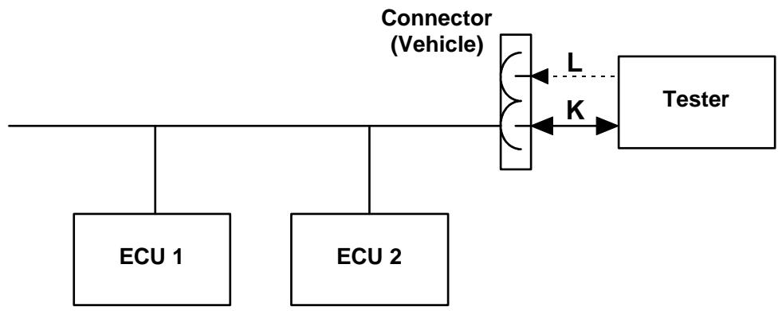
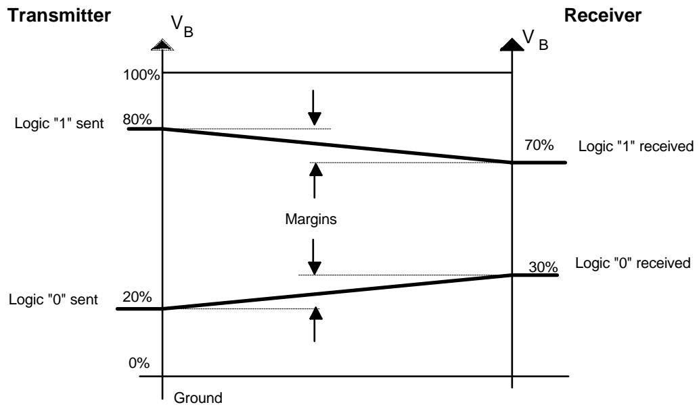
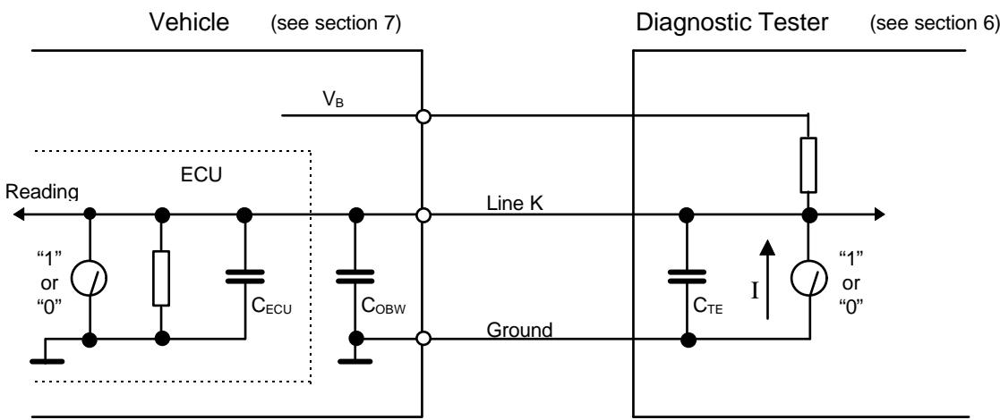

<table><tr><td>SSF 14230</td><td>Road Vehicles - Diagnostic Systems</td></tr><tr><td colspan="2">Keyword Protocol 2000 - Part 1 - Physical Layer
Swedish Implementation Standard</td></tr><tr><td colspan="2">Document:  SSF 14230-1</td></tr><tr><td colspan="2">Status:  Issue 3</td></tr><tr><td colspan="2">Date:  October 22, 1997</td></tr></table>

This document is based on the International Standard ISO 14230 Keyword Protocol 2000 and has been further developed to meet Swedish automotive manufacturer's requirements by the Swedish Vehicle Diagnostics Task Force. It is based on mutual agreement between the following companies:

Saab Automobile AB- SCANIA AB- Volvo Car Corp.- Volvo Bus Corp.- Mecel AB

# Document updates and issue history

This document can be revised and appear in several versions. The document will be classified in order to allow identification of updates and versions.

# A. Document status classification

The document is assigned the status Outline, Draft or Issue.

It will have the Outline status during the initial phase when parts of the document are not yet written.

The Draft status is entered when a complete document is ready, which can be submitted for reviews. The draft is not approved. The draft status can appear between issues, and will in that case be indicated together with the new issue number e.g. Draft Issue 2.

An Issue is established when the document is reviewed, corrected and approved.

# B. Version number and history procedure

Each issue is given a number and a date. A history record shall be kept over all issues. Document in Outline and Draft status shall not have a history record.

C. History Issue # Date

<table><tr><td>Issue #</td><td>Date</td><td>Comment</td></tr><tr><td>1</td><td>Aug. 19, 1996</td><td>First issue</td></tr><tr><td>2</td><td>June 12, 1997</td><td>$2 Reference to ISO 9141 and SAE J1962 removed.
$3 Definitions added.
$4.1 Definition of K-line usage changed. No ref. to 5-baud init.
$5 ISO 15031-3 added in example.
$5.2.1 Reference to line L removed from figure.
$5.2.2 Last section changed. Only 10.4 kbaud is used.
$5.2.3 Paragraph moved to SSF 14230-2.
$6.2.1 First section. Accuracy added to resistor value.
$6.2.2 Definition of accuracy changed. Only fast init. and 10.4 kbaud is used.
$7.2.3 New paragraph.
$7.3.1 Requirement of supporting initialisation methods changed. Only fast init. is used.</td></tr><tr><td>3</td><td>October 22, 1997</td><td>$6.2.4 Requirement for 24 V systems added
$7.2.2 Document reference changed</td></tr></table>

# Keyword Protocol 2000 Part 1 :Physical layer, Swedish Implementation Standard

# Table of Content

INTRODUCTION. 5 1 SCOPE. 5 2 NORMATIVE REFERENCES. 5 3 DEFINITIONS 6 4 ALLOWED CONFIGURATIONS. 7 5 SIGNAL AND COMMUNICATION SPECIFICATIONS. 8 5.1 Signal. 8 5.2 Communication specification. 9 6 REQUIREMENTS OF THE DIAGNOSTIC TESTER. 10 6.1 Minimum functional requirements. 10 6.2 Electrical specifications. 10 7 REQUIREMENTS OF THE ECU. 11 7.1 Input and output lines. 11 7.2 Electrical specifications. 11 7.3 Minimum functional capabilities. 11 8 REQUIREMENTS OF THE WIRING. 12

# Introduction

This document (The Swedish Keyword Protocol 2000 Implementation Standard) is based on the International Standard ISO/DIS 14230- 1. Changes are indicated by changing the font from "Arial" to "Times New Roman"!

It has been established in order to define common requirements for the implementation of diagnostic services for vehicle diagnostic systems.

# 1 Scope

1 ScopeThis part of SSF 14230 describes the physical layer on which the diagnostic services will be implemented. It is based on the physical layer described in ISO 9141- 2, but expanded to allow for vehicles with either 12 or 24 voltage supply.

# 2 Normative References

2 Normative ReferencesThe following standards contain provisions which, through reference in this text, constitute provisions of this national standard. At the time of publication, the editions indicated were valid. All standards are subject to revision, and parties to agreement based on this national standard are encouraged to investigate the possibility of applying the most recent editions of the standards indicated below. Members of IEC and ISO maintain registers of currently valid international standards.

ISO 7637- 1:1990

Road vehicles - Electrical disturbance by conduction and coupling - Part 1: Passenger cars and light commercial vehicles with nominal  $12\mathrm{V}$  supply voltage - Electrical transient conduction along supply lines only.

ISO 7637- 2:1990

Road vehicles - Electrical disturbance by conduction and coupling - Part 2: Commercial vehicles with nominal  $24~\mathrm{V}$  supply voltage - Electrical transient conduction along supply lines only.

ISO/DIS 7637- 3:1992

Road vehicles - Electrical disturbance by conduction and coupling - Part 3: Passenger cars and light commercial vehicles with nominal 12 V supply voltage and commercial vehicles with  $24~\mathrm{V}$  supply voltage - Electrical transient transmission by capacitive and inductive coupling via lines other than supply lines.

ISO/DIS 14230- 1:1995

Road Vehicles - Diagnostic systems - Keyword Protocol 2000 - Part 1: Physical Layer

SSF 14230- 2

Keyword protocol 2000 - Part 2: Data link layer.

SSF 14230- 3

Keyword protocol 2000 - Part 3: Implementation.

# 3 Definitions

For the purpose of this standard, the following definitions apply:

inspection:

test:

diagnosis:

diagnostic tester:

system:

ECU:

bus:

NRZ:

baud rate:

initialisation:

key words:

bit time:

Observation or measurement of an item, or characteristics of an item, and comparison of the observation(s) with pre established standards.

Procedure or action taken to compare, under real or simulated conditions, parameters of a system or component against specified performance and/or values.

Determination of the cause of malfunction of a road vehicle.

Non- built- in equipment with diagnostic capability. Such non- built- in equipment may be used in the vehicle.

Assemblage of components performing a specific function, for example an assemblage of an ECU and its associated sensors, actuators and interconnections.

Abbreviation of Electronic Control Unit.

One or more conductors connecting two or more ECUs together with the purpose of communicating with the test equipment.

Abbreviation of Non- Return- to- Zero. A method of representing binary signals in which there is no change of signal levels between two successive bits of the same logic level.

Number of binary elements of information transmitted per second on one line.

Process to activate an ECU for starting communication

Identifier for set of specifications for the subsequent serial communication. This set of specifications defines: - the specific function of each communication line - the format of the digital information such as the protocol, number and meaning of each of the words exchanged - the format of data such as baud rate, data coding, word length.

Duration of one unit of information.

# 4 Allowed configurations

4.1 Vehicle ECUs which support the protocol described in this document shall support a one wire (K line only) communication connection for diagnosis, test or maintenance. Vehicle battery voltage,  $\mathrm{V_B}$ , and ground shall be provided by the ECU(s), or the vehicle, to the tester.

Line K is a bi- directional line. It is used during initialisation to convey the wake up pattern from the diagnostic tester to vehicle ECUs. After conveying this information, the K line is used for all other diagnostic communications between tester and vehicle ECUs, in both directions. This includes the completion of the initialisation sequence and all other communication services as described in SSF 14230- 2 and the subsequent communication as described in SSF 14230- 2 and SSF 14230- 3.

  
Figure 1 shows the system configuration (Line L is not used).

The arrows indicate the direction of data flow.

# Figure 1- Possible system configurations.

4.2 If any ECU, either of one type or in combination are linked on a bus, the system designer shall ensure that the configuration is capable of correct operation. For example, data from one ECU shall not initialise the serial communication of another ECU on the bus and an initialisation signal shall not cause more than one ECU to respond simultaneously; it may, however, initialise a number of ECUs on the bus which then respond in an orderly sequential manner.

Line K shall not be used for purposes other than inspection, test and diagnosis, unless otherwise specified by the vehicle manufacturer.

# 5 Signal and communication specifications

5 Signal and communication specificationsNote: On those vehicles fitted with a diagnostic connector with ground and Battery Supply pins (e.g. ISO 15031- 3 / SAE J1962 connector), all measurements should be referenced to the pins of that connector. On other vehicles, without ground and supply pins in the diagnostic connector, the battery posts should be used as reference.

# 5.1 Signal

For proper operation of the serial communication, both ECU and diagnostic tester shall correctly determine each logic state as follows (Values for 24 volt systems appear in parenthesis):

- a logic "0" is equivalent to a voltage level on the line of less than  $20\%$  of  $V_{B}$  for transmitter,  $30\%$  of  $V_{B}$  for receiver; 
-a logic "1" is equivalent to a voltage level on the line of greater than  $80\%$  of  $V_{B}$  for transmitter ,  $70\%$  of  $V_{B}$  for receiver.

In addition, the slope times shall be less than  $10\%$ $(15\%)$  of the bit time. The slope times are defined as the time taken for the voltage to change from  $20\%$  to  $80\%$  of  $V_{B}$  and from  $80\%$  to  $20\%$  of  $V_{B}$  for transmitters.

Voltage levels between  $30\%$  and  $70\%$  of  $V_{B}$  may be detected as either logic "0" or logic "1".

NRZ coding shall be used. The bit time is defined as half the time between the  $50\% V_{B}$  levels of successive rising or falling edges of alternating "1" and "0" bits.

  
Figure 2 illustrates the worst case on signal levels. For electrical specifications of diagnostic testers see 6.2, and for ECUs see 7.2Figure 2: Signal voltage levels, worst case values.

# 5.2 Communication specification

5.2.1 The configuration is shown schematically in Figure 3

  
Figure 3- Communication schematic

5.2.2 The capacitance contribution of the diagnostic tester and associated cables are termed  $\mathbb{C}_{\mathsf{TE}}$  The capacitance contribution of the on- board wiring is termed  $\mathbb{C}_{\mathsf{OBW}}$  . The sum of the input capacitance of all the ECUs on the bus is defined thus:

Values for CECU and CoBw must be selected such that

$\mathsf{C}_{\mathsf{ECU}} + \mathsf{C}_{\mathsf{OBW}}\leq 7.2\mathsf{nF}$  and  $\mathbb{C}_{\mathrm{TE}}$  as specified in 6.2.6  $(\mathsf{C}_{\mathsf{ECU}} + \mathsf{C}_{\mathsf{OBW}}\leq 5.0\mathsf{nF}$  and  $\mathbb{C}_{\mathrm{TE}}$  as specified in 6.2.6)

(First values are for vehicles with nominal  $12V$  supply, values in parentheses are for  $24~\mathrm{V}$  vehicle battery voltage systems.)

These values are derived from the circuit resistance and baud rate tolerances (sections 6 and 7), allowed slope times and switching thresholds (section 5.1) and a communication speed of 10,4 kbaud.

# 6 Requirements of the diagnostic tester

# 6.1 Minimum functional requirements

The diagnostic tester shall be capable of supporting the initialisation methods and the communication protocol described in SSF 14230- 2.

# 6.2 Electrical specifications

(First values are for vehicles with nominal  $12V$  supply, values in parentheses are for  $24V$  vehicle battery voltage systems.)

These specifications shall apply over a working temperature range of  $- 20^{\circ}C$  to  $50^{\circ}C$  The following specifications shall apply to nominal  $12V$ $(24V)$  systems for which the diagnostic tester shall operate correctly in the range  $8V$  to  $16V$ $16V$  to  $32V$  ) of the vehicle battery voltage  $V_{B}$  . Manufacturers of diagnostic testers are encouraged to extend the limits of correct operation for vehicle battery voltage  $V_{B}$  and working temperature.

6.2.1 For line K of the diagnostic tester not connected to an ECU, the line shall be internally pulled up to  $V_{B}$  via a  $510 \Omega \pm 5\%$  ( $1k \Omega \pm 5\%$ ) resistor.

# Transmission state

- At logic "1" the diagnostic tester shall have an equivalent voltage source greater than  $90\% V_{B}$ , sourced from the vehicle battery supply  $V_{B}$ , and an equivalent resistance of  $510 \Omega \pm 5\%$  ( $1k \Omega \pm 5\%$ ).

- At logic "0" the diagnostic tester shall have an equivalent voltage of less than  $10\%$  of  $V_{B}$ , at a maximum sink current of  $100 \text{mA}$ .

# Receiving state

- The equivalent resistance on the line K of the diagnostic tester shall be  $510 \Omega \pm 5\%$  ( $1k \Omega \pm 5\%$ ) to  $V_{B}$ .

6.2.2 The diagnostic tester shall maintain fast initialisation and communication baud rates to  $\pm 0.5\%$  of nominal values.

6.2.3 For each byte the diagnostic tester shall be capable of determining the status of any bit, the transitions of which are shifted by not more than  $30\%$  of the bit time relative to their calculated position in time.

6.2.4 The diagnostic tester shall not transfer to the open line K any voltage higher than  $V_{B}$  or  $40 \text{V}$  ( $60 \text{V}$ ), whichever is the lower, or any voltage which is lower than  $- 1 \text{V}$ . This includes suppression of voltage excursions of  $V_{B}$  as detailed in ISO 7637- 1 (as detailed in ISO 7637- 2 for  $24 \text{V}$  vehicle battery voltage systems).

6.2.5 The diagnostic tester shall expect a resistance of at least  $5k \Omega$  ( $10k \Omega$ ) to vehicle ground on line K when connected to the vehicle.

6.2.6 The total capacitance of the diagnostic tester and its cable and connector shall not exceed  $2 \text{nF}$ .

# 7 Requirements of the ECU

7 Requirements of the ECUThe combined resistance defined in 6.2.5, and the total vehicle capacitance defined in 5.2.2, are the primary constraints. For guidance only the average values per ECU on a system with 20 ECUs connected is given (24 V values in parenthesis). This value may change if a different number of ECUs are connected.

# 7.1 Input and output lines

7.1 Input and output linesECUs shall have one (K line) connection as defined in 4.1.  $\mathrm{V}_{\mathrm{B}}$  and ground shall also be made available to the tester but need not come directly from the ECU.

# 7.2 Electrical specifications

7.2.1 In "Power Off" state, in the receiving state and at logic "1" in the transmitting state, line K of the ECU shall behave like a resistance to ground of  $120\mathrm{k}\Omega$ $(220\mathrm{k}\Omega)\pm 5\%$

No internal resistance between line K and  $\mathrm{V_B}$  shall be used.

The capacitance of line K with respect to ground of each ECU should not exceed 250 pF  $(150~\mathrm{pF})$

In case of problems (e.g. with EMI) the vehicle manufacturer's system designer can choose a different specification, but attention must be paid to the maximum value of the capacitance of the vehicle which is given by the summation of  $\mathbb{C}_{\mathrm{OBW}}$  and  $\mathbb{C}_{\mathrm{ECU}}$  This value shall not exceed the limits specified in 5.2.2.

At logic  $"0"$  , in the transmitting state, the ECU shall have an equivalent sink resistance of not more than  $110\Omega$ $(220\Omega)$  between line K and ground. In addition the sink resistance shall be designed so the slope time of the falling edge is as specified in 5.1.

When the serial communication of the ECU is not in operation and the diagnostic tester is connected, the output of the ECU shall be passive (i.e. equivalent to the receiving state when the serial communication of the ECU is in operation).

7.2.2 The line K input/output circuitry of the ECU shall withstand transitions and over voltage present on line K via the diagnostic tester source resistance, limited as below.

20 V dc permanent (36 V dc permanent) 24 V dc for 30 min (42 V dc for 30 min) 30 V dc for 1 min (48 V dc for 1 min).

Line K shall also withstand pulses 3a and 3b according to ISO 7637- 3, where the maximum positive voltage shall be an absolute value of 40 V (60 V), and the worst case negative voltage shall be - 1 V relative to ground.

7.2.3 When the power supply of the ECU is switched on or off, the ECU shall not produce any signals or other disturbances on the K- line.

# 7.3 Minimum functional capabilities

7.3.1 The ECU shall be capable of supporting the communication protocol and initialisation method described in SSF 14230- 2. It shall ignore the initialisation of other ECUs on the bus, also if they respond to different methods of initialisation than its own.

7.3.2 The ECU shall transmit messages with bit rates within  $\pm 1.7\%$  ( $\pm 1\%$  for  $24 \text{V}$  systems) of nominal bit rate.

7.3.3 For each byte the ECU shall be capable of determining the status of any bit, the transitions of which are shifted by not more than  $\pm 20\%$  of the bit time relative to their calculated position in time.

# 8 Requirements of the wiring

The capacitance of each serial communication line built into the vehicle shall not exceed 2 nF with respect to vehicle ground, when measured without any ECU connected.

$V_{B}$  and ground shall be made available to the diagnostic tester but need not come directly from an ECU.